[Chapter 17. ] Representation Learning and Generative Learning Using Autoencoders and GANs
=================================================================================================

Autoencoders[]{#idm45728446303656}[]{#idm45728446302648}[]{#idm45728446301976}[]{#idm45728446301304}
are artificial neural networks capable of learning dense representations
of the input data, called *latent representations* or *codings*, without
any supervision (i.e., the training set is unlabeled). These codings
typically have a much lower dimensionality than the input data, making
autoencoders useful for dimensionality reduction (see
[Chapter 8](https://learning.oreilly.com/library/view/hands-on-machine-learning/9781492032632/ch08.html#dimensionality_chapter)),
especially for visualization purposes. Autoencoders also act as feature
detectors, and they can be used for unsupervised pretraining of deep
neural networks (as we discussed in
[Chapter 11](https://learning.oreilly.com/library/view/hands-on-machine-learning/9781492032632/ch11.html#deep_chapter)).
Lastly, some[]{#idm45728446297240}[]{#idm45728446296536} autoencoders
are *generative models*: they are capable of randomly generating new
data that looks very similar to the training data. For example, you
could train an autoencoder on pictures of faces, and it would then be
able to generate new faces. However, the generated images are usually
fuzzy and not entirely realistic.

In[]{#idm45728446294264}[]{#idm45728446293288} contrast, faces generated
by generative adversarial networks (GANs) are now so convincing that it
is hard to believe that the people they represent do not exist. You can
judge so for yourself by visiting
[*https://thispersondoesnotexist.com/*](https://thispersondoesnotexist.com/),
a website that shows faces generated by a recent GAN architecture called
*StyleGAN* (you can also check out
[*https://thisrentaldoesnotexist.com/*](https://thisrentaldoesnotexist.com/)
to see some generated Airbnb bedrooms). GANs are now widely used for
super resolution (increasing the resolution of an image),
[colorization](https://github.com/jantic/DeOldify), powerful image
editing (e.g., replacing photo bombers with realistic background),
turning a simple sketch into a photorealistic image, predicting the next
frames in a video, augmenting a dataset (to train other models),
generating other types of data (such as text, audio, and time series),
identifying the weaknesses in other models and strengthening them, and
more.

Autoencoders[]{#idm45728446244760}[]{#idm45728446243560} and GANs are
both unsupervised, they both learn dense representations, they can both
be used as generative models, and they have many similar applications.
However, they work very differently:

-   Autoencoders simply learn to copy their inputs to their outputs.
    This may sound like a trivial task, but we will see that
    constraining the network in various ways can make it rather
    difficult. For example, you can limit the size of the latent
    representations, or you can add noise to the inputs and train the
    network to recover the original inputs. These constraints prevent
    the autoencoder from trivially copying the inputs directly to the
    outputs, which forces it to learn efficient ways of representing the
    data. In short, the codings are byproducts of the autoencoder
    learning the identity function under some constraints.

-   GANs[]{#idm45728446239160}[]{#idm45728446238456} are composed of two
    neural networks: a *generator* that tries to generate data that
    looks similar to the training data, and a *discriminator* that tries
    to tell real data from fake data. This architecture is very original
    in Deep Learning in that the generator and the discriminator compete
    against each other during training: the generator is often compared
    to a criminal trying to make realistic counterfeit money, while the
    discriminator is like the police investigator trying to tell real
    money from fake. *Adversarial training* (training competing neural
    networks)[]{#idm45728446235928} is widely considered as one of the
    most important ideas in recent years. In 2016, Yann LeCun even said
    that it was "the most interesting idea in the last 10 years in
    Machine Learning."

In this chapter we will start by exploring in more depth how
autoencoders work and how to use them for dimensionality reduction,
feature extraction, unsupervised pretraining, or as generative models.
This will naturally lead us to GANs. We will start by building a simple
GAN to generate fake images, but we will see that training is often
quite difficult. We will discuss the main difficulties you will
encounter with adversarial training, as well as some of the main
techniques to work around these difficulties. Let's start with
autoencoders!


Efficient Data Representations
==============================

Which[]{#idm45728446231784}[]{#idm45728446230760} of the following
number sequences do you find the easiest to memorize?

-   40, 27, 25, 36, 81, 57, 10, 73, 19, 68

-   50, 48, 46, 44, 42, 40, 38, 36, 34, 32, 30, 28, 26, 24, 22, 20, 18,
    16, 14

At first glance, it would seem that the first sequence should be easier,
since it is much shorter. However, if you look carefully at the second
sequence, you will notice that it is just the list of even numbers from
50 down to 14. Once you notice this pattern, the second sequence becomes
much easier to memorize than the first because you only need to remember
the pattern (i.e., decreasing even numbers) and the starting and ending
numbers (i.e., 50 and 14). Note that if you could quickly and easily
memorize very long sequences, you would not care much about the
existence of a pattern in the second sequence. You would just learn
every number by heart, and that would be that. The fact that it is hard
to memorize long sequences is what makes it useful to recognize
patterns, and hopefully this clarifies why constraining an autoencoder
during training pushes it to discover and exploit patterns in the data.

The relationship between memory, perception, and[]{#idm45728446225624}
pattern matching was [famously studied by William Chase and Herbert
Simon in the early
1970s](https://homl.info/111).^[1](https://learning.oreilly.com/library/view/hands-on-machine-learning/9781492032632/ch17.html#idm45728446224104){#idm45728446224104-marker
.totri-footnote}^ They observed that expert chess players were able to
memorize the positions of all the pieces in a game by looking at the
board for just five seconds, a task that most people would find
impossible. However, this was only the case when the pieces were placed
in realistic positions (from actual games), not when the pieces were
placed randomly. Chess experts don't have a much better memory than you
and I; they just see chess patterns more easily, thanks to their
experience with the game. Noticing patterns helps them store information
efficiently.

Just like the chess players in this memory experiment, an autoencoder
looks at the inputs, converts them to an efficient latent
representation, and then spits out something that (hopefully) looks very
close to the inputs. An
autoencoder[]{#idm45728446221256}[]{#idm45728446220280}[]{#idm45728446219608}[]{#idm45728446218936}[]{#idm45728446218264}
is always composed of two parts: an *encoder* (or *recognition network*)
that converts the inputs to a latent representation, followed by a
*decoder* (or *generative network*) that converts the internal
representation to the outputs (see
[Figure 17-1](https://learning.oreilly.com/library/view/hands-on-machine-learning/9781492032632/ch17.html#encoder_decoder_diagram)).

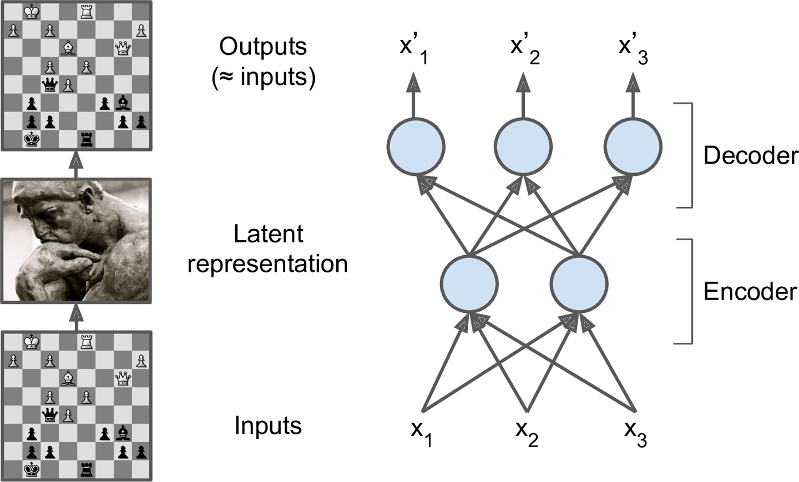

As you can see, an autoencoder typically has the same architecture as a
Multi-Layer Perceptron (MLP; see
[Chapter 10](https://learning.oreilly.com/library/view/hands-on-machine-learning/9781492032632/ch10.html#ann_chapter)),
except that the number of neurons in the output layer must be equal to
the number of inputs. In this example, there is just one hidden layer
composed of two neurons (the encoder), and one output layer composed of
three neurons (the decoder). The outputs are
often[]{#idm45728446210856}[]{#idm45728446210184} called the
*reconstructions* because the autoencoder tries to reconstruct the
inputs, and the cost function contains a *reconstruction loss* that
penalizes the model when the reconstructions are different from the
inputs.

Because the internal representation has a lower dimensionality than the
input data (it is 2D instead of 3D), the
autoencoder[]{#idm45728446207880}[]{#idm45728446207208} is said to be
*undercomplete*. An undercomplete autoencoder cannot trivially copy its
inputs to the codings, yet it must find a way to output a copy of its
inputs. It is forced to learn the most important features in the input
data (and drop the unimportant ones).

Let's see how to implement a very simple undercomplete autoencoder for
dimensionality reduction.


Performing PCA with an Undercomplete Linear Autoencoder
=======================================================

If[]{#idm45728446203272}[]{#idm45728446202168}[]{#idm45728446201496} the
autoencoder uses only linear activations and the cost
function[]{#idm45728446200440} is the mean squared error (MSE), then it
ends up performing Principal Component Analysis (PCA; see
[Chapter 8](https://learning.oreilly.com/library/view/hands-on-machine-learning/9781492032632/ch08.html#dimensionality_chapter)).

The following code builds a simple linear autoencoder to perform PCA on
a 3D dataset, projecting it to 2D:

``` {data-type="programlisting" code-language="python"}
from tensorflow import keras

encoder = keras.models.Sequential([keras.layers.Dense(2, input_shape=[3])])
decoder = keras.models.Sequential([keras.layers.Dense(3, input_shape=[2])])
autoencoder = keras.models.Sequential([encoder, decoder])

autoencoder.compile(loss="mse", optimizer=keras.optimizers.SGD(lr=0.1))
```

This code is really not very different from all the MLPs we built in
past chapters, but there are a few things to note:

-   We organized the autoencoder into two subcomponents: the encoder and
    the decoder. Both are regular `Sequential` models with a single
    `Dense` layer each, and the autoencoder is a `Sequential` model
    containing the encoder followed by the decoder (remember that a
    model can be used as a layer in another model).

-   The autoencoder's number of outputs is equal to the number of inputs
    (i.e., 3).

-   To perform simple PCA, we do not use any activation function (i.e.,
    all neurons are linear), and the cost function is the MSE. We will
    see more complex autoencoders shortly.

Now let's train the model on a simple generated 3D dataset and use it to
encode that same dataset (i.e., project it to 2D):

``` {data-type="programlisting" code-language="python"}
history = autoencoder.fit(X_train, X_train, epochs=20)
codings = encoder.predict(X_train)
```

Note that the same dataset, `X_train`, is used as both the inputs and
the targets.
[Figure 17-2](https://learning.oreilly.com/library/view/hands-on-machine-learning/9781492032632/ch17.html#linear_autoencoder_pca_diagram)
shows the original 3D dataset (on the left) and the output of the
autoencoder's hidden layer (i.e., the coding layer, on the right). As
you can see, the autoencoder found the best 2D plane to project the data
onto, preserving as much variance in the data as it could (just like
PCA).

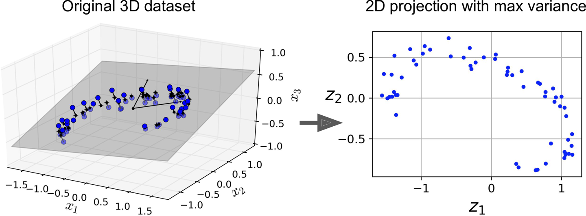


###### Note

You can think of autoencoders as a form of self-supervised learning
(i.e., using a supervised learning technique with automatically
generated labels, in this case simply equal to the inputs).


Stacked Autoencoders
====================

Just[]{#Astack17}[]{#idm45728446086712}[]{#idm45728446085768} like other
neural networks we have discussed, autoencoders can have multiple hidden
layers. In this case they are called *stacked autoencoders* (or *deep
autoencoders*). Adding more layers helps the autoencoder learn more
complex codings. That said, one must be careful not to make the
autoencoder too powerful. Imagine an encoder so powerful that it just
learns to map each input to a single arbitrary number (and the decoder
learns the reverse mapping). Obviously such an autoencoder will
reconstruct the training data perfectly, but it will not have learned
any useful data representation in the process (and it is unlikely to
generalize well to new instances).

The architecture of a stacked autoencoder is typically symmetrical with
regard to the central hidden layer (the coding layer). To put it simply,
it looks like a sandwich. For example, an autoencoder for MNIST
(introduced in
[Chapter 3](https://learning.oreilly.com/library/view/hands-on-machine-learning/9781492032632/ch03.html#classification_chapter))
may have 784 inputs, followed by a hidden layer with 100 neurons, then a
central hidden layer of 30 neurons, then another hidden layer with 100
neurons, and an output layer with 784 neurons. This stacked autoencoder
is represented in
[Figure 17-3](https://learning.oreilly.com/library/view/hands-on-machine-learning/9781492032632/ch17.html#stacked_autoencoder_diagram).


Implementing a Stacked Autoencoder Using Keras
----------------------------------------------

You[]{#idm45728446077064}[]{#idm45728446076056} can implement a stacked
autoencoder very much like a regular deep MLP. In particular, the same
techniques we used in
[Chapter 11](https://learning.oreilly.com/library/view/hands-on-machine-learning/9781492032632/ch11.html#deep_chapter)
for training deep nets can be applied. For example, the following code
builds a stacked autoencoder for Fashion MNIST (loaded and normalized as
in
[Chapter 10](https://learning.oreilly.com/library/view/hands-on-machine-learning/9781492032632/ch10.html#ann_chapter)),
using the SELU activation [function]:

``` {data-type="programlisting" code-language="python"}
stacked_encoder = keras.models.Sequential([
    keras.layers.Flatten(input_shape=[28, 28]),
    keras.layers.Dense(100, activation="selu"),
    keras.layers.Dense(30, activation="selu"),
])
stacked_decoder = keras.models.Sequential([
    keras.layers.Dense(100, activation="selu", input_shape=[30]),
    keras.layers.Dense(28 * 28, activation="sigmoid"),
    keras.layers.Reshape([28, 28])
])
stacked_ae = keras.models.Sequential([stacked_encoder, stacked_decoder])
stacked_ae.compile(loss="binary_crossentropy",
                   optimizer=keras.optimizers.SGD(lr=1.5))
history = stacked_ae.fit(X_train, X_train, epochs=10,
                         validation_data=[X_valid, X_valid])
```

Let's go through this code:

-   Just like earlier, we split the autoencoder model into two
    submodels: the encoder and the decoder.

-   The encoder takes 28 × 28--pixel grayscale images, flattens them so
    that each image is represented as a vector of size 784, then
    processes these vectors through two `Dense` layers of diminishing
    sizes (100 units then 30 units), both using the SELU activation
    function (you may want to add LeCun normal initialization as well,
    but the network is not very deep so it won't make a big difference).
    For each input image, the encoder outputs a vector of size 30.

-   The decoder takes codings of size 30 (output by the encoder) and
    processes them through two `Dense` layers of increasing sizes (100
    units then 784 units), and it reshapes the final vectors into 28 ×
    28 arrays so the decoder's outputs have the same shape as the
    encoder's inputs.

-   When compiling the stacked autoencoder, we use the binary
    cross-entropy loss instead of the[]{#idm45728445862024} mean squared
    error. We are treating the reconstruction task as a multilabel
    binary classification problem: each pixel intensity represents the
    probability that the pixel should be black. Framing it this way
    (rather than as a regression problem) tends to make the model
    converge
    faster.^[2](https://learning.oreilly.com/library/view/hands-on-machine-learning/9781492032632/ch17.html#idm45728445860616){#idm45728445860616-marker
    .totri-footnote}^

-   Finally, we train the model using `X_train` as both the inputs and
    the targets (and similarly, we use `X_valid` as both the validation
    inputs and targets).


Visualizing the Reconstructions
-------------------------------

One[]{#idm45728445856312}[]{#idm45728445855288} way to ensure that an
autoencoder is properly trained is to compare the inputs and the
outputs: the differences should not be too significant. Let's plot a few
images from the validation set, as well as their reconstructions:

``` {data-type="programlisting" code-language="python"}
def plot_image(image):
    plt.imshow(image, cmap="binary")
    plt.axis("off")

def show_reconstructions(model, n_images=5):
    reconstructions = model.predict(X_valid[:n_images])
    fig = plt.figure(figsize=(n_images * 1.5, 3))
    for image_index in range(n_images):
        plt.subplot(2, n_images, 1 + image_index)
        plot_image(X_valid[image_index])
        plt.subplot(2, n_images, 1 + n_images + image_index)
        plot_image(reconstructions[image_index])

show_reconstructions(stacked_ae)
```

[Figure 17-4](https://learning.oreilly.com/library/view/hands-on-machine-learning/9781492032632/ch17.html#reconstruction_plot)
shows the resulting images.

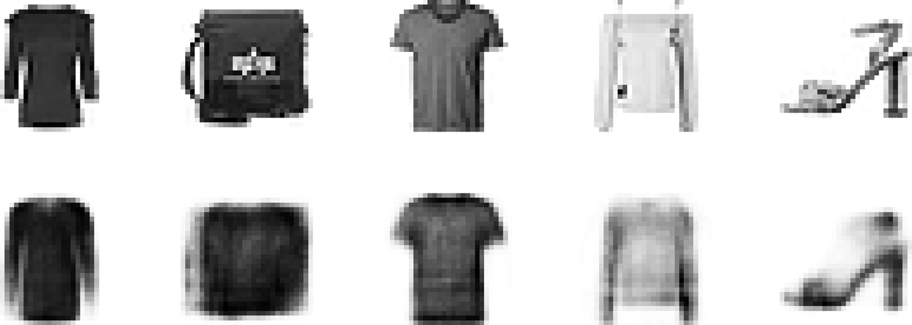

The reconstructions are recognizable, but a bit too lossy. We may need
to train the model for longer, or make the encoder and decoder deeper,
or make the codings larger. But if we make the network too powerful, it
will manage to make perfect reconstructions without having learned any
useful patterns in the data. For now, let's go with this model.


Visualizing the Fashion MNIST Dataset
-------------------------------------

Now[]{#idm45728445636264}[]{#idm45728445635288}[]{#idm45728445634344}[]{#idm45728445633432}
that we have trained a stacked autoencoder, we can use it to reduce the
dataset's dimensionality. For visualization, this does not give great
results compared to other dimensionality reduction algorithms (such as
those we discussed in
[Chapter 8](https://learning.oreilly.com/library/view/hands-on-machine-learning/9781492032632/ch08.html#dimensionality_chapter)),
but one big advantage of autoencoders is that they can handle large
datasets, with many instances and many features. So one strategy is to
use an autoencoder to reduce the dimensionality down to a reasonable
level, then use another dimensionality [reduction]
algorithm for visualization. Let's use this strategy to visualize
Fashion MNIST. First, we use the encoder from our stacked autoencoder to
reduce the dimensionality down to 30, then we use Scikit-Learn's
implementation of the t-SNE algorithm to reduce the dimensionality down
to 2 for visualization:

``` {data-type="programlisting" code-language="python"}
from sklearn.manifold import TSNE

X_valid_compressed = stacked_encoder.predict(X_valid)
tsne = TSNE()
X_valid_2D = tsne.fit_transform(X_valid_compressed)
```

Now we can plot the dataset:

``` {data-type="programlisting" code-language="python"}
plt.scatter(X_valid_2D[:, 0], X_valid_2D[:, 1], c=y_valid, s=10, cmap="tab10")
```

[Figure 17-5](https://learning.oreilly.com/library/view/hands-on-machine-learning/9781492032632/ch17.html#fashion_mnist_visualization_plot)
shows the resulting scatterplot (beautified a bit by displaying some of
the images). The t-SNE algorithm identified several clusters which match
the classes reasonably well (each class is represented with a different
color).

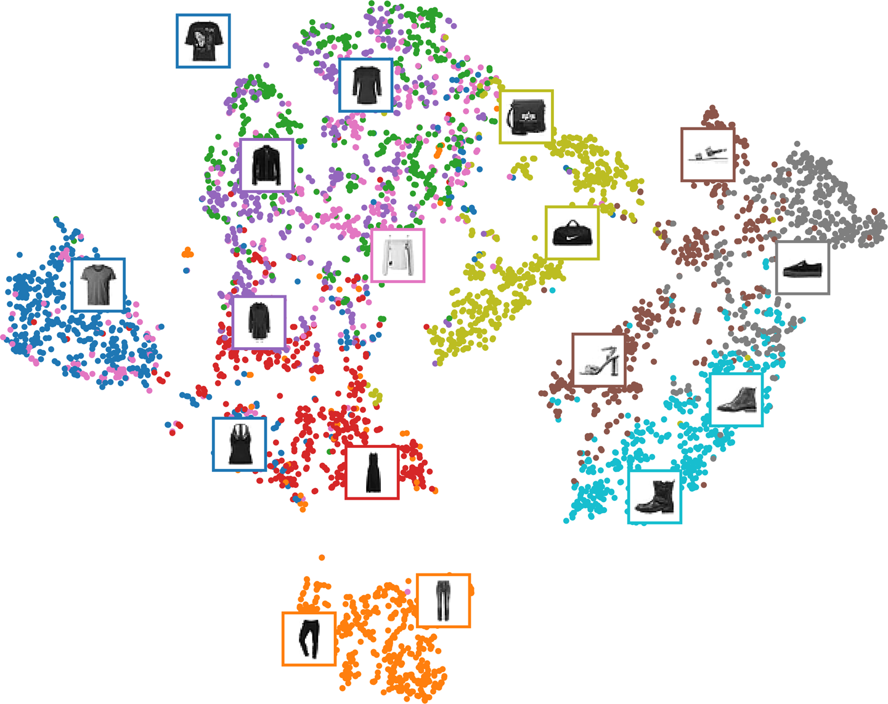

So, autoencoders can be used for dimensionality reduction. Another
application is for unsupervised pretraining.[]{#idm45728445542280}


Unsupervised Pretraining Using Stacked Autoencoders
---------------------------------------------------

As[]{#Aunsup17}[]{#SAunsup17}[]{#Pstack17}[]{#ULpretrain17} we discussed
in
[Chapter 11](https://learning.oreilly.com/library/view/hands-on-machine-learning/9781492032632/ch11.html#deep_chapter),
if you are tackling a complex supervised task but you do not have a lot
of labeled training data, one solution is to find a neural network that
performs a similar task and reuse its lower layers. This makes it
possible to train a high-performance model using little training data
because your neural network won't have to learn all the low-level
features; it will just reuse the feature detectors learned by the
existing network.

Similarly, if you have a large dataset but most of it is unlabeled, you
can first train a stacked autoencoder using all the data, then reuse the
lower layers to create a neural network for your actual task and train
it using the labeled data. For example,
[Figure 17-6](https://learning.oreilly.com/library/view/hands-on-machine-learning/9781492032632/ch17.html#unsupervised_pretraining_autoencoders_diagram)
shows how to use a stacked autoencoder to perform unsupervised
pretraining for a classification neural network. When training the
classifier, if you really don't have much labeled training data, you may
want to freeze the pretrained layers (at least the lower ones).


###### Note

Having plenty of unlabeled data and little labeled data is common.
Building a large unlabeled dataset is often cheap (e.g., a simple script
can download millions of images off the internet), but labeling those
images (e.g., classifying them as cute or not) can usually be done
reliably only by humans. Labeling instances is time-consuming and
costly, so it's normal to have only a few thousand human-labeled
instances.


There is nothing special about the implementation: just train an
autoencoder using all the training data (labeled plus unlabeled), then
reuse its encoder layers to create a new neural network (see the
exercises at the end of this chapter for an example).

Next, let's look at a few techniques for training stacked autoencoders.


Tying Weights
-------------

When[]{#idm45728445525416} an autoencoder is neatly symmetrical, like
the one we just built, a common technique is to *tie* the weights of the
decoder layers to the weights of the encoder layers. This halves the
number of weights in the model, speeding up training and limiting the
risk of overfitting. Specifically, if the autoencoder has a total of *N*
layers (not counting the input layer), and **W**~*L*~ represents the
connection weights of the *L*^th^ layer (e.g., layer 1 is the first
hidden layer, layer *N*/2 is the coding layer, and layer *N* is the
output layer), then the decoder layer weights can be defined simply as:
**W**~*N--L*+1~ = **W**~*L*~^⊺^ (with *L* = 1, 2, ..., *N*/2).

To tie weights between layers using Keras, let's define a custom layer:

``` {data-type="programlisting" code-language="python"}
class DenseTranspose(keras.layers.Layer):
    def __init__(self, dense, activation=None, **kwargs):
        self.dense = dense
        self.activation = keras.activations.get(activation)
        super().__init__(**kwargs)
    def build(self, batch_input_shape):
        self.biases = self.add_weight(name="bias", initializer="zeros",
                                      shape=[self.dense.input_shape[-1]])
        super().build(batch_input_shape)
    def call(self, inputs):
        z = tf.matmul(inputs, self.dense.weights[0], transpose_b=True)
        return self.activation(z + self.biases)
```

This custom layer acts like a regular `Dense` layer, but it uses another
`Dense` layer's weights, transposed (setting `transpose_b=True` is
equivalent to transposing the second argument, but it's more efficient
as it performs the transposition on the fly within the `matmul()`
operation). However, it uses its own bias vector. Next, we can build a
new stacked autoencoder, much like the previous one, but with the
decoder's `Dense` layers tied to the encoder's `Dense` layers:

``` {data-type="programlisting" code-language="python"}
dense_1 = keras.layers.Dense(100, activation="selu")
dense_2 = keras.layers.Dense(30, activation="selu")

tied_encoder = keras.models.Sequential([
    keras.layers.Flatten(input_shape=[28, 28]),
    dense_1,
    dense_2
])


tied_decoder = keras.models.Sequential([
    DenseTranspose(dense_2, activation="selu"),
    DenseTranspose(dense_1, activation="sigmoid"),
    keras.layers.Reshape([28, 28])
])

tied_ae = keras.models.Sequential([tied_encoder, tied_decoder])
```

This model achieves a very slightly lower reconstruction error than the
previous model, with almost half the number of parameters.


Training One Autoencoder at a Time
----------------------------------

Rather[]{#idm45728445191160} than training the whole stacked autoencoder
in one go like we just did, it is possible to train one shallow
autoencoder at a time, then stack all of them into a single stacked
autoencoder (hence the name), as shown in
[Figure 17-7](https://learning.oreilly.com/library/view/hands-on-machine-learning/9781492032632/ch17.html#stacking_autoencoders_diagram).
This technique is not used as much these days, but you may still run
into papers that talk about "greedy layerwise training," so it's good to
know what it means.

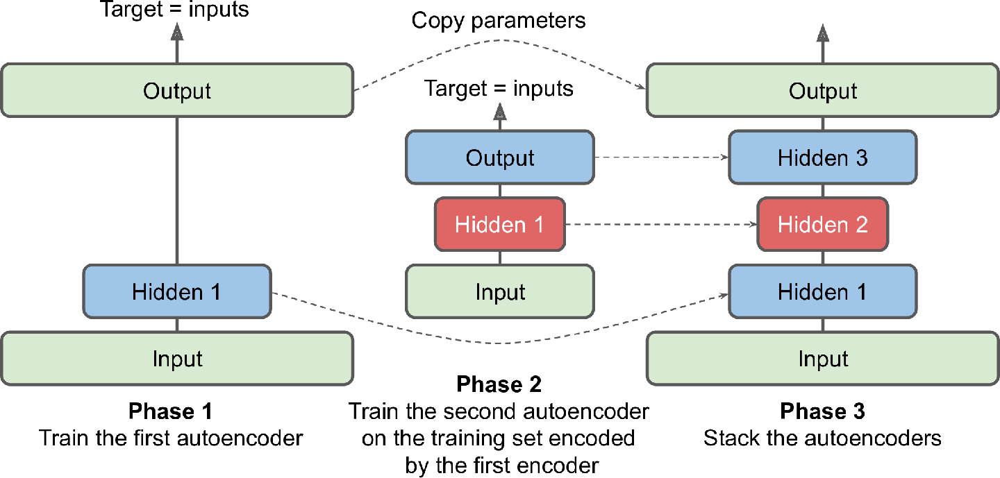

During the first phase of training, the first autoencoder learns to
reconstruct the inputs. Then we encode the whole training set using this
first autoencoder, and this gives us a new (compressed) training set. We
then train a second autoencoder on this new dataset. This is the second
phase of training. Finally, we build a big sandwich using all these
autoencoders, as shown in
[Figure 17-7](https://learning.oreilly.com/library/view/hands-on-machine-learning/9781492032632/ch17.html#stacking_autoencoders_diagram)
(i.e., we first stack the hidden layers of each autoencoder, then the
output layers in reverse order). This gives us the final stacked
autoencoder (see the "Training One Autoencoder at a Time" section in the
notebook for an implementation). We could easily train more autoencoders
this way, building a very deep stacked autoencoder.

As we discussed earlier, one of the triggers of the current tsunami of
interest in Deep Learning was the discovery in 2006 by [Geoffrey Hinton
et al.](https://homl.info/136) that deep neural networks can be
pretrained in an unsupervised fashion, using this greedy layerwise
approach. They used restricted Boltzmann machines (RBMs; see
[Appendix E](https://learning.oreilly.com/library/view/hands-on-machine-learning/9781492032632/app05.html#other_ann_appendix))
for this purpose, but in [2007 Yoshua Bengio et al.
showed](https://homl.info/112)^[3](https://learning.oreilly.com/library/view/hands-on-machine-learning/9781492032632/ch17.html#idm45728445182440){#idm45728445182440-marker
.totri-footnote}^ that autoencoders worked just as well. For several
years this was the only efficient way to train deep nets, until many of
the techniques introduced in
[Chapter 11](https://learning.oreilly.com/library/view/hands-on-machine-learning/9781492032632/ch11.html#deep_chapter)
made it possible to just train a deep net in one shot.

Autoencoders are not limited to dense networks: you can also build
convolutional autoencoders, or even recurrent autoencoders. Let's look
at these
now.[]{#idm45728445179656}[]{#idm45728445178680}[]{#idm45728445177736}[]{#idm45728445176792}


Convolutional Autoencoders
==========================

If[]{#idm45728445174584}[]{#idm45728445173576} you are dealing with
images, then the autoencoders we have seen so far will not work well
(unless the images are very small): as we saw in
[Chapter 14](https://learning.oreilly.com/library/view/hands-on-machine-learning/9781492032632/ch14.html#cnn_chapter),
convolutional neural networks are far better suited than dense networks
to work with images. So if you want to build an autoencoder for images
(e.g., for unsupervised pretraining or dimensionality reduction), you
will need to build a [*convolutional
autoencoder*](https://homl.info/convae).^[4](https://learning.oreilly.com/library/view/hands-on-machine-learning/9781492032632/ch17.html#idm45728445170568){#idm45728445170568-marker
.totri-footnote}^ The encoder is a regular CNN composed of convolutional
layers and pooling layers. It typically reduces the spatial
dimensionality of the inputs (i.e., height and width) while increasing
the depth (i.e., the number of feature maps). The decoder must do the
reverse (upscale the image and reduce its depth back to the original
dimensions), and for this you can use transpose convolutional layers
(alternatively, you could combine upsampling layers with convolutional
layers). Here is a simple convolutional autoencoder for Fashion MNIST:

``` {data-type="programlisting" code-language="python"}
conv_encoder = keras.models.Sequential([
    keras.layers.Reshape([28, 28, 1], input_shape=[28, 28]),
    keras.layers.Conv2D(16, kernel_size=3, padding="same", activation="selu"),
    keras.layers.MaxPool2D(pool_size=2),
    keras.layers.Conv2D(32, kernel_size=3, padding="same", activation="selu"),
    keras.layers.MaxPool2D(pool_size=2),
    keras.layers.Conv2D(64, kernel_size=3, padding="same", activation="selu"),
    keras.layers.MaxPool2D(pool_size=2)
])
conv_decoder = keras.models.Sequential([
    keras.layers.Conv2DTranspose(32, kernel_size=3, strides=2, padding="valid",
                                 activation="selu",
                                 input_shape=[3, 3, 64]),
    keras.layers.Conv2DTranspose(16, kernel_size=3, strides=2, padding="same",
                                 activation="selu"),
    keras.layers.Conv2DTranspose(1, kernel_size=3, strides=2, padding="same",
                                 activation="sigmoid"),
    keras.layers.Reshape([28, 28])
])
conv_ae = keras.models.Sequential([conv_encoder, conv_decoder])
```


Recurrent Autoencoders
======================

If[]{#idm45728445164856}[]{#idm45728444880136} you want to build an
autoencoder for sequences, such as time series or text (e.g., for
unsupervised learning or dimensionality reduction), then recurrent
neural networks (see
[Chapter 15](https://learning.oreilly.com/library/view/hands-on-machine-learning/9781492032632/ch15.html#rnn_chapter))
may be better suited than dense networks. Building a *recurrent
autoencoder* is straightforward: the encoder is typically a
sequence-to-vector RNN which compresses the input sequence down to a
single vector. The decoder is a vector-to-sequence RNN that does the
reverse:

``` {data-type="programlisting" code-language="python"}
recurrent_encoder = keras.models.Sequential([
    keras.layers.LSTM(100, return_sequences=True, input_shape=[None, 28]),
    keras.layers.LSTM(30)
])
recurrent_decoder = keras.models.Sequential([
    keras.layers.RepeatVector(28, input_shape=[30]),
    keras.layers.LSTM(100, return_sequences=True),
    keras.layers.TimeDistributed(keras.layers.Dense(28, activation="sigmoid"))
])
recurrent_ae = keras.models.Sequential([recurrent_encoder, recurrent_decoder])
```

This recurrent autoencoder can process sequences of any length, with 28
dimensions per time step. Conveniently, this means it can process
Fashion MNIST images by treating each image as a sequence of rows: at
each time step, the RNN will process a single row of 28 pixels.
Obviously, you could use a recurrent autoencoder for any kind of
sequence. Note that we use a `RepeatVector` layer as the first layer of
the decoder, to ensure that its input vector gets fed to the decoder at
each time step.

OK, let's step back for a second. So far we have seen various kinds of
autoencoders (basic, stacked, convolutional, and recurrent), and we have
looked at how to train them (either in one shot or layer by layer). We
also looked at a couple applications: data visualization and
unsupervised pretraining.

Up to now, in order to force the autoencoder to learn interesting
features, we have limited the size of the coding layer, making it
undercomplete. There are actually many other kinds of constraints that
can be used, including ones that allow the coding layer to be just as
large as the inputs, or even larger,
resulting[]{#idm45728444833640}[]{#idm45728444833032} in an
*overcomplete autoencoder*. Let's look at some of those approaches now.


Denoising Autoencoders
======================

Another[]{#idm45728444830088}[]{#idm45728444829080} way to force the
autoencoder to learn useful features is to add noise to its inputs,
training it to recover the original, noise-free inputs. This idea has
been around since the 1980s (e.g., it is mentioned in Yann LeCun's 1987
master's thesis). In a [2008
paper](https://homl.info/113),^[5](https://learning.oreilly.com/library/view/hands-on-machine-learning/9781492032632/ch17.html#idm45728444827352){#idm45728444827352-marker
.totri-footnote}^ Pascal Vincent et al. showed that autoencoders could
also be used for feature extraction. In a [2010
paper](https://homl.info/114),^[6](https://learning.oreilly.com/library/view/hands-on-machine-learning/9781492032632/ch17.html#idm45728444825336){#idm45728444825336-marker
.totri-footnote}^ Vincent[]{#idm45728444824040}[]{#idm45728444823352} et
al. introduced *stacked denoising autoencoders*.

The noise can be pure Gaussian noise added to the inputs, or it can be
randomly switched-off inputs, just like in dropout (introduced in
[Chapter 11](https://learning.oreilly.com/library/view/hands-on-machine-learning/9781492032632/ch11.html#deep_chapter)).
[Figure 17-8](https://learning.oreilly.com/library/view/hands-on-machine-learning/9781492032632/ch17.html#denoising_autoencoders_diagram)
shows both options.

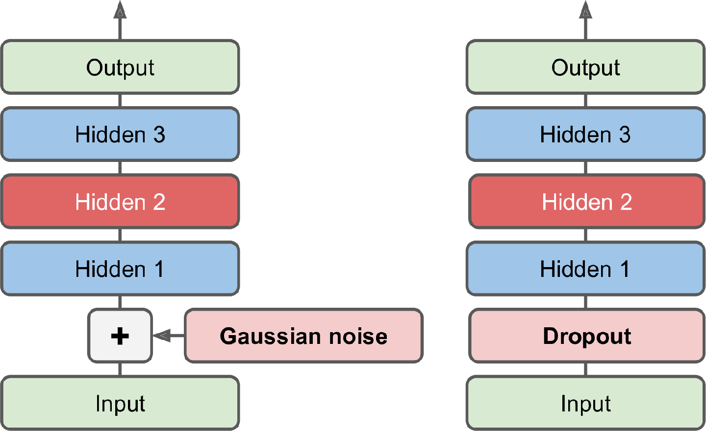

The implementation is straightforward: it is a regular stacked
autoencoder with an additional `Dropout` layer applied to the encoder's
inputs (or you could use a `GaussianNoise` layer instead). Recall that
the `Dropout` layer is only active during training (and so is the
`GaussianNoise` layer):

``` {.pagebreak-before data-type="programlisting" code-language="python"}
dropout_encoder = keras.models.Sequential([
    keras.layers.Flatten(input_shape=[28, 28]),
    keras.layers.Dropout(0.5),
    keras.layers.Dense(100, activation="selu"),
    keras.layers.Dense(30, activation="selu")
])
dropout_decoder = keras.models.Sequential([
    keras.layers.Dense(100, activation="selu", input_shape=[30]),
    keras.layers.Dense(28 * 28, activation="sigmoid"),
    keras.layers.Reshape([28, 28])
])
dropout_ae = keras.models.Sequential([dropout_encoder, dropout_decoder])
```

[Figure 17-9](https://learning.oreilly.com/library/view/hands-on-machine-learning/9781492032632/ch17.html#dropout_denoising_plot)
shows a few noisy images (with half the pixels turned off), and the
images reconstructed by the dropout-based denoising autoencoder. Notice
how the autoencoder guesses details that are actually not in the input,
such as the top of the white shirt (bottom row, fourth image). As you
can see, not only can denoising autoencoders be used for data
visualization or unsupervised pretraining, like the other autoencoders
we've discussed so far, but they can also be used quite simply and
efficiently to remove noise from images.

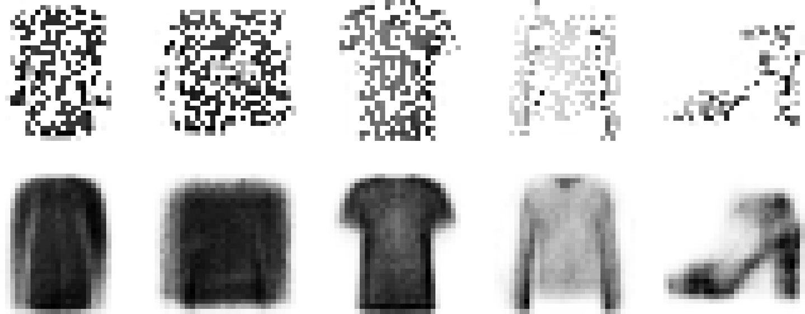


Sparse Autoencoders
===================

Another
kind[]{#idm45728444584360}[]{#idm45728444583352}[]{#idm45728444582680}
of constraint that often leads to good feature extraction is *sparsity*:
by adding an appropriate term to the cost function, the autoencoder is
pushed to reduce the number of active neurons in the coding layer. For
example, it may be pushed to have on average only 5% significantly
active neurons in the coding layer. This forces the autoencoder to
represent each input as a combination of a small number of activations.
As a result, each neuron in the coding layer typically ends up
representing a useful feature (if you could speak only a few words per
month, you would probably try to make them worth listening to).

A simple approach is to use the sigmoid activation function in the
coding layer (to constrain the codings to values between 0 and 1), use a
large coding layer (e.g., with 300 units), and add some ℓ~1~
regularization to the coding layer's activations (the decoder is just a
regular decoder):

``` {data-type="programlisting" code-language="python"}
sparse_l1_encoder = keras.models.Sequential([
    keras.layers.Flatten(input_shape=[28, 28]),
    keras.layers.Dense(100, activation="selu"),
    keras.layers.Dense(300, activation="sigmoid"),
    keras.layers.ActivityRegularization(l1=1e-3)
])
sparse_l1_decoder = keras.models.Sequential([
    keras.layers.Dense(100, activation="selu", input_shape=[300]),
    keras.layers.Dense(28 * 28, activation="sigmoid"),
    keras.layers.Reshape([28, 28])
])
sparse_l1_ae = keras.models.Sequential([sparse_l1_encoder, sparse_l1_decoder])
```

This `ActivityRegularization` layer just returns its inputs, but as a
side effect it adds a training loss equal to the sum of absolute values
of its inputs (this layer only has an effect during training).
Equivalently, you could remove the `ActivityRegularization` layer and
set `activity_regularizer=keras.regularizers.l1(1e-3)` in the previous
layer. This penalty will encourage the neural network to produce codings
close to 0, but since it will also be penalized if it does not
reconstruct the inputs correctly, it will have to output at least a few
nonzero values. Using the ℓ~1~ norm rather than the ℓ~2~ norm will push
the neural network to preserve the most important codings while
eliminating the ones that are not needed for the input image (rather
than just reducing all codings).

Another approach, which often yields better results, is to measure the
actual sparsity of the coding layer at each training iteration, and
penalize the model when the measured sparsity differs from a target
sparsity. We do so by computing the average activation of each neuron in
the coding layer, over the whole training batch. The batch size must not
be too small, or else the mean will not be accurate.

Once[]{#idm45728444393672} we have the mean activation per neuron, we
want to penalize the neurons that are too active, or not active enough,
by adding a *sparsity loss* to the cost function. For example, if we
measure that a neuron has an average activation of 0.3, but the target
sparsity is 0.1, it must be penalized to activate less. One approach
could be simply adding the squared error (0.3 -- 0.1)^2^ to the cost
function, but in practice a better approach is to use the
Kullback--Leibler (KL) divergence (briefly discussed in
[Chapter 4](https://learning.oreilly.com/library/view/hands-on-machine-learning/9781492032632/ch04.html#linear_models_chapter)),
which has much stronger gradients than the[]{#idm45728444390568} mean
squared error, as you can see in
[Figure 17-10](https://learning.oreilly.com/library/view/hands-on-machine-learning/9781492032632/ch17.html#sparsity_loss_plot).

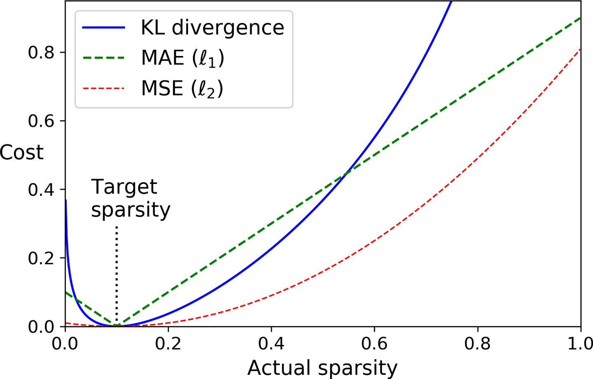

Given two discrete probability distributions *P* and *Q*, the KL
divergence between these distributions, noted *D*~KL~(*P* ∥ *Q*), can be
computed using [Equation
17-1](https://learning.oreilly.com/library/view/hands-on-machine-learning/9781492032632/ch17.html#kl_divergence_equation).


##### [Equation 17-1. ] Kullback--Leibler divergence

$$D_{KL}\left( P \parallel Q \right) = \sum\limits_{i}P\left( i \right)\log\frac{P\left( i \right)}{Q\left( i \right)}$$


In our case, we want to measure the divergence between the target
probability *p* that a neuron in the coding layer will activate and the
actual probability *q* (i.e., the mean activation over the training
batch). So the KL divergence simplifies to [Equation
17-2](https://learning.oreilly.com/library/view/hands-on-machine-learning/9781492032632/ch17.html#kl_divergence_equation_simplified).


##### [Equation 17-2. ] KL divergence between the target sparsity *p* and the actual sparsity *q*

$$D_{KL}\left( p \parallel q \right) = p\,\log\frac{p}{q} + \left( 1 - p \right)\log\frac{1 - p}{1 - q}$$


Once we have computed the sparsity loss for each neuron in the coding
layer, we sum up these losses and add the result to the cost function.
In order to control the relative importance of the sparsity loss and the
reconstruction loss, we can multiply the sparsity loss by a sparsity
weight hyperparameter. If this weight is too high, the model will stick
closely to the target sparsity, but it may not reconstruct the inputs
properly, making the model useless. Conversely, if it is too low, the
model will mostly ignore the sparsity objective and will not learn any
interesting features.

We now have all we need to implement a sparse autoencoder based on the
KL divergence. First, let's create a custom regularizer to apply KL
divergence regularization:

``` {data-type="programlisting" code-language="python"}
K = keras.backend
kl_divergence = keras.losses.kullback_leibler_divergence

class KLDivergenceRegularizer(keras.regularizers.Regularizer):
    def __init__(self, weight, target=0.1):
        self.weight = weight
        self.target = target
    def __call__(self, inputs):
        mean_activities = K.mean(inputs, axis=0)
        return self.weight * (
            kl_divergence(self.target, mean_activities) +
            kl_divergence(1. - self.target, 1. - mean_activities))
```

Now we can build the sparse autoencoder, using the
`KLDivergenceRegularizer` for the coding layer's activations:

``` {data-type="programlisting" code-language="python"}
kld_reg = KLDivergenceRegularizer(weight=0.05, target=0.1)
sparse_kl_encoder = keras.models.Sequential([
    keras.layers.Flatten(input_shape=[28, 28]),
    keras.layers.Dense(100, activation="selu"),
    keras.layers.Dense(300, activation="sigmoid", activity_regularizer=kld_reg)
])
sparse_kl_decoder = keras.models.Sequential([
    keras.layers.Dense(100, activation="selu", input_shape=[300]),
    keras.layers.Dense(28 * 28, activation="sigmoid"),
    keras.layers.Reshape([28, 28])
])
sparse_kl_ae = keras.models.Sequential([sparse_kl_encoder, sparse_kl_decoder])
```

After training this sparse autoencoder on Fashion MNIST, the activations
of the neurons in the coding layer are mostly close to 0 (about 70% of
all activations are lower than 0.1), and all neurons have a mean
activation around 0.1 (about 90% of all neurons have a mean activation
between 0.1 and 0.2), as shown in
[Figure 17-11](https://learning.oreilly.com/library/view/hands-on-machine-learning/9781492032632/ch17.html#sparse_autoencoder_plot).


Variational Autoencoders
========================

Another important category[]{#Avariat17}[]{#varauto17} of autoencoders
was [introduced in 2013](https://homl.info/115) by Diederik Kingma and
Max Welling and quickly became one of the most popular types of
autoencoders: *variational
autoencoders*.^[7](https://learning.oreilly.com/library/view/hands-on-machine-learning/9781492032632/ch17.html#idm45728444038680){#idm45728444038680-marker
.totri-footnote}^

They are quite different from all the autoencoders we have discussed so
far, in these particular ways:

-   They[]{#idm45728444036440}[]{#idm45728444035640} are *probabilistic
    autoencoders*, meaning that their outputs are partly determined by
    chance, even after training (as opposed to denoising autoencoders,
    which use randomness only during training).

-   Most[]{#idm45728444033144}[]{#idm45728444032408} importantly, they
    are *generative autoencoders*, meaning that they can generate new
    instances that look like they were sampled from the training set.

Both these properties make them rather similar to RBMs, but they are
easier to train, and the sampling process is much faster (with RBMs you
need to wait for the network to stabilize into a "thermal equilibrium"
before you can sample a new instance). Indeed, as their name suggests,
variational autoencoders perform variational
[]{#idm45728444029784}Bayesian inference (introduced in
[Chapter 9](https://learning.oreilly.com/library/view/hands-on-machine-learning/9781492032632/ch09.html#unsupervised_learning_chapter)),
which is an efficient way to perform approximate Bayesian inference.

Let's take a look at how they work.
[Figure 17-12](https://learning.oreilly.com/library/view/hands-on-machine-learning/9781492032632/ch17.html#variational_autoencoders_diagram)
(left) shows a variational autoencoder. You can recognize the basic
structure of all autoencoders, with an encoder followed by a decoder (in
this example, they both have two hidden layers), but there is a twist:
instead of directly producing a coding for a given input,
the[]{#idm45728444026136} encoder produces a *mean coding* **μ** and a
standard deviation **σ**. The actual coding is then sampled randomly
from a Gaussian distribution with mean **μ** and standard deviation
**σ**. After that the decoder decodes the sampled coding normally. The
right part of the diagram shows a training instance going through this
autoencoder. First, the encoder produces **μ** and **σ**, then a coding
is sampled randomly (notice that it is not exactly located at **μ**),
and finally this coding is decoded; the final output resembles the
training instance.

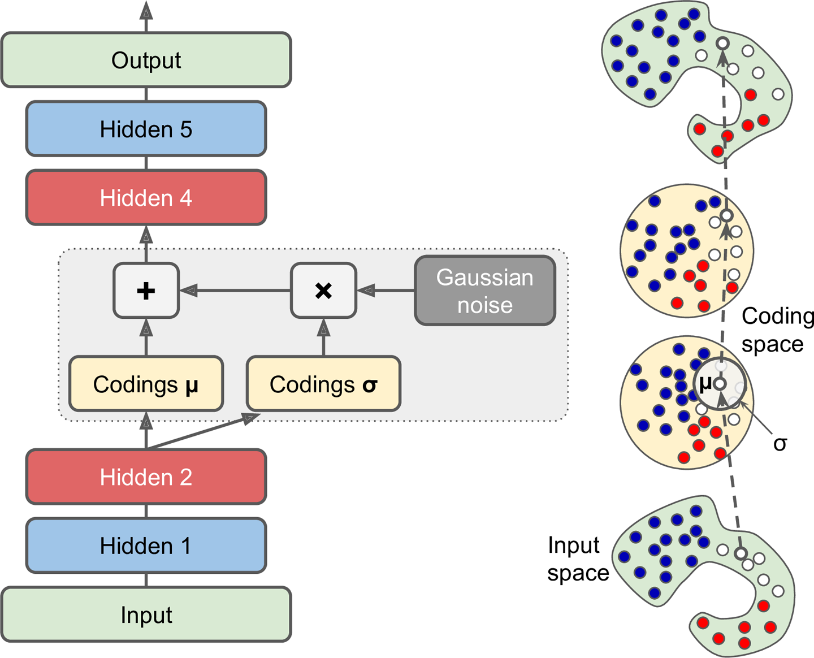

As you can see in the diagram, although the inputs may have a very
convoluted distribution, a variational autoencoder tends to produce
codings that look as though they were sampled from a simple Gaussian
distribution:^[8](https://learning.oreilly.com/library/view/hands-on-machine-learning/9781492032632/ch17.html#idm45728444018968){#idm45728444018968-marker
.totri-footnote}^ during training, the cost function (discussed next)
pushes the codings to gradually migrate within the coding space (also
called the *latent space*) to end up looking like a cloud of Gaussian
points. One great consequence is that after training a variational
autoencoder, you can very easily generate a new instance: just sample a
random coding from the Gaussian distribution, decode it, and voilà!

Now, let's look at the cost function. It is composed of two parts. The
first is the usual reconstruction loss that pushes the autoencoder to
reproduce its inputs (we can use cross entropy for this, as discussed
earlier). The second is[]{#idm45728444016680} the *latent loss* that
pushes the autoencoder to have codings that look as though they were
sampled from a simple Gaussian distribution: it is the KL divergence
between the target distribution (i.e., the Gaussian distribution) and
the actual distribution of the codings. The math is a bit more complex
than with the sparse autoencoder, in particular because of the Gaussian
noise, which limits the amount of information that can be transmitted to
the coding layer (thus pushing the autoencoder to learn useful
features). Luckily, the equations simplify, so the latent loss can be
computed quite simply using [Equation
17-3](https://learning.oreilly.com/library/view/hands-on-machine-learning/9781492032632/ch17.html#var_ae_latent_loss_equation):^[9](https://learning.oreilly.com/library/view/hands-on-machine-learning/9781492032632/ch17.html#idm45728444013976){#idm45728444013976-marker
.totri-footnote}^


##### [Equation 17-3. ] Variational autoencoder's latent loss

$$\mathcal{L} = - \frac{1}{2}\sum\limits_{i = 1}^{n}\left\lbrack {1 + \log\left( {\sigma_{i}}^{2} \right) - {\sigma_{i}}^{2} - {\mu_{i}}^{2}} \right\rbrack$$


In this equation, ℒ is the latent loss, *n* is the codings'
dimensionality, and *μ*~i~ and *σ*~i~ are the mean and standard
deviation of the *i*^th^ component of the codings. The vectors **μ** and
**σ** (which contain all the *μ*~i~ and *σ*~i~) are output by the
encoder, as shown in
[Figure 17-12](https://learning.oreilly.com/library/view/hands-on-machine-learning/9781492032632/ch17.html#variational_autoencoders_diagram)
(left).

A common tweak to the variational autoencoder's architecture is to make
the encoder output **γ** = log(**σ**^2^) rather than **σ**. The latent
loss can then be computed as shown in [Equation
17-4](https://learning.oreilly.com/library/view/hands-on-machine-learning/9781492032632/ch17.html#var_ae_latent_loss_equation_2).
This approach is more numerically stable and speeds up training.


##### [Equation 17-4. ] Variational autoencoder's latent loss, rewritten using **γ** = log(**σ**^2^)

$$\mathcal{L} = - \frac{1}{2}\sum\limits_{i = 1}^{n}\left\lbrack {1 + \gamma_{i} - \exp\left( \gamma_{i} \right) - {\mu_{i}}^{2}} \right\rbrack$$


Let's start building a variational autoencoder for Fashion MNIST (as
shown in
[Figure 17-12](https://learning.oreilly.com/library/view/hands-on-machine-learning/9781492032632/ch17.html#variational_autoencoders_diagram),
but using the **γ** tweak). First, we will need a custom layer to sample
the codings, given **μ** and **γ**:

``` {data-type="programlisting" code-language="python"}
class Sampling(keras.layers.Layer):
    def call(self, inputs):
        mean, log_var = inputs
        return K.random_normal(tf.shape(log_var)) * K.exp(log_var / 2) + mean
```

This `Sampling` layer takes two inputs: `mean` (**μ**) and `log_var`
(**γ**). It uses the function `K.random_normal()` to sample a random
vector (of the same shape as **γ**) from the Normal distribution, with
mean 0 and standard deviation 1. Then it multiplies it by exp(**γ** / 2)
(which is equal to **σ**, as you can verify), and finally it adds **μ**
and returns the result. This samples a codings vector from the Normal
distribution with mean **μ** and standard deviation **σ**.

Next, we can create the encoder, using the Functional API because the
model is not entirely sequential:

``` {data-type="programlisting" code-language="python"}
codings_size = 10

inputs = keras.layers.Input(shape=[28, 28])
z = keras.layers.Flatten()(inputs)
z = keras.layers.Dense(150, activation="selu")(z)
z = keras.layers.Dense(100, activation="selu")(z)
codings_mean = keras.layers.Dense(codings_size)(z)  # μ
codings_log_var = keras.layers.Dense(codings_size)(z)  # γ
codings = Sampling()([codings_mean, codings_log_var])
variational_encoder = keras.Model(
    inputs=[inputs], outputs=[codings_mean, codings_log_var, codings])
```

Note that the `Dense` layers that output `codings_mean` (**μ**) and
`codings_log_var` (**γ**) have the same inputs (i.e., the outputs of the
second `Dense` layer). We then pass both `codings_mean` and
`codings_log_var` to the `Sampling` layer. Finally, the
`variational_encoder` model has three outputs, in case you want to
inspect the values of `codings_mean` and `codings_log_var`. The only
output we will use is the last one (`codings`). Now let's build the
decoder:

``` {data-type="programlisting" code-language="python"}
decoder_inputs = keras.layers.Input(shape=[codings_size])
x = keras.layers.Dense(100, activation="selu")(decoder_inputs)
x = keras.layers.Dense(150, activation="selu")(x)
x = keras.layers.Dense(28 * 28, activation="sigmoid")(x)
outputs = keras.layers.Reshape([28, 28])(x)
variational_decoder = keras.Model(inputs=[decoder_inputs], outputs=[outputs])
```

For this decoder, we could have used the Sequential API instead of the
Functional API, since it is really just a simple stack of layers,
virtually identical to many of the decoders we have built so far.
Finally, let's build the variational autoencoder model:

``` {data-type="programlisting" code-language="python"}
_, _, codings = variational_encoder(inputs)
reconstructions = variational_decoder(codings)
variational_ae = keras.Model(inputs=[inputs], outputs=[reconstructions])
```

Note that we ignore the first two outputs of the encoder (we only want
to feed the codings to the decoder). Lastly, we must add the latent loss
and the reconstruction loss:

``` {data-type="programlisting" code-language="python"}
latent_loss = -0.5 * K.sum(
    1 + codings_log_var - K.exp(codings_log_var) - K.square(codings_mean),
    axis=-1)
variational_ae.add_loss(K.mean(latent_loss) / 784.)
variational_ae.compile(loss="binary_crossentropy", optimizer="rmsprop")
```

We first apply [Equation
17-4](https://learning.oreilly.com/library/view/hands-on-machine-learning/9781492032632/ch17.html#var_ae_latent_loss_equation_2)
to compute the latent loss for each instance in the batch (we sum over
the last axis). Then we compute the mean loss over all the instances in
the batch, and we divide the result by 784 to ensure it has the
appropriate scale compared to the reconstruction loss. Indeed, the
variational autoencoder's reconstruction loss is supposed to be the sum
of the pixel reconstruction errors, but when Keras computes the
`"binary_crossentropy"` loss, it computes the mean over all 784 pixels,
rather than the sum. So, the reconstruction loss is 784 times smaller
than we need it to be. We could define a custom loss to compute the sum
rather than the mean, but it is simpler to divide the latent loss by 784
(the final loss will be 784 times smaller than it should be, but this
just means that we should use a larger learning rate).

Note that we use the `RMSprop` optimizer, which works well in this case.
And finally we can train the autoencoder!

``` {data-type="programlisting" code-language="python"}
history = variational_ae.fit(X_train, X_train, epochs=50, batch_size=128,
                             validation_data=[X_valid, X_valid])
```


Generating Fashion MNIST Images
-------------------------------

Now[]{#idm45728443320824}[]{#idm45728443319848} let's use this
variational autoencoder to generate images that look like fashion items.
All we need to do is sample random codings from a Gaussian distribution
and decode them:

``` {data-type="programlisting" code-language="python"}
codings = tf.random.normal(shape=[12, codings_size])
images = variational_decoder(codings).numpy()
```

[Figure 17-13](https://learning.oreilly.com/library/view/hands-on-machine-learning/9781492032632/ch17.html#vae_generated_images_plot)
shows the 12 generated images.

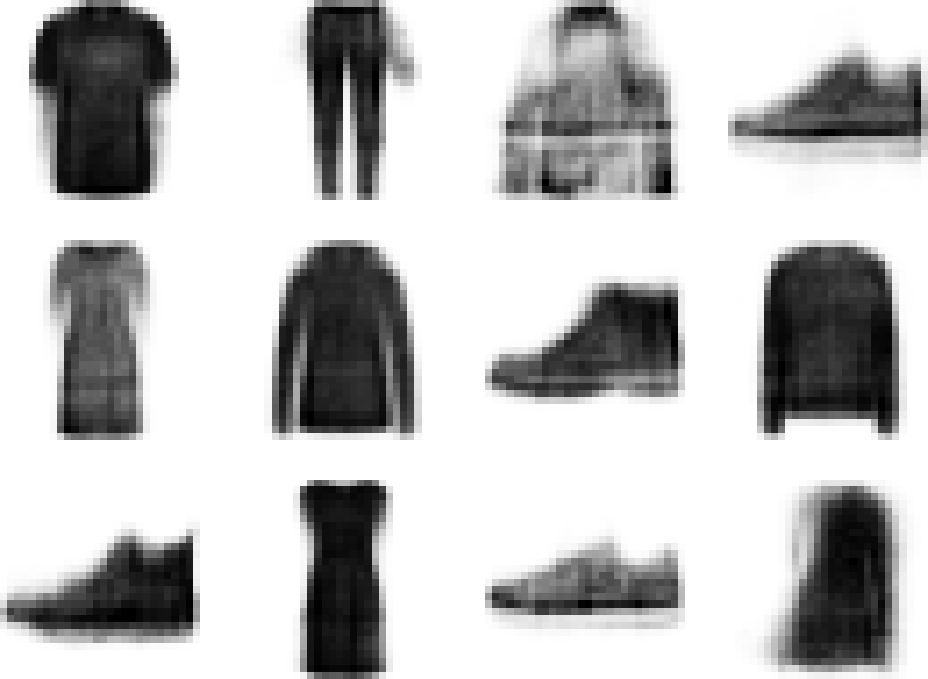

The majority of these images look fairly convincing, if a bit too fuzzy.
The rest are not great, but don't be too harsh on the autoencoder---it
only had a few minutes to learn! Give it a bit more fine-tuning and
training time, and those images should look better.

Variational[]{#idm45728443288008} autoencoders make it possible to
perform *semantic interpolation*: instead of interpolating two images at
the pixel level (which would look as if the two images were overlaid),
we can interpolate at the codings level. We first run both images
through the encoder, then we interpolate the two codings we get, and
finally we decode the interpolated codings to get the final image. It
will look like a regular Fashion MNIST image, but it will be an
intermediate between the original images. In the following code example,
we take the 12 codings we just generated, we organize them in a 3 × 4
grid, and we use TensorFlow's `tf.image.resize()` function to resize
this grid to 5 × 7. By default, the `resize()` function will perform
bilinear interpolation, so every other row and column will contain
interpolated codings. We then use the decoder to produce all the images:

``` {data-type="programlisting" code-language="python"}
codings_grid = tf.reshape(codings, [1, 3, 4, codings_size])
larger_grid = tf.image.resize(codings_grid, size=[5, 7])
interpolated_codings = tf.reshape(larger_grid, [-1, codings_size])
images = variational_decoder(interpolated_codings).numpy()
```

[Figure 17-14](https://learning.oreilly.com/library/view/hands-on-machine-learning/9781492032632/ch17.html#semantic_interpolation_plot)
shows the resulting images. The original images are framed, and the rest
are the result of semantic interpolation between the nearby images.
Notice, for example, how the shoe in the fourth row and fifth column is
a nice interpolation between the two shoes located above and below it.

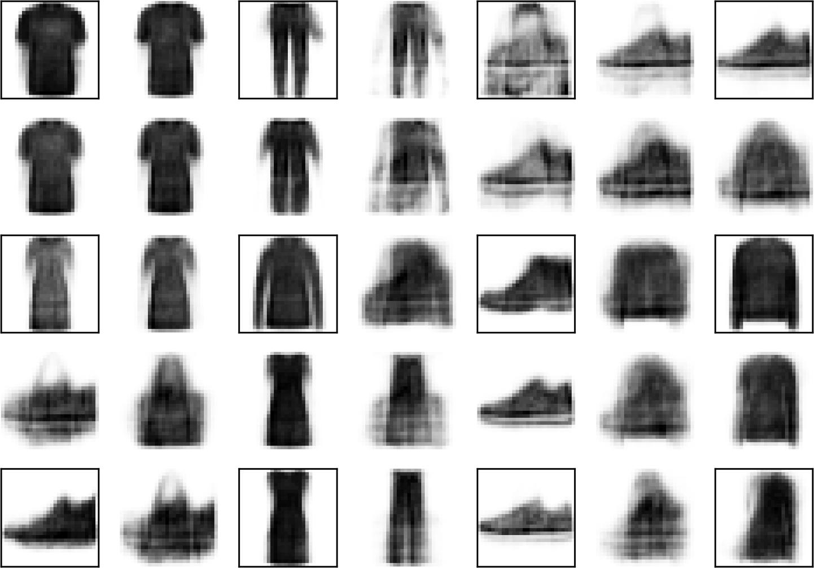

For several years, variational autoencoders were quite popular, but GANs
eventually took the lead, in particular because they are capable of
generating much more realistic and crisp images. So let's turn our
attention to GANs.[]{#idm45728443183720}[]{#idm45728443182744}


Generative Adversarial Networks
===============================

Generative adversarial networks[]{#idm45728443180360} were proposed in a
[2014
paper](https://homl.info/gan)^[10](https://learning.oreilly.com/library/view/hands-on-machine-learning/9781492032632/ch17.html#idm45728443178728){#idm45728443178728-marker}^
by Ian Goodfellow et al., and although the idea got researchers excited
almost instantly, it took a few years to overcome some of the
difficulties of training GANs. Like many great ideas, it seems simple in
hindsight: make neural networks compete against each other in the hope
that this competition will push them to excel. As shown in
[Figure 17-15](https://learning.oreilly.com/library/view/hands-on-machine-learning/9781492032632/ch17.html#gan_diagram),
a GAN is composed of two neural networks:

Generator

:   Takes a random distribution as input (typically Gaussian) and
    outputs some data---typically, an image. You can think of the random
    inputs as the latent representations (i.e., codings) of the image to
    be generated. So, as you can see, the generator offers the same
    functionality as a decoder in a variational autoencoder, and it can
    be used in the same way to generate new images (just feed it some
    Gaussian noise, and it outputs a brand-new image). However, it is
    trained very differently, as we will soon see.

Discriminator

:   Takes either a fake image from the generator or a real image from
    the training set as input, and must guess whether the input image is
    fake or real.

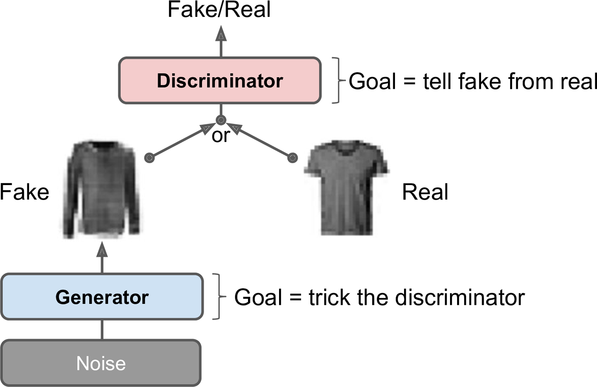

During training, the generator and the discriminator have opposite
goals: the discriminator tries to tell fake images from real images,
while the generator tries to produce images that look real enough to
trick the discriminator. Because the GAN is composed of two networks
with different objectives, it cannot be trained like a regular neural
network. Each training iteration is divided into two phases:

-   In the first phase, we train the discriminator. A batch of real
    images is sampled from the training set and is completed with an
    equal number of fake images produced by the generator. The labels
    are set to 0 for fake images and 1 for real images, and the
    discriminator is trained on this labeled batch for one step, using
    the binary cross-entropy loss. Importantly, backpropagation only
    optimizes the weights of the discriminator during this phase.

-   In the second phase, we train the generator. We first use it to
    produce another batch of fake images, and once again the
    discriminator is used to tell whether the images are fake or real.
    This time we do not add real images in the batch, and all the labels
    are set to 1 (real): in other words, we want the generator to
    produce images that the discriminator will (wrongly) believe to be
    real! Crucially, the weights of the discriminator are frozen during
    this step, so backpropagation only affects the weights of the
    generator.


###### Note

The generator never actually sees any real images, yet it gradually
learns to produce convincing fake images! All it gets is the gradients
flowing back through the discriminator. Fortunately, the better the
discriminator gets, the more information about the real images is
contained in these secondhand gradients, so the generator can make
significant progress.


Let's go ahead and build a simple GAN for Fashion MNIST.

First, we need to build the generator and the discriminator. The
generator is similar to an autoencoder's decoder, and the discriminator
is a regular binary classifier (it takes an image as input and ends with
a `Dense` layer containing a single unit and using the sigmoid
activation function). For the second phase of each training iteration,
we also need the full GAN model containing the generator followed by the
[discriminator]:

``` {data-type="programlisting" code-language="python"}
codings_size = 30

generator = keras.models.Sequential([
    keras.layers.Dense(100, activation="selu", input_shape=[codings_size]),
    keras.layers.Dense(150, activation="selu"),
    keras.layers.Dense(28 * 28, activation="sigmoid"),
    keras.layers.Reshape([28, 28])
])
discriminator = keras.models.Sequential([
    keras.layers.Flatten(input_shape=[28, 28]),
    keras.layers.Dense(150, activation="selu"),
    keras.layers.Dense(100, activation="selu"),
    keras.layers.Dense(1, activation="sigmoid")
])
gan = keras.models.Sequential([generator, discriminator])
```

Next, we need to compile these models. As the discriminator is a binary
classifier, we can naturally use the binary cross-entropy loss. The
generator will only be trained through the `gan` model, so we do not
need to compile it at all. The `gan` model is also a binary classifier,
so it can use the binary cross-entropy loss. Importantly, the
discriminator should not be trained during the second phase, so we make
it non-trainable before compiling the `gan` model:

``` {data-type="programlisting" code-language="python"}
discriminator.compile(loss="binary_crossentropy", optimizer="rmsprop")
discriminator.trainable = False
gan.compile(loss="binary_crossentropy", optimizer="rmsprop")
```


###### Note

The `trainable` attribute is taken into account by Keras only when
compiling a model, so after running this code, the `discriminator` *is*
trainable if we call its `fit()` method or its `train_on_batch()` method
(which we will be using), while it is *not* trainable when we call these
methods on the `gan` model.


Since the training loop is unusual, we cannot use the regular `fit()`
method. Instead, we will write a custom training loop. For this, we
first need to create a `Dataset` to iterate through the images:

``` {data-type="programlisting" code-language="python"}
batch_size = 32
dataset = tf.data.Dataset.from_tensor_slices(X_train).shuffle(1000)
dataset = dataset.batch(batch_size, drop_remainder=True).prefetch(1)
```

We are now ready to write the training loop. Let's wrap it in a
`train_gan()` function:

``` {.pagebreak-before data-type="programlisting" code-language="python"}
def train_gan(gan, dataset, batch_size, codings_size, n_epochs=50):
    generator, discriminator = gan.layers
    for epoch in range(n_epochs):
        for X_batch in dataset:
            # phase 1 - training the discriminator
            noise = tf.random.normal(shape=[batch_size, codings_size])
            generated_images = generator(noise)
            X_fake_and_real = tf.concat([generated_images, X_batch], axis=0)
            y1 = tf.constant([[0.]] * batch_size + [[1.]] * batch_size)
            discriminator.trainable = True
            discriminator.train_on_batch(X_fake_and_real, y1)
            # phase 2 - training the generator
            noise = tf.random.normal(shape=[batch_size, codings_size])
            y2 = tf.constant([[1.]] * batch_size)
            discriminator.trainable = False
            gan.train_on_batch(noise, y2)

train_gan(gan, dataset, batch_size, codings_size)
```

As discussed earlier, you can see the two phases at each iteration:

-   In phase one we feed Gaussian noise to the generator to produce fake
    images, and we complete this batch by concatenating an equal number
    of real images. The targets `y1` are set to 0 for fake images and 1
    for real images. Then we train the discriminator on this batch. Note
    that we set the discriminator's `trainable` attribute to `True`:
    this is only to get rid of a warning that Keras displays when it
    notices that `trainable` is now `False` but was `True` when the
    model was compiled (or vice versa).

-   In phase two, we feed the GAN some Gaussian noise. Its generator
    will start by producing fake images, then the discriminator will try
    to guess whether these images are fake or real. We want the
    discriminator to believe that the fake images are real, so the
    targets `y2` are set to 1. Note that we set the `trainable`
    attribute to `False`, once again to avoid a warning.

That's it! If you display the generated images (see
[Figure 17-16](https://learning.oreilly.com/library/view/hands-on-machine-learning/9781492032632/ch17.html#gan_generated_images_plot)),
you will see that at the end of the first epoch, they already start to
look like (very noisy) Fashion MNIST images.

Unfortunately, the images never really get much better than that, and
you may even find epochs where the GAN seems to be forgetting what it
learned. Why is that? Well, it turns out that training a GAN can be
challenging. Let's see why.

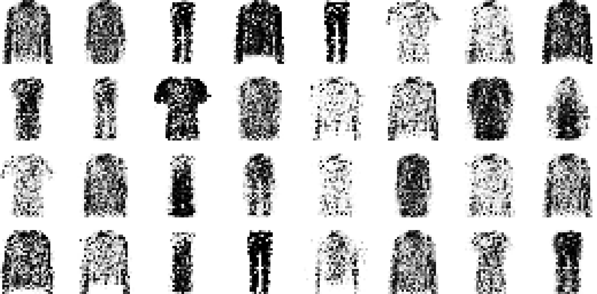


The Difficulties of Training GANs
---------------------------------

During[]{#idm45728442634136}[]{#idm45728442633048} training, the
generator and the discriminator constantly try to outsmart each other,
in a zero-sum game. As training advances, the game may end up in a state
that game theorists call a *Nash equilibrium*, named after the
mathematician John Nash: this is when no player would be better off
changing their own strategy, assuming the other players do not change
theirs. For example, a Nash equilibrium is reached when everyone drives
on the left side of the road: no driver would be better off being the
only one to switch sides. Of course, there is a second possible Nash
equilibrium: when everyone drives on the *right* side of the road.
Different initial states and dynamics may lead to one equilibrium or the
other. In this example, there is a single optimal strategy once an
equilibrium is reached (i.e., driving on the same side as everyone
else), but a Nash equilibrium can involve multiple competing strategies
(e.g., a predator chases its prey, the prey tries to escape, and neither
would be better off changing their strategy).

So how does this apply to GANs? Well, the authors of the paper
demonstrated that a GAN can only reach a single Nash equilibrium: that's
when the generator produces perfectly realistic images, and the
discriminator is forced to guess (50% real, 50% fake). This fact is very
encouraging: it would seem that you just need to train the GAN for long
enough, and it will eventually reach this equilibrium, giving you a
perfect generator. Unfortunately, it's not that simple: nothing
guarantees that the equilibrium will ever be reached.

The[]{#idm45728442628728} biggest difficulty is called *mode collapse*:
this is when the generator's outputs gradually become less diverse. How
can this happen? Suppose that the generator gets better at producing
convincing shoes than any other class. It will fool the discriminator a
bit more with shoes, and this will encourage it to produce even more
images of shoes. Gradually, it will forget how to produce anything else.
Meanwhile, the only fake images that the discriminator will see will be
shoes, so it will also forget how to discriminate fake images of other
classes. Eventually, when the discriminator manages to discriminate the
fake shoes from the real ones, the generator will be forced to move to
another class. It may then become good at shirts, forgetting about
shoes, and the discriminator will follow. The GAN may gradually cycle
across a few classes, never really becoming very good at any of them.

Moreover, because the generator and the discriminator are constantly
pushing against each other, their parameters may end up oscillating and
becoming unstable. Training may begin properly, then suddenly diverge
for no apparent reason, due to these instabilities. And since many
factors affect these complex dynamics, GANs are very sensitive to the
hyperparameters: you may have to spend a lot of effort fine-tuning them.

These problems have kept researchers very busy since 2014: many papers
were published on this topic, some proposing new cost
functions^[11](https://learning.oreilly.com/library/view/hands-on-machine-learning/9781492032632/ch17.html#idm45728442624984){#idm45728442624984-marker}^
(though a [2018
paper](https://homl.info/gansequal)^[12](https://learning.oreilly.com/library/view/hands-on-machine-learning/9781492032632/ch17.html#idm45728442622968){#idm45728442622968-marker}^
by Google researchers questions their efficiency) or techniques to
stabilize training or to avoid the mode collapse issue. For example, a
popular technique[]{#idm45728442621576} called *experience replay*
consists in storing the images produced by the generator at each
iteration in a replay buffer (gradually dropping older generated images)
and training the discriminator using real images plus fake images drawn
from this buffer (rather than just fake images produced by the current
generator). This reduces the chances that the discriminator will overfit
the latest generator's outputs. Another common
technique[]{#idm45728442619928} is called *mini-batch discrimination*:
it measures how similar images are across the batch and provides this
statistic to the discriminator, so it can easily reject a whole batch of
fake images that lack diversity. This encourages the generator to
produce a greater variety of images, reducing the chance of mode
collapse. Other papers simply propose specific architectures that happen
to perform well.

In short, this is still a very active field of research, and the
dynamics of GANs are still not perfectly understood. But the good news
is that great progress has been made, and some of the results are truly
astounding! So let's look at some of the most successful architectures,
starting with deep convolutional GANs, which were the state of the art
just a few years ago. Then we will look at two more recent (and more
complex) architectures.


Deep Convolutional GANs
-----------------------

The[]{#idm45728442615992}[]{#idm45728442615000} original GAN paper in
2014 experimented with convolutional layers, but only tried to generate
small images. Soon after, many researchers tried to build GANs based on
deeper convolutional nets for larger images. This proved to be tricky,
as training was very unstable, but Alec Radford et al. finally succeeded
in late 2015, after experimenting with many different architectures and
hyperparameters. They called their architecture [*deep convolutional
GANs*](https://homl.info/dcgan)
(DCGANs).^[13](https://learning.oreilly.com/library/view/hands-on-machine-learning/9781492032632/ch17.html#idm45728442612936){#idm45728442612936-marker}^
Here are the main guidelines they proposed for building stable
convolutional GANs:

-   Replace any pooling layers with strided convolutions (in the
    discriminator) and transposed convolutions (in the generator).

-   Use Batch Normalization in both the generator and the discriminator,
    except in the generator's output layer and the discriminator's input
    layer.

-   Remove fully connected hidden layers for deeper architectures.

-   Use ReLU activation in the generator for all layers except the
    output layer, which should use tanh.

-   Use leaky ReLU activation in the discriminator for all layers.

These guidelines will work in many cases, but not always, so you may
still need to experiment with different hyperparameters (in fact, just
changing the random seed and training the same model again will
sometimes work). For example, here is a small DCGAN that works
reasonably well with Fashion MNIST:

``` {.pagebreak-before data-type="programlisting" code-language="python"}
codings_size = 100

generator = keras.models.Sequential([
    keras.layers.Dense(7 * 7 * 128, input_shape=[codings_size]),
    keras.layers.Reshape([7, 7, 128]),
    keras.layers.BatchNormalization(),
    keras.layers.Conv2DTranspose(64, kernel_size=5, strides=2, padding="same",
                                 activation="selu"),
    keras.layers.BatchNormalization(),
    keras.layers.Conv2DTranspose(1, kernel_size=5, strides=2, padding="same",
                                 activation="tanh")
])
discriminator = keras.models.Sequential([
    keras.layers.Conv2D(64, kernel_size=5, strides=2, padding="same",
                        activation=keras.layers.LeakyReLU(0.2),
                        input_shape=[28, 28, 1]),
    keras.layers.Dropout(0.4),
    keras.layers.Conv2D(128, kernel_size=5, strides=2, padding="same",
                        activation=keras.layers.LeakyReLU(0.2)),
    keras.layers.Dropout(0.4),
    keras.layers.Flatten(),
    keras.layers.Dense(1, activation="sigmoid")
])
gan = keras.models.Sequential([generator, discriminator])
```

The generator takes codings of size 100, and it projects them to 6272
dimensions (7 \* 7 \* 128), and reshapes the result to get a 7 × 7 × 128
tensor. This tensor is batch normalized and fed to a transposed
convolutional layer with a stride of 2, which upsamples it from 7 × 7 to
14 × 14 and reduces its depth from 128 to 64. The result is batch
normalized again and fed to another transposed convolutional layer with
a stride of 2, which upsamples it from 14 × 14 to 28 × 28 and reduces
the depth from 64 to 1. This layer uses the tanh activation function, so
the outputs will range from --1 to 1. For this reason, before training
the GAN, we need to rescale the training set to that same range. We also
need to reshape it to add the channel dimension:

``` {data-type="programlisting" code-language="python"}
X_train = X_train.reshape(-1, 28, 28, 1) * 2. - 1. # reshape and rescale
```

The discriminator looks much like a regular CNN for binary
classification, except instead of using max pooling layers to downsample
the image, we use strided convolutions (`strides=2`). Also note that we
use the leaky ReLU activation function.

Overall, we respected the DCGAN guidelines, except we replaced the
`BatchNormalization` layers in the discriminator with `Dropout` layers
(otherwise training was unstable in this case) and we replaced ReLU with
SELU in the generator. Feel free to tweak this architecture: you will
see how sensitive it is to the hyperparameters (especially the relative
learning rates of the two networks).

Lastly, to build the dataset, then compile and train this model, we use
the exact same code as earlier. After 50 epochs of training, the
generator produces images like those shown in
[Figure 17-17](https://learning.oreilly.com/library/view/hands-on-machine-learning/9781492032632/ch17.html#dcgan_generated_images_plot).
It's still not perfect, but many of these images are pretty
[convincing].

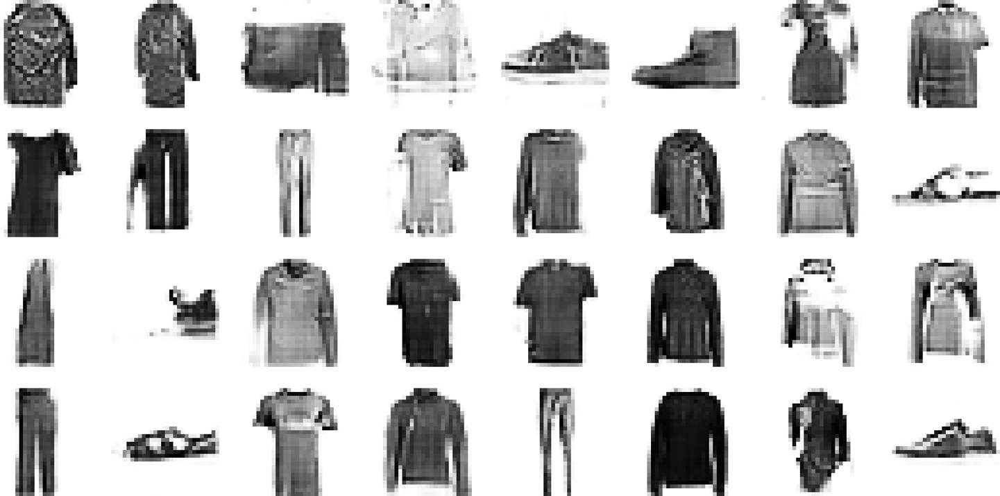

If you scale up this architecture and train it on a large dataset of
faces, you can get fairly realistic images. In fact, DCGANs can learn
quite meaningful latent representations, as you can see in
[Figure 17-18](https://learning.oreilly.com/library/view/hands-on-machine-learning/9781492032632/ch17.html#faces_arithmetics_diagram):
many images were generated, and nine of them were picked manually (top
left), including three representing men with glasses, three men without
glasses, and three women without glasses. For each of these categories,
the codings that were used to generate the images were averaged, and an
image was generated based on the resulting mean codings (lower left). In
short, each of the three lower-left images represents the mean of the
three images located above it. But this is not a simple mean computed at
the pixel level (this would result in three overlapping faces), it is a
mean computed in the latent space, so the images still look like normal
faces. Amazingly, if you compute men with glasses, minus men without
glasses, plus women without glasses---where each term corresponds to one
of the mean codings---and you generate the image that corresponds to
this coding, you get the image at the center of the 3 × 3 grid of faces
on the right: a woman with glasses! The eight other images around it
were generated based on the same vector plus a bit of noise, to
illustrate the semantic interpolation capabilities of DCGANs. Being able
to do arithmetic on faces feels like science fiction!

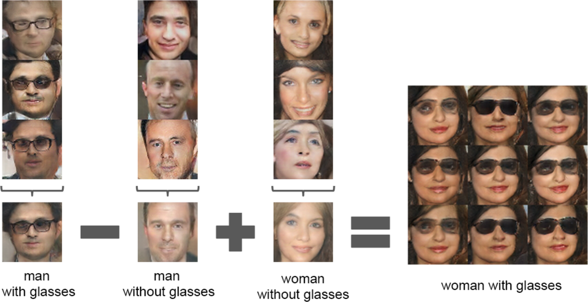


###### Tip

If you add each image's class as an extra input to both the generator
and the discriminator, they will both learn what each class looks like,
and thus you will be able to control the class of each image produced by
the generator. This is called a [*conditional
GAN*](https://homl.info/cgan)^[15](https://learning.oreilly.com/library/view/hands-on-machine-learning/9781492032632/ch17.html#idm45728442378376){#idm45728442378376-marker}^
(CGAN).


DCGANs aren't perfect, though. For example, when you try to generate
very large images using DCGANs, you often end up with locally convincing
features but overall inconsistencies (such as shirts with one sleeve
much longer than the other). How can you fix this?


Progressive Growing of GANs
---------------------------

An[]{#idm45728442375272} important technique was proposed in a [2018
paper](https://homl.info/progan)^[16](https://learning.oreilly.com/library/view/hands-on-machine-learning/9781492032632/ch17.html#idm45728442373528){#idm45728442373528-marker}^
by Nvidia researchers Tero Karras et al.: they suggested generating
small images at the beginning of training, then gradually adding
convolutional layers to both the generator and the discriminator to
produce larger and larger images (4 × 4, 8 × 8, 16 × 16, ..., 512 × 512,
1,024 × 1,024). This approach resembles greedy layer-wise training of
stacked autoencoders. The extra layers get added at the end of the
generator and at the beginning of the discriminator, and previously
trained layers remain trainable.

For example, when growing the generator's outputs from 4 × 4 to 8 × 8
(see
[Figure 17-19](https://learning.oreilly.com/library/view/hands-on-machine-learning/9781492032632/ch17.html#progressively_growing_gan_diagram)),
an upsampling layer (using nearest neighbor filtering) is added to the
existing convolutional layer, so it outputs 8 × 8 feature maps, which
are then fed to the new convolutional layer (which uses `"same"` padding
and strides of 1, so its outputs are also 8 × 8). This new layer is
followed by a new output convolutional layer: this is a regular
convolutional layer with kernel size 1 that projects the outputs down to
the desired number of color channels (e.g., 3). To avoid breaking the
trained weights of the first convolutional layer when the new
convolutional layer is added, the final output is a weighted sum of the
original output layer (which now outputs 8 × 8 feature maps) and the new
output layer. The weight of the new outputs is *α*, while the weight of
the original outputs is 1 -- *α*, and *α* is slowly increased from 0 to
1. In other words, the new convolutional layers (represented with dashed
lines in
[Figure 17-19](https://learning.oreilly.com/library/view/hands-on-machine-learning/9781492032632/ch17.html#progressively_growing_gan_diagram))
are gradually faded in, while the original output layer is gradually
faded out. A similar fade-in/fade-out technique is used when a new
convolutional layer is added to the discriminator (followed by an
average pooling layer for downsampling).


The paper also introduced several other techniques aimed at increasing
the diversity of the outputs (to avoid mode collapse) and making
training more stable:

Minibatch standard deviation layer

:   Added near[]{#idm45728442343784}[]{#idm45728442343032} the end of
    the discriminator. For each position in the inputs, it computes the
    standard deviation across all channels and all instances in the
    batch
    ([`S = tf.math.reduce_std(inputs, axis=[0, -1])`]).
    These standard deviations are then averaged across all points to get
    a single value (`v = tf.reduce_​mean(S)`). Finally, an extra feature
    map is added to each instance in the batch and filled with the
    computed value
    (`tf.concat([inputs, tf.fill([batch_size, height, width, 1], v)], axis=-1)`).
    How does this help? Well, if the generator produces images with
    little variety, then there will be a small standard deviation across
    feature maps in the discriminator. Thanks to this layer, the
    discriminator will have easy access to this statistic, making it
    less likely to be fooled by a generator that produces too little
    diversity. This will encourage the generator to produce more diverse
    outputs, reducing the risk of mode collapse.

Equalized learning rate

:   Initializes[]{#idm45728442338024}[]{#idm45728442337272} all weights
    using a simple Gaussian distribution with mean 0 and standard
    deviation 1 rather than using He initialization. However, the
    weights are scaled down at runtime (i.e., every time the layer is
    executed) by the same factor as in He initialization: they are
    divided by $\sqrt{2/n_{\text{inputs}}}$, where *n*~inputs~ is the
    number of inputs to the layer. The paper demonstrated that this
    technique significantly improved the GAN's performance when using
    RMSProp, Adam, or other adaptive gradient optimizers. Indeed, these
    optimizers normalize the gradient updates by their estimated
    standard deviation (see
    [Chapter 11](https://learning.oreilly.com/library/view/hands-on-machine-learning/9781492032632/ch11.html#deep_chapter)),
    so parameters that have a larger dynamic
    range^[17](https://learning.oreilly.com/library/view/hands-on-machine-learning/9781492032632/ch17.html#idm45728442330328){#idm45728442330328-marker}^
    will take longer to train, while parameters with a small dynamic
    range may be updated too quickly, leading to instabilities. By
    rescaling the weights as part of the model itself rather than just
    rescaling them upon initialization, this approach ensures that the
    dynamic range is the same for all parameters, throughout training,
    so they all learn at the same speed. This both speeds up and
    stabilizes training.

Pixelwise normalization layer

:   Added[]{#idm45728442328008}[]{#idm45728442327208} after each
    convolutional layer in the generator. It normalizes each activation
    based on all the activations in the same image and at the same
    location, but across all channels (dividing by the square root of
    the mean squared activation). In TensorFlow code, this is
    `inputs / tf.sqrt(tf.reduce_mean(tf.square(X), axis=-1, keepdims=True) + 1e-8)`
    (the smoothing term `1e-8` is needed to avoid division by zero).
    This technique avoids explosions in the activations due to excessive
    competition between the generator and the discriminator.

The combination of all these techniques allowed the authors to generate
[extremely convincing high-definition images of
faces](https://homl.info/progandemo). But what exactly do we call
"convincing"? Evaluation is one of the big challenges when working with
GANs: although it is possible to automatically evaluate the diversity of
the generated images, judging their quality is a much trickier and
subjective task. One technique is to use human raters, but this is
costly and time-consuming. So the authors proposed to measure the
similarity between the local image structure of the generated images and
the training images, considering every scale. This idea led them to
another groundbreaking innovation: StyleGANs.


StyleGANs
---------

The
state[]{#idm45728442321416}[]{#idm45728442320680}[]{#idm45728442319768}
of the art in high-resolution image generation was advanced once again
by the same Nvidia team in a [2018
paper](https://homl.info/stylegan)^[18](https://learning.oreilly.com/library/view/hands-on-machine-learning/9781492032632/ch17.html#idm45728442318360){#idm45728442318360-marker}^
that introduced the popular StyleGAN architecture. The authors used
*style transfer* techniques in the generator to ensure that the
generated images have the same local structure as the training images,
at every scale, greatly improving the quality of the generated images.
The discriminator and the loss function were not modified, only the
generator. Let's take a look at the StyleGAN. It is composed of two
networks (see
[Figure 17-20](https://learning.oreilly.com/library/view/hands-on-machine-learning/9781492032632/ch17.html#stylegan_diagram)):

Mapping network

:   An eight-layer MLP that maps the latent representations **z** (i.e.,
    the codings) to a vector **w**. This vector is then
    sent[]{#idm45728442313352}[]{#idm45728442312648} through multiple
    *affine transformations* (i.e., `Dense` layers with no activation
    functions, represented by the "A" boxes in
    [Figure 17-20](https://learning.oreilly.com/library/view/hands-on-machine-learning/9781492032632/ch17.html#stylegan_diagram)),
    which produces multiple vectors. These vectors control the style of
    the generated image at different levels, from fine-grained texture
    (e.g., hair color) to high-level features (e.g., adult or child). In
    short, the mapping network maps the codings to multiple style
    vectors.

Synthesis network

:   Responsible for generating the images. It has a constant learned
    input (to be clear, this input will be constant *after* training,
    but *during* training it keeps getting tweaked by backpropagation).
    It processes this input through multiple convolutional and
    upsampling layers, as earlier, but there are two twists: first, some
    noise is added to the input and to all the outputs of the
    convolutional layers (before the activation function). Second, each
    noise layer[]{#idm45728442307112}[]{#idm45728442306344} is followed
    by an *Adaptive Instance Normalization* (AdaIN) layer: it
    standardizes each feature map independently (by subtracting the
    feature map's mean and dividing by its standard deviation), then it
    uses the style vector to determine the scale and offset of each
    feature map (the style vector contains one scale and one bias term
    for each feature map).


The idea of adding noise independently from the codings is very
important. Some parts of an image are quite random, such as the exact
position of each freckle or hair. In earlier GANs, this randomness had
to either come from the codings or be some pseudorandom noise produced
by the generator itself. If it came from the codings, it meant that the
generator had to dedicate a significant portion of the codings'
representational power to store noise: this is quite wasteful. Moreover,
the noise had to be able to flow through the network and reach the final
layers of the generator: this seems like an unnecessary constraint that
probably slowed down training. And finally, some visual artifacts may
appear because the same noise was used at different levels. If instead
the generator tried to produce its own pseudorandom noise, this noise
might not look very convincing, leading to more visual artifacts. Plus,
part of the generator's weights would be dedicated to generating
pseudorandom noise, which again seems wasteful. By adding extra noise
inputs, all these issues are avoided; the GAN is able to use the
provided noise to add the right amount of stochasticity to each part of
the image.

The added noise is different for each level. Each noise input consists
of a single feature map full of Gaussian noise, which is broadcast to
all feature maps (of the given level) and scaled using learned
per-feature scaling factors (this is represented by the "B" boxes in
[Figure 17-20](https://learning.oreilly.com/library/view/hands-on-machine-learning/9781492032632/ch17.html#stylegan_diagram))
before it is added.

Finally, StyleGAN uses[]{#idm45728442297944}[]{#idm45728442296856} a
technique called *mixing regularization* (or *style mixing*), where a
percentage of the generated images are produced using two different
codings. Specifically, the codings **c**~1~ and **c**~2~ are sent
through the mapping network, giving two style vectors **w**~1~ and
**w**~2~. Then the synthesis network generates an image based on the
styles **w**~1~ for the first levels and the styles **w**~2~ for the
remaining levels. The cutoff level is picked randomly. This prevents the
network from assuming that styles at adjacent levels are correlated,
which in turn encourages locality in the GAN, meaning that each style
vector only affects a limited number of traits in the generated image.

There is such a wide variety of GANs out there that it would require a
whole book to cover them all. Hopefully this introduction has given you
the main ideas, and most importantly the desire to learn more. If you're
struggling with a mathematical concept, there are probably blog posts
out there that will help you understand it better. Then go ahead and
implement your own GAN, and do not get discouraged if it has trouble
learning at first: unfortunately, this is normal, and it will require
quite a bit of patience before it works, but the result is worth it. If
you're struggling with an implementation detail, there are plenty of
Keras or TensorFlow implementations that you can look at. In fact, if
all you want is to get some amazing results quickly, then you can just
use a pretrained model (e.g., there are pretrained StyleGAN models
available for Keras).

In the next chapter we will move to an entirely different branch of Deep
Learning: Deep Reinforcement Learning.


Exercises
=========

1.  What are the main tasks that autoencoders are used for?

2.  Suppose you want to train a classifier, and you have plenty of
    unlabeled training data but only a few thousand labeled instances.
    How can autoencoders help? How would you proceed?

3.  If an autoencoder perfectly reconstructs the inputs, is it
    necessarily a good autoencoder? How can you evaluate the performance
    of an autoencoder?

4.  What are undercomplete and overcomplete autoencoders? What is the
    main risk of an excessively undercomplete autoencoder? What about
    the main risk of an overcomplete autoencoder?

5.  How do you tie weights in a stacked autoencoder? What is the point
    of doing so?

6.  What is a generative model? Can you name a type of generative
    autoencoder?

7.  What is a GAN? Can you name a few tasks where GANs can shine?

8.  What are the main difficulties when training GANs?

9.  Try using a denoising autoencoder to pretrain an image classifier.
    You can use MNIST (the simplest option), or a more complex image
    dataset such as [CIFAR10](https://homl.info/122) if you want a
    bigger challenge. Regardless of the dataset you're using, follow
    these steps:

    -   Split the dataset into a training set and a test set. Train a
        deep denoising autoencoder on the full training set.

    -   Check that the images are fairly well reconstructed. Visualize
        the images that most activate each neuron in the coding layer.

    -   Build a classification DNN, reusing the lower layers of the
        autoencoder. Train it using only 500 images from the training
        set. Does it perform better with or without pretraining?

10. Train a variational autoencoder on the image dataset of your choice,
    and use it to generate images. Alternatively, you can try to find an
    unlabeled dataset that you are interested in and see if you can
    generate new samples.

11. Train a DCGAN to tackle the image dataset of your choice, and use it
    to generate images. Add experience replay and see if this helps.
    Turn it into a conditional GAN where you can control the generated
    class.

Solutions to these exercises are available in
[Appendix A](https://learning.oreilly.com/library/view/hands-on-machine-learning/9781492032632/app01.html#solutions_appendix).


^[1](https://learning.oreilly.com/library/view/hands-on-machine-learning/9781492032632/ch17.html#idm45728446224104-marker){.totri-footnote}^
William G. Chase and Herbert A. Simon, "Perception in Chess," *Cognitive
Psychology* 4, no. 1 (1973): 55--81.

^[2](https://learning.oreilly.com/library/view/hands-on-machine-learning/9781492032632/ch17.html#idm45728445860616-marker){.totri-footnote}^
You might be tempted to use the accuracy metric, but it would not work
properly, since this metric expects the labels to be either 0 or 1 for
each pixel. You can easily work around this problem by creating a custom
metric that computes the accuracy after rounding the targets and
predictions to 0 or 1.

^[3](https://learning.oreilly.com/library/view/hands-on-machine-learning/9781492032632/ch17.html#idm45728445182440-marker){.totri-footnote}^
Yoshua Bengio et al., "Greedy Layer-Wise Training of Deep Networks,"
*Proceedings of the 19th International Conference on Neural Information
Processing Systems* (2006): 153--160.

^[4](https://learning.oreilly.com/library/view/hands-on-machine-learning/9781492032632/ch17.html#idm45728445170568-marker){.totri-footnote}^
Jonathan Masci et al., "Stacked Convolutional Auto-Encoders for
Hierarchical Feature Extraction," *Proceedings of the 21st International
Conference on Artificial Neural Networks* 1 (2011): 52--59.

^[5](https://learning.oreilly.com/library/view/hands-on-machine-learning/9781492032632/ch17.html#idm45728444827352-marker){.totri-footnote}^
Pascal Vincent et al., "Extracting and Composing Robust Features with
Denoising Autoencoders," *Proceedings of the 25th International
Conference on Machine Learning* (2008): 1096--1103.

^[6](https://learning.oreilly.com/library/view/hands-on-machine-learning/9781492032632/ch17.html#idm45728444825336-marker){.totri-footnote}^
Pascal Vincent et al., "Stacked Denoising Autoencoders: Learning Useful
Representations in a Deep Network with a Local Denoising Criterion,"
*Journal of Machine Learning Research* 11 (2010): 3371--3408.

^[7](https://learning.oreilly.com/library/view/hands-on-machine-learning/9781492032632/ch17.html#idm45728444038680-marker){.totri-footnote}^
Diederik Kingma and Max Welling, "Auto-Encoding Variational Bayes,"
arXiv preprint arXiv:1312.6114 (2013).

^[8](https://learning.oreilly.com/library/view/hands-on-machine-learning/9781492032632/ch17.html#idm45728444018968-marker){.totri-footnote}^
Variational autoencoders are actually more general; the codings are not
limited to Gaussian distributions.

^[9](https://learning.oreilly.com/library/view/hands-on-machine-learning/9781492032632/ch17.html#idm45728444013976-marker){.totri-footnote}^
For more mathematical details, check out the original paper on
variational autoencoders, or Carl Doersch's [great
tutorial](https://homl.info/116) (2016).

^[10](https://learning.oreilly.com/library/view/hands-on-machine-learning/9781492032632/ch17.html#idm45728443178728-marker)^
Ian Goodfellow et al., "Generative Adversarial Nets," *Proceedings of
the 27th International Conference on Neural Information Processing
Systems* 2 (2014): 2672--2680.

^[11](https://learning.oreilly.com/library/view/hands-on-machine-learning/9781492032632/ch17.html#idm45728442624984-marker)^
For a nice comparison of the main GAN losses, check out this great
[GitHub project by Hwalsuk Lee](https://homl.info/ganloss).

^[12](https://learning.oreilly.com/library/view/hands-on-machine-learning/9781492032632/ch17.html#idm45728442622968-marker)^
Mario Lucic et al., "Are GANs Created Equal? A Large-Scale Study,"
*Proceedings of the 32nd International Conference on Neural Information
Processing Systems* (2018): 698--707.

^[13](https://learning.oreilly.com/library/view/hands-on-machine-learning/9781492032632/ch17.html#idm45728442612936-marker)^
Alec Radford et al., "Unsupervised Representation Learning with Deep
Convolutional Generative Adversarial Networks," arXiv preprint
arXiv:1511.06434 (2015).

^[14](https://learning.oreilly.com/library/view/hands-on-machine-learning/9781492032632/ch17.html#idm45728442381032-marker)^
Reproduced with the kind authorization of the authors.

^[15](https://learning.oreilly.com/library/view/hands-on-machine-learning/9781492032632/ch17.html#idm45728442378376-marker)^
Mehdi Mirza and Simon Osindero, "Conditional Generative Adversarial
Nets," arXiv preprint arXiv:1411.1784 (2014).

^[16](https://learning.oreilly.com/library/view/hands-on-machine-learning/9781492032632/ch17.html#idm45728442373528-marker)^
Tero Karras et al., "Progressive Growing of GANs for Improved Quality,
Stability, and Variation," *Proceedings of the International Conference
on Learning Representations* (2018).

^[17](https://learning.oreilly.com/library/view/hands-on-machine-learning/9781492032632/ch17.html#idm45728442330328-marker)^
The dynamic range of a variable is the ratio between the highest and the
lowest value it may take.

^[18](https://learning.oreilly.com/library/view/hands-on-machine-learning/9781492032632/ch17.html#idm45728442318360-marker)^
Tero Karras et al., "A Style-Based Generator Architecture for Generative
Adversarial Networks," arXiv preprint arXiv:1812.04948 (2018).

^[19](https://learning.oreilly.com/library/view/hands-on-machine-learning/9781492032632/ch17.html#idm45728442302184-marker)^
Reproduced with the kind authorization of the authors.
