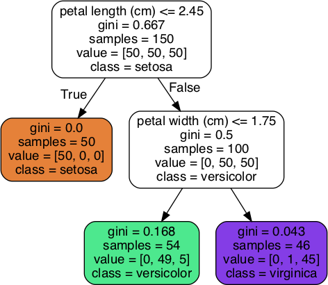
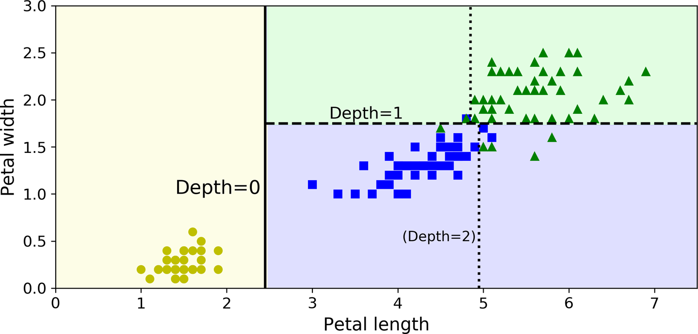
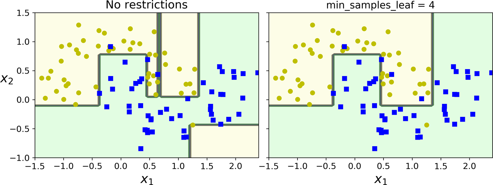
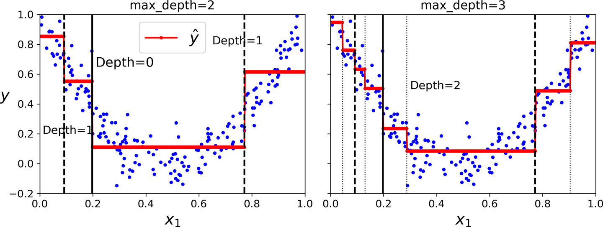
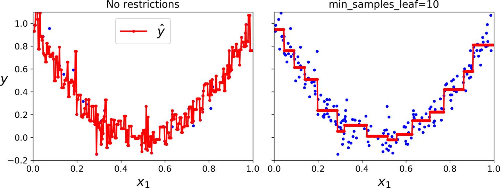
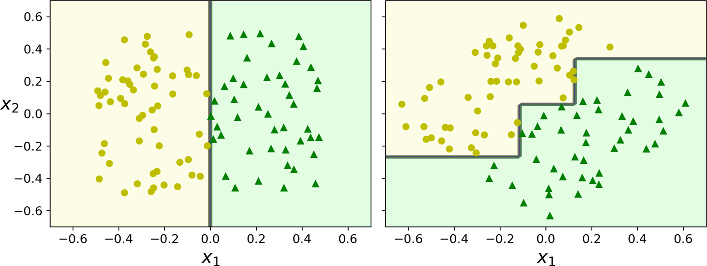
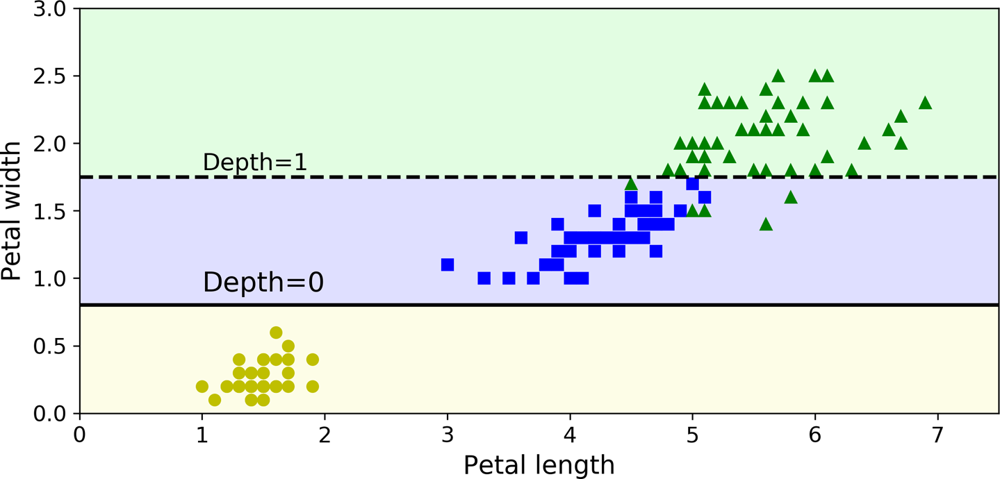

[Chapter 6. ]{.label}Decision Trees
===================================

Like[]{#idm45728480132712} SVMs, *Decision Trees* are versatile Machine
Learning algorithms that can perform both classification and regression
tasks, and even multioutput tasks. They are powerful algorithms, capable
of fitting complex datasets. For example, in
[Chapter 2](https://learning.oreilly.com/library/view/hands-on-machine-learning/9781492032632/ch02.html#project_chapter)
you trained a `DecisionTreeRegressor` model on the California housing
dataset, fitting it perfectly (actually, overfitting it).

Decision Trees are also the fundamental components of Random Forests
(see
[Chapter 7](https://learning.oreilly.com/library/view/hands-on-machine-learning/9781492032632/ch07.html#ensembles_chapter)),
which are among the most powerful Machine Learning algorithms available
today.

In this chapter we will start by discussing how to train, visualize, and
make predictions with Decision Trees. Then we will go through the CART
training algorithm used by Scikit-Learn, and we will discuss how to
regularize trees and use them for regression tasks. Finally, we will
discuss some of the limitations of Decision Trees.


Training and Visualizing a Decision Tree
========================================

To[]{#idm45728480125928} understand Decision Trees, let's build one and
take a look at how it makes predictions. The following code trains a
`DecisionTreeClassifier` on the iris dataset (see
[Chapter 4](https://learning.oreilly.com/library/view/hands-on-machine-learning/9781492032632/ch04.html#linear_models_chapter)):

``` {data-type="programlisting" code-language="python"}
from sklearn.datasets import load_iris
from sklearn.tree import DecisionTreeClassifier

iris = load_iris()
X = iris.data[:, 2:] # petal length and width
y = iris.target

tree_clf = DecisionTreeClassifier(max_depth=2)
tree_clf.fit(X, y)
```

You can visualize the trained Decision Tree by first using the
`export_graphviz()` method to output a graph definition file called
*iris\_tree.dot*:

``` {data-type="programlisting" code-language="python"}
from sklearn.tree import export_graphviz

export_graphviz(
        tree_clf,
        out_file=image_path("iris_tree.dot"),
        feature_names=iris.feature_names[2:],
        class_names=iris.target_names,
        rounded=True,
        filled=True
    )
```

Then you can use the `dot` command-line tool from the Graphviz package
to convert this *.dot* file to a variety of formats, such as PDF or
PNG.^[1](https://learning.oreilly.com/library/view/hands-on-machine-learning/9781492032632/ch06.html#idm45728480001704){#idm45728480001704-marker
.totri-footnote}^ This command line converts the *.dot* file to a *.png*
image file:

``` {data-type="programlisting" code-language="shell-session"}
$ dot -Tpng iris_tree.dot -o iris_tree.png
```

Your first Decision Tree looks like
[Figure 6-1](https://learning.oreilly.com/library/view/hands-on-machine-learning/9781492032632/ch06.html#iris_tree).




Making Predictions
==================

Let's[]{#idm45728479989832} see how the tree represented in
[Figure 6-1](https://learning.oreilly.com/library/view/hands-on-machine-learning/9781492032632/ch06.html#iris_tree)
makes predictions. Suppose you find an iris flower and you want to
classify it. You[]{#idm45728479987896} start at the *root node* (depth
0, at the top): this node asks whether the flower's petal length is
smaller than 2.45 cm. If it is, then you move down to the root's left
child node (depth 1, left). In[]{#idm45728479968296} this case, it is a
*leaf node* (i.e., it does not have any child nodes), so it does not ask
any questions: simply look at the predicted class for that node, and the
Decision Tree predicts that your flower is an *Iris setosa*
(`class=setosa`).

Now suppose you find another flower, and this time the petal length is
greater than 2.45 cm. You must move down to the root's right child node
(depth 1, right), which is not a leaf node, so the node asks another
question: is the petal width smaller than 1.75 cm? If it is, then your
flower is most likely an *Iris versicolor* (depth 2, left). If not, it
is likely an *Iris virginica* (depth 2, right). It's really that simple.


###### Note

One of the many qualities of Decision Trees is that they require very
little data preparation. In fact, they don't require feature scaling or
centering at all.


A node's `samples` attribute counts how many training instances it
applies to. For example, 100 training instances have a petal length
greater than 2.45 cm (depth 1, right), and of those 100, 54 have a petal
width smaller than 1.75 cm (depth 2, left). A node's `value` attribute
tells you how many training instances of each class this node applies
to: for example, the bottom-right node applies to 0 *Iris setosa*, 1
*Iris versicolor*, and 45 *Iris virginica*. Finally, a node's `gini`
attribute measures[]{#idm45728479940280} its *impurity*: a node is
"pure" (`gini=0`) if all training instances it applies to belong to the
same class. For example, since the depth-1 left node applies only to
*Iris setosa* training instances, it is pure and its `gini` score is 0.
[Equation
6-1](https://learning.oreilly.com/library/view/hands-on-machine-learning/9781492032632/ch06.html#gini_impurity)
shows how the training algorithm computes the `gini` score *G*~*i*~ of
the *i*^th^ node. The depth-2 left node has a `gini` score equal to 1 --
(0/54)^2^ -- (49/54)^2^ -- (5/54)^2^ ≈ 0.168.


##### [Equation 6-1. ]{.label}Gini impurity

$$G_{i} = 1 - \sum\limits_{k = 1}^{n}{p_{i,k}}^{2}$$


In this equation:

-   *p*~*i*,*k*~ is the ratio of class *k* instances among the training
    instances in the *i*^th^ node.


###### Note

Scikit-Learn uses
the[]{#idm45728479917960}[]{#idm45728479916952}[]{#idm45728479916280}[]{#idm45728479915512}[]{#idm45728479914840}
CART algorithm, which produces only *binary trees*: nonleaf nodes always
have two children (i.e., questions only have yes/no answers). However,
other algorithms such as ID3 can produce Decision Trees with nodes that
have more than two [children]{.keep-together}.


[Figure 6-2](https://learning.oreilly.com/library/view/hands-on-machine-learning/9781492032632/ch06.html#decision_tree_decision_boundaries_plot)
shows this Decision Tree's decision boundaries. The thick vertical line
represents the decision boundary of the root node (depth 0): petal
length = 2.45 cm. Since the lefthand area is pure (only *Iris setosa*),
it cannot be split any further. However, the righthand area is impure,
so the depth-1 right node splits it at petal width = 1.75 cm
(represented by the dashed line). Since `max_depth` was set to 2, the
Decision Tree stops right there. If you set `max_depth` to 3, then the
two depth-2 nodes would each add another decision boundary (represented
by the dotted lines).




##### Model Interpretation: White Box Versus Black Box

Decision Trees are intuitive, and their decisions are easy to interpret.
Such models are
often[]{#idm45728479905736}[]{#idm45728479905032}[]{#idm45728479904360}
called *white box models*. In contrast, as we will see, Random Forests
or neural networks are generally considered *black box models*. They
make great predictions, and you can easily check the calculations that
they performed to make these predictions; nevertheless, it is usually
hard to explain in simple terms why the predictions were made. For
example, if a neural network says that a particular person appears on a
picture, it is hard to know what contributed to this prediction: did the
model recognize that person's eyes? Their mouth? Their nose? Their
shoes? Or even the couch that they were sitting on? Conversely, Decision
Trees provide nice, simple classification rules that can even be applied
manually if need be (e.g., for flower classification).


Estimating Class Probabilities
==============================

A[]{#idm45728479900088} Decision Tree can also estimate the probability
that an instance belongs to a particular class *k*. First it traverses
the tree to find the leaf node for this instance, and then it returns
the ratio of training instances of class *k* in this node. For example,
suppose you have found a flower whose petals are 5 cm long and 1.5 cm
wide. The [corresponding]{.keep-together} leaf node is the depth-2 left
node, so the Decision Tree should output the following probabilities: 0%
for *Iris setosa* (0/54), 90.7% for *Iris versicolor* (49/54), and 9.3%
for *Iris virginica* (5/54). And if you ask it to predict the class, it
should output *Iris versicolor* (class 1) because it has the highest
probability. Let's check this:

``` {data-type="programlisting" code-language="pycon"}
>>> tree_clf.predict_proba([[5, 1.5]])
array([[0.        , 0.90740741, 0.09259259]])
>>> tree_clf.predict([[5, 1.5]])
array([1])
```

Perfect! Notice that the estimated probabilities would be identical
anywhere else in the bottom-right rectangle of
[Figure 6-2](https://learning.oreilly.com/library/view/hands-on-machine-learning/9781492032632/ch06.html#decision_tree_decision_boundaries_plot)---for
example, if the petals were 6 cm long and 1.5 cm wide (even though it
seems obvious that it would most likely be an *Iris virginica* in this
case).


The CART Training Algorithm
===========================

Scikit-Learn[]{#idm45728479871208}[]{#idm45728479869816}[]{#idm45728479868872}[]{#idm45728479867928}[]{#idm45728479867256}
uses the *Classification and Regression Tree* (CART) algorithm to train
Decision Trees (also called "growing" trees). The algorithm works by
first splitting the training set into two subsets using a single feature
*k* and a threshold *t*~*k*~ (e.g., "petal length ≤ 2.45 cm"). How does
it choose *k* and *t*~*k*~? It searches for the pair (*k*, *t*~*k*~)
that produces the purest subsets (weighted by their size). [Equation
6-2](https://learning.oreilly.com/library/view/hands-on-machine-learning/9781492032632/ch06.html#classification_cart_cost_function)
gives the cost function that the algorithm tries to minimize.


##### [Equation 6-2. ]{.label}CART cost function for classification

$$\begin{array}{cl}
 & {J\left( k,t_{k} \right) = \frac{m_{\text{left}}}{m}G_{\text{left}} + \frac{m_{\text{right}}}{m}G_{\text{right}}} \\
 & {\text{where}\left\{ \begin{array}{l}
{G_{\text{left/right}}\text{measures}\text{the}\text{impurity}\text{of}\text{the}\text{left/right}\text{subset,}} \\
{m_{\text{left/right}}\text{is}\text{the}\text{number}\text{of}\text{instances}\text{in}\text{the}\text{left/right}\text{subset.}} \\
\end{array} \right.} \\
\end{array}$$


Once the CART algorithm has successfully split the training set in two,
it splits the subsets using the same logic, then the sub-subsets, and so
on, recursively. It stops recursing once it reaches the maximum depth
(defined by the `max_depth` hyperparameter), or if it cannot find a
split that will reduce impurity. A few other hyperparameters (described
in a moment) control additional stopping conditions
(`min_samples_split`, `min_samples_leaf`, `min_weight_fraction_leaf`,
and `max_leaf_nodes`).


###### Warning

As[]{#idm45728479790648}[]{#idm45728479789912} you can see, the CART
algorithm is a *greedy algorithm*: it greedily searches for an optimum
split at the top level, then repeats the process at each subsequent
level. It does not check whether or not the split will lead to the
lowest possible impurity several levels down. A greedy algorithm often
produces a solution that's reasonably good but not guaranteed to be
optimal.

Unfortunately, finding the optimal tree is known to
be[]{#idm45728479787480} an *NP-Complete*
problem:^[2](https://learning.oreilly.com/library/view/hands-on-machine-learning/9781492032632/ch06.html#idm45728479786232){#idm45728479786232-marker
.totri-footnote}^ it requires *O*(exp(*m*)) time, making the problem
intractable even for small training sets. This is why we must settle for
a "reasonably good" solution.


Computational Complexity
========================

Making predictions[]{#idm45728479782344} requires traversing the
Decision Tree from the root to a leaf. Decision Trees generally are
approximately balanced, so traversing the Decision Tree requires going
through roughly *O*(log~2~(*m*))
nodes.^[3](https://learning.oreilly.com/library/view/hands-on-machine-learning/9781492032632/ch06.html#idm45728479779720){#idm45728479779720-marker
.totri-footnote}^ Since each node only requires checking the value of
one feature, the overall prediction complexity is *O*(log~2~(*m*)),
independent of the number of features. So predictions are very fast,
even when dealing with large training sets.

The training algorithm compares all features (or less if `max_features`
is set) on all samples at each node. Comparing all features on all
samples at each node results in a training complexity of *O*(*n* × *m*
log~2~(*m*)). For small training sets (less than a few thousand
instances), Scikit-Learn[]{#idm45728479772264} can speed up training by
presorting the data (set `presort=True`), but doing that slows down
training considerably for larger training sets.


Gini Impurity or Entropy?
=========================

By[]{#idm45728479769288}[]{#idm45728479767928}[]{#idm45728479767256}[]{#idm45728479766568}
default, the Gini impurity measure is used, but you can select the
*entropy* impurity measure instead by setting the `criterion`
hyperparameter to `"entropy"`. The concept of entropy originated in
thermodynamics as a measure of molecular disorder: entropy approaches
zero when molecules are still and well ordered. Entropy later spread to
a wide variety of domains,
including[]{#idm45728479764136}[]{#idm45728479763432} Shannon's
*information theory*, where it measures the average information content
of a
message:^[4](https://learning.oreilly.com/library/view/hands-on-machine-learning/9781492032632/ch06.html#idm45728479762200){#idm45728479762200-marker
.totri-footnote}^ entropy is zero when all messages are identical. In
Machine Learning, entropy is frequently used as an
[impurity]{.keep-together} measure: a set's entropy is zero when it
contains instances of only one class. [Equation
6-3](https://learning.oreilly.com/library/view/hands-on-machine-learning/9781492032632/ch06.html#entropy_function)
shows the definition of the entropy of the *i*^th^ node. For example,
the depth-2 left node in
[Figure 6-1](https://learning.oreilly.com/library/view/hands-on-machine-learning/9781492032632/ch06.html#iris_tree)
has an entropy equal to --(49/54) log~2~ (49/54) -- (5/54) log~2~ (5/54)
≈ 0.445.


##### [Equation 6-3. ]{.label}Entropy

$$H_{i} = - \sum\limits_{\binom{k = 1}{p_{i,k} \neq 0}}^{n}{p_{i,k}\log_{2}\left( p_{i,k} \right)}$$


So, should you use Gini impurity or entropy? The truth is, most of the
time it does not make a big difference: they lead to similar trees. Gini
impurity is slightly faster to compute, so it is a good default.
However, when they differ, Gini impurity tends to isolate the most
frequent class in its own branch of the tree, while entropy tends to
produce slightly more balanced
trees.^[5](https://learning.oreilly.com/library/view/hands-on-machine-learning/9781492032632/ch06.html#idm45728479739176){#idm45728479739176-marker
.totri-footnote}^


Regularization Hyperparameters
==============================

Decision[]{#idm45728479735800}[]{#idm45728479734776}[]{#idm45728479733816}
Trees make very few assumptions about the training data (as opposed to
linear models, which assume that the data is linear, for example). If
left unconstrained, the tree structure will adapt itself to the training
data, fitting it very closely---indeed, most likely overfitting it. Such
a
model[]{#idm45728479732424}[]{#idm45728479731752}[]{#idm45728479731080}
is often called a *nonparametric model*, not because it does not have
any parameters (it often has a lot) but because the number of parameters
is not determined prior to training, so the model structure is free to
stick closely to the data. In contrast, a *parametric model*, such as a
linear model, has a predetermined number of parameters, so its degree of
freedom is limited, reducing the risk of overfitting (but increasing the
risk of underfitting).

To avoid overfitting the training data, you need to restrict the
Decision Tree's freedom during training. As you know by now, this is
called regularization. The regularization hyperparameters depend on the
algorithm used, but generally you can at least restrict the maximum
depth of the Decision Tree. In[]{#idm45728479728120} Scikit-Learn, this
is controlled by the `max_depth` hyperparameter (the default value is
`None`, which means unlimited). Reducing `max_depth` will regularize the
model and thus reduce the risk of overfitting.

The `DecisionTreeClassifier` class has a few other parameters that
similarly restrict the shape of the Decision Tree: `min_samples_split`
(the minimum number of samples a node must have before it can be split),
`min_samples_leaf` (the minimum number of samples a leaf node must
have), `min_weight_fraction_leaf` (same as `min_samples_leaf` but
expressed as a fraction of the total number of weighted instances),
`max_leaf_nodes` (the maximum number of leaf nodes), and `max_features`
(the maximum number of features that are evaluated for splitting at each
node). Increasing `min_*` hyperparameters or reducing `max_*`
hyperparameters will regularize the model.


###### Note

Other[]{#idm45728479719704}[]{#idm45728479718968}[]{#idm45728479718328}
algorithms work by first training the Decision Tree without
restrictions, then *pruning* (deleting) unnecessary nodes. A node whose
children are all leaf nodes is considered unnecessary if the purity
improvement it provides is not statistically significant. Standard
statistical tests, such as the *χ*^2^ *test* (chi-squared test), are
used[]{#idm45728479715768}[]{#idm45728479715064} to estimate the
probability that the improvement is purely the result of chance (which
is called the *null hypothesis*). If this probability, called the
*p-value*, is higher than a given threshold (typically 5%, controlled by
a hyperparameter), then the node is considered unnecessary and its
children are deleted. The pruning continues until all unnecessary nodes
have been pruned.


[Figure 6-3](https://learning.oreilly.com/library/view/hands-on-machine-learning/9781492032632/ch06.html#min_samples_leaf_plot)
shows two Decision Trees trained on the moons dataset (introduced in
[Chapter 5](https://learning.oreilly.com/library/view/hands-on-machine-learning/9781492032632/ch05.html#svm_chapter)).
On the left the Decision Tree is trained with the default
hyperparameters (i.e., no restrictions), and on the right it's trained
with `min_samples_leaf=4`. It is quite obvious that the model on the
left is overfitting, and the model on the right will probably generalize
better.




Regression
==========

Decision Trees[]{#idm45728479705992}[]{#idm45728479704984} are also
capable of performing regression tasks. Let's[]{#idm45728479703912}
build a regression tree using Scikit-Learn's `DecisionTreeRegressor`
class, training it on a noisy quadratic dataset with `max_depth=2`:

``` {data-type="programlisting" code-language="python"}
from sklearn.tree import DecisionTreeRegressor

tree_reg = DecisionTreeRegressor(max_depth=2)
tree_reg.fit(X, y)
```

The resulting tree is represented in
[Figure 6-4](https://learning.oreilly.com/library/view/hands-on-machine-learning/9781492032632/ch06.html#regression_tree).


This tree looks very similar to the classification tree you built
earlier. The main difference is that instead of predicting a class in
each node, it predicts a value. For example, suppose you want to make a
prediction for a new instance with *x*~1~ = 0.6. You traverse the tree
starting at the root, and you eventually reach the leaf node that
predicts `value=0.111`. This prediction is the average target value of
the 110 training instances associated with this leaf node, and it
results in a []{#idm45728479674536}mean squared error equal to 0.015
over these 110 instances.

This model's predictions are represented on the left in
[Figure 6-5](https://learning.oreilly.com/library/view/hands-on-machine-learning/9781492032632/ch06.html#tree_regression_plot).
If you set `max_depth=3`, you get the predictions represented on the
right. Notice how the predicted value for each region is always the
average target value of the instances in that region. The algorithm
splits each region in a way that makes most training instances as close
as possible to that predicted value.



The CART algorithm works mostly the same way as earlier, except that
instead of trying to split the training set in a way that minimizes
impurity, it now tries to split the training set in a way that minimizes
the MSE. [Equation
6-4](https://learning.oreilly.com/library/view/hands-on-machine-learning/9781492032632/ch06.html#regression_cart_cost_function)
shows the cost function that the algorithm tries to minimize.


##### [Equation 6-4. ]{.label}CART cost function for regression

$$J\left( k,t_{k} \right) = \frac{m_{\text{left}}}{m}\text{MSE}_{\text{left}} + \frac{m_{\text{right}}}{m}\text{MSE}_{\text{right}}\text{where}\left\{ \begin{array}{l}
{\text{MSE}_{\text{node}} = \sum\limits_{i \in \text{node}}\left( {\hat{y}}_{\text{node}} - y^{(i)} \right)^{2}} \\
{{\hat{y}}_{\text{node}} = \frac{1}{m_{\text{node}}}\sum\limits_{i \in \text{node}}y^{(i)}} \\
\end{array} \right.$$


Just like for classification tasks, Decision Trees are prone to
overfitting when dealing with regression tasks. Without any
regularization (i.e., using the default hyperparameters), you get the
predictions on the left in
[Figure 6-6](https://learning.oreilly.com/library/view/hands-on-machine-learning/9781492032632/ch06.html#tree_regression_regularization_plot).
These predictions are obviously overfitting the training set very badly.
Just setting `min_samples_leaf=10` results in a much more reasonable
model, represented on the right in
[Figure 6-6](https://learning.oreilly.com/library/view/hands-on-machine-learning/9781492032632/ch06.html#tree_regression_regularization_plot).




Instability
===========

Hopefully[]{#idm45728479597640}[]{#idm45728479596904} by now you are
convinced that Decision Trees have a lot going for them: they are simple
to understand and interpret, easy to use, versatile, and powerful.
However, they do have a few limitations. First, as you may have noticed,
Decision Trees love orthogonal decision boundaries (all splits are
perpendicular to an axis), which[]{#idm45728479595480} makes them
sensitive to training set rotation. For example,
[Figure 6-7](https://learning.oreilly.com/library/view/hands-on-machine-learning/9781492032632/ch06.html#sensitivity_to_rotation_plot)
shows a simple linearly separable dataset: on the left, a Decision Tree
can split it easily, while on the right, after the dataset is rotated by
45°, the decision boundary looks unnecessarily convoluted. Although both
Decision Trees fit the training set perfectly, it is very likely that
the model on the right will not generalize well. One way to limit this
problem is to use Principal Component Analysis (see
[Chapter 8](https://learning.oreilly.com/library/view/hands-on-machine-learning/9781492032632/ch08.html#dimensionality_chapter)),
which often results in a better orientation of the training data.



More generally, the main issue with Decision Trees is that they are very
sensitive to small variations in the training data. For example, if you
just remove the widest *Iris versicolor* from the iris training set (the
one with petals 4.8 cm long and 1.8 cm wide) and train a new Decision
Tree, you may get the model represented in
[Figure 6-8](https://learning.oreilly.com/library/view/hands-on-machine-learning/9781492032632/ch06.html#decision_tree_instability_plot).
As you can see, it looks very different from the previous Decision Tree
([Figure 6-2](https://learning.oreilly.com/library/view/hands-on-machine-learning/9781492032632/ch06.html#decision_tree_decision_boundaries_plot)).
Actually, since[]{#idm45728479587448} the training algorithm used by
Scikit-Learn is
stochastic,^[6](https://learning.oreilly.com/library/view/hands-on-machine-learning/9781492032632/ch06.html#idm45728479586328){#idm45728479586328-marker
.totri-footnote}^ you may [get very]{.keep-together} different models
even on the same training data (unless you set the
[`random_state`]{.keep-together} hyperparameter).



Random Forests can limit this instability by averaging predictions over
many trees, as we will see in the next chapter.


Exercises
=========

1.  What is the approximate depth of a Decision Tree trained (without
    restrictions) on a training set with one million instances?

2.  Is a node's Gini impurity generally lower or greater than its
    parent's? Is it *generally* lower/greater, or *always*
    lower/greater?

3.  If a Decision Tree is overfitting the training set, is it a good
    idea to try decreasing `max_depth`?

4.  If a Decision Tree is underfitting the training set, is it a good
    idea to try scaling the input features?

5.  If it takes one hour to train a Decision Tree on a training set
    containing 1 million instances, roughly how much time will it take
    to train another Decision Tree on a training set containing 10
    million instances?

6.  If your training set contains 100,000 instances, will setting
    `presort=True` speed up training?

7.  Train and fine-tune a Decision Tree for the moons dataset by
    following these steps:

    1.  Use `make_moons(n_samples=10000, noise=0.4)` to generate a moons
        dataset.

    2.  Use `train_test_split()` to split the dataset into a training
        set and a test set.

    3.  Use grid search with cross-validation (with the help of the
        `GridSearchCV` class) to find good hyperparameter values for a
        `DecisionTreeClassifier`. Hint: try various values for
        `max_leaf_nodes`.

    4.  Train it on the full training set using these hyperparameters,
        and measure your model's performance on the test set. You should
        get roughly 85% to 87% accuracy.

8.  Grow a forest by following these steps:

    1.  Continuing the previous exercise, generate 1,000 subsets of the
        training set, each containing 100 instances selected randomly.
        Hint: you can use Scikit-Learn's `ShuffleSplit` class for this.

    2.  Train one Decision Tree on each subset, using the best
        hyperparameter values found in the previous exercise. Evaluate
        these 1,000 Decision Trees on the test set. Since they were
        trained on smaller sets, these Decision Trees will likely
        perform worse than the first Decision Tree, achieving only about
        80% [accuracy]{.keep-together}.

    3.  Now comes the magic. For each test set instance, generate the
        predictions of the 1,000 Decision Trees, and keep only the most
        frequent prediction (you can use SciPy's `mode()` function for
        this). This[]{#idm45728479559112} approach gives you
        *majority-vote predictions* over the test set.

    4.  Evaluate these predictions on the test set: you should obtain a
        slightly higher accuracy than your first model (about 0.5 to
        1.5% higher). Congratulations, you have trained a Random Forest
        classifier!

Solutions to these exercises are available in
[Appendix A](https://learning.oreilly.com/library/view/hands-on-machine-learning/9781492032632/app01.html#solutions_appendix).


^[1](https://learning.oreilly.com/library/view/hands-on-machine-learning/9781492032632/ch06.html#idm45728480001704-marker){.totri-footnote}^
Graphviz is an open source graph visualization software package,
available at [*http://www.graphviz.org/*](http://www.graphviz.org/).

^[2](https://learning.oreilly.com/library/view/hands-on-machine-learning/9781492032632/ch06.html#idm45728479786232-marker){.totri-footnote}^
P is the set of problems that can be solved in polynomial time. NP is
the set of problems whose solutions can be verified in polynomial time.
An NP-Hard problem is a problem to which any NP problem can be reduced
in polynomial time. An NP-Complete problem is both NP and NP-Hard. A
major open mathematical question is whether or not P = NP. If P ≠ NP
(which seems likely), then no polynomial algorithm will ever be found
for any NP-Complete problem (except perhaps on a quantum computer).

^[3](https://learning.oreilly.com/library/view/hands-on-machine-learning/9781492032632/ch06.html#idm45728479779720-marker){.totri-footnote}^
log~2~ is the binary logarithm. It is equal to log~2~(*m*) = log(*m*) /
log(2).

^[4](https://learning.oreilly.com/library/view/hands-on-machine-learning/9781492032632/ch06.html#idm45728479762200-marker){.totri-footnote}^
A reduction of entropy is often called an *information gain*.

^[5](https://learning.oreilly.com/library/view/hands-on-machine-learning/9781492032632/ch06.html#idm45728479739176-marker){.totri-footnote}^
See Sebastian Raschka's [interesting analysis for more
details](https://homl.info/19).

^[6](https://learning.oreilly.com/library/view/hands-on-machine-learning/9781492032632/ch06.html#idm45728479586328-marker){.totri-footnote}^
It randomly selects the set of features to evaluate at each node.
