[Lab 1. ] The Machine Learning Landscape
===================================================

When[]{#idm45728493908024} most people hear "Machine Learning," they
picture a robot: a dependable butler or a deadly Terminator, depending
on who you ask. But Machine Learning is not just a futuristic fantasy;
it's already here. In fact, it has been around for decades in some
specialized applications, []{#idm45728493906584}such as Optical
Character Recognition (OCR). But the first ML application that really
became mainstream, improving the lives of hundreds of millions of
people, took over the world back in the 1990s: []{#idm45728493905512}the
*spam filter*. It's not exactly a self-aware Skynet, but it does
technically qualify as Machine Learning (it has actually learned so well
that you seldom need to flag an email as spam anymore). It was followed
by hundreds of ML applications that now quietly power hundreds of
products and features that you use regularly, from better
recommendations to voice search.

Where does Machine Learning start and where does it end? What exactly
does it mean for a machine to *learn* something? If I download a copy of
Wikipedia, has my computer really learned something? Is it suddenly
smarter? In this lab we will start by clarifying what Machine
Learning is and why you may want to use it.

Then, before we set out to explore the Machine Learning continent, we
will take a look at the map and learn about the main regions and the
most notable landmarks: supervised versus unsupervised learning, online
versus batch learning, instance-based versus model-based learning. Then
we will look at the workflow of a typical ML project, discuss the main
challenges you may face, and cover how to evaluate and fine-tune a
Machine Learning system.

This lab introduces a lot of fundamental concepts (and jargon) that
every data scientist should know by heart. It will be a high-level
overview (it's the only lab without much code), all rather simple,
but you should make sure everything is crystal clear to you before
continuing on to the rest of the course. So grab a coffee and let's get
started!


###### Tip

If you already know all the Machine Learning basics, you may want to
skip directly to
[Lab 2](https://learning.oreilly.com/library/view/hands-on-machine-learning/9781492032632/ch02.html#project_lab).
If you are not sure, try to answer all the questions listed at the end
of the lab before moving on.


What Is Machine Learning?
=========================

Machine Learning is the science (and art) of programming computers so
they can *learn from data*.

Here is a slightly more general definition:

> \[Machine Learning is the\] field of study that gives computers the
> ability to learn without being explicitly programmed.
>
> Arthur Samuel, 1959

And a more engineering-oriented one:

> A computer program is said to learn from experience *E* with respect
> to some task *T* and some performance measure *P*, if its performance
> on *T*, as measured by *P*, improves with experience *E*.
>
> Tom Mitchell, 1997

Your spam filter is a Machine Learning program that, given examples of
spam emails (e.g., flagged by users) and examples of regular (nonspam,
also called "ham") emails, can learn to flag spam. The examples that the
system uses to learn are[]{#idm45728493876136} called the *training
set*. Each training example
is[]{#idm45728493874888}[]{#idm45728493874184} called a *training
instance* (or *sample*). In this case, the task *T* is to flag spam for
new emails, the experience *E* is[]{#idm45728493871640} the *training
data*, and the performance measure *P* needs to be defined; for example,
you can use the ratio of correctly classified emails.
This[]{#idm45728493869512} particular performance measure is called
*accuracy*, and it is often used in classification tasks.

If you just download a copy of Wikipedia, your computer has a lot more
data, but it is not suddenly better at any task. Thus, downloading a
copy of Wikipedia is not Machine Learning.


Why Use Machine Learning?
=========================

Consider[]{#idm45728493866072}[]{#idm45728493865064} how you would write
a spam filter using traditional programming techniques
([Figure 1-1](https://learning.oreilly.com/library/view/hands-on-machine-learning/9781492032632/ch01.html#traditional_approach_diagram)):

1.  First you would consider what spam typically looks like. You might
    notice that some words or phrases (such as "4U," "credit card,"
    "free," and "amazing") tend to come up a lot in the subject line.
    Perhaps you would also notice a few other patterns in the sender's
    name, the email's body, and other parts of the email.

2.  You would write a detection algorithm for each of the patterns that
    you noticed, and your program would flag emails as spam if a number
    of these patterns were detected.

3.  You would test your program and repeat steps 1 and 2 until it was
    good enough to launch.

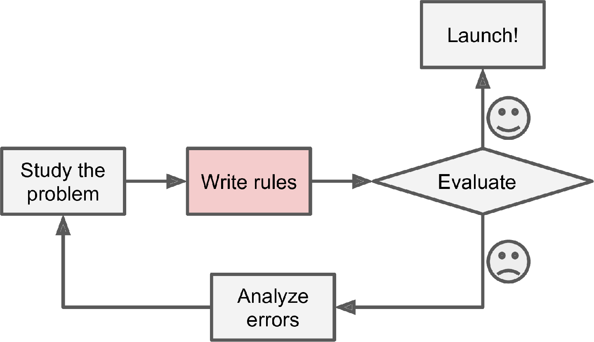

Since the problem is difficult, your program will likely become a long
list of complex rules---pretty hard to maintain.

In contrast, a spam filter based on Machine Learning techniques
automatically learns which words and phrases are good predictors of spam
by detecting unusually frequent patterns of words in the spam examples
compared to the ham examples
([Figure 1-2](https://learning.oreilly.com/library/view/hands-on-machine-learning/9781492032632/ch01.html#ml_approach_diagram)).
The program is much shorter, easier to maintain, and most likely more
accurate.

What if spammers notice that all their emails containing "4U" are
blocked? They might start writing "For U" instead. A spam filter using
traditional programming techniques would need to be updated to flag "For
U" emails. If spammers keep working around your spam filter, you will
need to keep writing new rules forever.

In contrast, a spam filter based on Machine Learning techniques
automatically notices that "For U" has become unusually frequent in spam
flagged by users, and it starts flagging them without your intervention
([Figure 1-3](https://learning.oreilly.com/library/view/hands-on-machine-learning/9781492032632/ch01.html#adapting_to_change_diagram)).


Another area where Machine Learning shines is for problems that either
are too complex for traditional approaches or have no known algorithm.
For example, consider speech recognition. Say you want to start simple
and write a program capable of distinguishing the words "one" and "two."
You might notice that the word "two" starts with a high-pitch sound
("T"), so you could hardcode an algorithm that measures high-pitch sound
intensity and use that to distinguish ones and twos⁠---but obviously
this technique will not scale to thousands of words spoken by millions
of very different people in noisy environments and in dozens of
languages. The best solution (at least today) is to write an algorithm
that learns by itself, given many example recordings for each word.

Finally, Machine Learning can help humans learn
([Figure 1-4](https://learning.oreilly.com/library/view/hands-on-machine-learning/9781492032632/ch01.html#data_mining_diagram)).
ML algorithms can be inspected to see what they have learned (although
for some algorithms this can be tricky). For instance, once a spam
filter has been trained on enough spam, it can easily be inspected to
reveal the list of words and combinations of words that it believes are
the best predictors of spam. Sometimes this will reveal unsuspected
[correlations] or new trends, and thereby lead to a
better understanding of the problem. Applying ML techniques to dig into
large amounts of data can help discover patterns that were not
immediately apparent. This is called *data mining*.


To summarize, Machine Learning is great for:

-   Problems for which existing solutions require a lot of fine-tuning
    or long lists of rules: one Machine Learning algorithm can often
    simplify code and perform better than the traditional approach.

-   Complex problems for which using a traditional approach yields no
    good solution: the best Machine Learning techniques can perhaps find
    a solution.

-   Fluctuating environments: a Machine Learning system can adapt to new
    data.

-   Getting insights about complex problems and large amounts of data.


Examples of Applications
========================

Let's look[]{#idm45728493836120} at some concrete examples of Machine
Learning tasks, along with the techniques that can tackle them:

Analyzing images of products on a production line to automatically classify them

:   This is image classification, typically performed using
    convolutional neural networks (CNNs; see
    [Lab 14](https://learning.oreilly.com/library/view/hands-on-machine-learning/9781492032632/ch14.html#cnn_lab)).

Detecting tumors in brain scans

:   This is semantic segmentation, where each pixel in the image is
    classified (as we want to determine the exact location and shape of
    tumors), typically using CNNs as well.

Automatically classifying news articles

:   This is natural language processing (NLP), and more specifically
    text classification, which can be tackled using recurrent neural
    networks (RNNs), CNNs, or Transformers (see
    [Lab 16](https://learning.oreilly.com/library/view/hands-on-machine-learning/9781492032632/ch16.html#nlp_lab)).

Automatically flagging offensive comments on discussion forums

:   This is also text classification, using the same NLP tools.

Summarizing long documents automatically

:   This is a branch of NLP called text summarization, again using the
    same tools.

Creating a chatbot or a personal assistant

:   This involves many NLP components, including natural language
    understanding (NLU) and question-answering modules.

Forecasting your company's revenue next year, based on many performance metrics

:   This is a regression task (i.e., predicting values) that may be
    tackled using any regression model, such as a Linear Regression or
    Polynomial Regression model (see
    [Lab 4](https://learning.oreilly.com/library/view/hands-on-machine-learning/9781492032632/ch04.html#linear_models_lab)),
    a regression SVM (see
    [Lab 5](https://learning.oreilly.com/library/view/hands-on-machine-learning/9781492032632/ch05.html#svm_lab)),
    a regression Random Forest (see
    [Lab 7](https://learning.oreilly.com/library/view/hands-on-machine-learning/9781492032632/ch07.html#ensembles_lab)),
    or an artificial neural network (see
    [Lab 10](https://learning.oreilly.com/library/view/hands-on-machine-learning/9781492032632/ch10.html#ann_lab)).
    If you want to take into account sequences of past performance
    metrics, you may want to use RNNs, CNNs, or Transformers (see
    Labs
    [15](https://learning.oreilly.com/library/view/hands-on-machine-learning/9781492032632/ch15.html#rnn_lab)
    and
    [16](https://learning.oreilly.com/library/view/hands-on-machine-learning/9781492032632/ch16.html#nlp_lab)).

Making your app react to voice commands

:   This is speech recognition, which requires processing audio samples:
    since they are long and complex sequences, they are typically
    processed using RNNs, CNNs, or Transformers (see Labs
    [15](https://learning.oreilly.com/library/view/hands-on-machine-learning/9781492032632/ch15.html#rnn_lab)
    and
    [16](https://learning.oreilly.com/library/view/hands-on-machine-learning/9781492032632/ch16.html#nlp_lab)).

Detecting credit card fraud

:   This is anomaly detection (see
    [Lab 9](https://learning.oreilly.com/library/view/hands-on-machine-learning/9781492032632/ch09.html#unsupervised_learning_lab)).

Segmenting clients based on their purchases so that you can design a different marketing strategy for each segment

:   This is clustering (see
    [Lab 9](https://learning.oreilly.com/library/view/hands-on-machine-learning/9781492032632/ch09.html#unsupervised_learning_lab)).

Representing a complex, high-dimensional dataset in a clear and insightful diagram

:   This is data visualization, often involving dimensionality reduction
    techniques (see
    [Lab 8](https://learning.oreilly.com/library/view/hands-on-machine-learning/9781492032632/ch08.html#dimensionality_lab)).

Recommending a product that a client may be interested in, based on past purchases

:   This is a recommender system. One approach is to feed past purchases
    (and other information about the client) to an artificial neural
    network (see
    [Lab 10](https://learning.oreilly.com/library/view/hands-on-machine-learning/9781492032632/ch10.html#ann_lab)),
    and get it to output the most likely next purchase. This neural net
    would typically be trained on past sequences of purchases across all
    clients.

Building an intelligent bot for a game

:   This is often tackled using Reinforcement Learning (RL; see
    [Lab 18](https://learning.oreilly.com/library/view/hands-on-machine-learning/9781492032632/ch18.html#rl_lab)),
    which is a branch of Machine Learning that trains agents (such as
    bots) to pick the actions that will maximize their rewards over time
    (e.g., a bot may get a reward every time the player loses some life
    points), within a given environment (such as the game). The famous
    AlphaGo program that beat the world champion at the game of Go was
    built using RL.

This list could go on and on, but hopefully it gives you a sense of the
incredible breadth and complexity of the tasks that Machine Learning can
tackle, and the types of techniques that you would use for each task.


Types of Machine Learning Systems
=================================

There[]{#MLtype01} are so many different types of Machine Learning
systems that it is useful to classify them in broad categories, based on
the following criteria:

-   Whether or not they are trained with human supervision (supervised,
    unsupervised, semisupervised, and Reinforcement Learning)

-   Whether or not they can learn incrementally on the fly (online
    versus batch learning)

-   Whether they work by simply comparing new data points to known data
    points, or instead by detecting patterns in the training data and
    building a predictive model, much like scientists do (instance-based
    versus model-based learning)

These criteria are not exclusive; you can combine them in any way you
like. For example, a state-of-the-art spam filter may learn on the fly
using a deep neural network model trained using examples of spam and
ham; this makes it an online, model-based, supervised learning system.

Let's look at each of these criteria a bit more closely.


Supervised/Unsupervised Learning
--------------------------------

Machine Learning systems can be classified according to the amount and
type of supervision they get during training. There are four major
categories: supervised learning, unsupervised learning, semisupervised
learning, and Reinforcement [Learning].


### Supervised learning

In *supervised learning*,
the[]{#idm45728493787368}[]{#idm45728493786360}[]{#idm45728493785416}
training set you feed to the algorithm includes the desired solutions,
called *labels*
([Figure 1-5](https://learning.oreilly.com/library/view/hands-on-machine-learning/9781492032632/ch01.html#supervised_learning_diagram)).


A[]{#idm45728493781128}[]{#idm45728493780120} typical supervised
learning task is *classification*. The spam filter is a good example of
this: it is trained with many example emails along with their *class*
(spam or ham), and it must learn how to classify new emails.

Another[]{#idm45728493777496} typical task is to predict a *target*
numeric value, such as the price of a car, given a set of *features*
(mileage, age, brand, etc.) called *predictors*.
This[]{#idm45728493775368} sort of task is called *regression*
([Figure 1-6](https://learning.oreilly.com/library/view/hands-on-machine-learning/9781492032632/ch01.html#regression_diagram)).^[1](https://learning.oreilly.com/library/view/hands-on-machine-learning/9781492032632/ch01.html#idm45728493772936){#idm45728493772936-marker
.totri-footnote}^ To train the system, you need to give it many examples
of cars, including both their predictors and their labels (i.e., their
prices).


###### Note

In Machine[]{#idm45728493770248}[]{#idm45728493769512} Learning an
*attribute* is a data type (e.g., "mileage"), while a *feature* has
several meanings, depending on the context, but generally means an
attribute plus its value (e.g., "mileage = 15,000"). Many people use the
words *attribute* and *feature* interchangeably.


Note[]{#idm45728493766392} that some regression algorithms can be used
for classification as well, and vice versa. For example, *Logistic
Regression* is commonly used for classification, as it can output a
value that corresponds to the probability of belonging to a given class
(e.g., 20% chance of being spam).

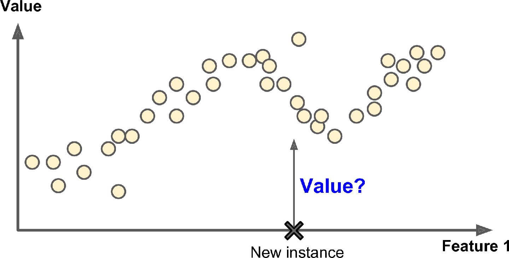

Here[]{#idm45728493761768} are some of the most important supervised
learning algorithms (covered in this course):

-   k-Nearest Neighbors

-   Linear Regression

-   Logistic Regression

-   Support Vector Machines (SVMs)

-   Decision Trees and Random Forests

-   Neural
    networks^[2](https://learning.oreilly.com/library/view/hands-on-machine-learning/9781492032632/ch01.html#idm45728493754968){#idm45728493754968-marker
    .totri-footnote}^


### Unsupervised learning

In *unsupervised learning*, as
you[]{#idm45728493751944}[]{#idm45728493750936} might guess, the
training data is unlabeled
([Figure 1-7](https://learning.oreilly.com/library/view/hands-on-machine-learning/9781492032632/ch01.html#unsupervised_learning_diagram)).
The system tries to learn without a teacher.


Here[]{#idm45728493746280} are some of the most important unsupervised
learning algorithms (most of these are covered in Labs
[8](https://learning.oreilly.com/library/view/hands-on-machine-learning/9781492032632/ch08.html#dimensionality_lab){.totri-footnote}
and
[9](https://learning.oreilly.com/library/view/hands-on-machine-learning/9781492032632/ch09.html#unsupervised_learning_lab){.totri-footnote}):

-   Clustering

    -   K-Means

    -   DBSCAN

    -   Hierarchical Cluster Analysis (HCA)

-   Anomaly detection and novelty detection

    -   One-class SVM

    -   Isolation Forest

-   Visualization and dimensionality reduction

    -   Principal Component Analysis (PCA)

    -   Kernel PCA

    -   Locally Linear Embedding (LLE)

    -   t-Distributed Stochastic Neighbor Embedding (t-SNE)

-   Association rule learning

    -   Apriori

    -   Eclat

For[]{#idm45728493726072}[]{#idm45728493725064}[]{#idm45728493724120}
example, say you have a lot of data about your blog's visitors. You may
want to run a *clustering* algorithm to try to detect groups of similar
visitors
([Figure 1-8](https://learning.oreilly.com/library/view/hands-on-machine-learning/9781492032632/ch01.html#clustering_diagram)).
At no point do you tell the algorithm which group a visitor belongs to:
it finds those connections without your help. For example, it might
notice that 40% of your visitors are males who love comic books and
generally read your blog in the evening, while 20% are young sci-fi
lovers who visit during the weekends. If
you[]{#idm45728493721384}[]{#idm45728493720424} use a *hierarchical
clustering* algorithm, it may also subdivide each group into smaller
groups. This may help you target your posts for each group.

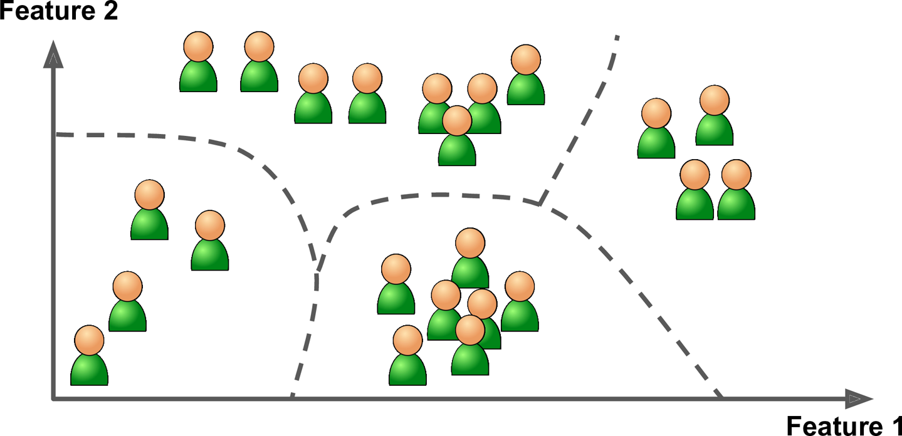

*Visualization* algorithms[]{#idm45728493716216}[]{#idm45728493715240}
are also good examples of unsupervised learning algorithms: you feed
them a lot of complex and unlabeled data, and they output a 2D or 3D
representation of your data that can easily be plotted
([Figure 1-9](https://learning.oreilly.com/library/view/hands-on-machine-learning/9781492032632/ch01.html#socher_ganjoo_manning_ng_2013_paper)).
These algorithms try to preserve as much structure as they can (e.g.,
trying to keep separate clusters in the input space from overlapping in
the visualization) so that you can understand how the data is organized
and perhaps identify unsuspected patterns.

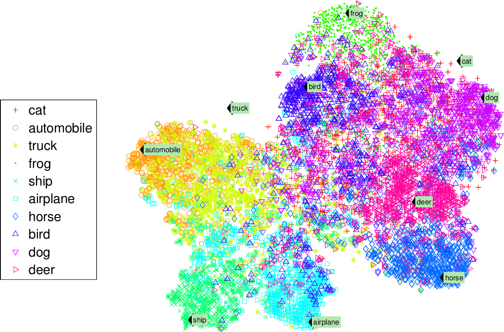

A[]{#idm45728493709192} related task is *dimensionality reduction*, in
which the goal is to simplify the data without losing too much
information. One way to do this is to merge several correlated features
into one. For example, a car's mileage may be strongly correlated with
its age, so the dimensionality reduction algorithm will merge them into
one feature that represents the car's wear and tear.
This[]{#idm45728493707256} is called *feature extraction*.


###### Tip

It is often a good idea to try to reduce the dimension of your training
data using a dimensionality reduction algorithm before you feed it to
another Machine Learning algorithm (such as a supervised learning
algorithm). It will run much faster, the data will take up less disk and
memory space, and in some cases it may also perform better.


Yet[]{#idm45728493703880} another important unsupervised task is
*anomaly detection*---for example, detecting unusual credit card
transactions to prevent fraud, catching manufacturing defects, or
automatically removing outliers from a dataset before feeding it to
another learning algorithm. The system is shown mostly normal instances
during training, so it learns to recognize them; then, when it sees a
new instance, it can tell whether it looks like a normal one or whether
it is likely an anomaly (see
[Figure 1-10](https://learning.oreilly.com/library/view/hands-on-machine-learning/9781492032632/ch01.html#anomaly_detection_diagram)).
A very similar task[]{#idm45728493701016} is *novelty detection*: it
aims to detect new instances that look different from all instances in
the training set. This requires having a very "clean" training set,
devoid of any instance that you would like the algorithm to detect. For
example, if you have thousands of pictures of dogs, and 1% of these
pictures represent Chihuahuas, then a novelty detection algorithm should
not treat new pictures of Chihuahuas as novelties. On the other hand,
anomaly detection algorithms may consider these dogs as so rare and so
different from other dogs that they would likely classify them as
anomalies (no offense to Chihuahuas).

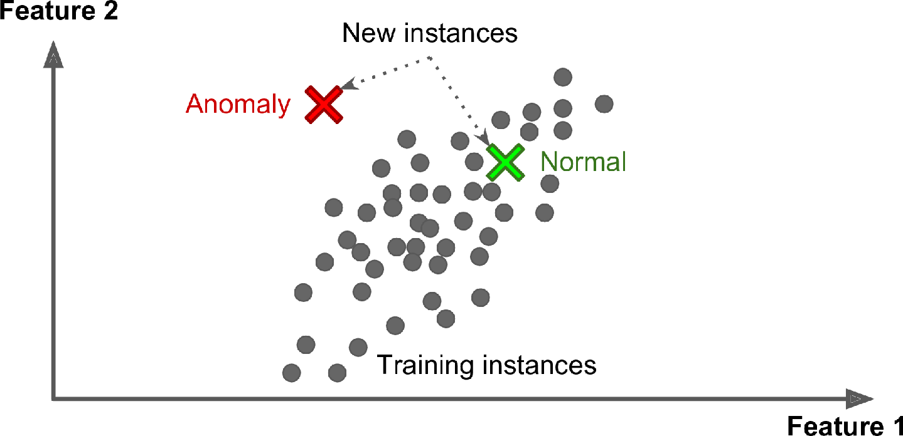

Finally, another[]{#idm45728493696616} common unsupervised task is
*association rule learning*, in which the goal is to dig into large
amounts of data and discover interesting relations between attributes.
For example, suppose you own a supermarket. Running an association rule
on your sales logs may reveal that people who purchase barbecue sauce
and potato chips also tend to buy steak. Thus, you may want to place
these items close to one another.


### Semisupervised learning

Since labeling[]{#idm45728493693560} data is usually time-consuming and
costly, you will often have plenty of unlabeled instances, and few
labeled instances. Some algorithms can deal with data that's partially
labeled. This is called *semisupervised learning*
([Figure 1-11](https://learning.oreilly.com/library/view/hands-on-machine-learning/9781492032632/ch01.html#semi_supervised_learning_diagram)).


Some[]{#idm45728493687992} photo-hosting services, such as Google
Photos, are good examples of this. Once you upload all your family
photos to the service, it automatically recognizes that the same person
A shows up in photos 1, 5, and 11, while another person B shows up in
photos 2, 5, and 7. This is the unsupervised part of the algorithm
(clustering). Now all the system needs is for you to tell it who these
people are. Just add one label per
person^[4](https://learning.oreilly.com/library/view/hands-on-machine-learning/9781492032632/ch01.html#idm45728493686392){#idm45728493686392-marker
.totri-footnote}^ and it is able to name everyone in every photo, which
is useful for searching photos.

Most semisupervised learning algorithms are combinations of unsupervised
and supervised algorithms. For[]{#idm45728493684984} example, *deep
belief networks* (DBNs) are based on unsupervised
components[]{#idm45728493683656} called *restricted Boltzmann machines*
(RBMs) stacked on top of one another. RBMs are trained sequentially in
an unsupervised manner, and then the whole system is fine-tuned using
supervised learning techniques.


### Reinforcement Learning

*Reinforcement Learning*
is[]{#idm45728493680264}[]{#idm45728493679288}[]{#idm45728493678616}[]{#idm45728493677944}[]{#idm45728493677272}
a very different beast. The learning system, called an *agent* in this
context, can observe the environment, select and perform actions, and
get *rewards* in return (or *penalties* in the form of negative rewards,
as shown in
[Figure 1-12](https://learning.oreilly.com/library/view/hands-on-machine-learning/9781492032632/ch01.html#reinforcement_learning_diagram)).
It must then learn by itself what is the best strategy, called a
*policy*, to get the most reward over time. A policy defines what action
the agent should choose when it is in a given situation.


For example, many robots implement Reinforcement Learning algorithms to
learn how to walk. DeepMind's AlphaGo program is also a good example of
Reinforcement Learning: it made the headlines in May 2017 when it beat
the world champion Ke Jie at the game of Go. It learned its winning
policy by analyzing millions of games, and then playing many games
against itself. Note that learning was turned off during the games
against the champion; AlphaGo was just applying the policy it had
learned.


Batch and Online Learning
-------------------------

Another criterion used to classify Machine Learning systems is whether
or not the system can learn incrementally from a stream of incoming
data.


### Batch learning

In *batch learning*, the[]{#idm45728493666888} system is incapable of
learning incrementally: it must be trained using all the available data.
This will generally take a lot of time and computing resources, so it is
typically done offline. First the system is trained, and then it is
launched into production and runs without learning anymore; it just
applies what it has learned. This is[]{#idm45728493665672} called
*offline learning*.

If you want a batch learning system to know about new data (such as a
new type of spam), you need to train a new version of the system from
scratch on the full dataset (not just the new data, but also the old
data), then stop the old system and replace it with the new one.

Fortunately, the whole process of training, evaluating, and launching a
Machine Learning system can be automated fairly easily (as shown in
[Figure 1-3](https://learning.oreilly.com/library/view/hands-on-machine-learning/9781492032632/ch01.html#adapting_to_change_diagram)),
so even a batch learning system can adapt to change. Simply update the
data and train a new version of the system from scratch as often as
needed.

This solution is simple and often works fine, but training using the
full set of data can take many hours, so you would typically train a new
system only every 24 hours or even just weekly. If your system needs to
adapt to rapidly changing data (e.g., to predict stock prices), then you
need a more reactive solution.

Also, training on the full set of data requires a lot of computing
resources (CPU, memory space, disk space, disk I/O, network I/O, etc.).
If you have a lot of data and you automate your system to train from
scratch every day, it will end up costing you a lot of money. If the
amount of data is huge, it may even be impossible to use a batch
learning algorithm.

Finally, if your system needs to be able to learn autonomously and it
has limited resources (e.g., a smartphone application or a rover on
Mars), then carrying around large amounts of training data and taking up
a lot of resources to train for hours every day is a showstopper.

Fortunately, a better option in all these cases is to use algorithms
that are capable of learning incrementally.


### Online learning

In *online learning*, you[]{#idm45728493657160} train the system
incrementally by feeding it data instances sequentially, either
individually or in small groups[]{#idm45728493656168} called
*mini-batches*. Each learning step is fast and cheap, so the system can
learn about new data on the fly, as it arrives (see
[Figure 1-13](https://learning.oreilly.com/library/view/hands-on-machine-learning/9781492032632/ch01.html#online_learning_diagram)).


Online learning is great for systems that receive data as a continuous
flow (e.g., stock prices) and need to adapt to change rapidly or
autonomously. It is also a good option if you have limited computing
resources: once an online learning system has learned about new data
instances, it does not need them anymore, so you can discard them
(unless you want to be able to roll back to a previous state and
"replay" the data). This can save a huge amount of space.

Online[]{#idm45728493650472} learning algorithms can also be used to
train systems on huge datasets that cannot fit in one machine's main
memory (this is called *out-of-core* learning). The algorithm loads part
of the data, runs a training step on that data, and repeats the process
until it has run on all of the data (see
[Figure 1-14](https://learning.oreilly.com/library/view/hands-on-machine-learning/9781492032632/ch01.html#ol_for_huge_datasets_diagram)).


###### Warning

Out-of-core[]{#idm45728493647112} learning is usually done offline
(i.e., not on the live system), so *online learning* can be a confusing
name. Think of it as *incremental learning*.


One important parameter of online learning systems is how fast they
should adapt to changing data: this[]{#idm45728493644696} is called the
*learning rate*. If you set a high learning rate, then your system will
rapidly adapt to new data, but it will also tend to quickly forget the
old data (you don't want a spam filter to flag only the latest kinds of
spam it was shown). Conversely, if you set a low learning rate, the
system will have more inertia; that is, it will learn more slowly, but
it will also be less sensitive to noise in the new data or to sequences
of nonrepresentative data points (outliers).

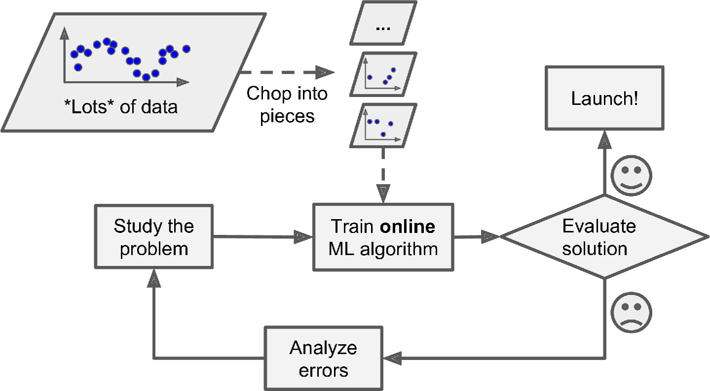

A big challenge with online learning is that if bad data is fed to the
system, the system's performance will gradually decline. If it's a live
system, your clients will notice. For example, bad data could come from
a malfunctioning sensor on a robot, or from someone spamming a search
engine to try to rank high in search results. To reduce this risk, you
need to monitor your system closely and promptly switch learning off
(and possibly revert to a previously working state) if you detect a drop
in performance. You may also want to monitor the input data and react to
abnormal data (e.g., using an anomaly detection algorithm).


Instance-Based Versus Model-Based Learning
------------------------------------------

One more way to categorize Machine Learning systems is by how they
*generalize*. Most Machine Learning tasks are about
making[]{#idm45728493637304} predictions. This means that given a number
of training examples, the system needs to be able to make good
predictions for (generalize to) examples it has never seen before.
Having a good performance measure on the training data is good, but
insufficient; the true goal is to perform well on new instances.

There are two main approaches to generalization: instance-based learning
and model-based learning.


### Instance-based learning

Possibly[]{#idm45728493633960} the most trivial form of learning is
simply to learn by heart. If you were to create a spam filter this way,
it would just flag all emails that are identical to emails that have
already been flagged by users---not the worst solution, but certainly
not the best.

Instead of just flagging emails that are identical to known spam emails,
your spam filter could be programmed to also flag emails that are very
similar to known spam emails. This[]{#idm45728493632248} requires a
*measure of similarity* between two emails. A (very basic) similarity
measure between two emails could be to count the number of words they
have in common. The system would flag an email as spam if it has many
words in common with a known spam email.

This is called *instance-based learning*: the system learns the examples
by heart, then generalizes to new cases by using a similarity measure to
compare them to the learned examples (or a subset of them). For example,
in
[Figure 1-15](https://learning.oreilly.com/library/view/hands-on-machine-learning/9781492032632/ch01.html#instance_based_learning_diagram)
the new instance would be classified as a triangle because the majority
of the most similar instances belong to that class.


### Model-based learning

Another[]{#idm45728493624136} way to generalize from a set of examples
is to build a model of these examples and then use that model to make
*predictions*. This is called *model-based learning*
([Figure 1-16](https://learning.oreilly.com/library/view/hands-on-machine-learning/9781492032632/ch01.html#model_based_learning_diagram)).

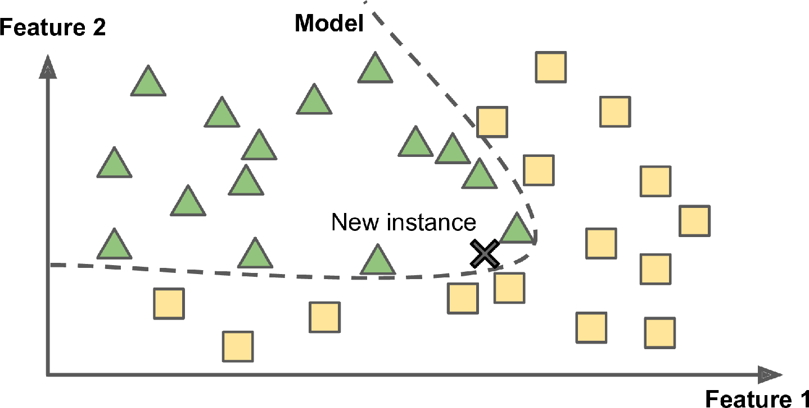

For example, suppose[]{#idm45728493618728} you want to know if money
makes people happy, so you download the Better Life Index data from the
[OECD's website](https://homl.info/4) and stats about gross domestic
product (GDP) per capita from the [IMF's website](https://homl.info/5).
Then you join the tables and sort by GDP per capita.
[Table 1-1](https://learning.oreilly.com/library/view/hands-on-machine-learning/9781492032632/ch01.html#life_satisfaction_table_excerpt)
shows an excerpt of what you get.

  Country         GDP per capita (USD)   Life satisfaction
  --------------- ---------------------- -------------------
  Hungary         12,240                 4.9
  Korea           27,195                 5.8
  France          37,675                 6.5
  Australia       50,962                 7.3
  United States   55,805                 7.2

  : [Table 1-1. ] Does money make people happier?

Let's plot the data for these countries
([Figure 1-17](https://learning.oreilly.com/library/view/hands-on-machine-learning/9781492032632/ch01.html#money_happy_scatterplot)).


There does seem to be a trend here!
Although[]{#idm45728493596408}[]{#idm45728493595704} the data is *noisy*
(i.e., partly random), it looks like life satisfaction goes up more or
less linearly as the country's GDP per capita increases. So you decide
to model life satisfaction as a linear function of GDP per capita.
This[]{#idm45728493593976}[]{#idm45728493593272} step is called *model
selection*: you selected a *linear model* of life satisfaction with just
one attribute, GDP per capita ([Equation
1-1](https://learning.oreilly.com/library/view/hands-on-machine-learning/9781492032632/ch01.html#a_simple_linear_model)).


##### [Equation 1-1. ] A simple linear model

[]{.MathJax_Preview style="color: inherit; display: none;"}


[[[[[[[life\_satisfaction]{#MathJax-Span-4 .mtext
style="font-family: MathJax_Main;"}[=]{#MathJax-Span-5 .mo
style="font-family: MathJax_Main; padding-left: 0.26em;"}[[[[θ]{#MathJax-Span-7
.mi
style="font-family: MathJax_Math-italic;"}[]{style="display: inline-block; width: 0px; height: 4.013em;"}]{style="position: absolute; clip: rect(3.139em, 1000.47em, 4.167em, -1000.01em); top: -4.008em; left: 0em;"}[[0]{#MathJax-Span-8
.mn
style="font-size: 70.7%; font-family: MathJax_Main;"}[]{style="display: inline-block; width: 0px; height: 4.013em;"}]{style="position: absolute; top: -3.854em; left: 0.465em;"}]{style="display: inline-block; position: relative; width: 0.877em; height: 0px;"}]{#MathJax-Span-6
.msub style="padding-left: 0.26em;"}[+]{#MathJax-Span-9 .mo
style="font-family: MathJax_Main; padding-left: 0.208em;"}[[[[θ]{#MathJax-Span-11
.mi
style="font-family: MathJax_Math-italic;"}[]{style="display: inline-block; width: 0px; height: 4.013em;"}]{style="position: absolute; clip: rect(3.139em, 1000.47em, 4.167em, -1000.01em); top: -4.008em; left: 0em;"}[[1]{#MathJax-Span-12
.mn
style="font-size: 70.7%; font-family: MathJax_Main;"}[]{style="display: inline-block; width: 0px; height: 4.013em;"}]{style="position: absolute; top: -3.854em; left: 0.465em;"}]{style="display: inline-block; position: relative; width: 0.877em; height: 0px;"}]{#MathJax-Span-10
.msub style="padding-left: 0.208em;"}[×]{#MathJax-Span-13 .mo
style="font-family: MathJax_Main; padding-left: 0.208em;"}[GDP\_per\_capita]{#MathJax-Span-14
.mtext
style="font-family: MathJax_Main; padding-left: 0.208em;"}]{#MathJax-Span-3
.mrow}]{#MathJax-Span-2
.mrow}[]{style="display: inline-block; width: 0px; height: 2.111em;"}]{style="position: absolute; clip: rect(1.237em, 1019.45em, 2.47em, -1000.01em); top: -2.105em; left: 0em;"}]{style="display: inline-block; position: relative; width: 19.437em; height: 0px; font-size: 103%;"}[]{style="display: inline-block; overflow: hidden; vertical-align: -0.262em; border-left: 0px solid; width: 0px; height: 1.009em;"}]{#MathJax-Span-1
.math
style="width: 20.054em; display: inline-block;"}[$$\text{life\_satisfaction} = \theta_{0} + \theta_{1} \times \text{GDP\_per\_capita}$$]{.MJX_Assistive_MathML
.MJX_Assistive_MathML_Block
role="presentation"}]{#MathJax-Element-1-Frame .MathJax tabindex="0"
mathml="<math xmlns=\"http://www.w3.org/1998/Math/MathML\" display=\"block\"><mrow><mtext>life_satisfaction</mtext><mo>=</mo><msub><mi>&#x3B8;</mi><mn>0</mn></msub><mo>+</mo><msub><mi>&#x3B8;</mi><mn>1</mn></msub><mo>&#xD7;</mo><mtext>GDP_per_capita</mtext></mrow></math>"
role="presentation" style="text-align: center; position: relative;"}


This[]{#idm45728493582840} model has two *model parameters*, *θ*~0~ and
*θ*~1~.^[5](https://learning.oreilly.com/library/view/hands-on-machine-learning/9781492032632/ch01.html#idm45728493580088){#idm45728493580088-marker
.totri-footnote}^ By tweaking these parameters, you can make your model
represent any linear function, as shown in
[Figure 1-18](https://learning.oreilly.com/library/view/hands-on-machine-learning/9781492032632/ch01.html#tweaking_model_params_plot).

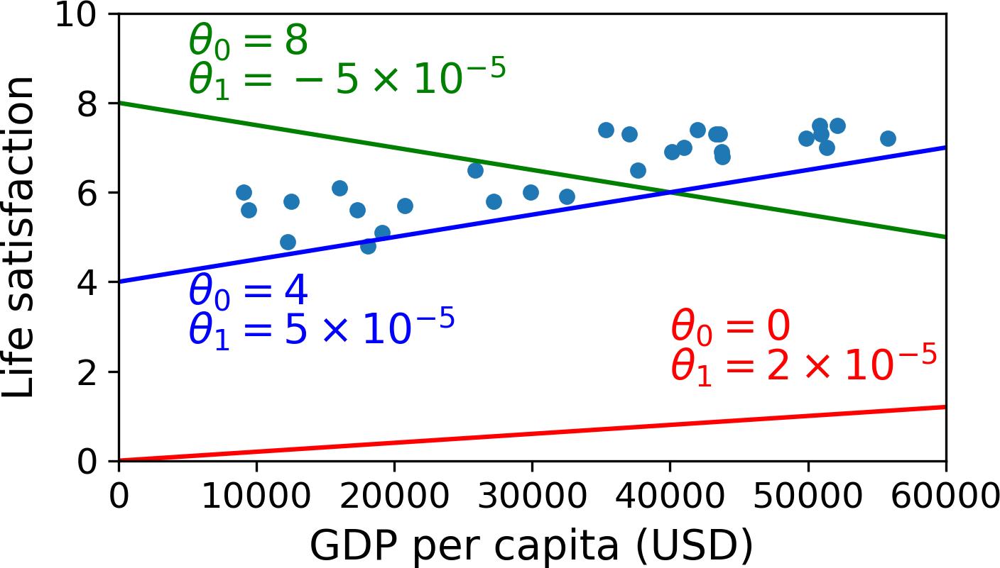

Before you can use your model, you need to define the parameter values
*θ*~0~ and *θ*~1~. How can you know which values will make your model
perform best? To answer this question, you need to specify a performance
measure. You can
either[]{#idm45728493573496}[]{#idm45728493572792}[]{#idm45728493572120}
define a *utility function* (or *fitness function*) that measures how
*good* your model is, or you can define a *cost function* that measures
how *bad* it is. For Linear Regression problems, people typically use a
cost function that measures the distance between the linear model's
predictions and the training examples; the objective is to minimize this
distance.

This is where the Linear Regression algorithm comes in: you feed it your
training examples, and it finds the parameters that make the linear
model fit best to your data.
This[]{#idm45728493568104}[]{#idm45728493567128} is called *training*
the model. In our case, the algorithm finds that the optimal parameter
values are *θ*~0~ = 4.85 and *θ*~1~ = 4.91 × 10^--5^.


###### Warning

Confusingly, the same[]{#idm45728493562840} word "model" can refer to a
*type of model* (e.g., Linear Regression),[]{#idm45728493560936} to a
*fully specified model architecture* (e.g., Linear Regression with one
input and one output), or[]{#idm45728493559624} to the *final trained
model* ready to be used for predictions (e.g., Linear Regression with
one input and one output, using *θ*~0~ = 4.85 and *θ*~1~ = 4.91 ×
10^--5^). Model selection consists in choosing the type of model and
fully specifying its architecture. Training a model means running an
algorithm to find the model parameters that will make it best fit the
training data (and hopefully make good predictions on new data).


Now the model fits the training data as closely as possible (for a
linear model), as you can see in
[Figure 1-19](https://learning.oreilly.com/library/view/hands-on-machine-learning/9781492032632/ch01.html#best_fit_model_plot).

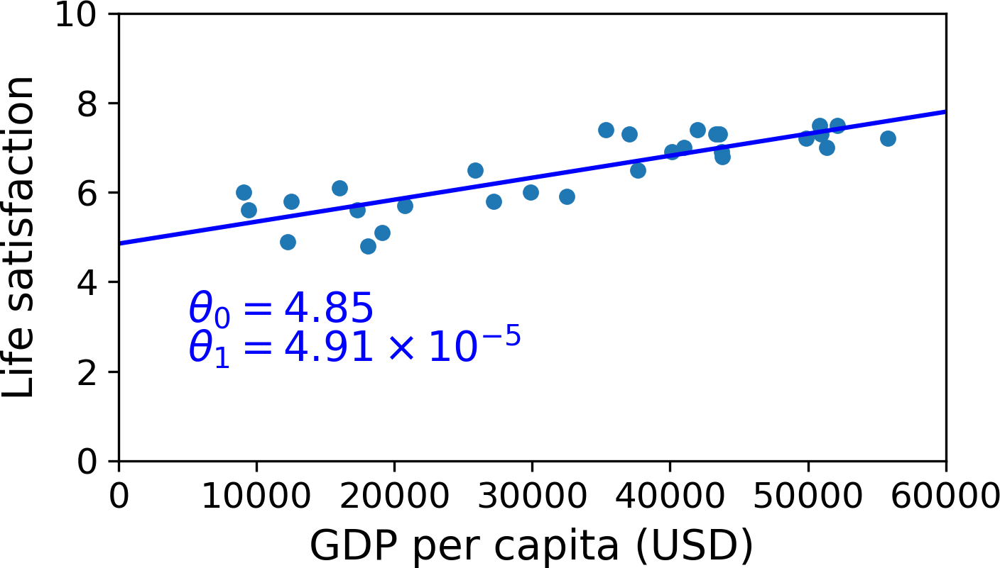

You are finally ready to run the model to make predictions. For example,
say you want to know how happy Cypriots are, and the OECD data does not
have the answer. Fortunately, you can use your model to make a good
prediction: you look up Cyprus's GDP per capita, find \$22,587, and then
apply your model and find that life satisfaction is likely to be
somewhere around 4.85 + 22,587 × 4.91 × 10^-5^ = 5.96.

To[]{#idm45728493550888} whet your appetite,
[Example 1-1](https://learning.oreilly.com/library/view/hands-on-machine-learning/9781492032632/ch01.html#example_scikit_code)
shows the Python code that loads the data, prepares
it,^[6](https://learning.oreilly.com/library/view/hands-on-machine-learning/9781492032632/ch01.html#idm45728493548920){#idm45728493548920-marker
.totri-footnote}^ creates a scatterplot for visualization, and then
trains a linear model and makes a
prediction.^[7](https://learning.oreilly.com/library/view/hands-on-machine-learning/9781492032632/ch01.html#idm45728493547448){#idm45728493547448-marker
.totri-footnote}^


##### [Example 1-1. ] Training and running a linear model using Scikit-Learn

``` {data-type="programlisting" code-language="python"}
import matplotlib.pyplot as plt
import numpy as np
import pandas as pd
import sklearn.linear_model

# Load the data
oecd_bli = pd.read_csv("oecd_bli_2015.csv", thousands=',')
gdp_per_capita = pd.read_csv("gdp_per_capita.csv",thousands=',',delimiter='\t',
                             encoding='latin1', na_values="n/a")


# Prepare the data
country_stats = prepare_country_stats(oecd_bli, gdp_per_capita)
X = np.c_[country_stats["GDP per capita"]]
y = np.c_[country_stats["Life satisfaction"]]

# Visualize the data
country_stats.plot(kind='scatter', x="GDP per capita", y='Life satisfaction')
plt.show()

# Select a linear model
model = sklearn.linear_model.LinearRegression()

# Train the model
model.fit(X, y)

# Make a prediction for Cyprus
X_new = [[22587]]  # Cyprus's GDP per capita
print(model.predict(X_new)) # outputs [[ 5.96242338]]
```


###### Note

If you had used an[]{#idm45728493541752} instance-based learning
algorithm instead, you would have found that Slovenia has the closest
GDP per capita to that of Cyprus (\$20,732), and since the OECD data
tells us that Slovenians' life satisfaction is 5.7, you would have
predicted a life satisfaction of 5.7 for Cyprus. If you zoom out a bit
and look at the two next-closest countries, you will find Portugal and
Spain with life satisfactions of 5.1 and 6.5, respectively. Averaging
these three values, you get 5.77, which is pretty close to your
model-based prediction. This[]{#idm45728493540424}[]{#idm45728493412264}
simple algorithm is called *k-Nearest Neighbors* regression (in this
example, *k* = 3).

Replacing the Linear Regression model with k-Nearest Neighbors
regression in the previous code is as simple as replacing these two
lines:

``` {data-type="programlisting" code-language="python"}
import sklearn.linear_model
model = sklearn.linear_model.LinearRegression()
```

with these two:

``` {data-type="programlisting" code-language="python"}
import sklearn.neighbors
model = sklearn.neighbors.KNeighborsRegressor(
    n_neighbors=3)
```


If all went well, your model will make good predictions. If not, you may
need to use more attributes (employment rate, health, air pollution,
etc.), get more or better-quality training data, or perhaps select a
more powerful model (e.g., a Polynomial Regression model).

In summary:

-   You studied the data.

-   You selected a model.

-   You trained it on the training data (i.e., the learning algorithm
    searched for the model parameter values that minimize a cost
    function).

-   Finally, you[]{#idm45728493354920} applied the model to make
    predictions on new cases (this is called *inference*), hoping that
    this model will generalize well.

This is what a typical Machine Learning project looks like. In
[Lab 2](https://learning.oreilly.com/library/view/hands-on-machine-learning/9781492032632/ch02.html#project_lab)
you will experience this firsthand by going through a project end to
end.

We have covered a lot of ground so far: you now know what Machine
Learning is really about, why it is useful, what some of the most common
categories of ML systems are, and what a typical project workflow looks
like. Now let's look at what can go wrong in learning and prevent you
from making accurate predictions.[]{#idm45728493351448}


Main Challenges of Machine Learning
===================================

In[]{#MLchallenge01} short, since your main task is to select a learning
algorithm and train it on some data, the two things that can go wrong
are "bad algorithm" and "bad data." Let's start with examples of bad
data.


Insufficient Quantity of Training Data
--------------------------------------

For[]{#idm45728493346456} a toddler to learn what an apple is, all it
takes is for you to point to an apple and say "apple" (possibly
repeating this procedure a few times). Now the child is able to
recognize apples in all sorts of colors and shapes. Genius.

Machine Learning is not quite there yet; it takes a lot of data for most
Machine Learning algorithms to work properly. Even for very simple
problems you typically need thousands of examples, and for complex
problems such as image or speech recognition you may need millions of
examples (unless you can reuse parts of an existing model).


##### The Unreasonable Effectiveness of Data

In a [famous paper](https://homl.info/6)
published[]{#idm45728493341736}[]{#idm45728493340728} in 2001, Microsoft
researchers Michele Banko and Eric Brill showed that very different
Machine Learning algorithms, including fairly simple ones, performed
almost identically well on a complex problem of natural language
disambiguation^[8](https://learning.oreilly.com/library/view/hands-on-machine-learning/9781492032632/ch01.html#idm45728493339432){#idm45728493339432-marker
.totri-footnote}^ once they were given enough data (as you can see in
[Figure 1-20](https://learning.oreilly.com/library/view/hands-on-machine-learning/9781492032632/ch01.html#banko_brill_2001_plot)).

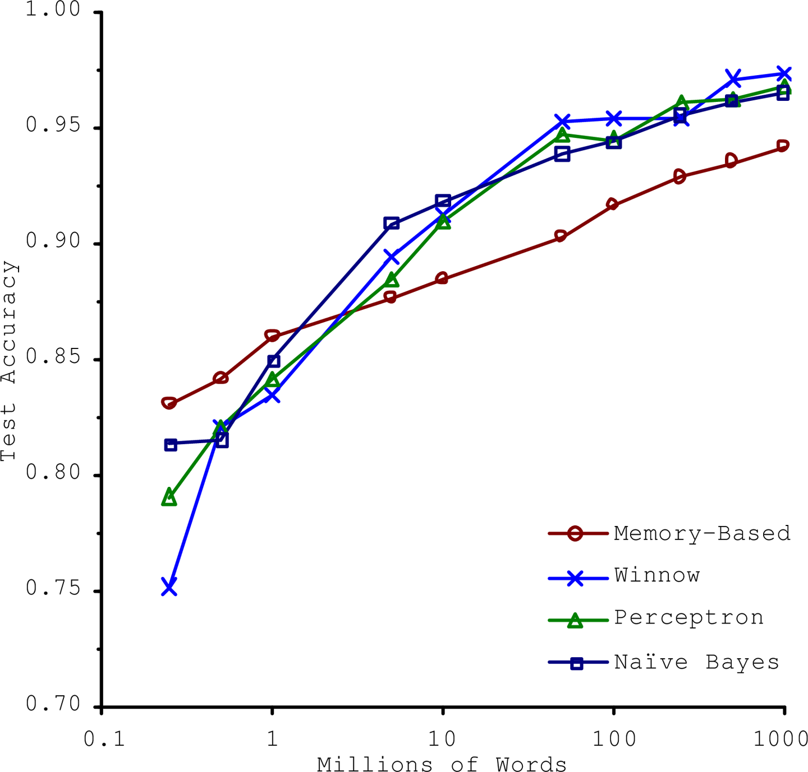

As[]{#idm45728493315720} the authors put it, "these results suggest that
we may want to reconsider the trade-off between spending time and money
on algorithm development versus spending it on corpus development."

The idea that data matters more than algorithms for complex problems was
further popularized by Peter Norvig et al. in a paper titled ["The
Unreasonable Effectiveness of Data"](https://homl.info/7), published in
2009.^[10](https://learning.oreilly.com/library/view/hands-on-machine-learning/9781492032632/ch01.html#idm45728493313368){#idm45728493313368-marker}^
It should be noted, however, that small- and medium-sized datasets are
still very common, and it is not always easy or cheap to get extra
training data⁠---so don't abandon algorithms just yet.


Nonrepresentative Training Data
-------------------------------

In[]{#idm45728493310328} order to generalize well, it is crucial that
your training data be representative of the new cases you want to
generalize to. This is true whether you use instance-based learning or
model-based learning.

For example, the set of countries we used earlier for training the
linear model was not perfectly representative; a few countries were
missing.
[Figure 1-21](https://learning.oreilly.com/library/view/hands-on-machine-learning/9781492032632/ch01.html#representative_training_data_scatterplot)
shows what the data looks like when you add the missing countries.

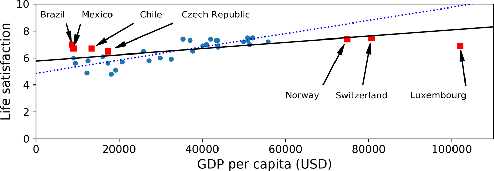

If you train a linear model on this data, you get the solid line, while
the old model is represented by the dotted line. As you can see, not
only does adding a few missing countries significantly alter the model,
but it makes it clear that such a simple linear model is probably never
going to work well. It seems that very rich countries are not happier
than moderately rich countries (in fact, they seem unhappier), and
conversely some poor countries seem happier than many rich countries.

By using a nonrepresentative training set, we trained a model that is
unlikely to make accurate predictions, especially for very poor and very
rich countries.

It is crucial to use a training set that is representative of the cases
you want to generalize to. This is often harder than it sounds: if the
sample is too small, you will[]{#idm45728493303464} have *sampling
noise* (i.e., nonrepresentative data as a result of chance), but even
very large samples can be nonrepresentative if the sampling method is
flawed. This[]{#idm45728493302056} is called *sampling bias*.


##### Examples of Sampling Bias

Perhaps the most famous example of sampling bias happened during the US
presidential election in 1936, which pitted Landon against Roosevelt:
the *Literary Digest* conducted a very large poll, sending mail to about
10 million people. It got 2.4 million answers, and predicted with high
confidence that Landon would get 57% of the votes. Instead, Roosevelt
won with 62% of the votes. The flaw was in the *Literary Digest*'s
sampling method:

-   First, to obtain the addresses to send the polls to, the *Literary
    Digest* used telephone directories, lists of magazine subscribers,
    club membership lists, and the like. All of these lists tended to
    favor wealthier people, who were more likely to vote Republican
    (hence Landon).

-   Second, less than 25% of the people who were polled answered. Again
    this introduced a sampling bias, by potentially ruling out people
    who didn't care much about politics, people who didn't like the
    *Literary Digest*, and other key groups. This is a special type of
    sampling bias called *nonresponse bias*.

Here is another example: say you want to build a system to recognize
funk music videos. One way to build your training set is to search for
"funk music" on YouTube and use the resulting videos. But this assumes
that YouTube's search engine returns a set of videos that are
representative of all the funk music videos on YouTube. In reality, the
search results are likely to be biased toward popular artists (and if
you live in Brazil you will get a lot of "funk carioca" videos, which
sound nothing like James Brown). On the other hand, how else can you get
a large training set?


Poor-Quality Data
-----------------

Obviously, if your training data[]{#idm45728493291192} is full of
errors, outliers, and noise (e.g., due to poor-quality measurements), it
will make it harder for the system to detect the underlying patterns, so
your system is less likely to perform well. It is often well worth the
effort to spend time cleaning up your training data. The truth is, most
data scientists spend a significant part of their time doing just that.
The following are a couple of examples of when you'd want to clean up
training data:

-   If some instances are clearly outliers, it may help to simply
    discard them or try to fix the errors manually.

-   If some instances are missing a few features (e.g., 5% of your
    customers did not specify their age), you must decide whether you
    want to ignore this attribute altogether, ignore these instances,
    fill in the missing values (e.g., with the median age), or train one
    model with the feature and one model without it.


Irrelevant Features
-------------------

As[]{#idm45728493285416} the saying goes: garbage in, garbage out. Your
system will only be capable of learning if the training data contains
enough relevant features and not too many irrelevant ones. A critical
part of the success of a Machine Learning project is coming up with a
good set of features to train on. This[]{#idm45728493283960} process,
called *feature engineering*, involves the following steps:

-   *Feature selection* (selecting[]{#idm45728493281400} the most useful
    features to train on among existing features)

-   *Feature extraction* (combining[]{#idm45728493279336} existing
    features to produce a more useful one⁠---as we saw earlier,
    dimensionality reduction algorithms can help)

-   Creating new features by gathering new data

Now that we have looked at many examples of bad data, let's look at a
couple of examples of bad algorithms.


Overfitting the Training Data
-----------------------------

Say[]{#idm45728493210296}[]{#idm45728493209288} you are visiting a
foreign country and the taxi driver rips you off. You might be tempted
to say that *all* taxi drivers in that country are thieves.
Overgeneralizing is something that we humans do all too often, and
unfortunately machines can fall into the same trap if we are not
careful. In Machine Learning this is called *overfitting*: it means that
the model performs well on the training data, but it does not generalize
well.

[Figure 1-22](https://learning.oreilly.com/library/view/hands-on-machine-learning/9781492032632/ch01.html#overfitting_model_plot)
shows an example of a high-degree polynomial life satisfaction model
that strongly overfits the training data. Even though it performs much
better on the training data than the simple linear model, would you
really trust its predictions?

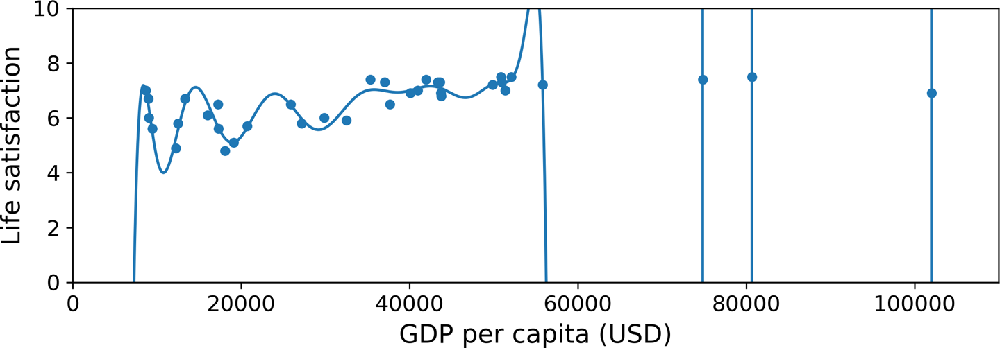

Complex models such as deep neural networks can detect subtle patterns
in the data, but if the training set is noisy, or if it is too small
(which introduces sampling noise), then the model is likely to detect
patterns in the noise itself. Obviously these patterns will not
generalize to new instances. For example, say you feed your life
satisfaction model many more attributes, including uninformative ones
such as the country's name. In that case, a complex model may detect
patterns like the fact that all countries in the training data with a
*w* in their name have a life satisfaction greater than 7: New Zealand
(7.3), Norway (7.4), Sweden (7.2), and Switzerland (7.5). How confident
are you that the *w*-satisfaction rule generalizes to Rwanda or
Zimbabwe? Obviously this pattern occurred in the training data by pure
chance, but the model has no way to tell whether a pattern is real or
simply the result of noise in the data.


###### Warning

Overfitting happens when the model is too complex relative to the amount
and noisiness of the training data. Here are possible solutions:

-   Simplify the model by selecting one with fewer parameters (e.g., a
    linear model rather than a high-degree polynomial model), by
    reducing the number of attributes in the training data, or by
    constraining the model.

-   Gather more training data.

-   Reduce the noise in the training data (e.g., fix data errors and
    remove outliers).


Constraining[]{#idm45728493196344} a model to make it simpler and reduce
the risk of overfitting is called *regularization*. For example, the
linear model we defined earlier has two parameters, *θ*~0~ and *θ*~1~.
This gives the learning algorithm two *degrees of freedom* to adapt the
model to the training data: it can tweak both the height (*θ*~0~) and
the slope (*θ*~1~) of the line. If we forced *θ*~1~ = 0, the algorithm
would have only one degree of freedom and would have a much harder time
fitting the data properly: all it could do is move the line up or down
to get as close as possible to the training instances, so it would end
up around the mean. A very simple model indeed! If we allow the
algorithm to modify *θ*~1~ but we force it to keep it small, then the
learning algorithm will effectively have somewhere in between one and
two degrees of freedom. It will produce a model that's simpler than one
with two degrees of freedom, but more complex than one with just one.
You want to find the right balance between fitting the training data
perfectly and keeping the model simple enough to ensure that it will
generalize well.

[Figure 1-23](https://learning.oreilly.com/library/view/hands-on-machine-learning/9781492032632/ch01.html#ridge_model_plot)
shows three models. The dotted line represents the original model that
was trained on the countries represented as circles (without the
countries represented as squares), the dashed line is our second model
trained with all countries (circles and squares), and the solid line is
a model trained with the same data as the first model but with a
regularization constraint. You can see that regularization forced the
model to have a smaller slope: this model does not fit the training data
(circles) as well as the first model, but it actually generalizes better
to new examples that it did not see during training (squares).

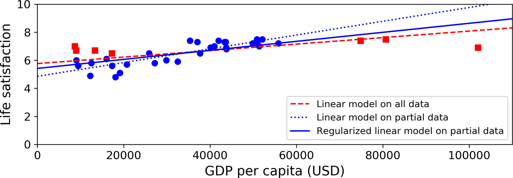

The[]{#idm45728493185032} amount of regularization to apply during
learning can be controlled by a *hyperparameter*. A hyperparameter is a
parameter of a learning algorithm (not of the model). As such, it is not
affected by the learning algorithm itself; it must be set prior to
training and remains constant during training. If you set the
regularization hyperparameter to a very large value, you will get an
almost flat model (a slope close to zero); the learning algorithm will
almost certainly not overfit the training data, but it will be less
likely to find a good solution. Tuning hyperparameters is an important
part of building a Machine Learning system (you will see a detailed
example in the next lab).


Underfitting the Training Data
------------------------------

As[]{#idm45728493181624}[]{#idm45728493180616} you might guess,
*underfitting* is the opposite of overfitting: it occurs when your model
is too simple to learn the underlying structure of the data. For
example, a linear model of life satisfaction is prone to underfit;
reality is just more complex than the model, so its predictions are
bound to be inaccurate, even on the training [examples].

Here are the main options for fixing this problem:

-   Select a more powerful model, with more parameters.

-   Feed better features to the learning algorithm (feature
    engineering).

-   Reduce the constraints on the model (e.g., reduce the regularization
    hyperparameter).


Stepping Back
-------------

By[]{#idm45728493173112} now you know a lot about Machine Learning.
However, we went through so many concepts that you may be feeling a
little lost, so let's step back and look at the big
[picture]:

-   Machine Learning is about making machines get better at some task by
    learning from data, instead of having to explicitly code rules.

-   There are many different types of ML systems: supervised or not,
    batch or online, instance-based or model-based.

-   In an ML project you gather data in a training set, and you feed the
    training set to a learning algorithm. If the algorithm is
    model-based, it tunes some parameters to fit the model to the
    training set (i.e., to make good predictions on the training set
    itself), and then hopefully it will be able to make good predictions
    on new cases as well. If the algorithm is instance-based, it just
    learns the examples by heart and generalizes to new instances by
    using a similarity measure to compare them to the learned instances.

-   The system will not perform well if your training set is too small,
    or if the data is not representative, is noisy, or is polluted with
    irrelevant features (garbage in, garbage out). Lastly, your model
    needs to be neither too simple (in which case it will underfit) nor
    too complex (in which case it will overfit).

There's just one last important topic to cover: once you have trained a
model, you don't want to just "hope" it generalizes to new cases. You
want to evaluate it and fine-tune it if necessary. Let's see how to do
that.[]{#idm45728493165400}


Testing and Validating
======================

The[]{#MLtest01} only way to know how well a model will generalize to
new cases is to actually try it out on new cases. One way to do that is
to put your model in production and monitor how well it performs. This
works well, but if your model is horribly bad, your users will
complain---not the best idea.

A[]{#idm45728493160312}[]{#idm45728493159576} better option is to split
your data into two sets: the *training set* and the *test set*. As these
names imply, you train your model using the training set, and you test
it using the test set. The error
rate[]{#idm45728493157736}[]{#idm45728493157032} on new cases is called
the *generalization error* (or *out-of-sample error*), and by evaluating
your model on the test set, you get an estimate of this error. This
value tells you how well your model will perform on instances it has
never seen before.

If the training error is low (i.e., your model makes few mistakes on the
training set) but the generalization error is high, it means that your
model is overfitting the training data.


###### Tip

It is common to use 80% of the data for
training[]{#idm45728493153720}[]{#idm45728493152744} and *hold out* 20%
for testing. However, this depends on the size of the dataset: if it
contains 10 million instances, then holding out 1% means your test set
will contain 100,000 instances, probably more than enough to get a good
estimate of the generalization error.


Hyperparameter Tuning and Model Selection
-----------------------------------------

Evaluating a
model[]{#idm45728493149464}[]{#idm45728493148456}[]{#idm45728493147512}[]{#idm45728493146568}
is simple enough: just use a test set. But suppose you are hesitating
between two types of models (say, a linear model and a polynomial
model): how can you decide between them? One option is to train both and
compare how well they generalize using the test set.

Now suppose that the linear model generalizes better, but you want to
apply some regularization to avoid overfitting. The question is, how do
you choose the value of the regularization hyperparameter? One option is
to train 100 different models using 100 different values for this
hyperparameter. Suppose you find the best hyperparameter value that
produces a model with the lowest generalization error⁠---say, just 5%
error. You launch this model into production, but unfortunately it does
not perform as well as expected and produces 15% errors. What just
happened?

The problem is that you measured the generalization error multiple times
on the test set, and you adapted the model and hyperparameters to
produce the best model *for that particular set*. This means that the
model is unlikely to perform as well on new data.

A[]{#idm45728493142792}[]{#idm45728493142056}[]{#idm45728493141384}
common solution to this problem is called *holdout validation*: you
simply hold out part of the training set to evaluate several candidate
models and select the best one. The new held-out set is called the
*validation set* (or sometimes the *development set*, or *dev set*).
More specifically, you train multiple models with various
hyperparameters on the reduced training set (i.e., the full training set
minus the validation set), and you select the model that performs best
on the validation set. After this holdout validation process, you train
the best model on the full training set (including the validation set),
and this gives you the final model. Lastly, you evaluate this final
model on the test set to get an estimate of the generalization error.

This solution usually works quite well. However, if the validation set
is too small, then model evaluations will be imprecise: you may end up
selecting a suboptimal model by mistake. Conversely, if the validation
set is too large, then the remaining training set will be much smaller
than the full training set. Why is this bad? Well, since the final model
will be trained on the full training set, it is not ideal to compare
candidate models trained on a much smaller training set. It would be
like selecting the fastest sprinter to participate in a marathon.
One[]{#idm45728493137336} way to solve this problem is to perform
repeated *cross-validation*, using many small validation sets. Each
model is evaluated once per validation set after it is trained on the
rest of the data. By averaging out all the evaluations of a model, you
get a much more accurate measure of its performance. There is a
drawback, however: the training time is multiplied by the number of
validation sets.


Data Mismatch
-------------

In[]{#idm45728493134248}[]{#idm45728493133240} some cases, it's easy to
get a large amount of data for training, but this data probably won't be
perfectly representative of the data that will be used in production.
For example, suppose you want to create a mobile app to take pictures of
flowers and automatically determine their species. You can easily
download millions of pictures of flowers on the web, but they won't be
perfectly representative of the pictures that will actually be taken
using the app on a mobile device. Perhaps you only have 10,000
representative pictures (i.e., actually taken with the app). In this
case, the most important rule to remember is that the validation set and
the test set must be as representative as possible of the data you
expect to use in production, so they should be composed exclusively of
representative pictures: you can shuffle them and put half in the
validation set and half in the test set (making sure that no duplicates
or near-duplicates end up in both sets). But after training your model
on the web pictures, if you observe that the performance of the model on
the validation set is disappointing, you will not know whether this is
because your model has overfit the training set, or whether this is just
due to the mismatch between the web pictures and the mobile app
pictures. One[]{#idm45728493130856} solution is to hold out some of the
training pictures (from the web) in yet another set that Andrew Ng calls
the *train-dev set*. After the model is trained (on the training set,
*not* on the train-dev set), you can evaluate it on the train-dev set.
If it performs well, then the model is not overfitting the training set.
If it performs poorly on the validation set, the problem must be coming
from the data mismatch. You can try to tackle this problem by
preprocessing the web images to make them look more like the pictures
that will be taken by the mobile app, and then retraining the model.
Conversely, if the model performs poorly on the train-dev set, then it
must have overfit the training set, so you should try to simplify or
regularize the model, get more training data, and clean up the training
data.


##### No Free Lunch Theorem

A model is a simplified version of the observations. The simplifications
are meant to discard the superfluous details that are unlikely to
generalize to new instances. To decide what data to discard and what
data to keep, you must make *assumptions*. For example, a linear model
makes the assumption that the data is fundamentally linear and that the
distance between the instances and the straight line is just noise,
which can safely be ignored.

In a [famous 1996
paper](https://homl.info/8),^[11](https://learning.oreilly.com/library/view/hands-on-machine-learning/9781492032632/ch01.html#idm45728493124488){#idm45728493124488-marker}^
David Wolpert[]{#idm45728493123352} demonstrated that if you make
absolutely no assumption about the data, then there is no reason to
prefer one model over any other. This is called the *No Free Lunch*
(NFL) theorem. For some datasets the best model is a linear model, while
for other datasets it is a neural network. There is no model that is *a
priori* guaranteed to work better (hence the name of the theorem). The
only way to know for sure which model is best is to evaluate them all.
Since this is not possible, in practice you make some reasonable
assumptions about the data and evaluate only a few reasonable models.
For example, for simple tasks you may evaluate linear models with
various levels of regularization, and for a complex problem you may
evaluate various neural
networks.[]{#idm45728493120984}[]{#idm45728493120008}


Exercises
=========

In this lab we have covered some of the most important concepts in
Machine Learning. In the next labs we will dive deeper and write
more code, but before we do, make sure you know how to answer the
following questions:

1.  How would you define Machine Learning?

2.  Can you name four types of problems where it shines?

3.  What is a labeled training set?

4.  What are the two most common supervised tasks?

5.  Can you name four common unsupervised tasks?

6.  What type of Machine Learning algorithm would you use to allow a
    robot to walk in various unknown terrains?

7.  What type of algorithm would you use to segment your customers into
    multiple groups?

8.  Would you frame the problem of spam detection as a supervised
    learning problem or an unsupervised learning problem?

9.  What is an online learning system?

10. What is out-of-core learning?

11. What type of learning algorithm relies on a similarity measure to
    make predictions?

12. What is the difference between a model parameter and a learning
    algorithm's hyperparameter?

13. What do model-based learning algorithms search for? What is the most
    common strategy they use to succeed? How do they make predictions?

14. Can you name four of the main challenges in Machine Learning?

15. If your model performs great on the training data but generalizes
    poorly to new instances, what is happening? Can you name three
    possible solutions?

16. What is a test set, and why would you want to use it?

17. What is the purpose of a validation set?

18. What is the train-dev set, when do you need it, and how do you use
    it?

19. What can go wrong if you tune hyperparameters using the test set?

Solutions to these exercises are available in
[Appendix A](https://learning.oreilly.com/library/view/hands-on-machine-learning/9781492032632/app01.html#solutions_appendix).


^[1](https://learning.oreilly.com/library/view/hands-on-machine-learning/9781492032632/ch01.html#idm45728493772936-marker){.totri-footnote}^
Fun fact: this odd-sounding name is a statistics term introduced by
Francis Galton while he was studying the fact that the children of tall
people tend to be shorter than their parents. Since the children were
shorter, he called this *regression to the mean*. This name was then
applied to the methods he used to analyze correlations between
variables.

^[2](https://learning.oreilly.com/library/view/hands-on-machine-learning/9781492032632/ch01.html#idm45728493754968-marker){.totri-footnote}^
Some neural network architectures can be unsupervised, such as
autoencoders and restricted Boltzmann machines. They can also be
semisupervised, such as in deep belief networks and unsupervised
pretraining.

^[3](https://learning.oreilly.com/library/view/hands-on-machine-learning/9781492032632/ch01.html#idm45728493711032-marker){.totri-footnote}^
Notice how animals are rather well separated from vehicles and how
horses are close to deer but far from birds. Figure reproduced with
permission from Richard Socher et al., "Zero-Shot Learning Through
Cross-Modal Transfer," *Proceedings of the 26th International Conference
on Neural Information Processing Systems* 1 (2013): 935--943.

^[4](https://learning.oreilly.com/library/view/hands-on-machine-learning/9781492032632/ch01.html#idm45728493686392-marker){.totri-footnote}^
That's when the system works perfectly. In practice it often creates a
few clusters per person, and sometimes mixes up two people who look
alike, so you may need to provide a few labels per person and manually
clean up some clusters.

^[5](https://learning.oreilly.com/library/view/hands-on-machine-learning/9781492032632/ch01.html#idm45728493580088-marker){.totri-footnote}^
By convention, the Greek letter *θ* (theta) is frequently used to
represent model parameters.

^[6](https://learning.oreilly.com/library/view/hands-on-machine-learning/9781492032632/ch01.html#idm45728493548920-marker){.totri-footnote}^
The `prepare_country_stats()` function's definition is not shown here
(see this lab's Jupyter notebook if you want all the gory details).
It's just boring pandas code that joins the life satisfaction data from
the OECD with the GDP per capita data from the IMF.

^[7](https://learning.oreilly.com/library/view/hands-on-machine-learning/9781492032632/ch01.html#idm45728493547448-marker){.totri-footnote}^
It's OK if you don't understand all the code yet; we will present
Scikit-Learn in the following labs.

^[8](https://learning.oreilly.com/library/view/hands-on-machine-learning/9781492032632/ch01.html#idm45728493339432-marker){.totri-footnote}^
For example, knowing whether to write "to," "two," or "too," depending
on the context.

^[9](https://learning.oreilly.com/library/view/hands-on-machine-learning/9781492032632/ch01.html#idm45728493335752-marker){.totri-footnote}^
Figure reproduced with permission from Michele Banko and Eric Brill,
"Scaling to Very Very Large Corpora for Natural Language
Disambiguation," *Proceedings of the 39th Annual Meeting of the
Association for Computational Linguistics* (2001): 26--33.

^[10](https://learning.oreilly.com/library/view/hands-on-machine-learning/9781492032632/ch01.html#idm45728493313368-marker)^
Peter Norvig et al., "The Unreasonable Effectiveness of Data," *IEEE
Intelligent Systems* 24, no. 2 (2009): 8--12.

^[11](https://learning.oreilly.com/library/view/hands-on-machine-learning/9781492032632/ch01.html#idm45728493124488-marker)^
David Wolpert, "The Lack of A Priori Distinctions Between Learning
Algorithms," *Neural Computation* 8, no. 7 (1996): 1341--1390.
