Lab 14. Deep Computer Vision Using Convolutional Neural Networks
====================================================================

Although IBM’s Deep Blue supercomputer beat the chess world champion
Garry Kasparov back in 1996, it wasn’t until fairly recently that
computers were able to reliably perform seemingly trivial tasks such as
detecting a puppy in a picture or recognizing spoken words. Why are
these tasks so effortless to us humans? The answer lies in the fact that
perception largely takes place outside the realm of our consciousness,
within specialized visual, auditory, and other sensory modules in our
brains. By the time sensory information reaches our consciousness, it is
already adorned with high-level features; for example, when you look at
a picture of a cute puppy, you cannot choose *not* to see the puppy,
*not* to notice its cuteness. Nor can you explain *how* you recognize a
cute puppy; it’s just obvious to you. Thus, we cannot trust our
subjective experience: perception is not trivial at all, and to
understand it we must look at how the sensory modules work.

Convolutional neural networks (CNNs) emerged from the study of the
brain’s visual cortex, and they have been used in image recognition
since the 1980s. In the last few years, thanks to the increase in
computational power, the amount of available training data, and the
tricks presented in
[Lab 11]
for training deep nets, CNNs have managed to achieve superhuman
performance on some complex visual tasks. They power image search
services, self-driving cars, automatic video classification systems, and
more. Moreover, CNNs are not restricted to visual perception: they are
also successful at many other tasks, such as voice recognition and
natural language processing. However, we will focus on visual
applications for now.

In this lab we will explore where CNNs came from, what their
building blocks look like, and how to implement them using TensorFlow
and Keras. Then we will discuss some of the best CNN architectures, as
well as other visual tasks, including object detection (classifying
multiple objects in an image and placing bounding boxes around them) and
semantic segmentation (classifying each pixel according to the class of
the object it belongs to).

The Architecture of the Visual Cortex
=====================================

David H. Hubel and Torsten Wiesel performed a series of experiments on
cats in
[1958](https://homl.info/71)^[1]
and
[1959](https://homl.info/72)^[2]
(and a [few years later on
monkeys](https://homl.info/73)^[3]
giving crucial insights into the structure of the visual cortex (the
authors received the Nobel Prize in Physiology or Medicine in 1981 for
their work). In particular, they showed that many neurons in the visual
cortex have a small *local receptive field*, meaning they react only to
visual stimuli located in a limited region of the visual field (see
[Figure 14-1]
in which the local receptive fields of five neurons are represented by
dashed circles). The receptive fields of different neurons may overlap,
and together they tile the whole visual field.

Moreover, the authors showed that some neurons react only to images of
horizontal lines, while others react only to lines with different
orientations (two neurons may have the same receptive field but react to
different line orientations). They also noticed that some neurons have
larger receptive fields, and they react to more complex patterns that
are combinations of the lower-level patterns. These observations led to
the idea that the higher-level neurons are based on the outputs of
neighboring lower-level neurons (in
[Figure 14-1]
notice that each neuron is connected only to a few neurons from the
previous layer). This powerful architecture is able to detect all sorts
of complex patterns in any area of the visual field.


###### Figure 14-1. Biological neurons in the visual cortex respond to specific patterns in small regions of the visual field called receptive fields; as the visual signal makes its way through consecutive brain modules, neurons respond to more complex patterns in larger receptive fields.

These studies of the visual cortex inspired the
[neocognitron](https://homl.info/74), ^[4]
introduced in 1980, which gradually evolved into what we now call
*convolutional neural networks*. An important milestone was a [1998
paper](https://homl.info/75)^[5]
by Yann LeCun et al. that introduced the famous *LeNet-5* architecture,
widely used by banks to recognize handwritten check numbers. This
architecture has some building blocks that you already know, such as
fully connected layers and sigmoid activation functions, but it also
introduces two new building blocks: *convolutional layers* and *pooling
layers*. Let’s look at them now.

###### Note

Why not simply use a deep neural network with fully connected layers for
image recognition tasks? Unfortunately, although this works fine for
small images (e.g., MNIST), it breaks down for larger images because of
the huge number of parameters it requires. For example, a 100 ×
100–pixel image has 10,000 pixels, and if the first layer has just 1,000
neurons (which already severely restricts the amount of information
transmitted to the next layer), this means a total of 10 million
connections. And that’s just the first layer. CNNs solve this problem
using partially connected layers and weight sharing.

Convolutional Layers
====================

The most important building block of a CNN is the *convolutional
layer*: ^[6]
neurons in the first convolutional layer are not connected to every
single pixel in the input image (like they were in the layers discussed
in previous labs), but only to pixels in their receptive fields (see
[Figure 14-2]
In turn, each neuron in the second convolutional layer is connected only
to neurons located within a small rectangle in the first layer. This
architecture allows the network to concentrate on small low-level
features in the first hidden layer, then assemble them into larger
higher-level features in the next hidden layer, and so on. This
hierarchical structure is common in real-world images, which is one of
the reasons why CNNs work so well for image recognition.

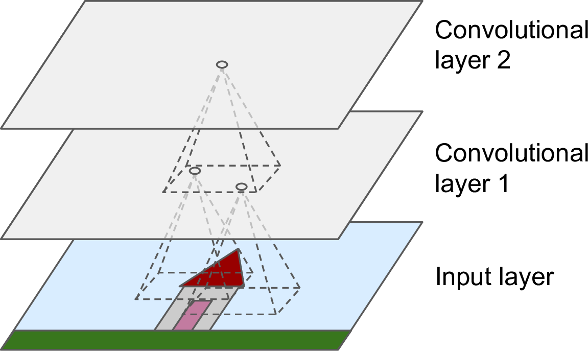

###### Figure 14-2. CNN layers with rectangular local receptive fields

###### Note

All the multilayer neural networks we’ve looked at so far had layers
composed of a long line of neurons, and we had to flatten input images
to 1D before feeding them to the neural network. In a CNN each layer is
represented in 2D, which makes it easier to match neurons with their
corresponding inputs.

A neuron located in row *i*, column *j* of a given layer is connected to
the outputs of the neurons in the previous layer located in rows *i* to
*i* + *f*~*h*~ – 1, columns *j* to *j* + *f*~*w*~ – 1, where *f*~*h*~
and *f*~*w*~ are the height and width of the receptive field (see
[Figure 14-3]
In order for a layer to have the same height and width as the previous
layer, it is common to add zeros around the inputs, as shown in the
diagram. This is called *zero* *padding*.


###### Figure 14-3. Connections between layers and zero padding

It is also possible to connect a large input layer to a much smaller
layer by spacing out the receptive fields, as shown in
[Figure 14-4]
This dramatically reduces the model’s computational complexity. The
shift from one receptive field to the next is called the *stride*. In
the diagram, a 5 × 7 input layer (plus zero padding) is connected to a 3
× 4 layer, using 3 × 3 receptive fields and a stride of 2 (in this
example the stride is the same in both directions, but it does not have
to be so). A neuron located in row *i*, column *j* in the upper layer is
connected to the outputs of the neurons in the previous layer located in
rows *i* × *s*~*h*~ to *i* × *s*~*h*~ + *f*~*h*~ – 1, columns *j* ×
*s*~*w*~ to *j* × *s*~*w*~ + *f*~*w*~ – 1, where *s*~*h*~ and *s*~*w*~
are the vertical and horizontal strides.

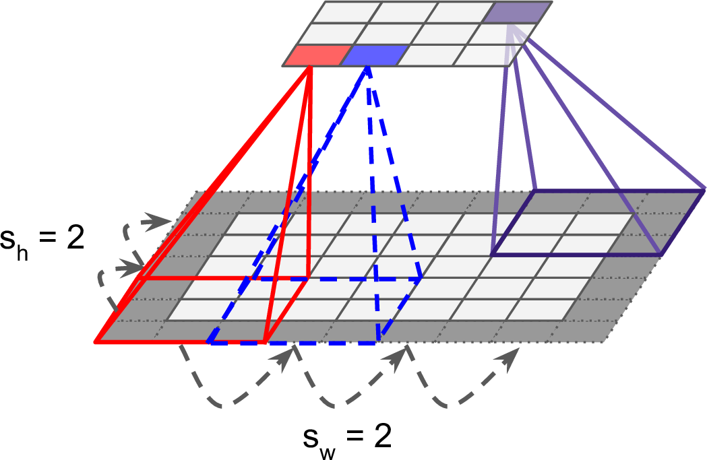

###### Figure 14-4. Reducing dimensionality using a stride of 2

Filters
-------

A neuron’s weights can be represented as a small image the size of the
receptive field. For example,
[Figure 14-5]
shows two possible sets of weights, called *filters* (or *convolution
kernels*). The first one is represented as a black square with a
vertical white line in the middle (it is a 7 × 7 matrix full of 0s
except for the central column, which is full of 1s); neurons using these
weights will ignore everything in their receptive field except for the
central vertical line (since all inputs will get multiplied by 0, except
for the ones located in the central vertical line). The second filter is
a black square with a horizontal white line in the middle. Once again,
neurons using these weights will ignore everything in their receptive
field except for the central horizontal line.

Now if all neurons in a layer use the same vertical line filter (and the
same bias term), and you feed the network the input image shown in
[Figure 14-5]
(the bottom image), the layer will output the top-left image. Notice
that the vertical white lines get enhanced while the rest gets blurred.
Similarly, the upper-right image is what you get if all neurons use the
same horizontal line filter; notice that the horizontal white lines get
enhanced while the rest is blurred out. Thus, a layer full of neurons
using the same filter outputs a *feature map*, which highlights the
areas in an image that activate the filter the most. Of course, you do
not have to define the filters manually: instead, during training the
convolutional layer will automatically learn the most useful filters for
its task, and the layers above will learn to combine them into more
complex patterns.

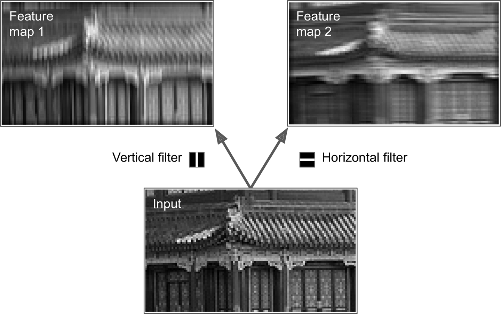

###### Figure 14-5. Applying two different filters to get two feature maps

Stacking Multiple Feature Maps
------------------------------

Up to now, for simplicity, I have represented the output of each
convolutional layer as a 2D layer, but in reality a convolutional layer
has multiple filters (you decide how many) and outputs one feature map
per filter, so it is more accurately represented in 3D (see
[Figure 14-6]
It has one neuron per pixel in each feature map, and all neurons within
a given feature map share the same parameters (i.e., the same weights
and bias term). Neurons in different feature maps use different
parameters. A neuron’s receptive field is the same as described earlier,
but it extends across all the previous layers’ feature maps. In short, a
convolutional layer simultaneously applies multiple trainable filters to
its inputs, making it capable of detecting multiple features anywhere in
its inputs.

###### Note

The fact that all neurons in a feature map share the same parameters
dramatically reduces the number of parameters in the model. Once the CNN
has learned to recognize a pattern in one location, it can recognize it
in any other location. In contrast, once a regular DNN has learned to
recognize a pattern in one location, it can recognize it only in that
particular location.

Input images are also composed of multiple sublayers: one per *color
channel*. There are typically three: red, green, and blue (RGB).
Grayscale images have just one channel, but some images may have much
more—for example, satellite images that capture extra light frequencies
(such as infrared).

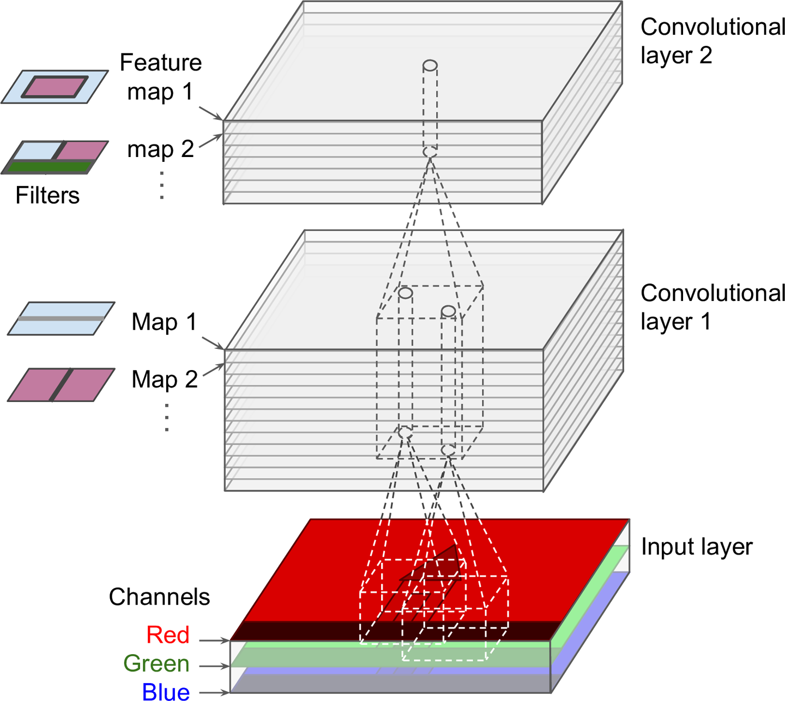

###### Figure 14-6. Convolutional layers with multiple feature maps, and images with three color channels

Specifically, a neuron located in row *i*, column *j* of the feature map
*k* in a given convolutional layer *l* is connected to the outputs of
the neurons in the previous layer *l* – 1, located in rows *i* ×
*s*~*h*~ to *i* × *s*~*h*~ + *f*~*h*~ – 1 and columns *j* × *s*~*w*~ to
*j* × *s*~*w*~ + *f*~*w*~ – 1, across all feature maps (in layer *l* –
*1*). Note that all neurons located in the same row *i* and column *j*
but in different feature maps are connected to the outputs of the exact
same neurons in the previous layer.

[Equation
14-1]
summarizes the preceding explanations in one big mathematical equation:
it shows how to compute the output of a given neuron in a convolutional
layer. It is a bit ugly due to all the different indices, but all it
does is calculate the weighted sum of all the inputs, plus the bias
term.

##### Equation 14-1. Computing the output of a neuron in a convolutional layer

zi,j,k=bk+∑u=0fh−1∑v=0fw−1∑k'=0fn′−1xi′,j′,k′×wu,v,k′,kwith{i'=i×sh+uj'=j×sw+vzi,j,k=bk+∑u=0fh-1∑v=0fw-1∑k'=0fn'-1xi',j',k'×wu,v,k',kwithi'=i×sh+uj'=j×sw+v

In this equation:

-   *z*~*i,\\ j,\\ k*~ is the output of the neuron located in row *i*,
    column *j* in feature map *k* of the convolutional layer (layer
    *l*).

-   As explained earlier, *s*~*h*~ and *s*~*w*~ are the vertical and
    horizontal strides, *f*~*h*~ and *f*~*w*~ are the height and width
    of the receptive field, and *f*~*n*′~ is the number of feature maps
    in the previous layer (layer *l* – 1).

-   *x*~*i*′,\\ *j*′,\\ *k*′~ is the output of the neuron located in
    layer *l* – 1, row *i*′, column *j*′, feature map *k*′ (or channel
    *k*′ if the previous layer is the input layer).

-   *b*~*k*~ is the bias term for feature map *k* (in layer *l*). You
    can think of it as a knob that tweaks the overall brightness of the
    feature map *k*.

-   *w*~*u*,\\ *v*,\\ *k*′\\ ,*k*~ is the connection weight between any
    neuron in feature map *k* of the layer *l* and its input located at
    row *u*, column *v* (relative to the neuron’s receptive field), and
    feature map *k*′.

TensorFlow Implementation
-------------------------

In TensorFlow, each input image is typically represented as a 3D tensor
of shape [*height, width, channels*]. A mini-batch is represented as a
4D tensor of shape [*mini-batch size, height, width, channels*]. The
weights of a convolutional layer are represented as a 4D tensor of shape
[*f*~*h*~, *f*~*w*~, *f*~*n*′~, *f*~*n*~]. The bias terms of a
convolutional layer are simply represented as a 1D tensor of shape
[*f*~*n*~].

Let’s look at a simple example. The following code loads two sample
images, using Scikit-Learn’s `load_sample_image()` (which loads two
color images, one of a Chinese temple, and the other of a flower), then
it creates two filters and applies them to both images, and finally it
displays one of the resulting feature maps. Note that you must pip
install the `Pillow` package to use `load_sample_image()`.

``` {data-type="programlisting" data-code-language="python"}
from sklearn.datasets import load_sample_image

# Load sample images
china = load_sample_image("china.jpg") / 255
flower = load_sample_image("flower.jpg") / 255
images = np.array([china, flower])
batch_size, height, width, channels = images.shape

# Create 2 filters
filters = np.zeros(shape=(7, 7, channels, 2), dtype=np.float32)
filters[:, 3, :, 0] = 1  # vertical line
filters[3, :, :, 1] = 1  # horizontal line

outputs = tf.nn.conv2d(images, filters, strides=1, padding="SAME")

plt.imshow(outputs[0, :, :, 1], cmap="gray") # plot 1st image's 2nd feature map
plt.show()
```

Let’s go through this code:

-   The pixel intensity for each color channel is represented as a byte
    from 0 to 255, so we scale these features simply by dividing by 255,
    to get floats ranging from 0 to 1.

-   Then we create two 7 × 7 filters (one with a vertical white line in
    the middle, and the other with a horizontal white line in the
    middle).

-   We apply them to both images using the `tf.nn.conv2d()` function,
    which is part of TensorFlow’s low-level Deep Learning API. In this
    example, we use zero padding (`padding="SAME"`) and a stride of 1.

-   Finally, we plot one of the resulting feature maps (similar to the
    top-right image in
    [Figure 14-5]

The `tf.nn.conv2d()` line deserves a bit more explanation:

-   `images` is the input mini-batch (a 4D tensor, as explained
    earlier).

-   `filters` is the set of filters to apply (also a 4D tensor, as
    explained earlier).

-   `strides` is equal to `1`, but it could also be a 1D array with four
    elements, where the two central elements are the vertical and
    horizontal strides (*s*~*h*~ and *s*~*w*~). The first and last
    elements must currently be equal to `1`. They may one day be used to
    specify a batch stride (to skip some instances) and a channel stride
    (to skip some of the previous layer’s feature maps or channels).

-   `padding` must be either `"SAME"` or `"VALID"`:

    -   If set to `"SAME"`, the convolutional layer uses zero padding if
        necessary. The output size is set to the number of input neurons
        divided by the stride, rounded up. For example, if the input
        size is 13 and the stride is 5 (see
        [Figure 14-7]
        then the output size is 3 (i.e., 13 / 5 = 2.6, rounded up to 3).
        Then zeros are added as evenly as possible around the inputs, as
        needed. When `strides=1`, the layer’s outputs will have the same
        spatial dimensions (width and height) as its inputs, hence the
        name *same*.

    -   If set to `"VALID"`, the convolutional layer does *not* use zero
        padding and may ignore some rows and columns at the bottom and
        right of the input image, depending on the stride, as shown in
        [Figure 14-7]
        (for simplicity, only the horizontal dimension is shown here,
        but of course the same logic applies to the vertical dimension).
        This means that every neuron’s receptive field lies strictly
        within valid positions inside the input (it does not go out of
        bounds), hence the name *valid*.

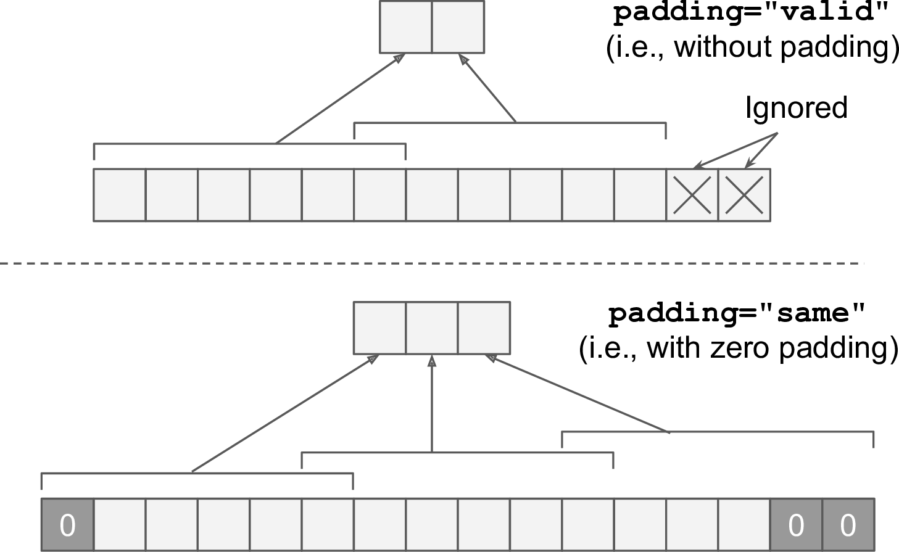

###### Figure 14-7. “SAME” or “VALID” padding (with input width 13, filter width 6, stride 5)

In this example we manually defined the filters, but in a real CNN you
would normally define filters as trainable variables so the neural net
can learn which filters work best, as explained earlier. Instead of
manually creating the variables, use the `keras.layers.Conv2D` layer:

``` {data-type="programlisting" data-code-language="python"}
conv = keras.layers.Conv2D(filters=32, kernel_size=3, strides=1,
                           padding="same", activation="relu")
```

This code creates a `Conv2D` layer with 32 filters, each 3 × 3, using a
stride of 1 (both horizontally and vertically) and `"same"` padding, and
applying the ReLU activation function to its outputs. As you can see,
convolutional layers have quite a few hyperparameters: you must choose
the number of filters, their height and width, the strides, and the
padding type. As always, you can use cross-validation to find the right
hyperparameter values, but this is very time-consuming. We will discuss
common CNN architectures later, to give you some idea of which
hyperparameter values work best in practice.

Memory Requirements
-------------------

Another problem with CNNs is that the convolutional layers require a
huge amount of RAM. This is especially true during training, because the
reverse pass of backpropagation requires all the intermediate values
computed during the forward pass.

For example, consider a convolutional layer with 5 × 5 filters,
outputting 200 feature maps of size 150 × 100, with stride 1 and
`"same"` padding. If the input is a 150 × 100 RGB image (three
channels), then the number of parameters is (5 × 5 × 3 + 1) × 200 =
15,200 (the + 1 corresponds to the bias terms), which is fairly small
compared to a fully connected
layer.
^[7]
However, each of the 200 feature maps contains 150 × 100 neurons, and
each of these neurons needs to compute a weighted sum of its 5 × 5 × 3 =
75 inputs: that’s a total of 225 million float multiplications. Not as
bad as a fully connected layer, but still quite computationally
intensive. Moreover, if the feature maps are represented using 32-bit
floats, then the convolutional layer’s output will occupy 200 × 150 ×
100 × 32 = 96 million bits (12 MB) of
RAM.
^[8]
And that’s just for one instance—if a training batch contains 100
instances, then this layer will use up 1.2 GB of RAM!

During inference (i.e., when making a prediction for a new instance) the
RAM occupied by one layer can be released as soon as the next layer has
been computed, so you only need as much RAM as required by two
consecutive layers. But during training everything computed during the
forward pass needs to be preserved for the reverse pass, so the amount
of RAM needed is (at least) the total amount of RAM required by all
layers.

###### Tip

If training crashes because of an out-of-memory error, you can try
reducing the mini-batch size. Alternatively, you can try reducing
dimensionality using a stride, or removing a few layers. Or you can try
using 16-bit floats instead of 32-bit floats. Or you could distribute
the CNN across multiple devices.

Now let’s look at the second common building block of CNNs: the *pooling
layer*.

Pooling Layers
==============

Once you understand how convolutional layers work, the pooling layers
are quite easy to grasp. Their goal is to *subsample* (i.e., shrink) the
input image in order to reduce the computational load, the memory usage,
and the number of parameters (thereby limiting the risk of overfitting).

Just like in convolutional layers, each neuron in a pooling layer is
connected to the outputs of a limited number of neurons in the previous
layer, located within a small rectangular receptive field. You must
define its size, the stride, and the padding type, just like before.
However, a pooling neuron has no weights; all it does is aggregate the
inputs using an aggregation function such as the max or mean.
[Figure 14-8]
shows a *max pooling layer*, which is the most common type of pooling
layer. In this example, we use a 2 × 2 *pooling
kernel*, ^[9]
with a stride of 2 and no padding. Only the max input value in each
receptive field makes it to the next layer, while the other inputs are
dropped. For example, in the lower-left receptive field in
[Figure 14-8]
the input values are 1, 5, 3, 2, so only the max value, 5, is propagated
to the next layer. Because of the stride of 2, the output image has half
the height and half the width of the input image (rounded down since we
use no padding).

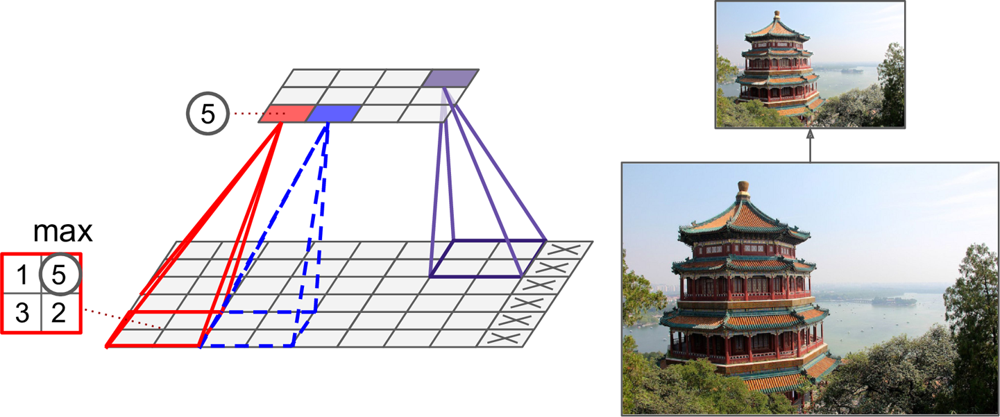

###### Figure 14-8. Max pooling layer (2 × 2 pooling kernel, stride 2, no padding)

###### Note

A pooling layer typically works on every input channel independently, so
the output depth is the same as the input depth.

Other than reducing computations, memory usage, and the number of
parameters, a max pooling layer also introduces some level of
*invariance* to small translations, as shown in
[Figure 14-9]
Here we assume that the bright pixels have a lower value than dark
pixels, and we consider three images (A, B, C) going through a max
pooling layer with a 2 × 2 kernel and stride 2. Images B and C are the
same as image A, but shifted by one and two pixels to the right. As you
can see, the outputs of the max pooling layer for images A and B are
identical. This is what translation invariance means. For image C, the
output is different: it is shifted one pixel to the right (but there is
still 50% invariance). By inserting a max pooling layer every few layers
in a CNN, it is possible to get some level of translation invariance at
a larger scale. Moreover, max pooling offers a small amount of
rotational invariance and a slight scale invariance. Such invariance
(even if it is limited) can be useful in cases where the prediction
should not depend on these details, such as in classification tasks.

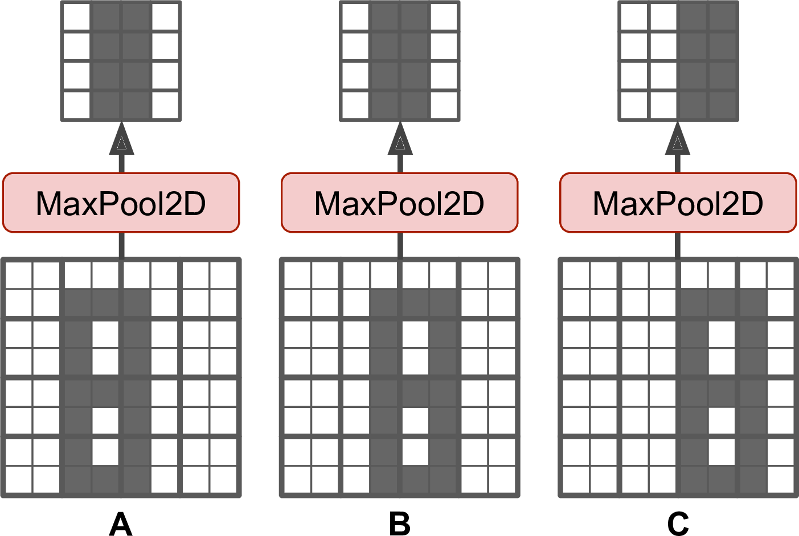

###### Figure 14-9. Invariance to small translations

However, max pooling has some downsides too. Firstly, it is obviously
very destructive: even with a tiny 2 × 2 kernel and a stride of 2, the
output will be two times smaller in both directions (so its area will be
four times smaller), simply dropping 75% of the input values. And in
some applications, invariance is not desirable. Take semantic
segmentation (the task of classifying each pixel in an image according
to the object that pixel belongs to, which we’ll explore later in this
lab): obviously, if the input image is translated by one pixel to
the right, the output should also be translated by one pixel to the
right. The goal in this case is *equivariance*, not invariance: a small
change to the inputs should lead to a corresponding small change in the
output.

TensorFlow Implementation
-------------------------

Implementing a max pooling layer in TensorFlow is quite easy. The
following code creates a max pooling layer using a 2 × 2 kernel. The
strides default to the kernel size, so this layer will use a stride of 2
(both horizontally and vertically). By default, it uses `"valid"`
padding (i.e., no padding at all):

``` {data-type="programlisting" data-code-language="python"}
max_pool = keras.layers.MaxPool2D(pool_size=2)
```

To create an *average pooling layer*, just use `AvgPool2D` instead of
`MaxPool2D`. As you might expect, it works exactly like a max pooling
layer, except it computes the mean rather than the max. Average pooling
layers used to be very popular, but people mostly use max pooling layers
now, as they generally perform better. This may seem surprising, since
computing the mean generally loses less information than computing the
max. But on the other hand, max pooling preserves only the strongest
features, getting rid of all the meaningless ones, so the next layers
get a cleaner signal to work with. Moreover, max pooling offers stronger
translation invariance than average pooling, and it requires slightly
less compute.

Note that max pooling and average pooling can be performed along the
depth dimension rather than the spatial dimensions, although this is not
as common. This can allow the CNN to learn to be invariant to various
features. For example, it could learn multiple filters, each detecting a
different rotation of the same pattern (such as hand-written digits; see
[Figure 14-10]
and the depthwise max pooling layer would ensure that the output is the
same regardless of the rotation. The CNN could similarly learn to be
invariant to anything else: thickness, brightness, skew, color, and so
on.

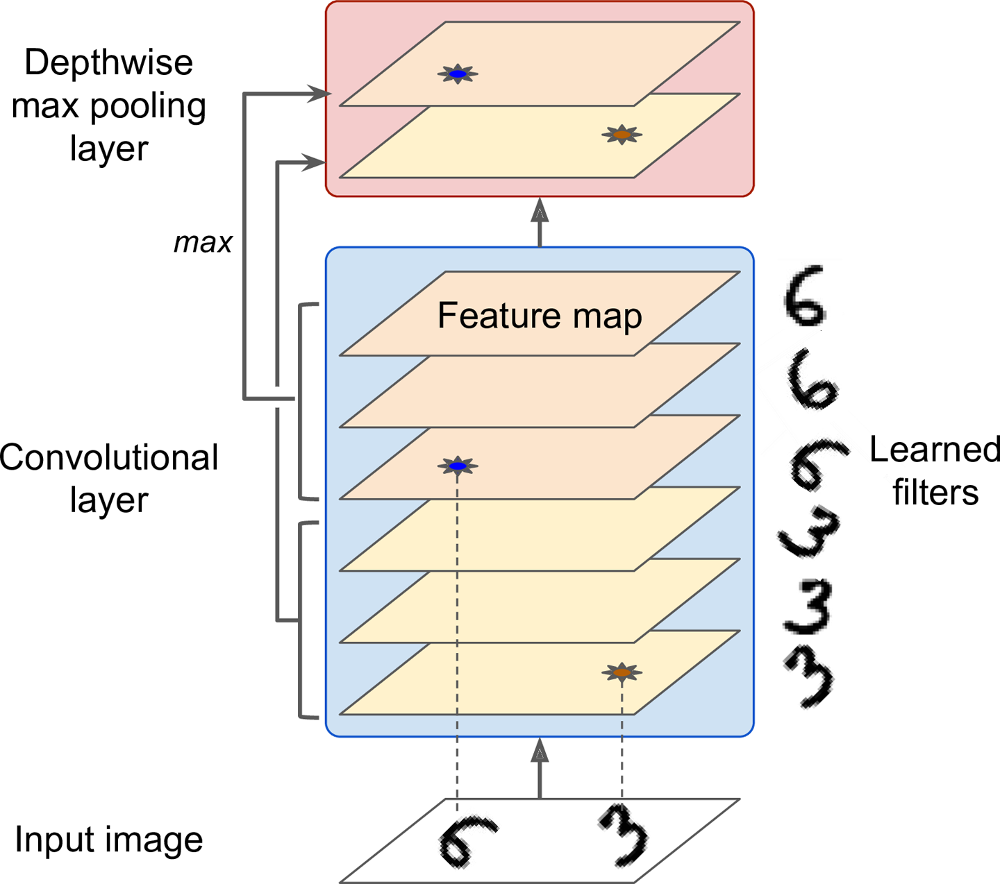

###### Figure 14-10. Depthwise max pooling can help the CNN learn any invariance

Keras does not include a depthwise max pooling layer, but TensorFlow’s
low-level Deep Learning API does: just use the `tf.nn.max_pool()`
function, and specify the kernel size and strides as 4-tuples (i.e.,
tuples of size 4). The first three values of each should be 1: this
indicates that the kernel size and stride along the batch, height, and
width dimensions should be 1. The last value should be whatever kernel
size and stride you want along the depth dimension—for example, 3 (this
must be a divisor of the input depth; it will not work if the previous
layer outputs 20 feature maps, since 20 is not a multiple of 3):

``` {data-type="programlisting" data-code-language="python"}
output = tf.nn.max_pool(images,
                        ksize=(1, 1, 1, 3),
                        strides=(1, 1, 1, 3),
                        padding="VALID")
```

If you want to include this as a layer in your Keras models, wrap it in
a `Lambda` layer (or create a custom Keras layer):

``` {data-type="programlisting" data-code-language="python"}
depth_pool = keras.layers.Lambda(
    lambda X: tf.nn.max_pool(X, ksize=(1, 1, 1, 3), strides=(1, 1, 1, 3),
                             padding="VALID"))
```

One last type of pooling layer that you will often see in modern
architectures is the *global average pooling layer*. It works very
differently: all it does is compute the mean of each entire feature map
(it’s like an average pooling layer using a pooling kernel with the same
spatial dimensions as the inputs). This means that it just outputs a
single number per feature map and per instance. Although this is of
course extremely destructive (most of the information in the feature map
is lost), it can be useful as the output layer, as we will see later in
this lab. To create such a layer, simply use the
`keras.layers.GlobalAvgPool2D` class:

``` {data-type="programlisting" data-code-language="python"}
global_avg_pool = keras.layers.GlobalAvgPool2D()
```

It’s equivalent to this simple `Lambda` layer, which computes the mean
over the spatial dimensions (height and width):

``` {data-type="programlisting" data-code-language="python"}
global_avg_pool = keras.layers.Lambda(lambda X: tf.reduce_mean(X, axis=[1, 2]))
```

Now you know all the building blocks to create convolutional neural
networks. Let’s see how to assemble them.

CNN Architectures
=================

Typical CNN architectures stack a few convolutional layers (each one
generally followed by a ReLU layer), then a pooling layer, then another
few convolutional layers (+ReLU), then another pooling layer, and so on.
The image gets smaller and smaller as it progresses through the network,
but it also typically gets deeper and deeper (i.e., with more feature
maps), thanks to the convolutional layers (see
[Figure 14-11]
At the top of the stack, a regular feedforward neural network is added,
composed of a few fully connected layers (+ReLUs), and the final layer
outputs the prediction (e.g., a softmax layer that outputs estimated
class probabilities).


###### Figure 14-11. Typical CNN architecture

###### Tip

A common mistake is to use convolution kernels that are too large. For
example, instead of using a convolutional layer with a 5 × 5 kernel,
stack two layers with 3 × 3 kernels: it will use fewer parameters and
require fewer computations, and it will usually perform better. One
exception is for the first convolutional layer: it can typically have a
large kernel (e.g., 5 × 5), usually with a stride of 2 or more: this
will reduce the spatial dimension of the image without losing too much
information, and since the input image only has three channels in
general, it will not be too costly.

Here is how you can implement a simple CNN to tackle the Fashion MNIST
dataset (introduced in
[Lab 10]

``` {data-type="programlisting" data-code-language="python"}
model = keras.models.Sequential([
    keras.layers.Conv2D(64, 7, activation="relu", padding="same",
                        input_shape=[28, 28, 1]),
    keras.layers.MaxPooling2D(2),
    keras.layers.Conv2D(128, 3, activation="relu", padding="same"),
    keras.layers.Conv2D(128, 3, activation="relu", padding="same"),
    keras.layers.MaxPooling2D(2),
    keras.layers.Conv2D(256, 3, activation="relu", padding="same"),
    keras.layers.Conv2D(256, 3, activation="relu", padding="same"),
    keras.layers.MaxPooling2D(2),
    keras.layers.Flatten(),
    keras.layers.Dense(128, activation="relu"),
    keras.layers.Dropout(0.5),
    keras.layers.Dense(64, activation="relu"),
    keras.layers.Dropout(0.5),
    keras.layers.Dense(10, activation="softmax")
])
```

Let’s go through this model:

-   The first layer uses 64 fairly large filters (7 × 7) but only stride
    1 because the input images are not very large. It also sets
    `input_shape=[28, 28, 1]`, because the images are 28 × 28 pixels,
    with a single color channel (i.e., grayscale).

-   Next we have a max pooling layer which uses a pool size of 2, so it
    divides each spatial dimension by a factor of 2.

-   Then we repeat the same structure twice: two convolutional layers
    followed by a max pooling layer. For larger images, we could repeat
    this structure several more times (the number of repetitions is a
    hyperparameter you can tune).

-   Note that the number of filters grows as we climb up the CNN toward
    the output layer (it is initially 64, then 128, then 256): it makes
    sense for it to grow, since the number of low-level features is
    often fairly low (e.g., small circles, horizontal lines), but there
    are many different ways to combine them into higher-level features.
    It is a common practice to double the number of filters after each
    pooling layer: since a pooling layer divides each spatial dimension
    by a factor of 2, we can afford to double the number of feature maps
    in the next layer without fear of exploding the number of
    parameters, memory usage, or computational load.

-   Next is the fully connected network, composed of two hidden dense
    layers and a dense output layer. Note that we must flatten its
    inputs, since a dense network expects a 1D array of features for
    each instance. We also add two dropout layers, with a dropout rate
    of 50% each, to reduce overfitting.

This CNN reaches over 92% accuracy on the test set. It’s not state of
the art, but it is pretty good, and clearly much better than what we
achieved with dense networks in
[Lab 10]

Over the years, variants of this fundamental architecture have been
developed, leading to amazing advances in the field. A good measure of
this progress is the error rate in competitions such as the ILSVRC
[ImageNet challenge](http://image-net.org/). In this competition the
top-five error rate for image classification fell from over 26% to less
than 2.3% in just six years. The top-five error rate is the number of
test images for which the system’s top five predictions did not include
the correct answer. The images are large (256 pixels high) and there are
1,000 classes, some of which are really subtle (try distinguishing 120
dog breeds). Looking at the evolution of the winning entries is a good
way to understand how CNNs work.

We will first look at the classical LeNet-5 architecture (1998), then
three of the winners of the ILSVRC challenge: AlexNet (2012), GoogLeNet
(2014), and ResNet (2015).

LeNet-5
-------

The [LeNet-5
architecture](https://homl.info/lenet5)^[10]
is perhaps the most widely known CNN architecture. As mentioned earlier,
it was created by Yann LeCun in 1998 and has been widely used for
handwritten digit recognition (MNIST). It is composed of the layers
shown in
[Table 14-1]

+------------+------------+------------+------------+------------+------------+------------+
| Layer      | Type       | Maps       | Size       | Kernel     | Stride     | Activation |
|            |            |            |            | size       |            |            |
+============+============+============+============+============+============+============+
| Out        | Fully      | –          | 10         | –          | –          | RBF        |
|            | connected  |            |            |            |            |            |
+------------+------------+------------+------------+------------+------------+------------+
| F6         | Fully      | –          | 84         | –          | –          | tanh       |
|            | connected  |            |            |            |            |            |
+------------+------------+------------+------------+------------+------------+------------+
| C5         | Convolutio | 120        | 1 × 1      | 5 × 5      | 1          | tanh       |
|            | n          |            |            |            |            |            |
+------------+------------+------------+------------+------------+------------+------------+
| S4         | Avg        | 16         | 5 × 5      | 2 × 2      | 2          | tanh       |
|            | pooling    |            |            |            |            |            |
+------------+------------+------------+------------+------------+------------+------------+
| C3         | Convolutio | 16         | 10 × 10    | 5 × 5      | 1          | tanh       |
|            | n          |            |            |            |            |            |
+------------+------------+------------+------------+------------+------------+------------+
| S2         | Avg        | 6          | 14 × 14    | 2 × 2      | 2          | tanh       |
|            | pooling    |            |            |            |            |            |
+------------+------------+------------+------------+------------+------------+------------+
| C1         | Convolutio | 6          | 28 × 28    | 5 × 5      | 1          | tanh       |
|            | n          |            |            |            |            |            |
+------------+------------+------------+------------+------------+------------+------------+
| In         | Input      | 1          | 32 × 32    | –          | –          | –          |
+------------+------------+------------+------------+------------+------------+------------+

: Table 14-1. LeNet-5 architecture

There are a few extra details to be noted:

-   MNIST images are 28 × 28 pixels, but they are zero-padded to 32 × 32
    pixels and normalized before being fed to the network. The rest of
    the network does not use any padding, which is why the size keeps
    shrinking as the image progresses through the network.

-   The average pooling layers are slightly more complex than usual:
    each neuron computes the mean of its inputs, then multiplies the
    result by a learnable coefficient (one per map) and adds a learnable
    bias term (again, one per map), then finally applies the activation
    function.

-   Most neurons in C3 maps are connected to neurons in only three or
    four S2 maps (instead of all six S2 maps). See table 1 (page 8) in
    the original
    paper^[10]
    for details.

-   The output layer is a bit special: instead of computing the matrix
    multiplication of the inputs and the weight vector, each neuron
    outputs the square of the Euclidian distance between its input
    vector and its weight vector. Each output measures how much the
    image belongs to a particular digit class. The cross-entropy cost
    function is now preferred, as it penalizes bad predictions much
    more, producing larger gradients and converging faster.

Yann LeCun’s [website](http://yann.lecun.com/exdb/lenet/index.html)
features great demos of LeNet-5 classifying digits.

AlexNet
-------

The [AlexNet CNN
architecture](https://homl.info/80)^[11]
won the 2012 ImageNet ILSVRC challenge by a large margin: it achieved a
top-five error rate of 17%, while the second best achieved only 26%! It
was developed by Alex Krizhevsky (hence the name), Ilya Sutskever, and
Geoffrey Hinton. It is similar to LeNet-5, only much larger and deeper,
and it was the first to stack convolutional layers directly on top of
one another, instead of stacking a pooling layer on top of each
convolutional layer.
[Table 14-2]
presents this architecture.

+-----------+-----------+-----------+-----------+-----------+-----------+-----------+-----------+
| Layer     | Type      | Maps      | Size      | Kernel    | Stride    | Padding   | Activatio |
|           |           |           |           | size      |           |           | n         |
+===========+===========+===========+===========+===========+===========+===========+===========+
| Out       | Fully     | –         | 1,000     | –         | –         | –         | Softmax   |
|           | connected |           |           |           |           |           |           |
+-----------+-----------+-----------+-----------+-----------+-----------+-----------+-----------+
| F10       | Fully     | –         | 4,096     | –         | –         | –         | ReLU      |
|           | connected |           |           |           |           |           |           |
+-----------+-----------+-----------+-----------+-----------+-----------+-----------+-----------+
| F9        | Fully     | –         | 4,096     | –         | –         | –         | ReLU      |
|           | connected |           |           |           |           |           |           |
+-----------+-----------+-----------+-----------+-----------+-----------+-----------+-----------+
| S8        | Max       | 256       | 6 × 6     | 3 × 3     | 2         | `valid`   | –         |
|           | pooling   |           |           |           |           |           |           |
+-----------+-----------+-----------+-----------+-----------+-----------+-----------+-----------+
| C7        | Convoluti | 256       | 13 × 13   | 3 × 3     | 1         | `same`    | ReLU      |
|           | on        |           |           |           |           |           |           |
+-----------+-----------+-----------+-----------+-----------+-----------+-----------+-----------+
| C6        | Convoluti | 384       | 13 × 13   | 3 × 3     | 1         | `same`    | ReLU      |
|           | on        |           |           |           |           |           |           |
+-----------+-----------+-----------+-----------+-----------+-----------+-----------+-----------+
| C5        | Convoluti | 384       | 13 × 13   | 3 × 3     | 1         | `same`    | ReLU      |
|           | on        |           |           |           |           |           |           |
+-----------+-----------+-----------+-----------+-----------+-----------+-----------+-----------+
| S4        | Max       | 256       | 13 × 13   | 3 × 3     | 2         | `valid`   | –         |
|           | pooling   |           |           |           |           |           |           |
+-----------+-----------+-----------+-----------+-----------+-----------+-----------+-----------+
| C3        | Convoluti | 256       | 27 × 27   | 5 × 5     | 1         | `same`    | ReLU      |
|           | on        |           |           |           |           |           |           |
+-----------+-----------+-----------+-----------+-----------+-----------+-----------+-----------+
| S2        | Max       | 96        | 27 × 27   | 3 × 3     | 2         | `valid`   | –         |
|           | pooling   |           |           |           |           |           |           |
+-----------+-----------+-----------+-----------+-----------+-----------+-----------+-----------+
| C1        | Convoluti | 96        | 55 × 55   | 11 × 11   | 4         | `valid`   | ReLU      |
|           | on        |           |           |           |           |           |           |
+-----------+-----------+-----------+-----------+-----------+-----------+-----------+-----------+
| In        | Input     | 3 (RGB)   | 227 × 227 | –         | –         | –         | –         |
+-----------+-----------+-----------+-----------+-----------+-----------+-----------+-----------+

: Table 14-2. AlexNet architecture

To reduce overfitting, the authors used two regularization techniques.
First, they applied dropout (introduced in
[Lab 11]
with a 50% dropout rate during training to the outputs of layers F9 and
F10. Second, they performed *data augmentation* by randomly shifting the
training images by various offsets, flipping them horizontally, and
changing the lighting conditions.

##### Data Augmentation

Data augmentation artificially increases the size of the training set by
generating many realistic variants of each training instance. This
reduces overfitting, making this a regularization technique. The
generated instances should be as realistic as possible: ideally, given
an image from the augmented training set, a human should not be able to
tell whether it was augmented or not. Simply adding white noise will not
help; the modifications should be learnable (white noise is not).

For example, you can slightly shift, rotate, and resize every picture in
the training set by various amounts and add the resulting pictures to
the training set (see
[Figure 14-12]
This forces the model to be more tolerant to variations in the position,
orientation, and size of the objects in the pictures. For a model that’s
more tolerant of different lighting conditions, you can similarly
generate many images with various contrasts. In general, you can also
flip the pictures horizontally (except for text, and other asymmetrical
objects). By combining these transformations, you can greatly increase
the size of your training set.


###### Figure 14-12. Generating new training instances from existing ones

AlexNet also uses a competitive normalization step immediately after the
ReLU step of layers C1 and C3, called *local response normalization*
(LRN): the most strongly activated neurons inhibit other neurons located
at the same position in neighboring feature maps (such competitive
activation has been observed in biological neurons). This encourages
different feature maps to specialize, pushing them apart and forcing
them to explore a wider range of features, ultimately improving
generalization. [Equation
14-2]
shows how to apply LRN.

##### Equation 14-2. Local response normalization (LRN)

bi=ai(k+α∑j=jlowjhighaj2)−βwith⎧⎩⎨⎪⎪jhigh=min(i+r2,fn−1)jlow=max(0,i−r2)bi=aik+α∑j=jlowjhighaj2-βwithjhigh=mini+r2,fn-1jlow=max0,i-r2

In this equation:

-   *b*~*i*~ is the normalized output of the neuron located in feature
    map *i*, at some row *u* and column *v* (note that in this equation
    we consider only neurons located at this row and column, so *u* and
    *v* are not shown).

-   *a*~*i*~ is the activation of that neuron after the ReLU step, but
    before normalization.

-   *k*, *α*, *β*, and *r* are hyperparameters. *k* is called the
    *bias*, and *r* is called the *depth radius*.

-   *f*~*n*~ is the number of feature maps.

For example, if *r* = 2 and a neuron has a strong activation, it will
inhibit the activation of the neurons located in the feature maps
immediately above and below its own.

In AlexNet, the hyperparameters are set as follows: *r* = 2, *α* =
0.00002, *β* = 0.75, and *k* = 1. This step can be implemented using the
`tf.nn.local_response_normalization()` function (which you can wrap in a
`Lambda` layer if you want to use it in a Keras model).

A variant of AlexNet called [*ZF
Net*](https://homl.info/zfnet)^[12]
was developed by Matthew Zeiler and Rob Fergus and won the 2013 ILSVRC
challenge. It is essentially AlexNet with a few tweaked hyperparameters
(number of feature maps, kernel size, stride, etc.).

GoogLeNet
---------

The [GoogLeNet architecture](https://homl.info/81) was developed by
Christian Szegedy et al. from Google
Research, ^[13]
and it won the ILSVRC 2014 challenge by pushing the top-five error rate
below 7%. This great performance came in large part from the fact that
the network was much deeper than previous CNNs (as you’ll see in
[Figure 14-14]
This was made possible by subnetworks called *inception
modules*, ^[14]
which allow GoogLeNet to use parameters much more efficiently than
previous architectures: GoogLeNet actually has 10 times fewer parameters
than AlexNet (roughly 6 million instead of 60 million).

[Figure 14-13]
shows the architecture of an inception module. The notation “3 × 3 +
1(S)” means that the layer uses a 3 × 3 kernel, stride 1, and `"same"`
padding. The input signal is first copied and fed to four different
layers. All convolutional layers use the ReLU activation function. Note
that the second set of convolutional layers uses different kernel sizes
(1 × 1, 3 × 3, and 5 × 5), allowing them to capture patterns at
different scales. Also note that every single layer uses a stride of 1
and `"same"` padding (even the max pooling layer), so their outputs all
have the same height and width as their inputs. This makes it possible
to concatenate all the outputs along the depth dimension in the final
*depth concatenation layer* (i.e., stack the feature maps from all four
top convolutional layers). This concatenation layer can be implemented
in TensorFlow using the `tf.concat()` operation, with `axis=3` (the axis
is the depth).

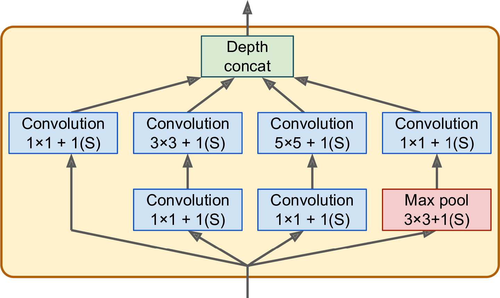

###### Figure 14-13. Inception module

You may wonder why inception modules have convolutional layers with 1 ×
1 kernels. Surely these layers cannot capture any features because they
look at only one pixel at a time? In fact, the layers serve three
purposes:

-   Although they cannot capture spatial patterns, they can capture
    patterns along the depth dimension.

-   They are configured to output fewer feature maps than their inputs,
    so they serve as *bottleneck layers*, meaning they reduce
    dimensionality. This cuts the computational cost and the number of
    parameters, speeding up training and improving generalization.

-   Each pair of convolutional layers ([1 × 1, 3 × 3] and [1 × 1, 5 ×
    5]) acts like a single powerful convolutional layer, capable of
    capturing more complex patterns. Indeed, instead of sweeping a
    simple linear classifier across the image (as a single convolutional
    layer does), this pair of convolutional layers sweeps a two-layer
    neural network across the image.

In short, you can think of the whole inception module as a convolutional
layer on steroids, able to output feature maps that capture complex
patterns at various scales.

###### Warning

The number of convolutional kernels for each convolutional layer is a
hyperparameter. Unfortunately, this means that you have six more
hyperparameters to tweak for every inception layer you add.

Now let’s look at the architecture of the GoogLeNet CNN (see
[Figure 14-14]
The number of feature maps output by each convolutional layer and each
pooling layer is shown before the kernel size. The architecture is so
deep that it has to be represented in three columns, but GoogLeNet is
actually one tall stack, including nine inception modules (the boxes
with the spinning tops). The six numbers in the inception modules
represent the number of feature maps output by each convolutional layer
in the module (in the same order as in
[Figure 14-13]
Note that all the convolutional layers use the ReLU activation function.


###### Figure 14-14. GoogLeNet architecture

Let’s go through this network:

-   The first two layers divide the image’s height and width by 4 (so
    its area is divided by 16), to reduce the computational load. The
    first layer uses a large kernel size so that much of the information
    is preserved.

-   Then the local response normalization layer ensures that the
    previous layers learn a wide variety of features (as discussed
    earlier).

-   Two convolutional layers follow, where the first acts like a
    bottleneck layer. As explained earlier, you can think of this pair
    as a single smarter convolutional layer.

-   Again, a local response normalization layer ensures that the
    previous layers capture a wide variety of patterns.

-   Next, a max pooling layer reduces the image height and width by 2,
    again to speed up computations.

-   Then comes the tall stack of nine inception modules, interleaved
    with a couple max pooling layers to reduce dimensionality and speed
    up the net.

-   Next, the global average pooling layer outputs the mean of each
    feature map: this drops any remaining spatial information, which is
    fine because there was not much spatial information left at that
    point. Indeed, GoogLeNet input images are typically expected to be
    224 × 224 pixels, so after 5 max pooling layers, each dividing the
    height and width by 2, the feature maps are down to 7 × 7. Moreover,
    it is a classification task, not localization, so it does not matter
    where the object is. Thanks to the dimensionality reduction brought
    by this layer, there is no need to have several fully connected
    layers at the top of the CNN (like in AlexNet), and this
    considerably reduces the number of parameters in the network and
    limits the risk of overfitting.

-   The last layers are self-explanatory: dropout for regularization,
    then a fully connected layer with 1,000 units (since there are 1,000
    classes) and a softmax activation function to output estimated class
    probabilities.

This diagram is slightly simplified: the original GoogLeNet architecture
also included two auxiliary classifiers plugged on top of the third and
sixth inception modules. They were both composed of one average pooling
layer, one convolutional layer, two fully connected layers, and a
softmax activation layer. During training, their loss (scaled down by
70%) was added to the overall loss. The goal was to fight the vanishing
gradients problem and regularize the network. However, it was later
shown that their effect was relatively minor.

Several variants of the GoogLeNet architecture were later proposed by
Google researchers, including Inception-v3 and Inception-v4, using
slightly different inception modules and reaching even better
performance.

VGGNet
------

The runner-up in the ILSVRC 2014 challenge was
[VGGNet](https://homl.info/83), ^[15]
developed by Karen Simonyan and Andrew Zisserman from the Visual
Geometry Group (VGG) research lab at Oxford University. It had a very
simple and classical architecture, with 2 or 3 convolutional layers and
a pooling layer, then again 2 or 3 convolutional layers and a pooling
layer, and so on (reaching a total of just 16 or 19 convolutional
layers, depending on the VGG variant), plus a final dense network with 2
hidden layers and the output layer. It used only 3 × 3 filters, but many
filters.

ResNet
------

Kaiming He et al. won the ILSVRC 2015 challenge using a [*Residual
Network* (or
*ResNet*)](https://homl.info/82), ^[16]
that delivered an astounding top-five error rate under 3.6%. The winning
variant used an extremely deep CNN composed of 152 layers (other
variants had 34, 50, and 101 layers). It confirmed the general trend:
models are getting deeper and deeper, with fewer and fewer parameters.
The key to being able to train such a deep network is to use *skip
connections* (also called *shortcut connections*): the signal feeding
into a layer is also added to the output of a layer located a bit higher
up the stack. Let’s see why this is useful.

When training a neural network, the goal is to make it model a target
function *h*(**x**). If you add the input **x** to the output of the
network (i.e., you add a skip connection), then the network will be
forced to model *f*(**x**) = *h*(**x**) – **x** rather than *h*(**x**).
This is called *residual learning* (see
[Figure 14-15]

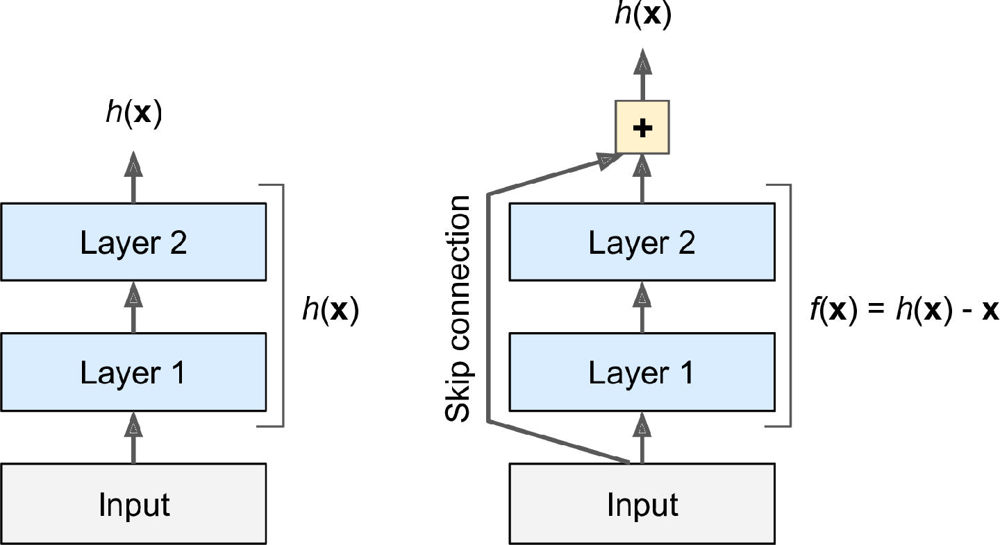

###### Figure 14-15. Residual learning

When you initialize a regular neural network, its weights are close to
zero, so the network just outputs values close to zero. If you add a
skip connection, the resulting network just outputs a copy of its
inputs; in other words, it initially models the identity function. If
the target function is fairly close to the identity function (which is
often the case), this will speed up training considerably.

Moreover, if you add many skip connections, the network can start making
progress even if several layers have not started learning yet (see
[Figure 14-16]
Thanks to skip connections, the signal can easily make its way across
the whole network. The deep residual network can be seen as a stack of
*residual units* (RUs), where each residual unit is a small neural
network with a skip connection.

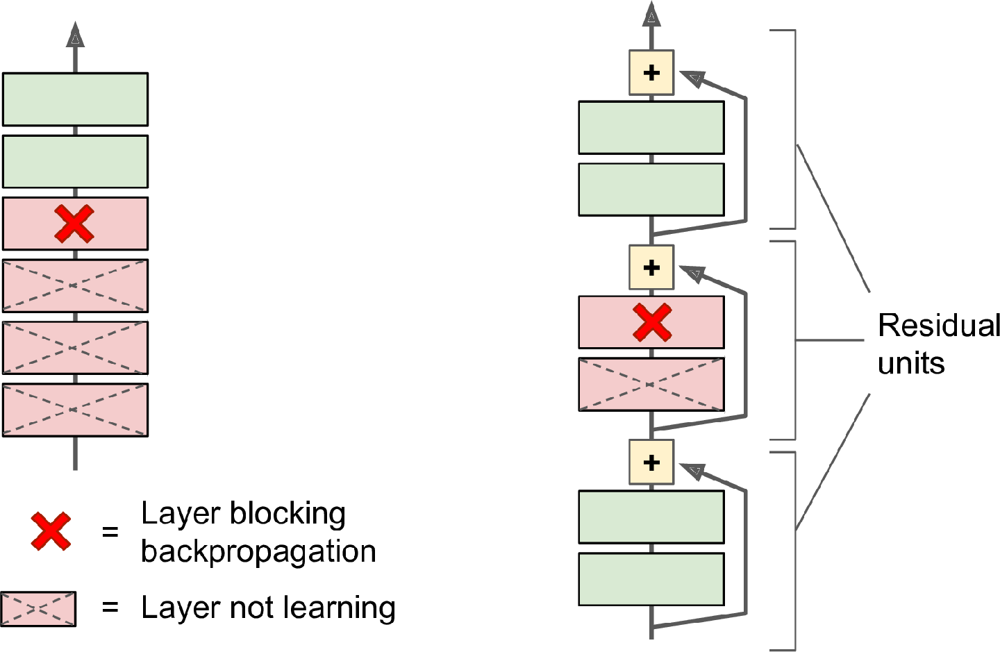

###### Figure 14-16. Regular deep neural network (left) and deep residual network (right)

Now let’s look at ResNet’s architecture (see
[Figure 14-17]
It is surprisingly simple. It starts and ends exactly like GoogLeNet
(except without a dropout layer), and in between is just a very deep
stack of simple residual units. Each residual unit is composed of two
convolutional layers (and no pooling layer!), with Batch Normalization
(BN) and ReLU activation, using 3 × 3 kernels and preserving spatial
dimensions (stride 1, `"same"` padding).

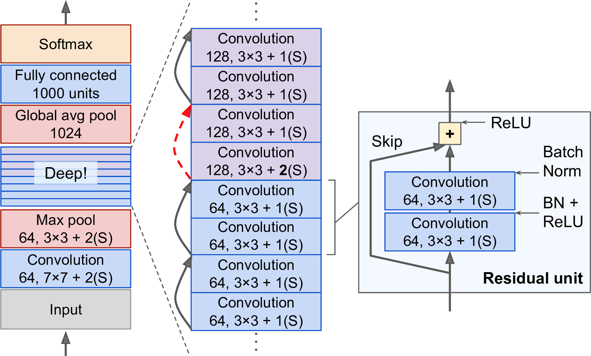

###### Figure 14-17. ResNet architecture

Note that the number of feature maps is doubled every few residual
units, at the same time as their height and width are halved (using a
convolutional layer with stride 2). When this happens, the inputs cannot
be added directly to the outputs of the residual unit because they don’t
have the same shape (for example, this problem affects the skip
connection represented by the dashed arrow in
[Figure 14-17]
To solve this problem, the inputs are passed through a 1 × 1
convolutional layer with stride 2 and the right number of output feature
maps (see
[Figure 14-18]

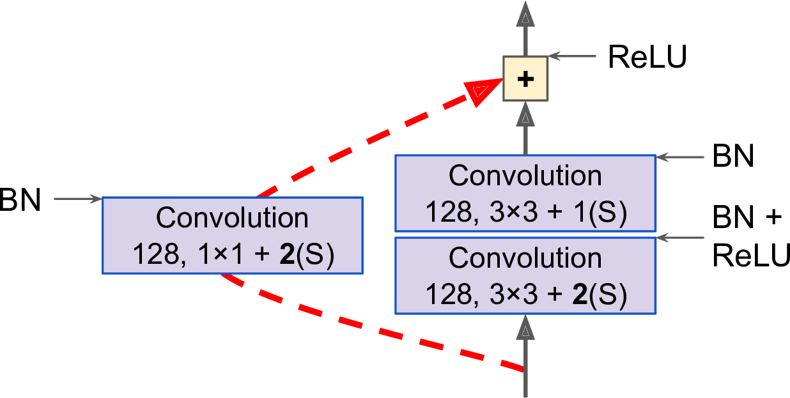

###### Figure 14-18. Skip connection when changing feature map size and depth

ResNet-34 is the ResNet with 34 layers (only counting the convolutional
layers and the fully connected
layer)^[17]
containing 3 residual units that output 64 feature maps, 4 RUs with 128
maps, 6 RUs with 256 maps, and 3 RUs with 512 maps. We will implement
this architecture later in this lab.

ResNets deeper than that, such as ResNet-152, use slightly different
residual units. Instead of two 3 × 3 convolutional layers with, say, 256
feature maps, they use three convolutional layers: first a 1 × 1
convolutional layer with just 64 feature maps (4 times less), which acts
as a bottleneck layer (as discussed already), then a 3 × 3 layer with 64
feature maps, and finally another 1 × 1 convolutional layer with 256
feature maps (4 times 64) that restores the original depth. ResNet-152
contains 3 such RUs that output 256 maps, then 8 RUs with 512 maps, a
whopping 36 RUs with 1,024 maps, and finally 3 RUs with 2,048 maps.

###### Note

Google’s
[Inception-v4](https://homl.info/84)^[18]
architecture merged the ideas of GoogLeNet and ResNet and achieved a
top-five error rate of close to 3% on ImageNet classification.

Xception
--------

Another variant of the GoogLeNet architecture is worth noting:
[Xception](https://homl.info/xception)^[19]
(which stands for *Extreme Inception*) was proposed in 2016 by François
Chollet (the author of Keras), and it significantly outperformed
Inception-v3 on a huge vision task (350 million images and 17,000
classes). Just like Inception-v4, it merges the ideas of GoogLeNet and
ResNet, but it replaces the inception modules with a special type of
layer called a *depthwise separable convolution layer* (or *separable
convolution layer* for
short^[20]
These layers had been used before in some CNN architectures, but they
were not as central as in the Xception architecture. While a regular
convolutional layer uses filters that try to simultaneously capture
spatial patterns (e.g., an oval) and cross-channel patterns (e.g., mouth
+ nose + eyes = face), a separable convolutional layer makes the strong
assumption that spatial patterns and cross-channel patterns can be
modeled separately (see
[Figure 14-19]
Thus, it is composed of two parts: the first part applies a single
spatial filter for each input feature map, then the second part looks
exclusively for cross-channel patterns—it is just a regular
convolutional layer with 1 × 1 filters.

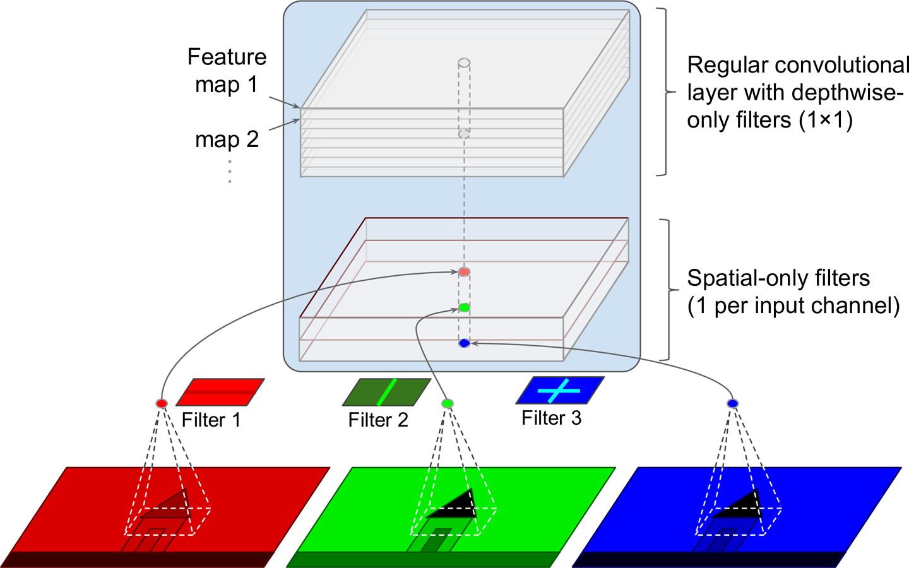

###### Figure 14-19. Depthwise separable convolutional layer

Since separable convolutional layers only have one spatial filter per
input channel, you should avoid using them after layers that have too
few channels, such as the input layer (granted, that’s what
[Figure 14-19]
represents, but it is just for illustration purposes). For this reason,
the Xception architecture starts with 2 regular convolutional layers,
but then the rest of the architecture uses only separable convolutions
(34 in all), plus a few max pooling layers and the usual final layers (a
global average pooling layer and a dense output layer).

You might wonder why Xception is considered a variant of GoogLeNet,
since it contains no inception module at all. Well, as we discussed
earlier, an inception module contains convolutional layers with 1 × 1
filters: these look exclusively for cross-channel patterns. However, the
convolutional layers that sit on top of them are regular convolutional
layers that look both for spatial and cross-channel patterns. So you can
think of an inception module as an intermediate between a regular
convolutional layer (which considers spatial patterns and cross-channel
patterns jointly) and a separable convolutional layer (which considers
them separately). In practice, it seems that separable convolutional
layers generally perform better.

###### Tip

Separable convolutional layers use fewer parameters, less memory, and
fewer computations than regular convolutional layers, and in general
they even perform better, so you should consider using them by default
(except after layers with few channels).

The ILSVRC 2016 challenge was won by the CUImage team from the Chinese
University of Hong Kong. They used an ensemble of many different
techniques, including a sophisticated object-detection system called
[GBD-Net](https://homl.info/gbdnet), ^[21]
to achieve a top-five error rate below 3%. Although this result is
unquestionably impressive, the complexity of the solution contrasted
with the simplicity of ResNets. Moreover, one year later another fairly
simple architecture performed even better, as we will see now.

SENet
-----

The winning architecture in the ILSVRC 2017 challenge was the
[Squeeze-and-Excitation Network
(SENet)](https://homl.info/senet).
^[22]
This architecture extends existing architectures such as inception
networks and ResNets, and boosts their performance. This allowed SENet
to win the competition with an astonishing 2.25% top-five error rate!
The extended versions of inception networks and ResNets are called
*SE-Inception* and *SE-ResNet*, respectively. The boost comes from the
fact that a SENet adds a small neural network, called an *SE block*, to
every unit in the original architecture (i.e., every inception module or
every residual unit), as shown in
[Figure 14-20]

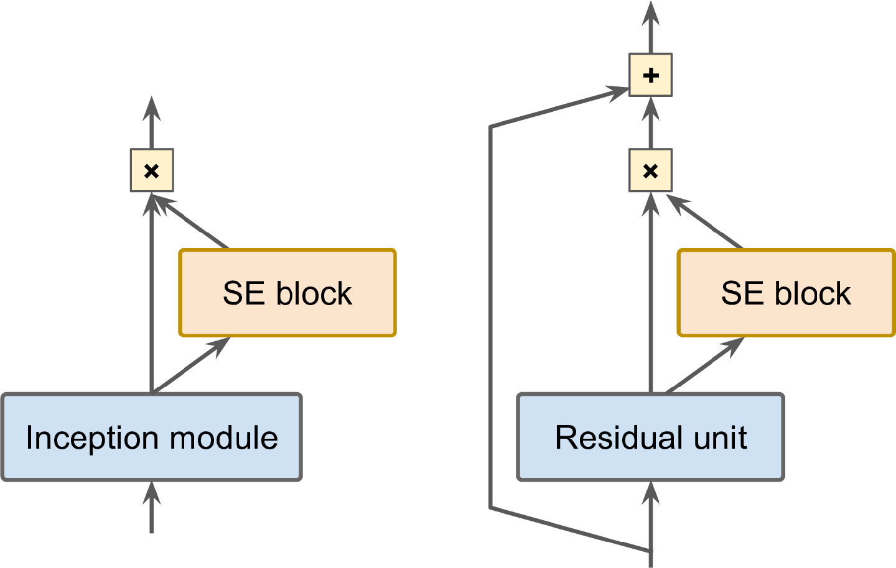

###### Figure 14-20. SE-Inception module (left) and SE-ResNet unit (right)

An SE block analyzes the output of the unit it is attached to, focusing
exclusively on the depth dimension (it does not look for any spatial
pattern), and it learns which features are usually most active together.
It then uses this information to recalibrate the feature maps, as shown
in
[Figure 14-21]
For example, an SE block may learn that mouths, noses, and eyes usually
appear together in pictures: if you see a mouth and a nose, you should
expect to see eyes as well. So if the block sees a strong activation in
the mouth and nose feature maps, but only mild activation in the eye
feature map, it will boost the eye feature map (more accurately, it will
reduce irrelevant feature maps). If the eyes were somewhat confused with
something else, this feature map recalibration will help resolve the
ambiguity.

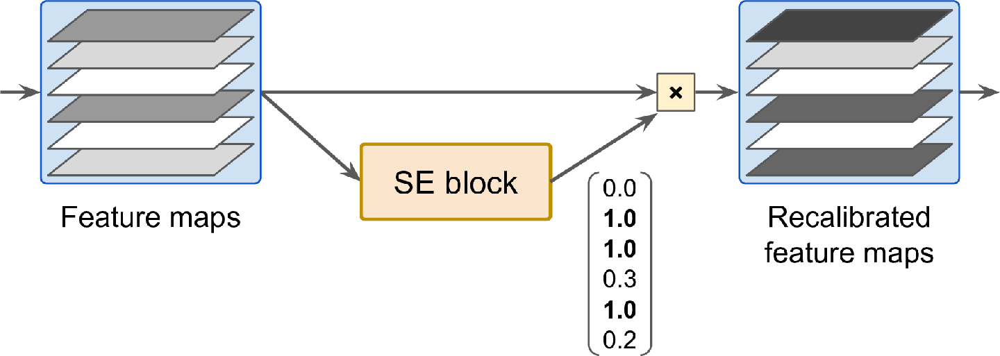

###### Figure 14-21. An SE block performs feature map recalibration

An SE block is composed of just three layers: a global average pooling
layer, a hidden dense layer using the ReLU activation function, and a
dense output layer using the sigmoid activation function (see
[Figure 14-22]


###### Figure 14-22. SE block architecture

As earlier, the global average pooling layer computes the mean
activation for each feature map: for example, if its input contains 256
feature maps, it will output 256 numbers representing the overall level
of response for each filter. The next layer is where the “squeeze”
happens: this layer has significantly fewer than 256 neurons—typically
16 times fewer than the number of feature maps (e.g., 16 neurons)—so the
256 numbers get compressed into a small vector (e.g., 16 dimensions).
This is a low-dimensional vector representation (i.e., an embedding) of
the distribution of feature responses. This bottleneck step forces the
SE block to learn a general representation of the feature combinations
(we will see this principle in action again when we discuss autoencoders
in
[Lab 17]
Finally, the output layer takes the embedding and outputs a
recalibration vector containing one number per feature map (e.g., 256),
each between 0 and 1. The feature maps are then multiplied by this
recalibration vector, so irrelevant features (with a low recalibration
score) get scaled down while relevant features (with a recalibration
score close to 1) are left alone.

Implementing a ResNet-34 CNN Using Keras
========================================

Most CNN architectures described so far are fairly straightforward to
implement (although generally you would load a pretrained network
instead, as we will see). To illustrate the process, let’s implement a
ResNet-34 from scratch using Keras. First, let’s create a `ResidualUnit`
layer:

``` {data-type="programlisting" data-code-language="python"}
class ResidualUnit(keras.layers.Layer):
    def __init__(self, filters, strides=1, activation="relu", **kwargs):
        super().__init__(**kwargs)
        self.activation = keras.activations.get(activation)
        self.main_layers = [
            keras.layers.Conv2D(filters, 3, strides=strides,
                                padding="same", use_bias=False),
            keras.layers.BatchNormalization(),
            self.activation,
            keras.layers.Conv2D(filters, 3, strides=1,
                                padding="same", use_bias=False),
            keras.layers.BatchNormalization()]
        self.skip_layers = []
        if strides > 1:
            self.skip_layers = [
                keras.layers.Conv2D(filters, 1, strides=strides,
                                    padding="same", use_bias=False),
                keras.layers.BatchNormalization()]

    def call(self, inputs):
        Z = inputs
        for layer in self.main_layers:
            Z = layer(Z)
        skip_Z = inputs
        for layer in self.skip_layers:
            skip_Z = layer(skip_Z)
        return self.activation(Z + skip_Z)
```

As you can see, this code matches
[Figure 14-18]
pretty closely. In the constructor, we create all the layers we will
need: the main layers are the ones on the right side of the diagram, and
the skip layers are the ones on the left (only needed if the stride is
greater than 1). Then in the `call()` method, we make the inputs go
through the main layers and the skip layers (if any), then we add both
outputs and apply the activation function.

Next, we can build the ResNet-34 using a `Sequential` model, since it’s
really just a long sequence of layers (we can treat each residual unit
as a single layer now that we have the `ResidualUnit` class):

``` {data-type="programlisting" data-code-language="python"}
model = keras.models.Sequential()
model.add(keras.layers.Conv2D(64, 7, strides=2, input_shape=[224, 224, 3],
                              padding="same", use_bias=False))
model.add(keras.layers.BatchNormalization())
model.add(keras.layers.Activation("relu"))
model.add(keras.layers.MaxPool2D(pool_size=3, strides=2, padding="same"))
prev_filters = 64
for filters in [64] * 3 + [128] * 4 + [256] * 6 + [512] * 3:
    strides = 1 if filters == prev_filters else 2
    model.add(ResidualUnit(filters, strides=strides))
    prev_filters = filters
model.add(keras.layers.GlobalAvgPool2D())
model.add(keras.layers.Flatten())
model.add(keras.layers.Dense(10, activation="softmax"))
```

The only slightly tricky part in this code is the loop that adds the
`ResidualUnit` layers to the model: as explained earlier, the first 3
RUs have 64 filters, then the next 4 RUs have 128 filters, and so on. We
then set the stride to 1 when the number of filters is the same as in
the previous RU, or else we set it to 2. Then we add the `ResidualUnit`,
and finally we update `prev_filters`.

It is amazing that in fewer than 40 lines of code, we can build the
model that won the ILSVRC 2015 challenge! This demonstrates both the
elegance of the ResNet model and the expressiveness of the Keras API.
Implementing the other CNN architectures is not much harder. However,
Keras comes with several of these architectures built in, so why not use
them instead?

Using Pretrained Models from Keras
==================================

In general, you won’t have to implement standard models like GoogLeNet
or ResNet manually, since pretrained networks are readily available with
a single line of code in the `keras.applications` package. For example,
you can load the ResNet-50 model, pretrained on ImageNet, with the
following line of code:

``` {data-type="programlisting" data-code-language="python"}
model = keras.applications.resnet50.ResNet50(weights="imagenet")
```

That’s all! This will create a ResNet-50 model and download weights
pretrained on the ImageNet dataset. To use it, you first need to ensure
that the images have the right size. A ResNet-50 model expects 224 ×
224-pixel images (other models may expect other sizes, such as 299 ×
299), so let’s use TensorFlow’s `tf.image.resize()` function to resize
the images we loaded earlier:

``` {data-type="programlisting" data-code-language="python"}
images_resized = tf.image.resize(images, [224, 224])
```

###### Tip

The `tf.image.resize()` will not preserve the aspect ratio. If this is a
problem, try cropping the images to the appropriate aspect ratio before
resizing. Both operations can be done in one shot with
`tf.image.crop_and_resize()`.

The pretrained models assume that the images are preprocessed in a
specific way. In some cases they may expect the inputs to be scaled from
0 to 1, or –1 to 1, and so on. Each model provides a
`preprocess_input()` function that you can use to preprocess your
images. These functions assume that the pixel values range from 0 to
255, so we must multiply them by 255 (since earlier we scaled them to
the 0–1 range):

``` {data-type="programlisting" data-code-language="python"}
inputs = keras.applications.resnet50.preprocess_input(images_resized * 255)
```

Now we can use the pretrained model to make predictions:

``` {data-type="programlisting" data-code-language="python"}
Y_proba = model.predict(inputs)
```

As usual, the output `Y_proba` is a matrix with one row per image and
one column per class (in this case, there are 1,000 classes). If you
want to display the top *K* predictions, including the class name and
the estimated probability of each predicted class, use the
`decode_predictions()` function. For each image, it returns an array
containing the top *K* predictions, where each prediction is represented
as an array containing the class
identifier, ^[23]
its name, and the corresponding confidence score:

``` {data-type="programlisting" data-code-language="python"}
top_K = keras.applications.resnet50.decode_predictions(Y_proba, top=3)
for image_index in range(len(images)):
    print("Image #{}".format(image_index))
    for class_id, name, y_proba in top_K[image_index]:
        print("  {} - {:12s} {:.2f}%".format(class_id, name, y_proba * 100))
    print()
```

The output looks like this:

``` {data-type="programlisting"}
Image #0
  n03877845 - palace       42.87%
  n02825657 - bell_cote    40.57%
  n03781244 - monastery    14.56%

Image #1
  n04522168 - vase         46.83%
  n07930864 - cup          7.78%
  n11939491 - daisy        4.87%
```

The correct classes (monastery and daisy) appear in the top three
results for both images. That’s pretty good, considering that the model
had to choose from among 1,000 classes.

As you can see, it is very easy to create a pretty good image classifier
using a pretrained model. Other vision models are available in
`keras.applications`, including several ResNet variants, GoogLeNet
variants like Inception-v3 and Xception, VGGNet variants, and MobileNet
and MobileNetV2 (lightweight models for use in mobile applications).

But what if you want to use an image classifier for classes of images
that are not part of ImageNet? In that case, you may still benefit from
the pretrained models to perform transfer learning.

Pretrained Models for Transfer Learning
=======================================

If you want to build an image classifier but you do not have enough
training data, then it is often a good idea to reuse the lower layers of
a pretrained model, as we discussed in
[Lab 11]
For example, let’s train a model to classify pictures of flowers,
reusing a pretrained Xception model. First, let’s load the dataset using
TensorFlow Datasets (see
[Lab 13]

``` {data-type="programlisting" data-code-language="python"}
import tensorflow_datasets as tfds

dataset, info = tfds.load("tf_flowers", as_supervised=True, with_info=True)
dataset_size = info.splits["train"].num_examples # 3670
class_names = info.features["label"].names # ["dandelion", "daisy", ...]
n_classes = info.features["label"].num_classes # 5
```

Note that you can get information about the dataset by setting
`with_info=True`. Here, we get the dataset size and the names of the
classes. Unfortunately, there is only a `"train"` dataset, no test set
or validation set, so we need to split the training set. The TF Datasets
project provides an API for this. For example, let’s take the first 10%
of the dataset for testing, the next 15% for validation, and the
remaining 75% for training:

``` {data-type="programlisting" data-code-language="python"}
test_split, valid_split, train_split = tfds.Split.TRAIN.subsplit([10, 15, 75])

test_set = tfds.load("tf_flowers", split=test_split, as_supervised=True)
valid_set = tfds.load("tf_flowers", split=valid_split, as_supervised=True)
train_set = tfds.load("tf_flowers", split=train_split, as_supervised=True)
```

Next we must preprocess the images. The CNN expects 224 × 224 images, so
we need to resize them. We also need to run the images through
Xception’s `preprocess_input()` function:

``` {data-type="programlisting" data-code-language="python"}
def preprocess(image, label):
    resized_image = tf.image.resize(image, [224, 224])
    final_image = keras.applications.xception.preprocess_input(resized_image)
    return final_image, label
```

Let’s apply this preprocessing function to all three datasets, shuffle
the training set, and add batching and prefetching to all the datasets:

``` {data-type="programlisting" data-code-language="python"}
batch_size = 32
train_set = train_set.shuffle(1000)
train_set = train_set.map(preprocess).batch(batch_size).prefetch(1)
valid_set = valid_set.map(preprocess).batch(batch_size).prefetch(1)
test_set = test_set.map(preprocess).batch(batch_size).prefetch(1)
```

If you want to perform some data augmentation, change the preprocessing
function for the training set, adding some random transformations to the
training images. For example, use `tf.image.random_crop()` to randomly
crop the images, use `tf.image.random_flip_left_right()` to randomly
flip the images horizontally, and so on (see the “Pretrained Models for
Transfer Learning” section of the notebook for an example).

###### Tip

The `keras.preprocessing.image.ImageDataGenerator` class makes it easy
to load images from disk and augment them in various ways: you can shift
each image, rotate it, rescale it, flip it horizontally or vertically,
shear it, or apply any transformation function you want to it. This is
very convenient for simple projects. However, building a tf.data
pipeline has many advantages: it can read the images efficiently (e.g.,
in parallel) from any source, not just the local disk; you can
manipulate the `Dataset` as you wish; and if you write a preprocessing
function based on `tf.image` operations, this function can be used both
in the tf.data pipeline and in the model you will deploy to production
(see
[Lab 19]

Next let’s load an Xception model, pretrained on ImageNet. We exclude
the top of the network by setting `include_top=False`: this excludes the
global average pooling layer and the dense output layer. We then add our
own global average pooling layer, based on the output of the base model,
followed by a dense output layer with one unit per class, using the
softmax activation function. Finally, we create the Keras `Model`:

``` {data-type="programlisting" data-code-language="python"}
base_model = keras.applications.xception.Xception(weights="imagenet",
                                                  include_top=False)
avg = keras.layers.GlobalAveragePooling2D()(base_model.output)
output = keras.layers.Dense(n_classes, activation="softmax")(avg)
model = keras.Model(inputs=base_model.input, outputs=output)
```

As explained in
[Lab 11]
it’s usually a good idea to freeze the weights of the pretrained layers,
at least at the beginning of training:

``` {data-type="programlisting" data-code-language="python"}
for layer in base_model.layers:
    layer.trainable = False
```

###### Note

Since our model uses the base model’s layers directly, rather than the
`base_model` object itself, setting `base_model.trainable=False` would
have no effect.

Finally, we can compile the model and start training:

``` {data-type="programlisting" data-code-language="python"}
optimizer = keras.optimizers.SGD(lr=0.2, momentum=0.9, decay=0.01)
model.compile(loss="sparse_categorical_crossentropy", optimizer=optimizer,
              metrics=["accuracy"])
history = model.fit(train_set, epochs=5, validation_data=valid_set)
```

###### Warning

This will be very slow, unless you have a GPU. If you do not, then you
should run this lab’s notebook in Colab, using a GPU runtime (it’s
free!). See the instructions at
[*https://github.com/fenago/ml-scikit-keras-tensorflow*](https://github.com/fenago/ml-scikit-keras-tensorflow).

After training the model for a few epochs, its validation accuracy
should reach about 75–80% and stop making much progress. This means that
the top layers are now pretty well trained, so we are ready to unfreeze
all the layers (or you could try unfreezing just the top ones) and
continue training (don’t forget to compile the model when you freeze or
unfreeze layers). This time we use a much lower learning rate to avoid
damaging the pretrained weights:

``` {data-type="programlisting" data-code-language="python"}
for layer in base_model.layers:
    layer.trainable = True

optimizer = keras.optimizers.SGD(lr=0.01, momentum=0.9, decay=0.001)
model.compile(...)
history = model.fit(...)
```

It will take a while, but this model should reach around 95% accuracy on
the test set. With that, you can start training amazing image
classifiers! But there’s more to computer vision than just
classification. For example, what if you also want to know *where* the
flower is in the picture? Let’s look at this now.

Classification and Localization
===============================

Localizing an object in a picture can be expressed as a regression task,
as discussed in
[Lab 10]
to predict a bounding box around the object, a common approach is to
predict the horizontal and vertical coordinates of the object’s center,
as well as its height and width. This means we have four numbers to
predict. It does not require much change to the model; we just need to
add a second dense output layer with four units (typically on top of the
global average pooling layer), and it can be trained using the MSE loss:

``` {data-type="programlisting" data-code-language="python"}
base_model = keras.applications.xception.Xception(weights="imagenet",
                                                  include_top=False)
avg = keras.layers.GlobalAveragePooling2D()(base_model.output)
class_output = keras.layers.Dense(n_classes, activation="softmax")(avg)
loc_output = keras.layers.Dense(4)(avg)
model = keras.Model(inputs=base_model.input,
                    outputs=[class_output, loc_output])
model.compile(loss=["sparse_categorical_crossentropy", "mse"],
              loss_weights=[0.8, 0.2], # depends on what you care most about
              optimizer=optimizer, metrics=["accuracy"])
```

But now we have a problem: the flowers dataset does not have bounding
boxes around the flowers. So, we need to add them ourselves. This is
often one of the hardest and most costly parts of a Machine Learning
project: getting the labels. It’s a good idea to spend time looking for
the right tools. To annotate images with bounding boxes, you may want to
use an open source image labeling tool like VGG Image Annotator,
LabelImg, OpenLabeler, or ImgLab, or perhaps a commercial tool like
LabelBox or Supervisely. You may also want to consider crowdsourcing
platforms such as Amazon Mechanical Turk if you have a very large number
of images to annotate. However, it is quite a lot of work to set up a
crowdsourcing platform, prepare the form to be sent to the workers,
supervise them, and ensure that the quality of the bounding boxes they
produce is good, so make sure it is worth the effort. If there are just
a few thousand images to label, and you don’t plan to do this
frequently, it may be preferable to do it yourself. Adriana Kovashka et
al. wrote a very practical
[paper](https://homl.info/crowd)^[24]
about crowdsourcing in computer vision. I recommend you check it out,
even if you do not plan to use crowdsourcing.

Let’s suppose you’ve obtained the bounding boxes for every image in the
flowers dataset (for now we will assume there is a single bounding box
per image). You then need to create a dataset whose items will be
batches of preprocessed images along with their class labels and their
bounding boxes. Each item should be a tuple of the form
`(images, (class_labels, bounding_boxes))`. Then you are ready to train
your model!

###### Tip

The bounding boxes should be normalized so that the horizontal and
vertical coordinates, as well as the height and width, all range from 0
to 1. Also, it is common to predict the square root of the height and
width rather than the height and width directly: this way, a 10-pixel
error for a large bounding box will not be penalized as much as a
10-pixel error for a small bounding box.

The MSE often works fairly well as a cost function to train the model,
but it is not a great metric to evaluate how well the model can predict
bounding boxes. The most common metric for this is the *Intersection
over Union* (IoU): the area of overlap between the predicted bounding
box and the target bounding box, divided by the area of their union (see
[Figure 14-23]
In tf.keras, it is implemented by the `tf.keras.metrics.MeanIoU` class.

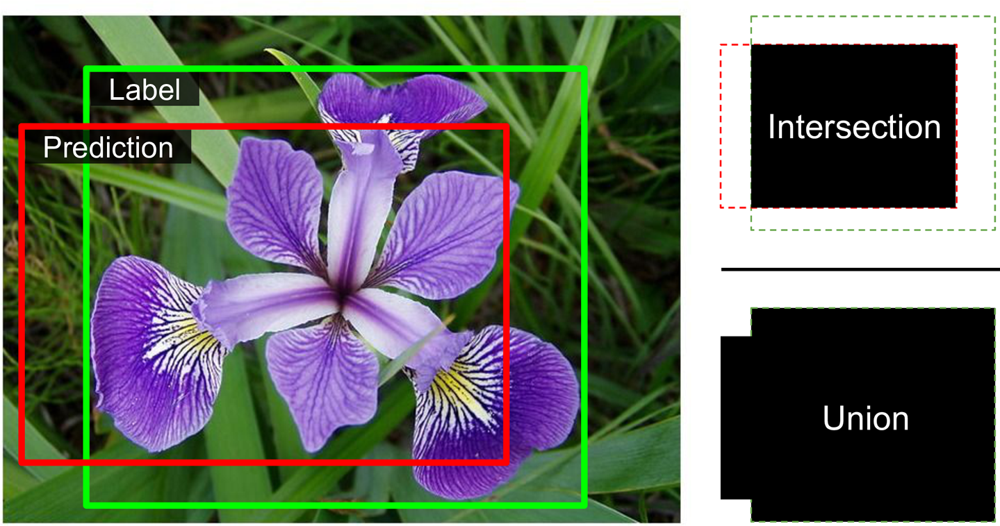

###### Figure 14-23. Intersection over Union (IoU) metric for bounding boxes

Classifying and localizing a single object is nice, but what if the
images contain multiple objects (as is often the case in the flowers
dataset)?

Object Detection
================

The task of classifying and localizing multiple objects in an image is
called *object detection*. Until a few years ago, a common approach was
to take a CNN that was trained to classify and locate a single object,
then slide it across the image, as shown in
[Figure 14-24]
In this example, the image was chopped into a 6 × 8 grid, and we show a
CNN (the thick black rectangle) sliding across all 3 × 3 regions. When
the CNN was looking at the top left of the image, it detected part of
the leftmost rose, and then it detected that same rose again when it was
first shifted one step to the right. At the next step, it started
detecting part of the topmost rose, and then it detected it again once
it was shifted one more step to the right. You would then continue to
slide the CNN through the whole image, looking at all 3 × 3 regions.
Moreover, since objects can have varying sizes, you would also slide the
CNN across regions of different sizes. For example, once you are done
with the 3 × 3 regions, you might want to slide the CNN across all 4 × 4
regions as well.

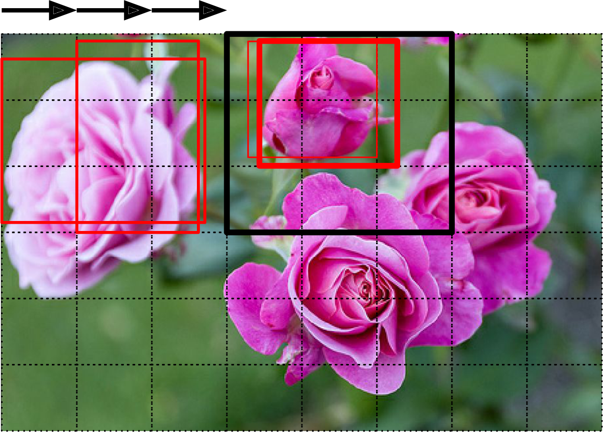

###### Figure 14-24. Detecting multiple objects by sliding a CNN across the image

This technique is fairly straightforward, but as you can see it will
detect the same object multiple times, at slightly different positions.
Some post-processing will then be needed to get rid of all the
unnecessary bounding boxes. A common approach for this is called
*non-max suppression*. Here’s how you do it:

1.  First, you need to add an extra *objectness* output to your CNN, to
    estimate the probability that a flower is indeed present in the
    image (alternatively, you could add a “no-flower” class, but this
    usually does not work as well). It must use the sigmoid activation
    function, and you can train it using binary cross-entropy loss. Then
    get rid of all the bounding boxes for which the objectness score is
    below some threshold: this will drop all the bounding boxes that
    don’t actually contain a flower.

2.  Find the bounding box with the highest objectness score, and get rid
    of all the other bounding boxes that overlap a lot with it (e.g.,
    with an IoU greater than 60%). For example, in
    [Figure 14-24]
    the bounding box with the max objectness score is the thick bounding
    box over the topmost rose (the objectness score is represented by
    the thickness of the bounding boxes). The other bounding box over
    that same rose overlaps a lot with the max bounding box, so we will
    get rid of it.

3.  Repeat step two until there are no more bounding boxes to get rid
    of.

This simple approach to object detection works pretty well, but it
requires running the CNN many times, so it is quite slow. Fortunately,
there is a much faster way to slide a CNN across an image: using a
*fully convolutional network* (FCN).

Fully Convolutional Networks
----------------------------

The idea of FCNs was first introduced in a [2015
paper](https://homl.info/fcn)^[25]
by Jonathan Long et al., for semantic segmentation (the task of
classifying every pixel in an image according to the class of the object
it belongs to). The authors pointed out that you could replace the dense
layers at the top of a CNN by convolutional layers. To understand this,
let’s look at an example: suppose a dense layer with 200 neurons sits on
top of a convolutional layer that outputs 100 feature maps, each of size
7 × 7 (this is the feature map size, not the kernel size). Each neuron
will compute a weighted sum of all 100 × 7 × 7 activations from the
convolutional layer (plus a bias term). Now let’s see what happens if we
replace the dense layer with a convolutional layer using 200 filters,
each of size 7 × 7, and with `"valid"` padding. This layer will output
200 feature maps, each 1 × 1 (since the kernel is exactly the size of
the input feature maps and we are using `"valid"` padding). In other
words, it will output 200 numbers, just like the dense layer did; and if
you look closely at the computations performed by a convolutional layer,
you will notice that these numbers will be precisely the same as those
the dense layer produced. The only difference is that the dense layer’s
output was a tensor of shape [*batch size*, 200], while the
convolutional layer will output a tensor of shape [*batch size*, 1, 1,
200].

###### Tip

To convert a dense layer to a convolutional layer, the number of filters
in the convolutional layer must be equal to the number of units in the
dense layer, the filter size must be equal to the size of the input
feature maps, and you must use `"valid"` padding. The stride may be set
to 1 or more, as we will see shortly.

Why is this important? Well, while a dense layer expects a specific
input size (since it has one weight per input feature), a convolutional
layer will happily process images of any
size^[26]
(however, it does expect its inputs to have a specific number of
channels, since each kernel contains a different set of weights for each
input channel). Since an FCN contains only convolutional layers (and
pooling layers, which have the same property), it can be trained and
executed on images of any size!

For example, suppose we’d already trained a CNN for flower
classification and localization. It was trained on 224 × 224 images, and
it outputs 10 numbers: outputs 0 to 4 are sent through the softmax
activation function, and this gives the class probabilities (one per
class); output 5 is sent through the logistic activation function, and
this gives the objectness score; outputs 6 to 9 do not use any
activation function, and they represent the bounding box’s center
coordinates, as well as its height and width. We can now convert its
dense layers to convolutional layers. In fact, we don’t even need to
retrain it; we can just copy the weights from the dense layers to the
convolutional layers! Alternatively, we could have converted the CNN
into an FCN before training.

Now suppose the last convolutional layer before the output layer (also
called the bottleneck layer) outputs 7 × 7 feature maps when the network
is fed a 224 × 224 image (see the left side of
[Figure 14-25]
If we feed the FCN a 448 × 448 image (see the right side of
[Figure 14-25]
the bottleneck layer will now output 14 × 14 feature
maps.
^[27]
Since the dense output layer was replaced by a convolutional layer using
10 filters of size 7 × 7, with `"valid"` padding and stride 1, the
output will be composed of 10 features maps, each of size 8 × 8 (since
14 – 7 + 1 = 8). In other words, the FCN will process the whole image
only once, and it will output an 8 × 8 grid where each cell contains 10
numbers (5 class probabilities, 1 objectness score, and 4 bounding box
coordinates). It’s exactly like taking the original CNN and sliding it
across the image using 8 steps per row and 8 steps per column. To
visualize this, imagine chopping the original image into a 14 × 14 grid,
then sliding a 7 × 7 window across this grid; there will be 8 × 8 = 64
possible locations for the window, hence 8 × 8 predictions. However, the
FCN approach is *much* more efficient, since the network only looks at
the image once. In fact, *You Only Look Once* (YOLO) is the name of a
very popular object detection architecture, which we’ll look at next.

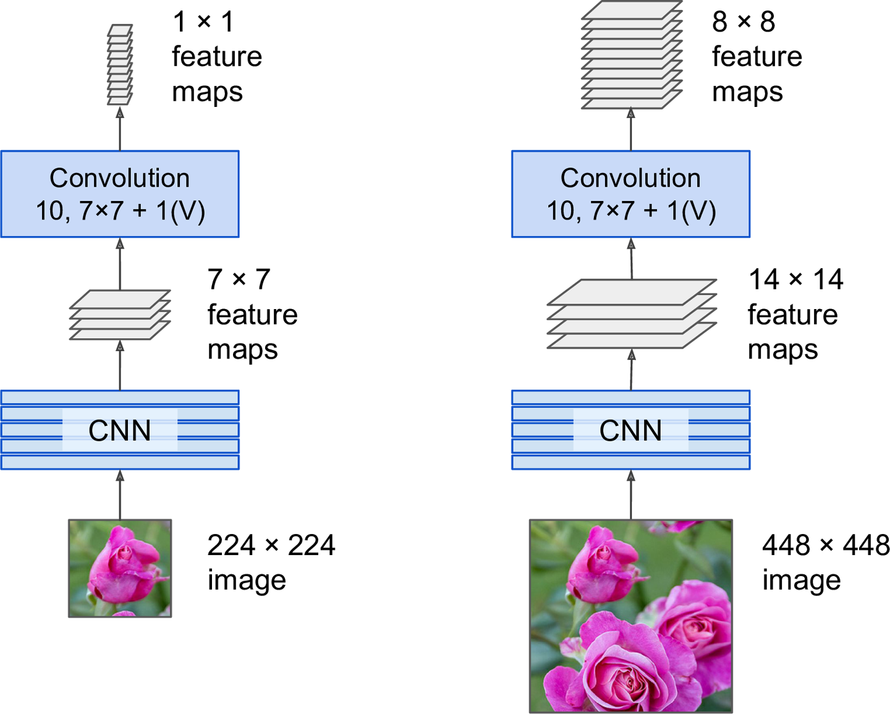

###### Figure 14-25. The same fully convolutional network processing a small image (left) and a large one (right)

You Only Look Once (YOLO)
-------------------------

YOLO is an extremely fast and accurate object detection architecture
proposed by Joseph Redmon et al. in a [2015
paper](https://homl.info/yolo), ^[28]
and subsequently improved [in
2016](https://homl.info/yolo2)^[29]
(YOLOv2) and [in
2018](https://homl.info/yolo3)^[30]
(YOLOv3). It is so fast that it can run in real time on a video, as seen
in Redmon’s [demo](https://homl.info/yolodemo).

YOLOv3’s architecture is quite similar to the one we just discussed, but
with a few important differences:

-   It outputs five bounding boxes for each grid cell (instead of just
    one), and each bounding box comes with an objectness score. It also
    outputs 20 class probabilities per grid cell, as it was trained on
    the PASCAL VOC dataset, which contains 20 classes. That’s a total of
    45 numbers per grid cell: 5 bounding boxes, each with 4 coordinates,
    plus 5 objectness scores, plus 20 class probabilities.

-   Instead of predicting the absolute coordinates of the bounding box
    centers, YOLOv3 predicts an offset relative to the coordinates of
    the grid cell, where (0, 0) means the top left of that cell and (1,
    1) means the bottom right. For each grid cell, YOLOv3 is trained to
    predict only bounding boxes whose center lies in that cell (but the
    bounding box itself generally extends well beyond the grid cell).
    YOLOv3 applies the logistic activation function to the bounding box
    coordinates to ensure they remain in the 0 to 1 range.

-   Before training the neural net, YOLOv3 finds five representative
    bounding box dimensions, called *anchor boxes* (or *bounding box
    priors*). It does this by applying the K-Means algorithm (see
    [Lab 9]
    to the height and width of the training set bounding boxes. For
    example, if the training images contain many pedestrians, then one
    of the anchor boxes will likely have the dimensions of a typical
    pedestrian. Then when the neural net predicts five bounding boxes
    per grid cell, it actually predicts how much to rescale each of the
    anchor boxes. For example, suppose one anchor box is 100 pixels tall
    and 50 pixels wide, and the network predicts, say, a vertical
    rescaling factor of 1.5 and a horizontal rescaling of 0.9 (for one
    of the grid cells). This will result in a predicted bounding box of
    size 150 × 45 pixels. To be more precise, for each grid cell and
    each anchor box, the network predicts the log of the vertical and
    horizontal rescaling factors. Having these priors makes the network
    more likely to predict bounding boxes of the appropriate dimensions,
    and it also speeds up training because it will more quickly learn
    what reasonable bounding boxes look like.

-   The network is trained using images of different scales: every few
    batches during training, the network randomly chooses a new image
    dimension (from 330 × 330 to 608 × 608 pixels). This allows the
    network to learn to detect objects at different scales. Moreover, it
    makes it possible to use YOLOv3 at different scales: the smaller
    scale will be less accurate but faster than the larger scale, so you
    can choose the right trade-off for your use case.

There are a few more innovations you might be interested in, such as the
use of skip connections to recover some of the spatial resolution that
is lost in the CNN (we will discuss this shortly, when we look at
semantic segmentation). In the 2016 paper, the authors introduce the
YOLO9000 model that uses hierarchical classification: the model predicts
a probability for each node in a visual hierarchy called *WordTree*.
This makes it possible for the network to predict with high confidence
that an image represents, say, a dog, even though it is unsure what
specific type of dog. I encourage you to go ahead and read all three
papers: they are quite pleasant to read, and they provide excellent
examples of how Deep Learning systems can be incrementally improved.

##### Mean Average Precision (mAP)

A very common metric used in object detection tasks is the *mean Average
Precision* (mAP). “Mean Average” sounds a bit redundant, doesn’t it? To
understand this metric, let’s go back to two classification metrics we
discussed in
[Lab 3]
precision and recall. Remember the trade-off: the higher the recall, the
lower the precision. You can visualize this in a precision/recall curve
(see
[Figure 3-5]
To summarize this curve into a single number, we could compute its area
under the curve (AUC). But note that the precision/recall curve may
contain a few sections where precision actually goes up when recall
increases, especially at low recall values (you can see this at the top
left of
[Figure 3-5]
This is one of the motivations for the mAP metric.

Suppose the classifier has 90% precision at 10% recall, but 96%
precision at 20% recall. There’s really no trade-off here: it simply
makes more sense to use the classifier at 20% recall rather than at 10%
recall, as you will get both higher recall and higher precision. So
instead of looking at the precision *at* 10% recall, we should really be
looking at the *maximum* precision that the classifier can offer with
*at least* 10% recall. It would be 96%, not 90%. Therefore, one way to
get a fair idea of the model’s performance is to compute the maximum
precision you can get with at least 0% recall, then 10% recall, 20%, and
so on up to 100%, and then calculate the mean of these maximum
precisions. This is called the *Average Precision* (AP) metric. Now when
there are more than two classes, we can compute the AP for each class,
and then compute the mean AP (mAP). That’s it!

In an object detection system, there is an additional level of
complexity: what if the system detected the correct class, but at the
wrong location (i.e., the bounding box is completely off)? Surely we
should not count this as a positive prediction. One approach is to
define an IOU threshold: for example, we may consider that a prediction
is correct only if the IOU is greater than, say, 0.5, and the predicted
class is correct. The corresponding mAP is generally noted mAP@0.5 (or
mAP@50%, or sometimes just AP~50~). In some competitions (such as the
PASCAL VOC challenge), this is what is done. In others (such as the COCO
competition), the mAP is computed for different IOU thresholds (0.50,
0.55, 0.60, …, 0.95), and the final metric is the mean of all these mAPs
(noted mAP@[.50:.95] or mAP@[.50:0.05:.95]). Yes, that’s a mean mean
average.

Several YOLO implementations built using TensorFlow are available on
GitHub. In particular, check out [Zihao Zang’s TensorFlow 2
implementation](https://homl.info/yolotf2). Other object detection
models are available in the TensorFlow Models project, many with
pretrained weights; and some have even been ported to TF Hub, such as
[SSD](https://homl.info/ssd)^[31]
and
[Faster-RCNN](https://homl.info/fasterrcnn), ^[32]
which are both quite popular. SSD is also a “single shot” detection
model, similar to YOLO. Faster R-CNN is more complex: the image first
goes through a CNN, then the output is passed to a *Region Proposal
Network* (RPN) that proposes bounding boxes that are most likely to
contain an object, and a classifier is run for each bounding box, based
on the cropped output of the CNN.

The choice of detection system depends on many factors: speed, accuracy,
available pretrained models, training time, complexity, etc. The papers
contain tables of metrics, but there is quite a lot of variability in
the testing environments, and the technologies evolve so fast that it is
difficult to make a fair comparison that will be useful for most people
and remain valid for more than a few months.

So, we can locate objects by drawing bounding boxes around them. Great!
But perhaps you want to be a bit more precise. Let’s see how to go down
to the pixel level.

Semantic Segmentation
=====================

In *semantic segmentation*, each pixel is classified according to the
class of the object it belongs to (e.g., road, car, pedestrian,
building, etc.), as shown in
[Figure 14-26]
Note that different objects of the same class are *not* distinguished.
For example, all the bicycles on the right side of the segmented image
end up as one big lump of pixels. The main difficulty in this task is
that when images go through a regular CNN, they gradually lose their
spatial resolution (due to the layers with strides greater than 1); so,
a regular CNN may end up knowing that there’s a person somewhere in the
bottom left of the image, but it will not be much more precise than
that.

Just like for object detection, there are many different approaches to
tackle this problem, some quite complex. However, a fairly simple
solution was proposed in the 2015 paper by Jonathan Long et al. we
discussed earlier. The authors start by taking a pretrained CNN and
turning it into an FCN. The CNN applies an overall stride of 32 to the
input image (i.e., if you add up all the strides greater than 1),
meaning the last layer outputs feature maps that are 32 times smaller
than the input image. This is clearly too coarse, so they add a single
*upsampling layer* that multiplies the resolution by 32.


###### Figure 14-26. Semantic segmentation

There are several solutions available for upsampling (increasing the
size of an image), such as bilinear interpolation, but that only works
reasonably well up to ×4 or ×8. Instead, they use a *transposed
convolutional
layer*: ^[33]
it is equivalent to first stretching the image by inserting empty rows
and columns (full of zeros), then performing a regular convolution (see
[Figure 14-27]
Alternatively, some people prefer to think of it as a regular
convolutional layer that uses fractional strides (e.g., 1/2 in
[Figure 14-27]
The transposed convolutional layer can be initialized to perform
something close to linear interpolation, but since it is a trainable
layer, it will learn to do better during training. In tf.keras, you can
use the `Conv2DTranspose` layer.

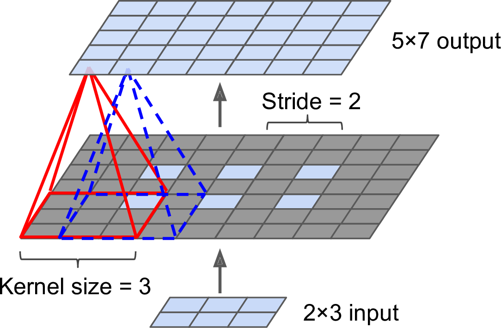

###### Figure 14-27. Upsampling using a transposed convolutional layer

###### Note

In a transposed convolutional layer, the stride defines how much the
input will be stretched, not the size of the filter steps, so the larger
the stride, the larger the output (unlike for convolutional layers or
pooling layers).

##### TensorFlow Convolution Operations

TensorFlow also offers a few other kinds of convolutional layers:

`keras.layers.Conv1D`
:   Creates a convolutional layer for 1D inputs, such as time series or
    text (sequences of letters or words), as we will see in
    [Lab 15]

`keras.layers.Conv3D`
:   Creates a convolutional layer for 3D inputs, such as 3D PET scans.

`dilation_rate`
:   Setting the `dilation_rate` hyperparameter of any convolutional
    layer to a value of 2 or more creates an *à-trous convolutional
    layer* (“à trous” is French for “with holes”). This is equivalent to
    using a regular convolutional layer with a filter dilated by
    inserting rows and columns of zeros (i.e., holes). For example, a 1
    × 3 filter equal to `[[1,2,3]]` may be dilated with a *dilation
    rate* of 4, resulting in a *dilated filter* of
    `[[1, 0, 0, 0, 2, 0, 0, 0, 3]]`. This lets the convolutional layer
    have a larger receptive field at no computational price and using no
    extra parameters.

`tf.nn.depthwise_conv2d()`
:   Can be used to create a *depthwise convolutional layer* (but you
    need to create the variables yourself). It applies every filter to
    every individual input channel independently. Thus, if there are
    *f*~*n*~ filters and *f*~*n*′~ input channels, then this will output
    *f*~*n*~ × *f*~*n*′~ feature maps.

This solution is OK, but still too imprecise. To do better, the authors
added skip connections from lower layers: for example, they upsampled
the output image by a factor of 2 (instead of 32), and they added the
output of a lower layer that had this double resolution. Then they
upsampled the result by a factor of 16, leading to a total upsampling
factor of 32 (see
[Figure 14-28]
This recovered some of the spatial resolution that was lost in earlier
pooling layers. In their best architecture, they used a second similar
skip connection to recover even finer details from an even lower layer.
In short, the output of the original CNN goes through the following
extra steps: upscale ×2, add the output of a lower layer (of the
appropriate scale), upscale ×2, add the output of an even lower layer,
and finally upscale ×8. It is even possible to scale up beyond the size
of the original image: this can be used to increase the resolution of an
image, which is a technique called *super-resolution*.


###### Figure 14-28. Skip layers recover some spatial resolution from lower layers

Once again, many GitHub repositories provide TensorFlow implementations
of semantic segmentation (TensorFlow 1 for now), and you will even find
pretrained *instance segmentation* models in the TensorFlow Models
project. Instance segmentation is similar to semantic segmentation, but
instead of merging all objects of the same class into one big lump, each
object is distinguished from the others (e.g., it identifies each
individual bicycle). At present, the instance segmentation models
available in the TensorFlow Models project are based on the *Mask R-CNN*
architecture, which was proposed in a [2017
paper](https://homl.info/maskrcnn): ^[34]
it extends the Faster R-CNN model by additionally producing a pixel mask
for each bounding box. So not only do you get a bounding box around each
object, with a set of estimated class probabilities, but you also get a
pixel mask that locates pixels in the bounding box that belong to the
object.

As you can see, the field of Deep Computer Vision is vast and moving
fast, with all sorts of architectures popping out every year, all based
on convolutional neural networks. The progress made in just a few years
has been astounding, and researchers are now focusing on harder and
harder problems, such as *adversarial learning* (which attempts to make
the network more resistant to images designed to fool it),
explainability (understanding why the network makes a specific
classification), realistic *image generation* (which we will come back
to in
[Lab 17]
and *single-shot learning* (a system that can recognize an object after
it has seen it just once). Some even explore completely novel
architectures, such as Geoffrey Hinton’s [*capsule
networks*](https://homl.info/capsnet)^[35]
(I presented them in a couple of
[videos](https://homl.info/capsnetvideos), with the corresponding code
in a notebook). Now on to the next lab, where we will look at how to
process sequential data such as time series using recurrent neural
networks and convolutional neural networks.

Exercises
=========

1.  What are the advantages of a CNN over a fully connected DNN for
    image classification?

2.  Consider a CNN composed of three convolutional layers, each with 3 ×
    3 kernels, a stride of 2, and `"same"` padding. The lowest layer
    outputs 100 feature maps, the middle one outputs 200, and the top
    one outputs 400. The input images are RGB images of 200 × 300
    pixels.

    What is the total number of parameters in the CNN? If we are using
    32-bit floats, at least how much RAM will this network require when
    making a prediction for a single instance? What about when training
    on a mini-batch of 50 images?

3.  If your GPU runs out of memory while training a CNN, what are five
    things you could try to solve the problem?

4.  Why would you want to add a max pooling layer rather than a
    convolutional layer with the same stride?

5.  When would you want to add a local response normalization layer?

6.  Can you name the main innovations in AlexNet, compared to LeNet-5?
    What about the main innovations in GoogLeNet, ResNet, SENet, and
    Xception?

7.  What is a fully convolutional network? How can you convert a dense
    layer into a convolutional layer?

8.  What is the main technical difficulty of semantic segmentation?

9.  Build your own CNN from scratch and try to achieve the highest
    possible accuracy on MNIST.

10. Use transfer learning for large image classification, going through
    these steps:

    1.  Create a training set containing at least 100 images per class.
        For example, you could classify your own pictures based on the
        location (beach, mountain, city, etc.), or alternatively you can
        use an existing dataset (e.g., from TensorFlow Datasets).

    2.  Split it into a training set, a validation set, and a test set.

    3.  Build the input pipeline, including the appropriate
        preprocessing operations, and optionally add data augmentation.

    4.  Fine-tune a pretrained model on this dataset.

11. Go through TensorFlow’s [Style Transfer
    tutorial](https://homl.info/styletuto). It is a fun way to generate
    art using Deep Learning.

**Solution for the exercises are available in the solutions file.**

^[1]
David H. Hubel, “Single Unit Activity in Striate Cortex of Unrestrained
Cats,” *The Journal of Physiology* 147 (1959): 226–238.

^[2]
David H. Hubel and Torsten N. Wiesel, “Receptive Fields of Single
Neurons in the Cat’s Striate Cortex,” *The Journal of Physiology* 148
(1959): 574–591.

^[3]
David H. Hubel and Torsten N. Wiesel, “Receptive Fields and Functional
Architecture of Monkey Striate Cortex,” *The Journal of Physiology* 195
(1968): 215–243.

^[4]
Kunihiko Fukushima, “Neocognitron: A Self-Organizing Neural Network
Model for a Mechanism of Pattern Recognition Unaffected by Shift in
Position,” *Biological Cybernetics* 36 (1980): 193–202.

^[5]
Yann LeCun et al., “Gradient-Based Learning Applied to Document
Recognition,” *Proceedings of the IEEE* 86, no. 11 (1998): 2278–2324.

^[6]
A convolution is a mathematical operation that slides one function over
another and measures the integral of their pointwise multiplication. It
has deep connections with the Fourier transform and the Laplace
transform and is heavily used in signal processing. Convolutional layers
actually use cross-correlations, which are very similar to convolutions
(see [*https://homl.info/76*](https://homl.info/76) for more details).

^[7]
A fully connected layer with 150 × 100 neurons, each connected to all
150 × 100 × 3 inputs, would have 150^2^ × 100^2^ × 3 = 675 million
parameters!

^[8]
In the international system of units (SI), 1 MB = 1,000 KB = 1,000 ×
1,000 bytes = 1,000 × 1,000 × 8 bits.

^[9]
Other kernels we’ve discussed so far had weights, but pooling kernels do
not: they are just stateless sliding windows.

^[10]
Yann LeCun et al., “Gradient-Based Learning Applied to Document
Recognition,” *Proceedings of the IEEE* 86, no. 11 (1998): 2278–2324.

^[11]
Alex Krizhevsky et al., “ImageNet Classification with Deep Convolutional
Neural Networks,” *\_Proceedings of the 25th International Conference on
Neural Information Processing Systems* 1 (2012): 1097–1105.

^[12]
Matthew D. Zeiler and Rob Fergus, “Visualizing and Understanding
Convolutional Networks,” *Proceedings of the European Conference on
Computer Vision* (2014): 818-833.

^[13]
Christian Szegedy et al., “Going Deeper with Convolutions,” *Proceedings
of the IEEE Conference on Computer Vision and Pattern Recognition*
(2015): 1–9.

^[14]
In the 2010 movie *Inception*, the characters keep going deeper and
deeper into multiple layers of dreams; hence the name of these modules.

^[15]
Karen Simonyan and Andrew Zisserman, “Very Deep Convolutional Networks
for Large-Scale Image Recognition,” arXiv preprint arXiv:1409.1556
(2014).

^[16]
Kaiming He et al., “Deep Residual Learning for Image Recognition,” arXiv
preprint arXiv:1512:03385 (2015).

^[17]
It is a common practice when describing a neural network to count only
layers with parameters.

^[18]
Christian Szegedy et al., “Inception–v4, Inception-ResNet and the Impact
of Residual Connections on Learning,” arXiv preprint arXiv:1602.07261
(2016).

^[19]
François Chollet, “Xception: Deep Learning with Depthwise Separable
Convolutions,” arXiv preprint arXiv:1610.02357 (2016).

^[20]
This name can sometimes be ambiguous, since spatially separable
convolutions are often called “separable convolutions” as well.

^[21]
Xingyu Zeng et al., “Crafting GBD-Net for Object Detection,” *IEEE
Transactions on Pattern Analysis and Machine Intelligence* 40, no. 9
(2018): 2109–2123.

^[22]
Jie Hu et al., “Squeeze-and-Excitation Networks,” *Proceedings of the
IEEE Conference on Computer Vision and Pattern Recognition* (2018):
7132–7141.

^[23]
In the ImageNet dataset, each image is associated to a word in the
[WordNet dataset](https://wordnet.princeton.edu/): the class ID is just
a WordNet ID.

^[24]
Adriana Kovashka et al., “Crowdsourcing in Computer Vision,”
*Foundations and Trends in Computer Graphics and Vision* 10, no. 3
(2014): 177–243.

^[25]
Jonathan Long et al., “Fully Convolutional Networks for Semantic
Segmentation,” *Proceedings of the IEEE Conference on Computer Vision
and Pattern Recognition* (2015): 3431–3440.

^[26]
There is one small exception: a convolutional layer using `"valid"`
padding will complain if the input size is smaller than the kernel size.

^[27]
This assumes we used only `"same"` padding in the network: indeed,
`"valid"` padding would reduce the size of the feature maps. Moreover,
448 can be neatly divided by 2 several times until we reach 7, without
any rounding error. If any layer uses a different stride than 1 or 2,
then there may be some rounding error, so again the feature maps may end
up being smaller.

^[28]
Joseph Redmon et al., “You Only Look Once: Unified, Real-Time Object
Detection,” *Proceedings of the IEEE Conference on Computer Vision and
Pattern Recognition* (2016): 779–788.

^[29]
Joseph Redmon and Ali Farhadi, “YOLO9000: Better, Faster, Stronger,”
*Proceedings of the IEEE Conference on Computer Vision and Pattern
Recognition* (2017): 6517–6525.

^[30]
Joseph Redmon and Ali Farhadi, “YOLOv3: An Incremental Improvement,”
arXiv preprint arXiv:1804.02767 (2018).

^[31]
Wei Liu et al., “SSD: Single Shot Multibox Detector,” *Proceedings of
the 14th European Conference on Computer Vision* 1 (2016): 21–37.

^[32]
Shaoqing Ren et al., “Faster R-CNN: Towards Real-Time Object Detection
with Region Proposal Networks,” *Proceedings of the 28th International
Conference on Neural Information Processing Systems* 1 (2015): 91–99.

^[33]
This type of layer is sometimes referred to as a *deconvolution layer*,
but it does *not* perform what mathematicians call a deconvolution, so
this name should be avoided.

^[34]
Kaiming He et al., “Mask R-CNN,” arXiv preprint arXiv:1703.06870 (2017).

^[35]
Geoffrey Hinton et al., “Matrix Capsules with EM Routing,” *Proceedings
of the International Conference on Learning Representations* (2018).

