[Lab 3. ] Classification
===================================

In
[Lab 1](https://learning.oreilly.com/library/view/hands-on-machine-learning/9781492032632/ch01.html#landscape_lab)
I mentioned that the most common supervised learning tasks are
regression (predicting values) and classification (predicting classes).
In
[Lab 2](https://learning.oreilly.com/library/view/hands-on-machine-learning/9781492032632/ch02.html#project_lab)
we explored a regression task, predicting housing values, using various
algorithms such as Linear Regression, Decision Trees, and Random Forests
(which will be explained in further detail in later labs). Now we
will turn our attention to classification systems.


MNIST
=====

In[]{#idm45728488574312}[]{#idm45728488573304}[]{#idm45728488572360}
this lab we will be using the MNIST dataset, which is a set of
70,000 small images of digits handwritten by high school students and
employees of the US Census Bureau. Each image is labeled with the digit
it represents. This set has been studied so much that it is often called
the "hello world" of Machine Learning: whenever people come up with a
new classification algorithm they are curious to see how it will perform
on MNIST, and anyone who learns Machine Learning tackles this dataset
sooner or later.

Scikit-Learn[]{#idm45728488570648} provides many helper functions to
download popular datasets. MNIST is one of them. The following code
fetches the MNIST
dataset:^[1](https://learning.oreilly.com/library/view/hands-on-machine-learning/9781492032632/ch03.html#idm45728488569352){#idm45728488569352-marker
.totri-footnote}^

``` {data-type="programlisting" code-language="pycon"}
>>> from sklearn.datasets import fetch_openml
>>> mnist = fetch_openml('mnist_784', version=1)
>>> mnist.keys()
dict_keys(['data', 'target', 'feature_names', 'DESCR', 'details',
           'categories', 'url'])
```

Datasets loaded by Scikit-Learn generally have a similar dictionary
structure, including the following:

-   A `DESCR` key describing the dataset

-   A `data` key containing an array with one row per instance and one
    column per feature

-   A `target` key containing an array with the labels

Let's look at these arrays:

``` {data-type="programlisting" code-language="pycon"}
>>> X, y = mnist["data"], mnist["target"]
>>> X.shape
(70000, 784)
>>> y.shape
(70000,)
```

There are 70,000 images, and each image has 784 features. This is
because each image is 28 × 28 pixels, and each feature simply represents
one pixel's intensity, from 0 (white) to 255 (black). Let's take a peek
at one digit from the dataset. All you need to do is grab an instance's
feature vector, reshape it to a 28 × 28 array, and display it using
Matplotlib's `imshow()` function:

``` {data-type="programlisting" code-language="python"}
import matplotlib as mpl
import matplotlib.pyplot as plt

some_digit = X[0]
some_digit_image = some_digit.reshape(28, 28)

plt.imshow(some_digit_image, cmap="binary")
plt.axis("off")
plt.show()
```

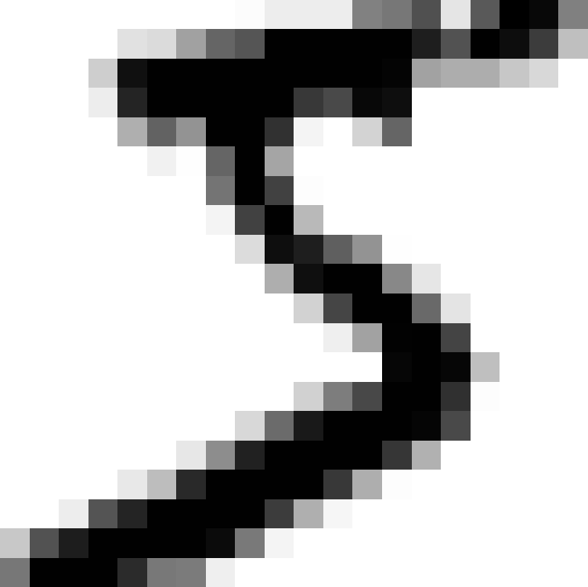

This looks like a 5, and indeed that's what the label tells us:

``` {data-type="programlisting" code-language="pycon"}
>>> y[0]
'5'
```

Note that the label is a string. Most ML algorithms expect numbers, so
let's cast `y` to integer:

``` {data-type="programlisting" code-language="pycon"}
>>> y = y.astype(np.uint8)
```

To give you a feel for the complexity of the classification task,
[Figure 3-1](https://learning.oreilly.com/library/view/hands-on-machine-learning/9781492032632/ch03.html#more_digits_plot)
shows a few more images from the MNIST dataset.

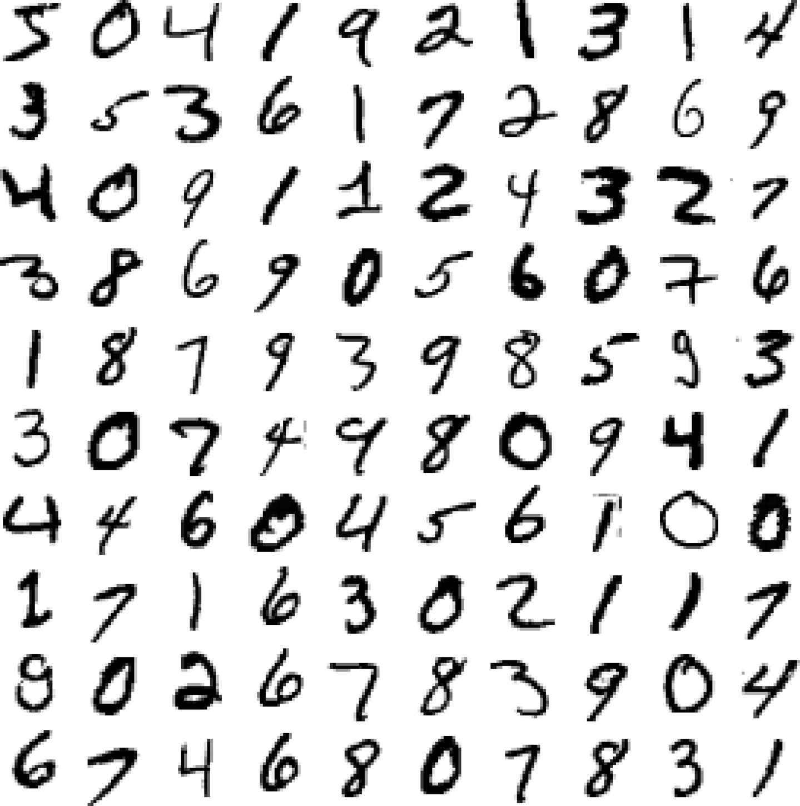

But wait! You should always create a test set and set it aside before
inspecting the data closely. The MNIST dataset is actually already split
into a training set (the first 60,000 images) and a test set (the last
10,000 images):

``` {data-type="programlisting" code-language="python"}
X_train, X_test, y_train, y_test = X[:60000], X[60000:], y[:60000], y[60000:]
```

The training set is already shuffled for us, which is good because this
guarantees that all cross-validation folds will be similar (you don't
want one fold to be missing some digits). Moreover, some learning
algorithms are sensitive to the order of the training instances, and
they perform poorly if they get many similar instances in a row.
Shuffling the dataset ensures that this won't
happen.^[2](https://learning.oreilly.com/library/view/hands-on-machine-learning/9781492032632/ch03.html#idm45728488324168){#idm45728488324168-marker
.totri-footnote}^


Training a Binary Classifier
============================

Let's simplify[]{#idm45728488322376}[]{#idm45728488302344} the problem
for now and only try to identify one digit---for example, the number 5.
This "5-detector" will be an example of a *binary classifier*, capable
of distinguishing between just two classes, 5 and not-5. Let's create
the target vectors for this classification task:

``` {data-type="programlisting" code-language="python"}
y_train_5 = (y_train == 5)  # True for all 5s, False for all other digits
y_test_5 = (y_test == 5)
```

Now let's pick a classifier and train it. A good place to
start[]{#idm45728488292168}[]{#idm45728488291320}[]{#idm45728488290680}
is with a *Stochastic Gradient Descent* (SGD) classifier, using
Scikit-Learn's `SGDClassifier` class. This classifier has the advantage
of being capable of handling very large datasets efficiently. This is in
part because SGD deals with training instances independently, one at a
time (which also makes SGD well suited[]{#idm45728488248440} for online
learning), as we will see later. Let's create an `SGDClassifier` and
train it on the whole training set:

``` {data-type="programlisting" code-language="python"}
from sklearn.linear_model import SGDClassifier

sgd_clf = SGDClassifier(random_state=42)
sgd_clf.fit(X_train, y_train_5)
```


###### Tip

The `SGDClassifier` relies on randomness during training (hence the name
"stochastic"). If you want reproducible results, you should set the
`random_state` parameter.


Now we can use it to detect images of the number 5:

``` {data-type="programlisting" code-language="pycon"}
>>> sgd_clf.predict([some_digit])
array([ True])
```

The classifier guesses that this image represents a 5 (`True`). Looks
like it guessed right in this particular case! Now, let's evaluate this
model's performance.


Performance Measures
====================

Evaluating[]{#idm45728488180744}[]{#CPperform03} a classifier is often
significantly trickier than evaluating a regressor, so we will spend a
large part of this lab on this topic. There are many performance
measures available, so grab another coffee and get ready to learn many
new concepts and acronyms!


Measuring Accuracy Using Cross-Validation
-----------------------------------------

A[]{#idm45728488192856}[]{#idm45728488191880} good way to evaluate a
model is to use cross-validation, just as you did in
[Lab 2](https://learning.oreilly.com/library/view/hands-on-machine-learning/9781492032632/ch02.html#project_lab).


##### Implementing Cross-Validation

Occasionally you will need more control over the cross-validation
process than what Scikit-Learn provides off the shelf. In these cases,
you can implement cross-validation yourself. The[]{#idm45728488188648}
following code does roughly the same thing as Scikit-Learn's
`cross_val_score()` function, and it prints the same result:

``` {data-type="programlisting" code-language="python"}
from sklearn.model_selection import StratifiedKFold
from sklearn.base import clone

skfolds = StratifiedKFold(n_splits=3, random_state=42)

for train_index, test_index in skfolds.split(X_train, y_train_5):
    clone_clf = clone(sgd_clf)
    X_train_folds = X_train[train_index]
    y_train_folds = y_train_5[train_index]
    X_test_fold = X_train[test_index]
    y_test_fold = y_train_5[test_index]

    clone_clf.fit(X_train_folds, y_train_folds)
    y_pred = clone_clf.predict(X_test_fold)
    n_correct = sum(y_pred == y_test_fold)
    print(n_correct / len(y_pred))  # prints 0.9502, 0.96565, and 0.96495
```

The `StratifiedKFold` class[]{#idm45728488153752}[]{#idm45728488045256}
performs stratified sampling (as explained in
[Lab 2](https://learning.oreilly.com/library/view/hands-on-machine-learning/9781492032632/ch02.html#project_lab))
to produce folds that contain a representative ratio of each class. At
each iteration the code creates a clone of the classifier, trains that
clone on the training folds, and makes predictions on the test fold.
Then it counts the number of correct predictions and outputs the ratio
of correct predictions.


Let's use the `cross_val_score()` function to evaluate our
`SGDClassifier` model, using K-fold cross-validation with three folds.
Remember that K-fold cross-validation means splitting the training set
into K folds (in this case, three), then making predictions and
evaluating them on each fold using a model trained on the remaining
folds (see
[Lab 2](https://learning.oreilly.com/library/view/hands-on-machine-learning/9781492032632/ch02.html#project_lab)):

``` {data-type="programlisting" code-language="pycon"}
>>> from sklearn.model_selection import cross_val_score
>>> cross_val_score(sgd_clf, X_train, y_train_5, cv=3, scoring="accuracy")
array([0.96355, 0.93795, 0.95615])
```

Wow!
Above[]{#idm45728488025816}[]{#idm45728488024968}[]{#idm45728488024296}
93% accuracy (ratio of correct predictions) on all cross-validation
folds? This looks amazing, doesn't it? Well, before you get too excited,
let's look at a very dumb classifier that just classifies every single
image in the "not-5" class:

``` {data-type="programlisting" code-language="python"}
from sklearn.base import BaseEstimator

class Never5Classifier(BaseEstimator):
    def fit(self, X, y=None):
        return self
    def predict(self, X):
        return np.zeros((len(X), 1), dtype=bool)
```

Can you guess this model's accuracy? Let's find out:

``` {data-type="programlisting" code-language="pycon"}
>>> never_5_clf = Never5Classifier()
>>> cross_val_score(never_5_clf, X_train, y_train_5, cv=3, scoring="accuracy")
array([0.91125, 0.90855, 0.90915])
```

That's right, it has over 90% accuracy! This is simply because only
about 10% of the images are 5s, so if you always guess that an image is
*not* a 5, you will be right about 90% of the time. Beats Nostradamus.

This demonstrates why accuracy is generally not the preferred
performance measure for classifiers, especially when you are dealing
with *skewed datasets* (i.e., when some classes are much more frequent
than others).


Confusion Matrix
----------------

A[]{#idm45728487861528}[]{#idm45728487860520}[]{#idm45728487859576} much
better way to evaluate the performance of a classifier is to look at the
*confusion matrix*. The general idea is to count the number of times
instances of class A are classified as class B. For example, to know the
number of times the classifier confused images of 5s with 3s, you would
look in the fifth row and third column of the confusion matrix.

To compute the confusion matrix, you first need to have a set of
predictions so that they can be compared to the actual targets. You
could make predictions on the test set, but let's keep it untouched for
now (remember that you want to use the test set only at the very end of
your project, once you have a classifier that you are ready to launch).
Instead, you can use the `cross_val_predict()` function:

``` {data-type="programlisting" code-language="python"}
from sklearn.model_selection import cross_val_predict

y_train_pred = cross_val_predict(sgd_clf, X_train, y_train_5, cv=3)
```

Just like the `cross_val_score()` function, `cross_val_predict()`
performs K-fold cross-validation, but instead of returning the
evaluation scores, it returns the predictions made on each test fold.
This means that you get a clean prediction for each instance in the
training set ("clean" meaning that the prediction is made by a model
that never saw the data during training).

Now you are ready to get the confusion matrix using the
`confusion_matrix()` function. Just pass it the target classes
(`y_train_5`) and the predicted classes (`y_train_pred`):

``` {data-type="programlisting" code-language="pycon"}
>>> from sklearn.metrics import confusion_matrix
>>> confusion_matrix(y_train_5, y_train_pred)
array([[53057,  1522],
       [ 1325,  4096]])
```

Each row in a confusion matrix represents an *actual class*, while each
column represents a *predicted class*. The first row of this matrix
considers non-5 images (the *negative class*): 53,057 of them were
correctly classified as non-5s (they are called *true negatives*), while
the remaining 1,522 were wrongly classified as 5s (*false positives*).
The second row considers the images of 5s (the *positive class*): 1,325
were wrongly classified as non-5s (*false negatives*), while the
remaining 4,096 were correctly classified as 5s (*true positives*). A
perfect classifier would have only true positives and true negatives, so
its confusion matrix would have nonzero values only on its main diagonal
(top left to bottom right):

``` {data-type="programlisting" code-language="pycon"}
>>> y_train_perfect_predictions = y_train_5  # pretend we reached perfection
>>> confusion_matrix(y_train_5, y_train_perfect_predictions)
array([[54579,     0],
       [    0,  5421]])
```

The confusion matrix gives you a lot of information, but sometimes you
may prefer a more concise metric. An interesting one to look at is the
accuracy of the positive predictions; this
is[]{#Mprecision03}[]{#precis03} called the *precision* of the
classifier ([Equation
3-1](https://learning.oreilly.com/library/view/hands-on-machine-learning/9781492032632/ch03.html#equation_three_one)).


##### [Equation 3-1. ] Precision

[]{.MathJax_Preview style="color: inherit; display: none;"}


[[[[[[[precision]{#MathJax-Span-252 .mtext
style="font-family: MathJax_Main;"}[=]{#MathJax-Span-253 .mo
style="font-family: MathJax_Main; padding-left: 0.26em;"}[[[[[T[]{style="display: inline-block; overflow: hidden; height: 1px; width: 0.105em;"}]{#MathJax-Span-256
.mi
style="font-family: MathJax_Math-italic;"}[P[]{style="display: inline-block; overflow: hidden; height: 1px; width: 0.105em;"}]{#MathJax-Span-257
.mi style="font-family: MathJax_Math-italic;"}]{#MathJax-Span-255
.mrow}[]{style="display: inline-block; width: 0px; height: 4.013em;"}]{style="position: absolute; clip: rect(3.19em, 1001.45em, 4.167em, -1000.01em); top: -4.676em; left: 50%; margin-left: -0.717em;"}[[[T[]{style="display: inline-block; overflow: hidden; height: 1px; width: 0.105em;"}]{#MathJax-Span-259
.mi
style="font-family: MathJax_Math-italic;"}[P[]{style="display: inline-block; overflow: hidden; height: 1px; width: 0.105em;"}]{#MathJax-Span-260
.mi style="font-family: MathJax_Math-italic;"}[+]{#MathJax-Span-261 .mo
style="font-family: MathJax_Main; padding-left: 0.208em;"}[F[]{style="display: inline-block; overflow: hidden; height: 1px; width: 0.105em;"}]{#MathJax-Span-262
.mi
style="font-family: MathJax_Math-italic; padding-left: 0.208em;"}[P[]{style="display: inline-block; overflow: hidden; height: 1px; width: 0.105em;"}]{#MathJax-Span-263
.mi style="font-family: MathJax_Math-italic;"}]{#MathJax-Span-258
.mrow}[]{style="display: inline-block; width: 0px; height: 4.013em;"}]{style="position: absolute; clip: rect(3.19em, 1004.18em, 4.27em, -1000.01em); top: -3.339em; left: 50%; margin-left: -2.054em;"}[[]{style="display: inline-block; overflow: hidden; vertical-align: 0em; border-top: 1.3px solid; width: 4.27em; height: 0px;"}[]{style="display: inline-block; width: 0px; height: 1.082em;"}]{style="position: absolute; clip: rect(0.877em, 1004.28em, 1.237em, -1000.01em); top: -1.283em; left: 0em;"}]{style="display: inline-block; position: relative; width: 4.27em; height: 0px; margin-right: 0.105em; margin-left: 0.105em;"}]{#MathJax-Span-254
.mfrac style="padding-left: 0.26em;"}]{#MathJax-Span-251
.mrow}]{#MathJax-Span-250
.mrow}[]{style="display: inline-block; width: 0px; height: 2.111em;"}]{style="position: absolute; clip: rect(0.62em, 1009.63em, 3.036em, -1000.01em); top: -2.105em; left: 0em;"}]{style="display: inline-block; position: relative; width: 9.617em; height: 0px; font-size: 103%;"}[]{style="display: inline-block; overflow: hidden; vertical-align: -0.845em; border-left: 0px solid; width: 0px; height: 2.28em;"}]{#MathJax-Span-249
.math
style="width: 9.926em; display: inline-block;"}[$$\text{precision} = \frac{TP}{TP + FP}$$]{.MJX_Assistive_MathML
.MJX_Assistive_MathML_Block
role="presentation"}]{#MathJax-Element-7-Frame .MathJax tabindex="0"
mathml="<math xmlns=\"http://www.w3.org/1998/Math/MathML\" display=\"block\"><mrow><mtext>precision</mtext><mo>=</mo><mfrac><mrow><mi>T</mi><mi>P</mi></mrow><mrow><mi>T</mi><mi>P</mi><mo>+</mo><mi>F</mi><mi>P</mi></mrow></mfrac></mrow></math>"
role="presentation" style="text-align: center; position: relative;"}


*TP* is the number of true positives, and *FP* is the number of false
positives.

A trivial way to have perfect precision is to make one single positive
prediction and ensure it is correct (precision = 1/1 = 100%). But this
would not be very useful, since the classifier would ignore all but one
positive instance.
So[]{#Mrecall03}[]{#recall03}[]{#idm45728487684168}[]{#idm45728487683496}
precision is typically used along with another metric named *recall*,
also called *sensitivity* or the *true positive rate* (TPR): this is the
ratio of positive instances that are correctly detected by the
classifier ([Equation
3-2](https://learning.oreilly.com/library/view/hands-on-machine-learning/9781492032632/ch03.html#equation_three_two)).


##### [Equation 3-2. ] Recall

[]{.MathJax_Preview style="color: inherit; display: none;"}


[[[[[[[recall]{#MathJax-Span-267 .mtext
style="font-family: MathJax_Main;"}[=]{#MathJax-Span-268 .mo
style="font-family: MathJax_Main; padding-left: 0.26em;"}[[[[[T[]{style="display: inline-block; overflow: hidden; height: 1px; width: 0.105em;"}]{#MathJax-Span-271
.mi
style="font-family: MathJax_Math-italic;"}[P[]{style="display: inline-block; overflow: hidden; height: 1px; width: 0.105em;"}]{#MathJax-Span-272
.mi style="font-family: MathJax_Math-italic;"}]{#MathJax-Span-270
.mrow}[]{style="display: inline-block; width: 0px; height: 4.013em;"}]{style="position: absolute; clip: rect(3.19em, 1001.45em, 4.167em, -1000.01em); top: -4.676em; left: 50%; margin-left: -0.717em;"}[[[T[]{style="display: inline-block; overflow: hidden; height: 1px; width: 0.105em;"}]{#MathJax-Span-274
.mi
style="font-family: MathJax_Math-italic;"}[P[]{style="display: inline-block; overflow: hidden; height: 1px; width: 0.105em;"}]{#MathJax-Span-275
.mi style="font-family: MathJax_Math-italic;"}[+]{#MathJax-Span-276 .mo
style="font-family: MathJax_Main; padding-left: 0.208em;"}[F[]{style="display: inline-block; overflow: hidden; height: 1px; width: 0.105em;"}]{#MathJax-Span-277
.mi
style="font-family: MathJax_Math-italic; padding-left: 0.208em;"}[N[]{style="display: inline-block; overflow: hidden; height: 1px; width: 0.105em;"}]{#MathJax-Span-278
.mi style="font-family: MathJax_Math-italic;"}]{#MathJax-Span-273
.mrow}[]{style="display: inline-block; width: 0px; height: 4.013em;"}]{style="position: absolute; clip: rect(3.19em, 1004.28em, 4.27em, -1000.01em); top: -3.339em; left: 50%; margin-left: -2.157em;"}[[]{style="display: inline-block; overflow: hidden; vertical-align: 0em; border-top: 1.3px solid; width: 4.424em; height: 0px;"}[]{style="display: inline-block; width: 0px; height: 1.082em;"}]{style="position: absolute; clip: rect(0.877em, 1004.43em, 1.237em, -1000.01em); top: -1.283em; left: 0em;"}]{style="display: inline-block; position: relative; width: 4.424em; height: 0px; margin-right: 0.105em; margin-left: 0.105em;"}]{#MathJax-Span-269
.mfrac style="padding-left: 0.26em;"}]{#MathJax-Span-266
.mrow}]{#MathJax-Span-265
.mrow}[]{style="display: inline-block; width: 0px; height: 2.111em;"}]{style="position: absolute; clip: rect(0.62em, 1008.29em, 3.036em, -1000.01em); top: -2.105em; left: 0em;"}]{style="display: inline-block; position: relative; width: 8.28em; height: 0px; font-size: 103%;"}[]{style="display: inline-block; overflow: hidden; vertical-align: -0.845em; border-left: 0px solid; width: 0px; height: 2.28em;"}]{#MathJax-Span-264
.math
style="width: 8.537em; display: inline-block;"}[$$\text{recall} = \frac{TP}{TP + FN}$$]{.MJX_Assistive_MathML
.MJX_Assistive_MathML_Block
role="presentation"}]{#MathJax-Element-8-Frame .MathJax tabindex="0"
mathml="<math xmlns=\"http://www.w3.org/1998/Math/MathML\" display=\"block\"><mrow><mtext>recall</mtext><mo>=</mo><mfrac><mrow><mi>T</mi><mi>P</mi></mrow><mrow><mi>T</mi><mi>P</mi><mo>+</mo><mi>F</mi><mi>N</mi></mrow></mfrac></mrow></math>"
role="presentation" style="text-align: center; position: relative;"}


*FN* is, of course, the number of false negatives.

If you are confused about the confusion matrix,
[Figure 3-2](https://learning.oreilly.com/library/view/hands-on-machine-learning/9781492032632/ch03.html#confusion_matrix_diagram)
may help.

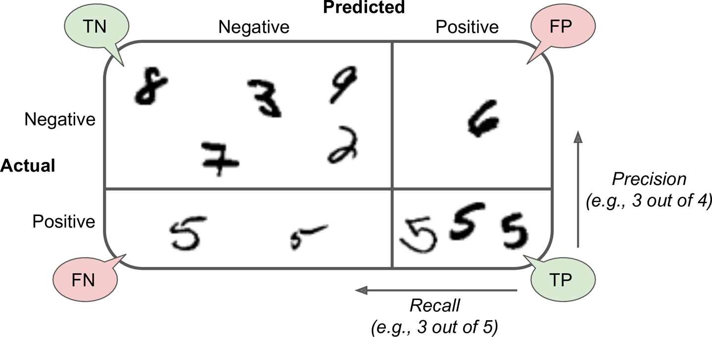


Precision and Recall
--------------------

Scikit-Learn[]{#SLmetrics03} provides several functions to compute
classifier metrics, including precision and recall:

``` {data-type="programlisting" code-language="pycon"}
>>> from sklearn.metrics import precision_score, recall_score
>>> precision_score(y_train_5, y_train_pred) # == 4096 / (4096 + 1522)
0.7290850836596654
>>> recall_score(y_train_5, y_train_pred) # == 4096 / (4096 + 1325)
0.7555801512636044
```

Now your 5-detector does not look as shiny as it did when you looked at
its accuracy. When it claims an image represents a 5, it is correct only
72.9% of the time. Moreover, it only detects 75.6% of the 5s.

It is often convenient to combine precision and recall into a single
metric
called[]{#idm45728487626856}[]{#idm45728487618280}[]{#idm45728487617608}
the *F~1~ score*, in particular if you need a simple way to compare two
classifiers. The F~1~ score is the *harmonic mean* of precision and
recall ([Equation
3-3](https://learning.oreilly.com/library/view/hands-on-machine-learning/9781492032632/ch03.html#equation_three_three)).
Whereas the regular mean treats all values equally, the harmonic mean
gives much more weight to low values. As a result, the classifier will
only get a high F~1~ score if both recall and precision are high.


##### [Equation 3-3. ] F~1~

[]{.MathJax_Preview style="color: inherit; display: none;"}


[[[[[[[[[[F[]{style="display: inline-block; overflow: hidden; height: 1px; width: 0.105em;"}]{#MathJax-Span-283
.mi
style="font-family: MathJax_Math-italic;"}[]{style="display: inline-block; width: 0px; height: 4.013em;"}]{style="position: absolute; clip: rect(3.19em, 1000.73em, 4.167em, -1000.01em); top: -4.008em; left: 0em;"}[[1]{#MathJax-Span-284
.mn
style="font-size: 70.7%; font-family: MathJax_Main;"}[]{style="display: inline-block; width: 0px; height: 4.013em;"}]{style="position: absolute; top: -3.854em; left: 0.671em;"}]{style="display: inline-block; position: relative; width: 1.082em; height: 0px;"}]{#MathJax-Span-282
.msub}[=]{#MathJax-Span-285 .mo
style="font-family: MathJax_Main; padding-left: 0.26em;"}[[[[2]{#MathJax-Span-287
.mn
style="font-family: MathJax_Main;"}[]{style="display: inline-block; width: 0px; height: 4.013em;"}]{style="position: absolute; clip: rect(3.19em, 1000.47em, 4.167em, -1000.01em); top: -4.676em; left: 50%; margin-left: -0.255em;"}[[[[[[1]{#MathJax-Span-290
.mn
style="font-size: 70.7%; font-family: MathJax_Main;"}[]{style="display: inline-block; width: 0px; height: 4.013em;"}]{style="position: absolute; clip: rect(3.396em, 1000.32em, 4.167em, -1000.01em); top: -4.419em; left: 50%; margin-left: -0.152em;"}[[precision]{#MathJax-Span-291
.mtext
style="font-size: 70.7%; font-family: MathJax_Main;"}[]{style="display: inline-block; width: 0px; height: 4.013em;"}]{style="position: absolute; clip: rect(3.396em, 1002.68em, 4.321em, -1000.01em); top: -3.648em; left: 50%; margin-left: -1.334em;"}[[]{style="display: inline-block; overflow: hidden; vertical-align: 0em; border-top: 1.3px solid; width: 2.83em; height: 0px;"}[]{style="display: inline-block; width: 0px; height: 1.082em;"}]{style="position: absolute; clip: rect(0.877em, 1002.84em, 1.237em, -1000.01em); top: -1.283em; left: 0em;"}]{style="display: inline-block; position: relative; width: 2.83em; height: 0px; margin-right: 0.105em; margin-left: 0.105em;"}]{#MathJax-Span-289
.mfrac}[+]{#MathJax-Span-292 .mo
style="font-family: MathJax_Main; padding-left: 0.208em;"}[[[[1]{#MathJax-Span-294
.mn
style="font-size: 70.7%; font-family: MathJax_Main;"}[]{style="display: inline-block; width: 0px; height: 4.013em;"}]{style="position: absolute; clip: rect(3.396em, 1000.32em, 4.167em, -1000.01em); top: -4.419em; left: 50%; margin-left: -0.152em;"}[[recall]{#MathJax-Span-295
.mtext
style="font-size: 70.7%; font-family: MathJax_Main;"}[]{style="display: inline-block; width: 0px; height: 4.013em;"}]{style="position: absolute; clip: rect(3.345em, 1001.66em, 4.167em, -1000.01em); top: -3.596em; left: 50%; margin-left: -0.82em;"}[[]{style="display: inline-block; overflow: hidden; vertical-align: 0em; border-top: 1.3px solid; width: 1.751em; height: 0px;"}[]{style="display: inline-block; width: 0px; height: 1.082em;"}]{style="position: absolute; clip: rect(0.877em, 1001.76em, 1.237em, -1000.01em); top: -1.283em; left: 0em;"}]{style="display: inline-block; position: relative; width: 1.751em; height: 0px; margin-right: 0.105em; margin-left: 0.105em;"}]{#MathJax-Span-293
.mfrac style="padding-left: 0.208em;"}]{#MathJax-Span-288
.mrow}[]{style="display: inline-block; width: 0px; height: 4.013em;"}]{style="position: absolute; clip: rect(2.985em, 1006.28em, 4.681em, -1000.01em); top: -3.185em; left: 50%; margin-left: -3.134em;"}[[]{style="display: inline-block; overflow: hidden; vertical-align: 0em; border-top: 1.3px solid; width: 6.429em; height: 0px;"}[]{style="display: inline-block; width: 0px; height: 1.082em;"}]{style="position: absolute; clip: rect(0.877em, 1006.39em, 1.237em, -1000.01em); top: -1.283em; left: 0em;"}]{style="display: inline-block; position: relative; width: 6.429em; height: 0px; margin-right: 0.105em; margin-left: 0.105em;"}]{#MathJax-Span-286
.mfrac style="padding-left: 0.26em;"}[=]{#MathJax-Span-296 .mo
style="font-family: MathJax_Main; padding-left: 0.26em;"}[2]{#MathJax-Span-297
.mn
style="font-family: MathJax_Main; padding-left: 0.26em;"}[×]{#MathJax-Span-298
.mo
style="font-family: MathJax_Main; padding-left: 0.208em;"}[[[[[precision]{#MathJax-Span-301
.mtext style="font-family: MathJax_Main;"}[]{#MathJax-Span-302 .mspace
style="height: 0em; vertical-align: 0em; width: 0.157em; display: inline-block; overflow: hidden;"}[×]{#MathJax-Span-303
.mo
style="font-family: MathJax_Main; padding-left: 0.208em;"}[]{#MathJax-Span-304
.mspace
style="height: 0em; vertical-align: 0em; width: 0.157em; display: inline-block; overflow: hidden;"}[recall]{#MathJax-Span-305
.mtext
style="font-family: MathJax_Main; padding-left: 0.208em;"}]{#MathJax-Span-300
.mrow}[]{style="display: inline-block; width: 0px; height: 4.013em;"}]{style="position: absolute; clip: rect(3.19em, 1007.67em, 4.373em, -1000.01em); top: -4.676em; left: 50%; margin-left: -3.854em;"}[[[precision]{#MathJax-Span-307
.mtext style="font-family: MathJax_Main;"}[]{#MathJax-Span-308 .mspace
style="height: 0em; vertical-align: 0em; width: 0.157em; display: inline-block; overflow: hidden;"}[+]{#MathJax-Span-309
.mo
style="font-family: MathJax_Main; padding-left: 0.208em;"}[]{#MathJax-Span-310
.mspace
style="height: 0em; vertical-align: 0em; width: 0.157em; display: inline-block; overflow: hidden;"}[recall]{#MathJax-Span-311
.mtext
style="font-family: MathJax_Main; padding-left: 0.208em;"}]{#MathJax-Span-306
.mrow}[]{style="display: inline-block; width: 0px; height: 4.013em;"}]{style="position: absolute; clip: rect(3.19em, 1007.67em, 4.373em, -1000.01em); top: -3.339em; left: 50%; margin-left: -3.854em;"}[[]{style="display: inline-block; overflow: hidden; vertical-align: 0em; border-top: 1.3px solid; width: 7.818em; height: 0px;"}[]{style="display: inline-block; width: 0px; height: 1.082em;"}]{style="position: absolute; clip: rect(0.877em, 1007.83em, 1.237em, -1000.01em); top: -1.283em; left: 0em;"}]{style="display: inline-block; position: relative; width: 7.818em; height: 0px; margin-right: 0.105em; margin-left: 0.105em;"}]{#MathJax-Span-299
.mfrac}[=]{#MathJax-Span-312 .mo
style="font-family: MathJax_Main; padding-left: 0.26em;"}[[[[[T[]{style="display: inline-block; overflow: hidden; height: 1px; width: 0.105em;"}]{#MathJax-Span-315
.mi
style="font-family: MathJax_Math-italic;"}[P[]{style="display: inline-block; overflow: hidden; height: 1px; width: 0.105em;"}]{#MathJax-Span-316
.mi style="font-family: MathJax_Math-italic;"}]{#MathJax-Span-314
.mrow}[]{style="display: inline-block; width: 0px; height: 4.013em;"}]{style="position: absolute; clip: rect(3.19em, 1001.45em, 4.167em, -1000.01em); top: -4.676em; left: 50%; margin-left: -0.717em;"}[[[T[]{style="display: inline-block; overflow: hidden; height: 1px; width: 0.105em;"}]{#MathJax-Span-318
.mi
style="font-family: MathJax_Math-italic;"}[P[]{style="display: inline-block; overflow: hidden; height: 1px; width: 0.105em;"}]{#MathJax-Span-319
.mi style="font-family: MathJax_Math-italic;"}[+]{#MathJax-Span-320 .mo
style="font-family: MathJax_Main; padding-left: 0.208em;"}[[[[[F[]{style="display: inline-block; overflow: hidden; height: 1px; width: 0.054em;"}]{#MathJax-Span-323
.mi
style="font-size: 70.7%; font-family: MathJax_Math-italic;"}[N[]{style="display: inline-block; overflow: hidden; height: 1px; width: 0.054em;"}]{#MathJax-Span-324
.mi
style="font-size: 70.7%; font-family: MathJax_Math-italic;"}[+]{#MathJax-Span-325
.mo
style="font-size: 70.7%; font-family: MathJax_Main;"}[F[]{style="display: inline-block; overflow: hidden; height: 1px; width: 0.054em;"}]{#MathJax-Span-326
.mi
style="font-size: 70.7%; font-family: MathJax_Math-italic;"}[P[]{style="display: inline-block; overflow: hidden; height: 1px; width: 0.054em;"}]{#MathJax-Span-327
.mi
style="font-size: 70.7%; font-family: MathJax_Math-italic;"}]{#MathJax-Span-322
.mrow}[]{style="display: inline-block; width: 0px; height: 4.013em;"}]{style="position: absolute; clip: rect(3.396em, 1002.79em, 4.219em, -1000.01em); top: -4.47em; left: 50%; margin-left: -1.386em;"}[[2]{#MathJax-Span-328
.mn
style="font-size: 70.7%; font-family: MathJax_Main;"}[]{style="display: inline-block; width: 0px; height: 4.013em;"}]{style="position: absolute; clip: rect(3.396em, 1000.32em, 4.167em, -1000.01em); top: -3.648em; left: 50%; margin-left: -0.152em;"}[[]{style="display: inline-block; overflow: hidden; vertical-align: 0em; border-top: 1.3px solid; width: 2.882em; height: 0px;"}[]{style="display: inline-block; width: 0px; height: 1.082em;"}]{style="position: absolute; clip: rect(0.877em, 1002.89em, 1.237em, -1000.01em); top: -1.283em; left: 0em;"}]{style="display: inline-block; position: relative; width: 2.882em; height: 0px; margin-right: 0.105em; margin-left: 0.105em;"}]{#MathJax-Span-321
.mfrac style="padding-left: 0.208em;"}]{#MathJax-Span-317
.mrow}[]{style="display: inline-block; width: 0px; height: 4.013em;"}]{style="position: absolute; clip: rect(2.933em, 1005.77em, 4.527em, -1000.01em); top: -3.082em; left: 50%; margin-left: -2.877em;"}[[]{style="display: inline-block; overflow: hidden; vertical-align: 0em; border-top: 1.3px solid; width: 5.915em; height: 0px;"}[]{style="display: inline-block; width: 0px; height: 1.082em;"}]{style="position: absolute; clip: rect(0.877em, 1005.92em, 1.237em, -1000.01em); top: -1.283em; left: 0em;"}]{style="display: inline-block; position: relative; width: 5.915em; height: 0px; margin-right: 0.105em; margin-left: 0.105em;"}]{#MathJax-Span-313
.mfrac style="padding-left: 0.26em;"}]{#MathJax-Span-281
.mrow}]{#MathJax-Span-280
.mrow}[]{style="display: inline-block; width: 0px; height: 2.111em;"}]{style="position: absolute; clip: rect(0.568em, 1027.26em, 3.653em, -1000.01em); top: -2.105em; left: 0em;"}]{style="display: inline-block; position: relative; width: 27.252em; height: 0px; font-size: 103%;"}[]{style="display: inline-block; overflow: hidden; vertical-align: -1.48em; border-left: 0px solid; width: 0px; height: 2.915em;"}]{#MathJax-Span-279
.math
style="width: 28.075em; display: inline-block;"}[$$\mathit{F}_{1} = \frac{2}{\frac{1}{\text{precision}} + \frac{1}{\text{recall}}} = 2 \times \frac{\text{precision}\, \times \,\text{recall}}{\text{precision}\, + \,\text{recall}} = \frac{TP}{TP + \frac{FN + FP}{2}}$$]{.MJX_Assistive_MathML
.MJX_Assistive_MathML_Block
role="presentation"}]{#MathJax-Element-9-Frame .MathJax tabindex="0"
mathml="<math xmlns=\"http://www.w3.org/1998/Math/MathML\" display=\"block\"><mrow><msub><mi mathvariant=\"italic\">F</mi><mn>1</mn></msub><mo>=</mo><mfrac><mn>2</mn><mrow><mfrac><mn>1</mn><mtext>precision</mtext></mfrac><mo>+</mo><mfrac><mn>1</mn><mtext>recall</mtext></mfrac></mrow></mfrac><mo>=</mo><mn>2</mn><mo>&#xD7;</mo><mfrac><mrow><mtext>precision</mtext><mspace width=\"0.166667em\" /><mo>&#xD7;</mo><mspace width=\"0.166667em\" /><mtext>recall</mtext></mrow><mrow><mtext>precision</mtext><mspace width=\"0.166667em\" /><mo>+</mo><mspace width=\"0.166667em\" /><mtext>recall</mtext></mrow></mfrac><mo>=</mo><mfrac><mrow><mi>T</mi><mi>P</mi></mrow><mrow><mi>T</mi><mi>P</mi><mo>+</mo><mfrac><mrow><mi>F</mi><mi>N</mi><mo>+</mo><mi>F</mi><mi>P</mi></mrow><mn>2</mn></mfrac></mrow></mfrac></mrow></math>"
role="presentation" style="text-align: center; position: relative;"}


To compute the F~1~ score, simply call the `f1_score()` function:

``` {data-type="programlisting" code-language="pycon"}
>>> from sklearn.metrics import f1_score
>>> f1_score(y_train_5, y_train_pred)
0.7420962043663375
```

The F~1~ score favors classifiers that have similar precision and
recall. This is not always what you want: in some contexts you mostly
care about precision, and in other contexts you really care about
recall. For example, if you trained a classifier to detect videos that
are safe for kids, you would probably prefer a classifier that rejects
many good videos (low recall) but keeps only safe ones (high precision),
rather than a classifier that has a much higher recall but lets a few
really bad videos show up in your product (in such cases, you may even
want to add a human pipeline to check the classifier's video selection).
On the other hand, suppose you train a classifier to detect shoplifters
in surveillance images: it is probably fine if your classifier has only
30% precision as long as it has 99% recall (sure, the security guards
will get a few false alerts, but almost all shoplifters will get
caught).

Unfortunately, you can't have it both ways: increasing precision reduces
recall, and vice versa. This is called the *precision/recall trade-off*.


Precision/Recall Trade-off
--------------------------

To understand this trade-off, let's look at how the `SGDClassifier`
makes its classification decisions.[]{#idm45728487544520} For each
instance, it computes a score based on a *decision function*. If that
score is greater than a threshold, it assigns the instance to the
positive class; otherwise it assigns it to the negative class.
[Figure 3-3](https://learning.oreilly.com/library/view/hands-on-machine-learning/9781492032632/ch03.html#decision_threshold_diagram)
shows a few digits positioned from the lowest score on the left to the
highest score on the right. Suppose the *decision threshold* is
positioned at the central arrow (between the two 5s): you will find 4
true positives (actual 5s) on the right of that threshold, and 1 false
positive (actually a 6). Therefore, with that threshold, the precision
is 80% (4 out of 5). But out of 6 actual 5s, the classifier only detects
4, so the recall is 67% (4 out of 6). If you raise the threshold (move
it to the arrow on the right), the false positive (the 6) becomes a true
negative, thereby increasing the precision (up to 100% in this case),
but one true positive becomes a false negative, decreasing recall down
to 50%. Conversely, lowering the threshold increases recall and reduces
precision.


Scikit-Learn does not let you set the threshold directly, but it does
give you access to the decision scores that it uses to make predictions.
Instead of calling the classifier's `predict()` method, you can call its
`decision_function()` method, which returns a score for each instance,
and then use any threshold you want to make predictions based on those
scores:

``` {data-type="programlisting" code-language="pycon"}
>>> y_scores = sgd_clf.decision_function([some_digit])
>>> y_scores
array([2412.53175101])
>>> threshold = 0
>>> y_some_digit_pred = (y_scores > threshold)
array([ True])
```

The `SGDClassifier` uses a threshold equal to 0, so the previous code
returns the same result as the `predict()` method (i.e., `True`). Let's
raise the threshold:

``` {data-type="programlisting" code-language="pycon"}
>>> threshold = 8000
>>> y_some_digit_pred = (y_scores > threshold)
>>> y_some_digit_pred
array([False])
```

This confirms that raising the threshold decreases recall. The image
actually represents a 5, and the classifier detects it when the
threshold is 0, but it misses it when the threshold is increased to
8,000.

How do you decide which threshold to use? First, use the
`cross_val_predict()` function to get the scores of all instances in the
training set, but this time specify that you want to return decision
scores instead of predictions:

``` {data-type="programlisting" code-language="python"}
y_scores = cross_val_predict(sgd_clf, X_train, y_train_5, cv=3,
                             method="decision_function")
```

With these scores, use the `precision_recall_curve()` function to
compute precision and recall for all possible thresholds:

``` {data-type="programlisting" code-language="python"}
from sklearn.metrics import precision_recall_curve

precisions, recalls, thresholds = precision_recall_curve(y_train_5, y_scores)
```

Finally, use Matplotlib to plot precision and recall as functions of the
threshold value
([Figure 3-4](https://learning.oreilly.com/library/view/hands-on-machine-learning/9781492032632/ch03.html#precision_recall_vs_threshold_plot)):

``` {data-type="programlisting" code-language="python"}
def plot_precision_recall_vs_threshold(precisions, recalls, thresholds):
    plt.plot(thresholds, precisions[:-1], "b--", label="Precision")
    plt.plot(thresholds, recalls[:-1], "g-", label="Recall")
    [...] # highlight the threshold and add the legend, axis label, and grid

plot_precision_recall_vs_threshold(precisions, recalls, thresholds)
plt.show()
```


###### Note

You may wonder why the precision curve is bumpier than the recall curve
in
[Figure 3-4](https://learning.oreilly.com/library/view/hands-on-machine-learning/9781492032632/ch03.html#precision_recall_vs_threshold_plot).
The reason is that precision may sometimes go down when you raise the
threshold (although in general it will go up). To understand why, look
back at
[Figure 3-3](https://learning.oreilly.com/library/view/hands-on-machine-learning/9781492032632/ch03.html#decision_threshold_diagram)
and notice what happens when you start from the central threshold and
move it just one digit to the right: precision goes from 4/5 (80%) down
to 3/4 (75%). On the other hand, recall can only go down when the
threshold is increased, which explains why its curve looks smooth.


Another way to select a good precision/recall trade-off is to plot
precision directly against recall, as shown in
[Figure 3-5](https://learning.oreilly.com/library/view/hands-on-machine-learning/9781492032632/ch03.html#precision_vs_recall_plot)
(the same threshold as earlier is highlighted).

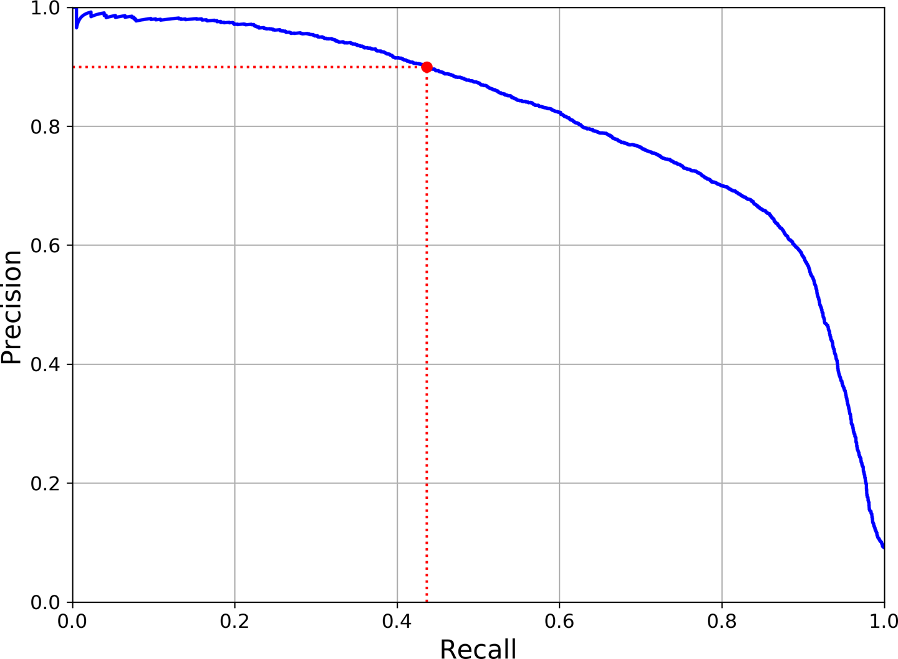

You can see that precision really starts to fall sharply around 80%
recall. You will probably want to select a precision/recall trade-off
just before that drop---for example, at around 60% recall. But of
course, the choice depends on your project.

Suppose you decide to aim for 90% precision. You look up the first plot
and find that you need to use a threshold of about 8,000. To be more
precise you can search for the lowest threshold that gives you at least
90% precision (`np.argmax()` will give you the first index of the
maximum value, which in this case means the first `True` value):

``` {data-type="programlisting" code-language="python"}
threshold_90_precision = thresholds[np.argmax(precisions >= 0.90)] # ~7816
```

To make predictions (on the training set for now), instead of calling
the classifier's `predict()` method, you can run this code:

``` {data-type="programlisting" code-language="python"}
y_train_pred_90 = (y_scores >= threshold_90_precision)
```

Let's check these predictions' precision and recall:

``` {data-type="programlisting" code-language="pycon"}
>>> precision_score(y_train_5, y_train_pred_90)
0.9000380083618396
>>> recall_score(y_train_5, y_train_pred_90)
0.4368197749492714
```

Great, you have a 90% precision classifier! As you can see, it is fairly
easy to create a classifier with virtually any precision you want: just
set a high enough threshold, and you're done. But wait, not so fast. A
high-precision classifier is not very useful if its recall is too low!


###### Tip

If someone says, "Let's reach 99% precision," you should ask, "At what
recall?"[]{#idm45728487178856}[]{#idm45728487177880}[]{#idm45728487176936}[]{#idm45728487175992}


The ROC Curve
-------------

The *receiver operating characteristic* (ROC)
curve[]{#idm45728487153096}[]{#idm45728487152120} is another common tool
used with binary classifiers. It is very similar to the precision/recall
curve, but instead of plotting precision versus recall, the ROC curve
plots the *true positive rate* (another name for recall) against the
*false positive rate* (FPR).
The[]{#idm45728487150360}[]{#idm45728487149656} FPR is the ratio of
negative instances that are incorrectly classified as positive. It is
equal to 1 -- the *true negative rate* (TNR), which is the ratio of
negative instances that are correctly classified as negative. The TNR is
also called *specificity*. Hence, the ROC curve plots *sensitivity*
(recall) versus [1 -- *specificity*].

To plot the ROC curve, you first use the `roc_curve()` function to
compute the TPR and FPR for various threshold values:

``` {data-type="programlisting" code-language="python"}
from sklearn.metrics import roc_curve

fpr, tpr, thresholds = roc_curve(y_train_5, y_scores)
```

Then you can plot the FPR against the TPR using Matplotlib. This code
produces the plot in
[Figure 3-6](https://learning.oreilly.com/library/view/hands-on-machine-learning/9781492032632/ch03.html#roc_curve_plot):

``` {data-type="programlisting" code-language="python"}
def plot_roc_curve(fpr, tpr, label=None):
    plt.plot(fpr, tpr, linewidth=2, label=label)
    plt.plot([0, 1], [0, 1], 'k--') # Dashed diagonal
    [...] # Add axis labels and grid

plot_roc_curve(fpr, tpr)
plt.show()
```

Once again there is a trade-off: the higher the recall (TPR), the more
false positives (FPR) the classifier produces. The dotted line
represents the ROC curve of a purely random classifier; a good
classifier stays as far away from that line as possible (toward the
top-left corner).

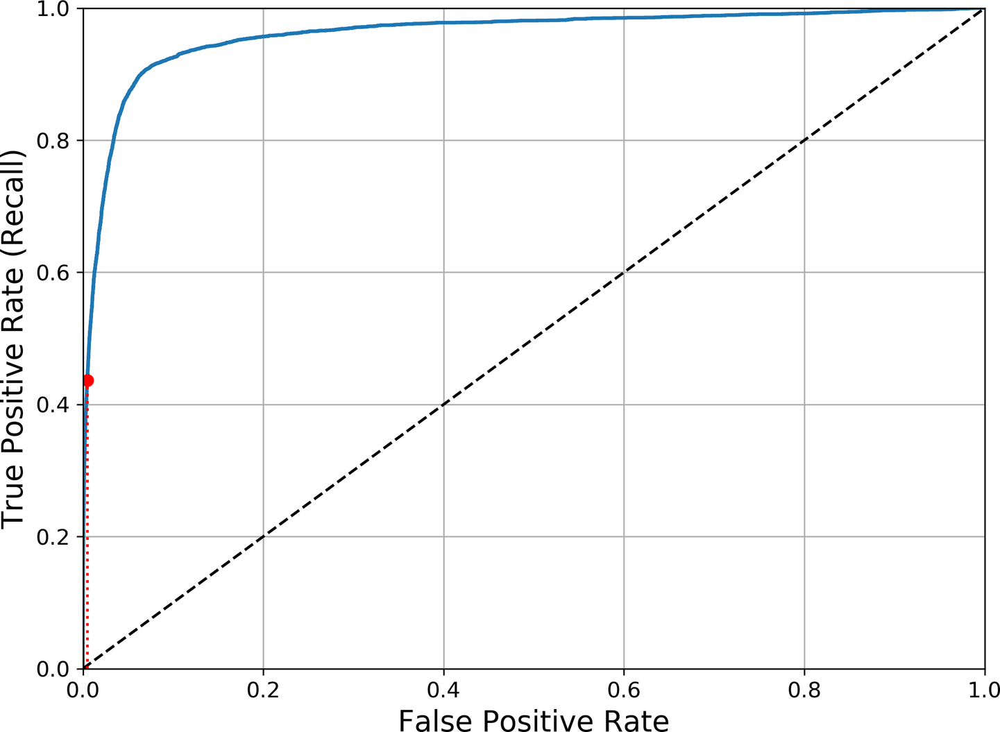

One[]{#idm45728487008408}[]{#idm45728487007704} way to compare
classifiers is to measure the *area under the curve* (AUC). A perfect
classifier will have a ROC AUC equal to 1, whereas a purely random
classifier will have a ROC AUC equal to 0.5. Scikit-Learn provides a
function to compute the ROC AUC:

``` {data-type="programlisting" code-language="pycon"}
>>> from sklearn.metrics import roc_auc_score
>>> roc_auc_score(y_train_5, y_scores)
0.9611778893101814
```


###### Tip

Since the ROC curve is so similar to the precision/recall (PR) curve,
you may wonder how to decide which one to use. As a rule of thumb, you
should prefer the PR curve whenever the positive class is rare or when
you care more about the false positives than the false negatives.
Otherwise, use the ROC curve. For example, looking at the previous ROC
curve (and the ROC AUC score), you may think that the classifier is
really good. But this is mostly because there are few positives (5s)
compared to the negatives (non-5s). In contrast, the PR curve makes it
clear that the classifier has room for improvement (the curve could be
closer to the top-right corner).


Let's now train a `RandomForestClassifier` and compare its ROC curve and
ROC AUC score to those of the `SGDClassifier`. First, you need to get
scores for each instance in the training set. But due to the way it
works (see
[Lab 7](https://learning.oreilly.com/library/view/hands-on-machine-learning/9781492032632/ch07.html#ensembles_lab)),
the `RandomForestClassifier` class does not have a `decision_function()`
method. Instead, it has a `predict_proba()` method. Scikit-Learn
classifiers generally have one or the other, or both. The
`predict_proba()` method returns an array containing a row per instance
and a column per class, each containing the probability that the given
instance belongs to the given class (e.g., 70% chance that the image
represents a 5):

``` {data-type="programlisting" code-language="python"}
from sklearn.ensemble import RandomForestClassifier

forest_clf = RandomForestClassifier(random_state=42)
y_probas_forest = cross_val_predict(forest_clf, X_train, y_train_5, cv=3,
                                    method="predict_proba")
```

The `roc_curve()` function expects labels and scores, but instead of
scores you can give it class probabilities. Let's use the positive
class's probability as the score:

``` {data-type="programlisting" code-language="python"}
y_scores_forest = y_probas_forest[:, 1]   # score = proba of positive class
fpr_forest, tpr_forest, thresholds_forest = roc_curve(y_train_5,y_scores_forest)
```

Now you are ready to plot the ROC curve. It is useful to plot the first
ROC curve as well to see how they compare
([Figure 3-7](https://learning.oreilly.com/library/view/hands-on-machine-learning/9781492032632/ch03.html#roc_curve_comparison_plot)):

``` {data-type="programlisting" code-language="python"}
plt.plot(fpr, tpr, "b:", label="SGD")
plot_roc_curve(fpr_forest, tpr_forest, "Random Forest")
plt.legend(loc="lower right")
plt.show()
```

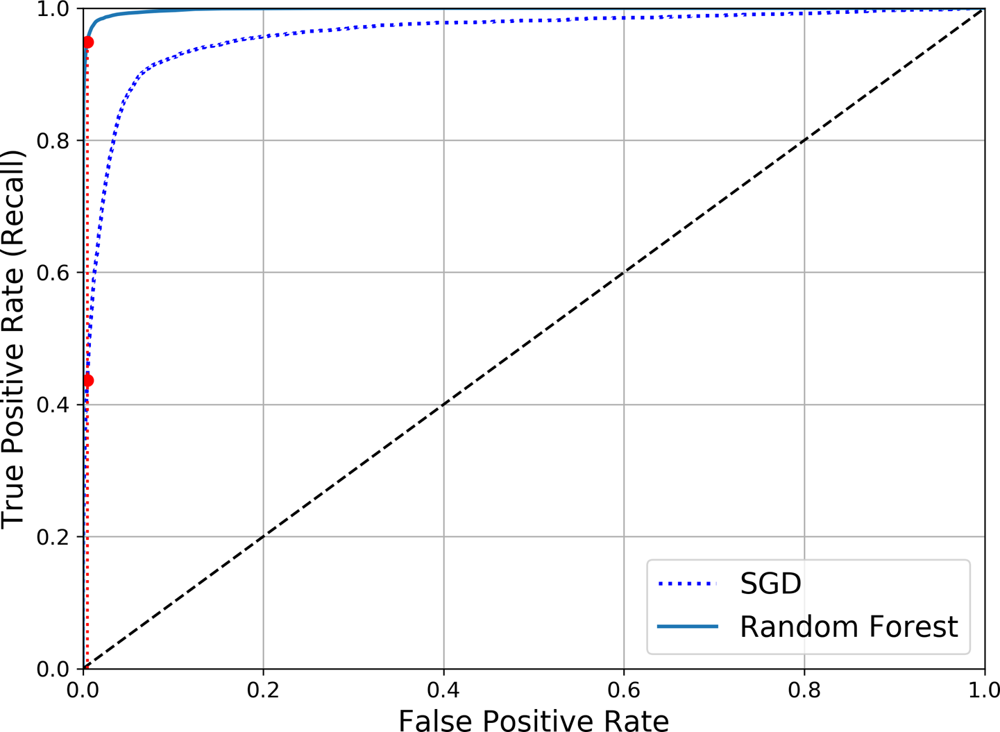

As you can see in
[Figure 3-7](https://learning.oreilly.com/library/view/hands-on-machine-learning/9781492032632/ch03.html#roc_curve_comparison_plot),
the `RandomForestClassifier`'s ROC curve looks much better than the
`SGDClassifier`'s: it comes much closer to the top-left corner. As a
result, its ROC AUC score is also significantly better:

``` {data-type="programlisting" code-language="pycon"}
>>> roc_auc_score(y_train_5, y_scores_forest)
0.9983436731328145
```

Try measuring the precision and recall scores: you should find 99.0%
precision and 86.6% recall. Not too bad!

You now know how to train binary classifiers, choose the appropriate
metric for your task, evaluate your classifiers using cross-validation,
select the precision/recall trade-off that fits your needs, and use ROC
curves and ROC AUC scores to compare various models. Now let's try to
detect more than just the 5s.[]{#idm45728486802040}


Multiclass Classification
=========================

Whereas[]{#idm45728486800808}[]{#idm45728486797672}[]{#idm45728486797032}
binary classifiers distinguish between two classes, *multiclass
classifiers* (also called *multinomial classifiers*) can distinguish
between more than two classes.

Some algorithms (such as Logistic Regression classifiers, Random Forest
classifiers, and naive Bayes classifiers) are capable of handling
multiple classes natively. Others (such as SGD Classifiers or Support
Vector Machine classifiers) are strictly binary classifiers. However,
there are various strategies that you can use to perform multiclass
classification with multiple binary classifiers.

One way to create a system that can classify the digit images into 10
classes (from 0 to 9) is to train 10 binary classifiers, one for each
digit (a 0-detector, a 1-detector, a 2-detector, and so on). Then when
you want to classify an image, you get the decision score from each
classifier for that image and you select the class whose classifier
outputs the highest score.
This[]{#idm45728486793752}[]{#idm45728486793080} is called the
*one-versus-the-rest* (OvR) strategy (also called *one-versus-all*).

Another strategy[]{#idm45728486785128} is to train a binary classifier
for every pair of digits: one to distinguish 0s and 1s, another to
distinguish 0s and 2s, another for 1s and 2s, and so on. This is called
the *one-versus-one* (OvO) strategy. If there are *N* classes, you need
to train *N* × (*N* -- 1) / 2 classifiers. For the MNIST problem, this
means training 45 binary classifiers! When you want to classify an
image, you have to run the image through all 45 classifiers and see
which class wins the most duels. The main advantage of OvO is that each
classifier only needs to be trained on the part of the training set for
the two classes that it must distinguish.

Some algorithms (such as Support Vector Machine classifiers) scale
poorly with the size of the training set. For these algorithms OvO is
preferred because it is faster to train many classifiers on small
training sets than to train few classifiers on large training sets. For
most binary classification algorithms, however, OvR is preferred.

Scikit-Learn detects when you try to use a binary classification
algorithm for a multiclass classification task, and it automatically
runs OvR or OvO, depending on the algorithm. Let's try this with a
Support Vector Machine classifier (see
[Lab 5](https://learning.oreilly.com/library/view/hands-on-machine-learning/9781492032632/ch05.html#svm_lab)),
using the `sklearn.svm.SVC` class:

``` {data-type="programlisting" code-language="pycon"}
>>> from sklearn.svm import SVC
>>> svm_clf = SVC()
>>> svm_clf.fit(X_train, y_train) # y_train, not y_train_5
>>> svm_clf.predict([some_digit])
array([5], dtype=uint8)
```

That was easy! This code trains the `SVC` on the training set using the
original target classes from 0 to 9 (`y_train`), instead of the
5-versus-the-rest target classes (`y_train_5`). Then it makes a
prediction (a correct one in this case). Under the hood, Scikit-Learn
actually used the OvO strategy: it trained 45 binary classifiers, got
their decision scores for the image, and selected the class that won the
most duels.

If you call the `decision_function()` method, you will see that it
returns 10 scores per instance (instead of just 1). That's one score per
class:

``` {data-type="programlisting" code-language="pycon"}
>>> some_digit_scores = svm_clf.decision_function([some_digit])
>>> some_digit_scores
array([[ 2.92492871,  7.02307409,  3.93648529,  0.90117363,  5.96945908,
         9.5       ,  1.90718593,  8.02755089, -0.13202708,  4.94216947]])
```

The highest score is indeed the one corresponding to class `5`:

``` {data-type="programlisting" code-language="pycon"}
>>> np.argmax(some_digit_scores)
5
>>> svm_clf.classes_
array([0, 1, 2, 3, 4, 5, 6, 7, 8, 9], dtype=uint8)
>>> svm_clf.classes_[5]
5
```


###### Warning

When a classifier is trained, it stores the list of target classes in
its `classes_` attribute, ordered by value. In this case, the index of
each class in the `classes_` array conveniently matches the class itself
(e.g., the class at index 5 happens to be class `5`), but in general you
won't be so lucky.


If you want to force Scikit-Learn to use one-versus-one or
one-versus-the-rest, you can use the `OneVsOneClassifier` or
`OneVsRestClassifier` classes. Simply create an instance and pass a
classifier to its constructor (it does not even have to be a binary
classifier). For example, this code creates a multiclass classifier
using the OvR strategy, based on an `SVC`:

``` {data-type="programlisting" code-language="pycon"}
>>> from sklearn.multiclass import OneVsRestClassifier
>>> ovr_clf = OneVsRestClassifier(SVC())
>>> ovr_clf.fit(X_train, y_train)
>>> ovr_clf.predict([some_digit])
array([5], dtype=uint8)
>>> len(ovr_clf.estimators_)
10
```

Training an `SGDClassifier` is just as easy:

``` {data-type="programlisting" code-language="pycon"}
>>> sgd_clf.fit(X_train, y_train)
>>> sgd_clf.predict([some_digit])
array([5], dtype=uint8)
```

This time Scikit-Learn used the OvR strategy under the hood: since there
are 10 classes, it trained 10 binary classifiers. The
`decision_function()` method now returns one value per class. Let's look
at the score that the SGD classifier assigned to each class:

``` {data-type="programlisting" code-language="pycon"}
>>> sgd_clf.decision_function([some_digit])
array([[-15955.22628, -38080.96296, -13326.66695,   573.52692, -17680.68466,
          2412.53175, -25526.86498, -12290.15705, -7946.05205, -10631.35889]])
```

You can see that the classifier is fairly confident about its
prediction: almost all scores are largely negative, while class `5` has
a score of 2412.5. The model has a slight doubt regarding class `3`,
which gets a score of 573.5. Now of course you want to evaluate this
classifier. As usual, you can use cross-validation. Use the
`cross_val_score()` function to evaluate the `SGDClassifier`'s accuracy:

``` {data-type="programlisting" code-language="pycon"}
>>> cross_val_score(sgd_clf, X_train, y_train, cv=3, scoring="accuracy")
array([0.8489802 , 0.87129356, 0.86988048])
```

It gets over 84% on all test folds. If you used a random classifier, you
would get 10% accuracy, so this is not such a bad score, but you can
still do much better. Simply scaling the inputs (as discussed in
[Lab 2](https://learning.oreilly.com/library/view/hands-on-machine-learning/9781492032632/ch02.html#project_lab))
increases accuracy above 89%:

``` {data-type="programlisting" code-language="pycon"}
>>> from sklearn.preprocessing import StandardScaler
>>> scaler = StandardScaler()
>>> X_train_scaled = scaler.fit_transform(X_train.astype(np.float64))
>>> cross_val_score(sgd_clf, X_train_scaled, y_train, cv=3, scoring="accuracy")
array([0.89707059, 0.8960948 , 0.90693604])
```


Error Analysis
==============

If[]{#idm45728486358088}[]{#idm45728486357080} this were a real project,
you would now follow the steps in your Machine Learning project
checklist (see
[Appendix B](https://learning.oreilly.com/library/view/hands-on-machine-learning/9781492032632/app02.html#project_checklist_appendix)).
You'd explore data preparation options, try out multiple models
(shortlisting the best ones and fine-tuning their hyperparameters using
`GridSearchCV`), and automate as much as possible. Here, we will assume
that you have found a promising model and you want to find ways to
improve it. One way to do this is to analyze the types of errors it
makes.

First, look at the confusion matrix. You need to make predictions using
the `cross_val_predict()` function, then call the `confusion_matrix()`
function, just like you did earlier:

``` {data-type="programlisting" code-language="pycon"}
>>> y_train_pred = cross_val_predict(sgd_clf, X_train_scaled, y_train, cv=3)
>>> conf_mx = confusion_matrix(y_train, y_train_pred)
>>> conf_mx
array([[5578,    0,   22,    7,    8,   45,   35,    5,  222,    1],
       [   0, 6410,   35,   26,    4,   44,    4,    8,  198,   13],
       [  28,   27, 5232,  100,   74,   27,   68,   37,  354,   11],
       [  23,   18,  115, 5254,    2,  209,   26,   38,  373,   73],
       [  11,   14,   45,   12, 5219,   11,   33,   26,  299,  172],
       [  26,   16,   31,  173,   54, 4484,   76,   14,  482,   65],
       [  31,   17,   45,    2,   42,   98, 5556,    3,  123,    1],
       [  20,   10,   53,   27,   50,   13,    3, 5696,  173,  220],
       [  17,   64,   47,   91,    3,  125,   24,   11, 5421,   48],
       [  24,   18,   29,   67,  116,   39,    1,  174,  329, 5152]])
```

That's a lot of numbers. It's often more convenient to look at an image
representation of the confusion matrix, using Matplotlib's `matshow()`
function:

``` {data-type="programlisting" code-language="python"}
plt.matshow(conf_mx, cmap=plt.cm.gray)
plt.show()
```

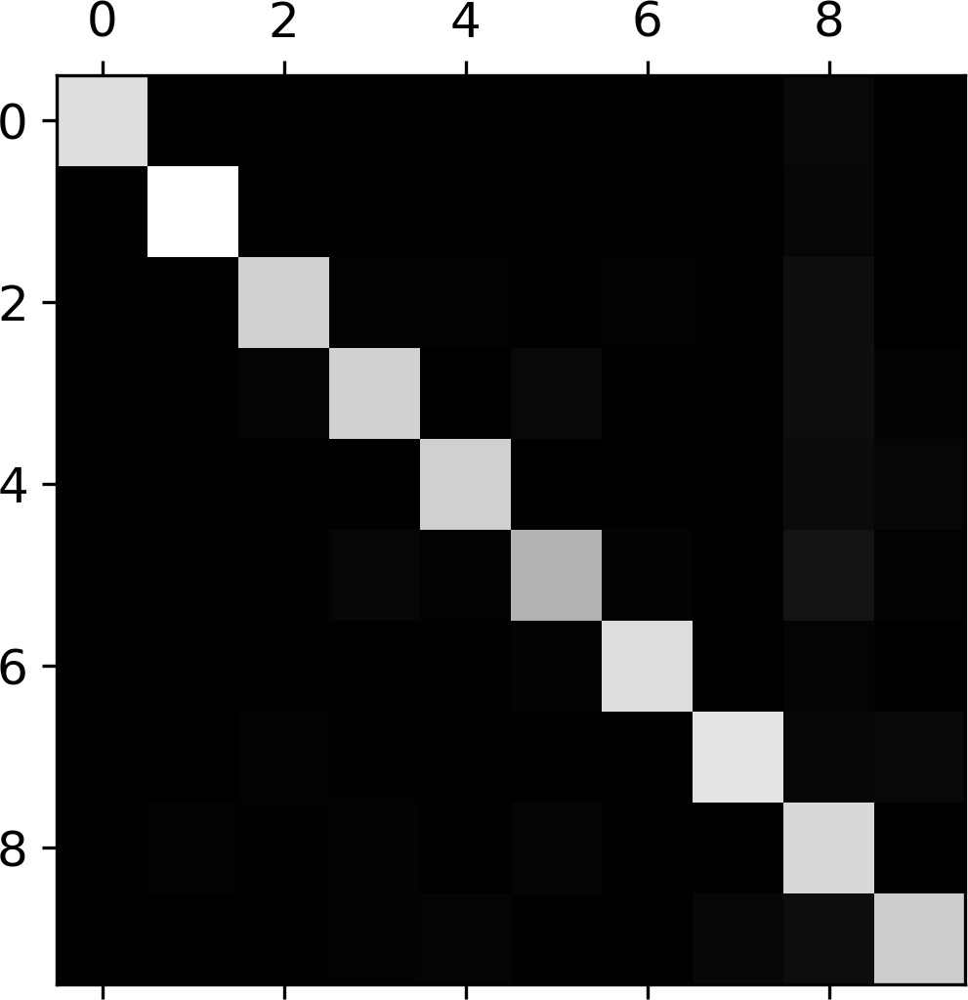

This confusion matrix looks pretty good, since most images are on the
main diagonal, which means that they were classified correctly. The 5s
look slightly darker than the other digits, which could mean that there
are fewer images of 5s in the dataset or that the classifier does not
perform as well on 5s as on other digits. In fact, you can verify that
both are the case.

Let's focus the plot on the errors. First, you need to divide each value
in the confusion matrix by the number of images in the corresponding
class so that you can compare error rates instead of absolute numbers of
errors (which would make abundant classes look unfairly bad):

``` {data-type="programlisting" code-language="python"}
row_sums = conf_mx.sum(axis=1, keepdims=True)
norm_conf_mx = conf_mx / row_sums
```

Fill the diagonal with zeros to keep only the errors, and plot the
result:

``` {data-type="programlisting" code-language="python"}
np.fill_diagonal(norm_conf_mx, 0)
plt.matshow(norm_conf_mx, cmap=plt.cm.gray)
plt.show()
```

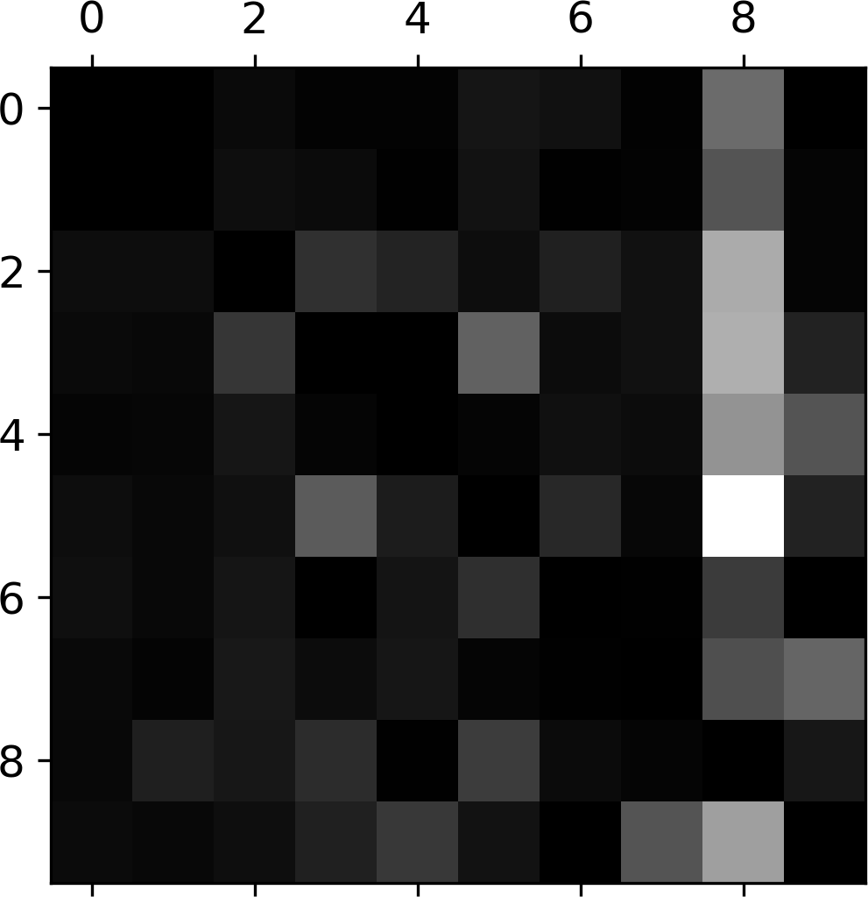

You can clearly see the kinds of errors the classifier makes. Remember
that rows represent actual classes, while columns represent predicted
classes. The column for class 8 is quite bright, which tells you that
many images get misclassified as 8s. However, the row for class 8 is not
that bad, telling you that actual 8s in general get properly classified
as 8s. As you can see, the confusion matrix is not necessarily
symmetrical. You can also see that 3s and 5s often get confused (in both
directions).

Analyzing the confusion matrix often gives you insights into ways to
improve your classifier. Looking at this plot, it seems that your
efforts should be spent on reducing the false 8s. For example, you could
try to gather more training data for digits that look like 8s (but are
not) so that the classifier can learn to distinguish them from real 8s.
Or you could engineer new features that would help the classifier---for
example, writing an algorithm to count the number of closed loops (e.g.,
8 has two, 6 has one, 5 has none). Or you could preprocess the images
(e.g., using Scikit-Image, Pillow, or OpenCV) to make some patterns,
such as closed loops, stand out more.

Analyzing individual errors can also be a good way to gain insights on
what your classifier is doing and why it is failing, but it is more
difficult and time-consuming. For example, let's plot examples of 3s and
5s (the `plot_digits()` function just uses Matplotlib's `imshow()`
function; see this lab's Jupyter notebook for details):

``` {data-type="programlisting" code-language="python"}
cl_a, cl_b = 3, 5
X_aa = X_train[(y_train == cl_a) & (y_train_pred == cl_a)]
X_ab = X_train[(y_train == cl_a) & (y_train_pred == cl_b)]
X_ba = X_train[(y_train == cl_b) & (y_train_pred == cl_a)]
X_bb = X_train[(y_train == cl_b) & (y_train_pred == cl_b)]

plt.figure(figsize=(8,8))
plt.subplot(221); plot_digits(X_aa[:25], images_per_row=5)
plt.subplot(222); plot_digits(X_ab[:25], images_per_row=5)
plt.subplot(223); plot_digits(X_ba[:25], images_per_row=5)
plt.subplot(224); plot_digits(X_bb[:25], images_per_row=5)
plt.show()
```

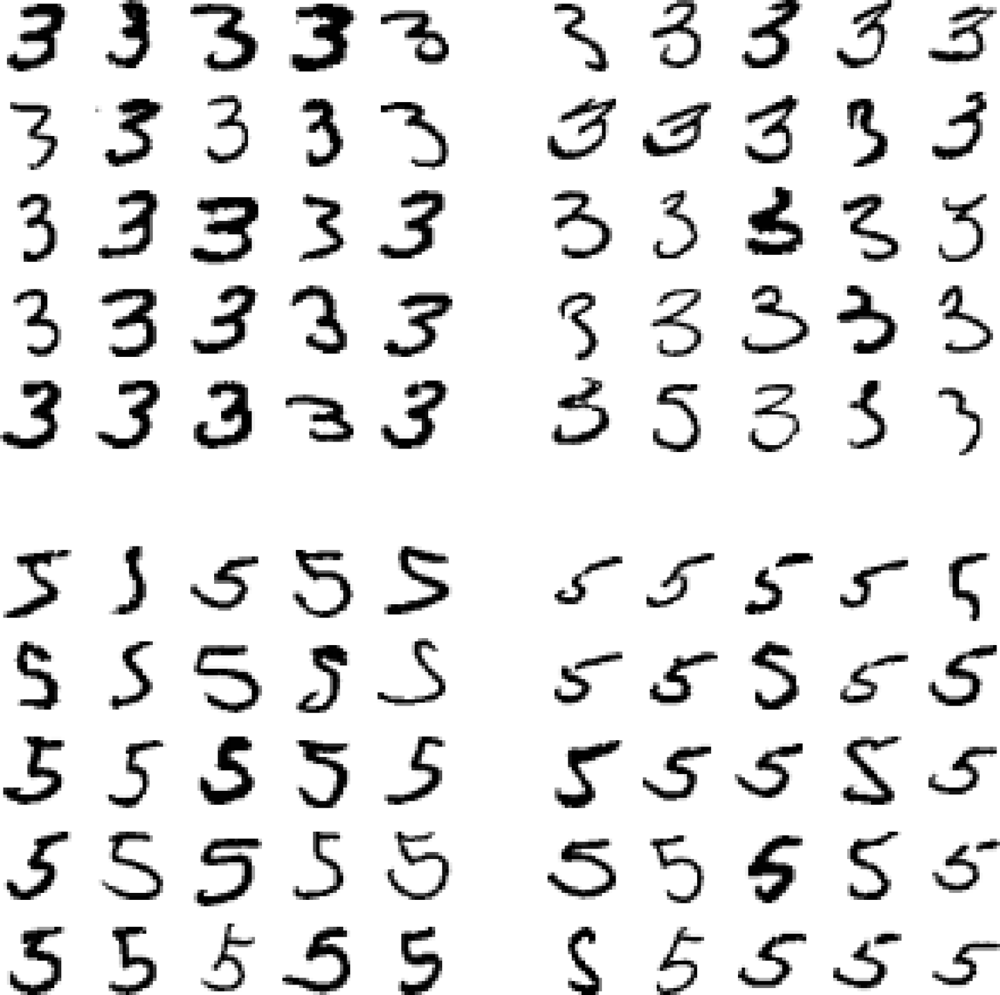

The two 5 × 5 blocks on the left show digits classified as 3s, and the
two 5 × 5 blocks on the right show images classified as 5s. Some of the
digits that the classifier gets wrong (i.e., in the bottom-left and
top-right blocks) are so badly written that even a human would have
trouble classifying them (e.g., the 5 in the first row and second column
truly looks like a badly written 3). However, most misclassified images
seem like obvious errors to us, and it's hard to understand why the
classifier made the mistakes it
did.^[3](https://learning.oreilly.com/library/view/hands-on-machine-learning/9781492032632/ch03.html#idm45728485976232){#idm45728485976232-marker
.totri-footnote}^ The reason is that we used a simple `SGDClassifier`,
which is a linear model. All it does is assign a weight per class to
each pixel, and when it sees a new image it just sums up the weighted
pixel intensities to get a score for each class. So since 3s and 5s
differ only by a few pixels, this model will easily confuse them.

The main difference between 3s and 5s is the position of the small line
that joins the top line to the bottom arc. If you draw a 3 with the
junction slightly shifted to the left, the classifier might classify it
as a 5, and vice versa. In other words, this classifier is quite
sensitive to image shifting and rotation. So one way to reduce the 3/5
confusion would be to preprocess the images to ensure that they are well
centered and not too rotated. This will probably help reduce other
errors as well.


Multilabel Classification
=========================

Until[]{#idm45728485972488}[]{#idm45728485971512} now each instance has
always been assigned to just one class. In some cases you may want your
classifier to output multiple classes for each instance. Consider a
face-recognition classifier: what should it do if it recognizes several
people in the same picture? It should attach one tag per person it
recognizes. Say the classifier has been trained to recognize three
faces, Alice, Bob, and Charlie. Then when the classifier is shown a
picture of Alice and Charlie, it should output \[1, 0, 1\] (meaning
"Alice yes, Bob no, Charlie yes"). Such a classification system that
outputs multiple binary tags is called a *multilabel classification*
system.

We won't go into face recognition just yet, but let's look at a simpler
example, just for illustration purposes:

``` {data-type="programlisting" code-language="python"}
from sklearn.neighbors import KNeighborsClassifier

y_train_large = (y_train >= 7)
y_train_odd = (y_train % 2 == 1)
y_multilabel = np.c_[y_train_large, y_train_odd]

knn_clf = KNeighborsClassifier()
knn_clf.fit(X_train, y_multilabel)
```

This code creates a `y_multilabel` array containing two target labels
for each digit image: the first indicates whether or not the digit is
large (7, 8, or 9), and the second indicates whether or not it is odd.
The next lines create a `KNeighborsClassifier` instance (which supports
multilabel classification, though not all classifiers do), and we train
it using the multiple targets array. Now you can make a prediction, and
notice that it outputs two labels:

``` {data-type="programlisting" code-language="pycon"}
>>> knn_clf.predict([some_digit])
array([[False,  True]])
```

And it gets it right! The digit 5 is indeed not large (`False`) and odd
(`True`).

There are many ways to evaluate a multilabel classifier, and selecting
the right metric really depends on your project. One approach is to
measure the F~1~ score for each individual label (or any other binary
classifier metric discussed earlier), then simply compute the average
score. This code computes the average F~1~ score across all labels:

``` {data-type="programlisting" code-language="pycon"}
>>> y_train_knn_pred = cross_val_predict(knn_clf, X_train, y_multilabel, cv=3)
>>> f1_score(y_multilabel, y_train_knn_pred, average="macro")
0.976410265560605
```

This assumes that all labels are equally important, however, which may
not be the case. In particular, if you have many more pictures of Alice
than of Bob or Charlie, you may want to give more weight to the
classifier's score on pictures of Alice. One simple option is to give
each label a weight equal to its *support* (i.e., the number of
instances with that target label). To[]{#idm45728485769304} do this,
simply set `average="weighted"` in the preceding
code.^[4](https://learning.oreilly.com/library/view/hands-on-machine-learning/9781492032632/ch03.html#idm45728485767992){#idm45728485767992-marker
.totri-footnote}^


Multioutput Classification
==========================

The[]{#idm45728485765592}[]{#idm45728485764616} last type of
classification task we are going to discuss here is called
*multioutput--multiclass classification* (or simply *multioutput
classification*). It is simply a generalization of multilabel
classification where each label can be multiclass (i.e., it can have
more than two possible values).

To illustrate this, let's build a system that removes noise from images.
It will take as input a noisy digit image, and it will (hopefully)
output a clean digit image, represented as an array of pixel
intensities, just like the MNIST images. Notice that the classifier's
output is multilabel (one label per pixel) and each label can have
multiple values (pixel intensity ranges from 0 to 255). It is thus an
example of a multioutput classification system.


###### Note

The line between classification and regression is sometimes blurry, such
as in this example. Arguably, predicting pixel intensity is more akin to
regression than to classification. Moreover, multioutput systems are not
limited to classification tasks; you could even have a system that
outputs multiple labels per instance, including both class labels and
value labels.


Let's start by creating the training and test sets by taking the MNIST
images and adding noise to their pixel intensities[]{#idm45728485759944}
with NumPy's `randint()` function. The target images will be the
original images:

``` {data-type="programlisting" code-language="python"}
noise = np.random.randint(0, 100, (len(X_train), 784))
X_train_mod = X_train + noise
noise = np.random.randint(0, 100, (len(X_test), 784))
X_test_mod = X_test + noise
y_train_mod = X_train
y_test_mod = X_test
```

Let's take a peek at an image from the test set (yes, we're snooping on
the test data, so you should be frowning right now):

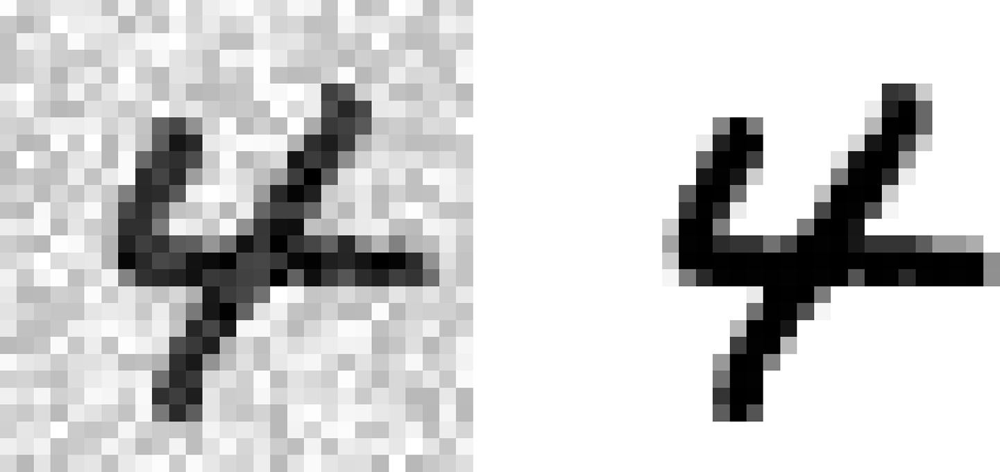

On the left is the noisy input image, and on the right is the clean
target image. Now let's train the classifier and make it clean this
image:

``` {data-type="programlisting" code-language="python"}
knn_clf.fit(X_train_mod, y_train_mod)
clean_digit = knn_clf.predict([X_test_mod[some_index]])
plot_digit(clean_digit)
```

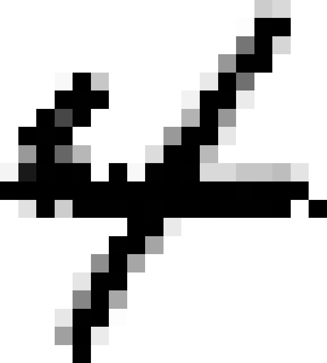

Looks close enough to the target! This concludes our tour of
classification. You should now know how to select good metrics for
classification tasks, pick the appropriate precision/recall trade-off,
compare classifiers, and more generally build good classification
systems for a variety of tasks.


Exercises
=========

1.  Try to build a classifier for the MNIST dataset that achieves over
    97% accuracy on the test set. Hint: the `KNeighborsClassifier` works
    quite well for this task; you just need to find good hyperparameter
    values (try a grid search on the `weights` and `n_neighbors`
    hyperparameters).

2.  Write a function that can shift an MNIST image in any direction
    (left, right, up, or down) by one
    pixel.^[5](https://learning.oreilly.com/library/view/hands-on-machine-learning/9781492032632/ch03.html#idm45728485640728){#idm45728485640728-marker
    .totri-footnote}^ Then, for each image in the training set, create
    four shifted copies (one per direction) and add them to the training
    set. Finally, train your best model on this expanded training set
    and measure its accuracy on the test set. You should observe that
    your model performs even better now! This technique of artificially
    growing the training set is called *data augmentation* or *training
    set expansion*.

3.  Tackle the Titanic dataset. A great place to start is on
    [Kaggle](https://www.kaggle.com/c/titanic).

4.  Build a spam classifier (a more challenging exercise):

    -   Download examples of spam and ham from [Apache SpamAssassin's
        public datasets](https://homl.info/spamassassin).

    -   Unzip the datasets and familiarize yourself with the data
        format.

    -   Split the datasets into a training set and a test set.

    -   Write a data preparation pipeline to convert each email into a
        feature vector. Your preparation pipeline should transform an
        email into a (sparse) vector that indicates the presence or
        absence of each possible word. For example, if all emails only
        ever contain four words, "Hello," "how," "are," "you," then the
        email "Hello you Hello Hello you" would be converted into a
        vector \[1, 0, 0, 1\] (meaning \["Hello" is present, "how" is
        absent, "are" is absent, "you" is present\]), or \[3, 0, 0, 2\]
        if you prefer to count the number of occurrences of each word.

        You may want to add hyperparameters to your preparation pipeline
        to control whether or not to strip off email headers, convert
        each email to lowercase, remove punctuation, replace all URLs
        with "URL," replace all numbers with "NUMBER," or even perform
        *stemming* (i.e., trim off word endings; there are Python
        libraries available to do this).

        Finally, try out several classifiers and see if you can build a
        great spam classifier, with both high recall and high precision.

Solutions to these exercises can be found in the Jupyter notebooks
available at
[*https://github.com/ageron/handson-ml2*](https://github.com/ageron/handson-ml2).


^[1](https://learning.oreilly.com/library/view/hands-on-machine-learning/9781492032632/ch03.html#idm45728488569352-marker){.totri-footnote}^
By default Scikit-Learn caches downloaded datasets in a directory called
*\$HOME/scikit\_learn\_data*.

^[2](https://learning.oreilly.com/library/view/hands-on-machine-learning/9781492032632/ch03.html#idm45728488324168-marker){.totri-footnote}^
Shuffling may be a bad idea in some contexts---for example, if you are
working on time series data (such as stock market prices or weather
conditions). We will explore this in the next labs.

^[3](https://learning.oreilly.com/library/view/hands-on-machine-learning/9781492032632/ch03.html#idm45728485976232-marker){.totri-footnote}^
But remember that our brain is a fantastic pattern recognition system,
and our visual system does a lot of complex preprocessing before any
information reaches our consciousness, so the fact that it feels simple
does not mean that it is.

^[4](https://learning.oreilly.com/library/view/hands-on-machine-learning/9781492032632/ch03.html#idm45728485767992-marker){.totri-footnote}^
Scikit-Learn offers a few other averaging options and multilabel
classifier metrics; see the documentation for more details.

^[5](https://learning.oreilly.com/library/view/hands-on-machine-learning/9781492032632/ch03.html#idm45728485640728-marker){.totri-footnote}^
You can use the `shift()` function from the
`scipy.ndimage.interpolation` module. For example,
`shift(image, [2, 1], cval=0)` shifts the image two pixels down and one
pixel to the right.
