[Lab 4. ] Training Models
====================================

So far we have treated
Machine Learning models and their training algorithms mostly like black
boxes. If you went through some of the exercises in the previous
labs, you may have been surprised by how much you can get done
without knowing anything about what's under the hood: you optimized a
regression system, you improved a digit image classifier, and you even
built a spam classifier from scratch, all this without knowing how they
actually work. Indeed, in many situations you don't really need to know
the implementation details.

However, having a good understanding of how things work can help you
quickly home in on the appropriate model, the right training algorithm
to use, and a good set of hyperparameters for your task. Understanding
what's under the hood will also help you debug issues and perform error
analysis more efficiently. Lastly, most of the topics discussed in this
lab will be essential in understanding, building, and training
neural networks (discussed in
[Part II](https://learning.oreilly.com/library/view/hands-on-machine-learning/9781492032632/part02.html#neural_nets_part)
of this course).

In this lab we will start by looking at the []{}
Linear Regression model, one of the simplest models there is. We will
discuss two very different ways to train it:

-   Using a direct "closed-form" equation that directly computes the
    model parameters that best fit the model to the training set (i.e.,
    the model parameters that minimize the cost function over the
    training set).

-   Using an iterative optimization approach
    called Gradient Descent (GD) that gradually
    tweaks the model parameters to minimize the cost function over the
    training set, eventually converging to the same set of parameters as
    the first method. We will look at a few variants of Gradient Descent
    that we will use again and again when we study neural networks in
    [Part II](https://learning.oreilly.com/library/view/hands-on-machine-learning/9781492032632/part02.html#neural_nets_part):
    Batch GD, Mini-batch GD, and Stochastic GD.

Next we will look at Polynomial Regression, a more
complex model that can fit nonlinear datasets. Since this model has more
parameters than Linear Regression, it is more prone to overfitting the
training data, so we will look at how to detect whether or not this is
the case using learning curves, and then we will look at several
regularization techniques that can reduce the risk of overfitting the
training set.

Finally, we will look at two more models that are commonly used for
classification tasks: Logistic Regression and Softmax Regression.


###### Warning

There will be quite a few math equations in this lab, using basic
notions of linear algebra
and calculus. To understand these equations, you will need to know what
vectors and matrices are; how to transpose them, multiply them, and
inverse them; and what partial derivatives are. If you are unfamiliar
with these concepts, please go through the linear algebra and calculus
introductory tutorials available as Jupyter notebooks in the [online
supplemental material](https://github.com/ageron/handson-ml2). For those
who are truly allergic to mathematics, you should still go through this
lab and simply skip the equations; hopefully, the text will be
sufficient to help you understand most of the concepts.


Linear Regression
=================

In
[Lab 1](https://learning.oreilly.com/library/view/hands-on-machine-learning/9781492032632/ch01.html#landscape_lab)
we []{#TMlinear04} []{#RPlinear04} looked at a
simple regression model of life satisfaction: *life\_satisfaction* =
*θ*~0~ + *θ*~1~ × *GDP\_per\_capita*.

This model is just a linear function of the input feature
`GDP_per_capita`. *θ*~0~ and *θ*~1~ are the model's parameters.

More generally, a linear model makes a prediction by simply computing a
weighted sum of the input features,
plus a constant called the
*bias term* (also called the *intercept term*), as shown in [Equation
4-1](https://learning.oreilly.com/library/view/hands-on-machine-learning/9781492032632/ch04.html#equation_four_one).


##### [Equation 4-1. ] Linear Regression model prediction

$$\hat{y} = \theta_{0} + \theta_{1}x_{1} + \theta_{2}x_{2} + \cdots + \theta_{n}x_{n}$$


In this equation:

-   *ŷ* is the predicted value.

-   *n* is the number of features.

-   *x*~*i*~ is the *i*^th^ feature value.

-   *θ*~*j*~ is the *j*^th^ model parameter (including the bias term
    *θ*~0~ and the feature weights *θ*~1~, *θ*~2~, ⋯, *θ*~*n*~).

This can be written much more concisely using a vectorized form, as
shown in [Equation
4-2](https://learning.oreilly.com/library/view/hands-on-machine-learning/9781492032632/ch04.html#linear_regression_prediction_vectorized_equation).


##### [Equation 4-2. ] Linear Regression model prediction (vectorized form)

$\hat{y} = h_{\mathbf{\theta}}\left( \mathbf{x} \right) = \mathbf{\theta} \cdot \mathbf{x}$


In this equation:

-   **θ** is the model's
    *parameter vector*, containing the bias term *θ*~0~ and the feature
    weights *θ*~1~ to *θ*~*n*~.

-   **x** is the instance's
    *feature vector*, containing *x*~0~ to *x*~*n*~, with *x*~0~ always
    equal to 1.

-   **θ** · **x** is the dot product of the vectors **θ** and **x**,
    which is of course equal to *θ*~0~*x*~0~ + *θ*~1~*x*~1~ +
    *θ*~2~*x*~2~ + \... + *θ*~*n*~*x*~*n*~.

-   *h*~**θ**~ is the hypothesis function, using the model parameters
    **θ**.


###### Note

In Machine Learning, vectors
are often represented as *column vectors*, which are 2D arrays with a
single column. If **θ** and **x** are column vectors, then the
prediction is $\hat{y} = \mathbf{\theta}^{\intercal}\mathbf{x}$, where
$\mathbf{\theta}^{\intercal}$ is the *transpose* of **θ** (a row vector
instead of a column vector) and $\mathbf{\theta}^{\intercal}\mathbf{x}$
is the matrix multiplication of $\mathbf{\theta}^{\intercal}$ and **x**.
It is of course the same prediction, except that it is now represented
as a single-cell matrix rather than a scalar value. In this course I will
use this notation to avoid switching between dot products and matrix
multiplications.


OK, that's the Linear Regression model---but how
do we train it? Well, recall that training a model means setting its
parameters so that the model best fits the training set. For this
purpose, we first need a measure of how well (or poorly) the model fits
the training data. In
[Lab 2](https://learning.oreilly.com/library/view/hands-on-machine-learning/9781492032632/ch02.html#project_lab)
we saw that the most common performance measure of a regression model is
the Root Mean Square Error (RMSE) ([Equation
2-1](https://learning.oreilly.com/library/view/hands-on-machine-learning/9781492032632/ch02.html#rmse_equation)).
Therefore, to train a Linear Regression model, we need to find the value
of **θ** that minimizes the RMSE. In practice, it is simpler to minimize
the mean squared error (MSE) than the RMSE, and it leads to the same
result (because the value that minimizes a function also minimizes its
square
root).^[1](https://learning.oreilly.com/library/view/hands-on-machine-learning/9781492032632/ch04.html){-marker
.totri-footnote}^

The MSE of a Linear Regression hypothesis *h*~**θ**~ on a training set
**X** is calculated using [Equation
4-3](https://learning.oreilly.com/library/view/hands-on-machine-learning/9781492032632/ch04.html#mse_cost_function).


##### [Equation 4-3. ] MSE cost function for a Linear Regression model

$$\text{MSE}\left( \mathbf{X},h_{\mathbf{\theta}} \right) = \frac{1}{m}\sum\limits_{i = 1}^{m}\left( \mathbf{\theta}^{\intercal}\mathbf{x}^{(i)} - y^{(i)} \right)^{2}$$


Most of these notations were presented in
[Lab 2](https://learning.oreilly.com/library/view/hands-on-machine-learning/9781492032632/ch02.html#project_lab)
(see
["Notations"](https://learning.oreilly.com/library/view/hands-on-machine-learning/9781492032632/ch02.html#notations)).
The only difference is that we write *h*~**θ**~ instead of just *h* to
make it clear that the model is parametrized by the vector **θ**. To
simplify notations, we will just write MSE(**θ**) instead of MSE(**X**,
*h*~**θ**~).


The Normal Equation
-------------------

To []{}
find the value of **θ** that minimizes the cost function, there is a
*closed-form solution*---in other words, a mathematical equation that
gives the result directly. This is called the *Normal Equation*
([Equation
4-4](https://learning.oreilly.com/library/view/hands-on-machine-learning/9781492032632/ch04.html#equation_four_four)).


##### [Equation 4-4. ] Normal Equation

$$\hat{\mathbf{\theta}} = \left( \mathbf{X}^{\intercal}\mathbf{X} \right)^{- 1}~\mathbf{X}^{\intercal}~\mathbf{y}$$


In this equation:

-   $\hat{\mathbf{\theta}}$ is the value of **θ** that minimizes the
    cost function.

-   **y** is the vector of target values containing *y*^(1)^ to
    *y*^(*m*)^.

Let's generate some linear-looking data to test this equation on
([Figure 4-1](https://learning.oreilly.com/library/view/hands-on-machine-learning/9781492032632/ch04.html#generated_data_plot)):

``` {data-type="programlisting" code-language="python"}
import numpy as np

X = 2 * np.random.rand(100, 1)
y = 4 + 3 * X + np.random.randn(100, 1)
```

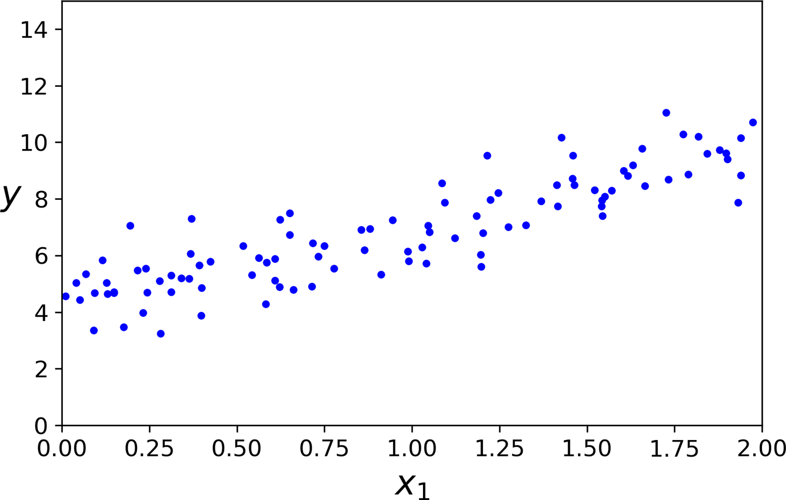

Now let's compute $\hat{\mathbf{\theta}}$ using the Normal Equation.
We will use the `inv()` function from NumPy's
linear algebra module (`np.linalg`) to compute the inverse of a matrix,
and the `dot()` method for matrix multiplication:

``` {data-type="programlisting" code-language="python"}
X_b = np.c_[np.ones((100, 1)), X]  # add x0 = 1 to each instance
theta_best = np.linalg.inv(X_b.T.dot(X_b)).dot(X_b.T).dot(y)
```

The function that we used to generate the data is *y* = 4 + 3*x*~1~ +
Gaussian noise. Let's see what the equation found:

``` {data-type="programlisting" code-language="pycon"}
>>> theta_best
array([[4.21509616],
       [2.77011339]])
```

We would have hoped for *θ*~0~ = 4 and *θ*~1~ = 3 instead of *θ*~0~ =
4.215 and *θ*~1~ = 2.770. Close enough, but the noise made it impossible
to recover the exact parameters of the original function.

Now we can make predictions using $\hat{\mathbf{\theta}}$:

``` {data-type="programlisting" code-language="pycon"}
>>> X_new = np.array([[0], [2]])
>>> X_new_b = np.c_[np.ones((2, 1)), X_new] # add x0 = 1 to each instance
>>> y_predict = X_new_b.dot(theta_best)
>>> y_predict
array([[4.21509616],
       [9.75532293]])
```

Let's plot this model's predictions
([Figure 4-2](https://learning.oreilly.com/library/view/hands-on-machine-learning/9781492032632/ch04.html#linear_model_predictions_plot)):

``` {data-type="programlisting" code-language="python"}
plt.plot(X_new, y_predict, "r-")
plt.plot(X, y, "b.")
plt.axis([0, 2, 0, 15])
plt.show()
```

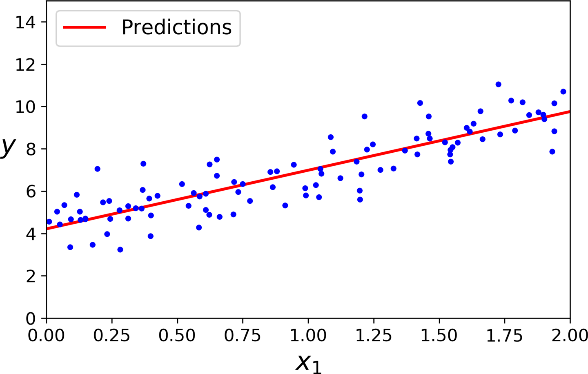

Performing Linear Regression using Scikit-Learn is
simple:^[2](https://learning.oreilly.com/library/view/hands-on-machine-learning/9781492032632/ch04.html){-marker
.totri-footnote}^

``` {data-type="programlisting" code-language="pycon"}
>>> from sklearn.linear_model import LinearRegression
>>> lin_reg = LinearRegression()
>>> lin_reg.fit(X, y)
>>> lin_reg.intercept_, lin_reg.coef_
(array([4.21509616]), array([[2.77011339]]))
>>> lin_reg.predict(X_new)
array([[4.21509616],
       [9.75532293]])
```

The `LinearRegression` class is based on the `scipy.linalg.lstsq()`
function (the name stands for "least squares"), which you could call
directly:

``` {data-type="programlisting" code-language="pycon"}
>>> theta_best_svd, residuals, rank, s = np.linalg.lstsq(X_b, y, rcond=1e-6)
>>> theta_best_svd
array([[4.21509616],
       [2.77011339]])
```

This function computes
$\hat{\mathbf{\theta}} = \mathbf{X}^{+}\mathbf{y}$, where
$\mathbf{X}^{+}$ is the *pseudoinverse* of **X** (specifically, [the
Moore-Penrose] inverse). You can use `np.linalg.pinv()`
to compute the [pseudoinverse] directly:

``` {data-type="programlisting" code-language="pycon"}
>>> np.linalg.pinv(X_b).dot(y)
array([[4.21509616],
       [2.77011339]])
```

The pseudoinverse itself is computed using a
standard matrix factorization technique called *Singular Value
Decomposition* (SVD) that can decompose the training set matrix **X**
into the matrix multiplication of three matrices **U** **Σ** **V**^⊺^
(see `numpy.linalg.svd()`). The pseudoinverse is computed as
$\mathbf{X}^{+} = \mathbf{V}\mathbf{\Sigma}^{+}\mathbf{U}^{\intercal}$.
To compute the matrix $\mathbf{\Sigma}^{+}$, the algorithm takes **Σ**
and sets to zero all values smaller than a tiny threshold value, then it
replaces all the nonzero values with their inverse, and finally it
transposes the resulting matrix. This approach is more efficient than
computing the Normal Equation, plus it handles edge cases nicely:
indeed, the Normal Equation may not work if the matrix **X**^⊺^**X** is
not invertible (i.e., singular), such as if *m* \< *n* or if some
features are redundant, but the pseudoinverse is always defined.


Computational Complexity
------------------------

The Normal Equation computes the inverse of
**X**^⊺^ **X**, which is an (*n* + 1) × (*n* + 1) matrix (where *n* is
the number of features). The *computational complexity* of inverting
such a matrix is typically about *O*(*n*^2.4^) to *O*(*n*^3^), depending
on the implementation. In other words, if you double the number of
features, you multiply the computation time by roughly 2^2.4^ = 5.3 to
2^3^ = 8.

The SVD approach used by Scikit-Learn's `LinearRegression` class is
about *O*(*n*^2^). If you double the number of features, you multiply
the computation time by roughly 4.


###### Warning

Both the Normal Equation and the SVD approach get very slow when the
number of features grows large (e.g., 100,000). On the positive side,
both are linear with regard to the number of instances in the training
set (they are *O*(*m*)), so they handle large training sets efficiently,
provided they can fit in memory.


Also, once you have trained your Linear Regression model (using the
Normal Equation or any other algorithm), predictions are very fast: the
computational complexity is linear with regard to both the number of
instances you want to make predictions on and the number of features. In
other words, making predictions on twice as many instances (or twice as
many features) will take roughly twice as much time.

Now we will look at a very different way to train a Linear Regression
model, which is better suited for cases where there are a large number
of features or too many training instances to fit in
memory. []{}


Gradient Descent
================

*Gradient Descent* is []{#TMgradient04} a generic
optimization algorithm capable of finding optimal solutions to a wide
range of problems. The general idea of Gradient Descent is to tweak
parameters iteratively in order to minimize a cost function.

Suppose you are lost in the mountains in a dense fog, and you can only
feel the slope of the ground below your feet. A good strategy to get to
the bottom of the valley quickly is to go downhill in the direction of
the steepest slope. This is exactly what Gradient Descent does: it
measures the local gradient of the error function with regard to the
parameter vector **θ**, and it goes in the direction of descending
gradient. Once the gradient is zero, you have reached a minimum!

Concretely,
you []{}
start by filling **θ** with random values (this is called *random
initialization*). Then you improve it gradually, taking one baby step at
a time, each step attempting to decrease the cost function (e.g., the
MSE), until the algorithm *converges* to a minimum (see
[Figure 4-3](https://learning.oreilly.com/library/view/hands-on-machine-learning/9781492032632/ch04.html#gradient_descent_diagram)).

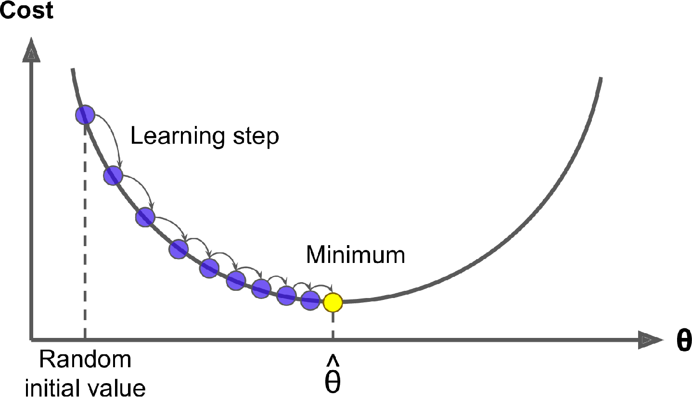

An important parameter in
Gradient Descent is the size of the steps, determined by the *learning
rate* hyperparameter. If the learning rate is too small, then the
algorithm will have to go through many iterations to converge, which
will take a long time (see
[Figure 4-4](https://learning.oreilly.com/library/view/hands-on-machine-learning/9781492032632/ch04.html#small_learning_rate_diagram)).

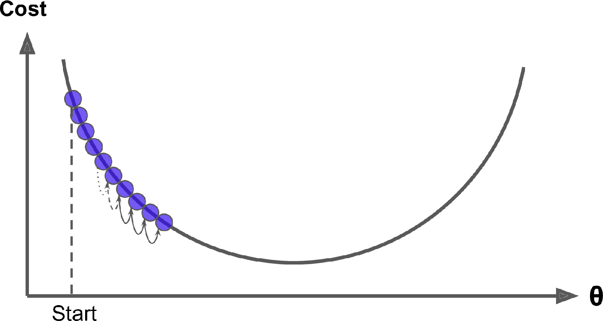

On the other hand, if the learning rate is too high, you might jump
across the valley and end up on the other side, possibly even higher up
than you were before. This might make the algorithm diverge, with larger
and larger values, failing to find a good solution (see
[Figure 4-5](https://learning.oreilly.com/library/view/hands-on-machine-learning/9781492032632/ch04.html#large_learning_rate_diagram)).

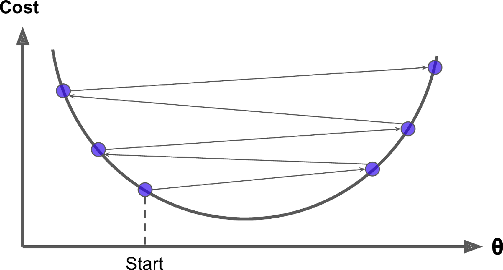

Finally, not all cost functions look like nice, regular bowls. There may
be holes, ridges, plateaus, and all sorts of irregular terrains, making
convergence to the minimum difficult.
[Figure 4-6](https://learning.oreilly.com/library/view/hands-on-machine-learning/9781492032632/ch04.html#gradient_descent_pitfalls_diagram)
shows the two main challenges with Gradient Descent. If the random
initialization starts the algorithm on the left,
then it will converge to a
*local minimum*, which is not as good as the *global minimum*. If it
starts on the right, then it will take a very long time to cross the
plateau. And if you stop too early, you will never reach the global
minimum.

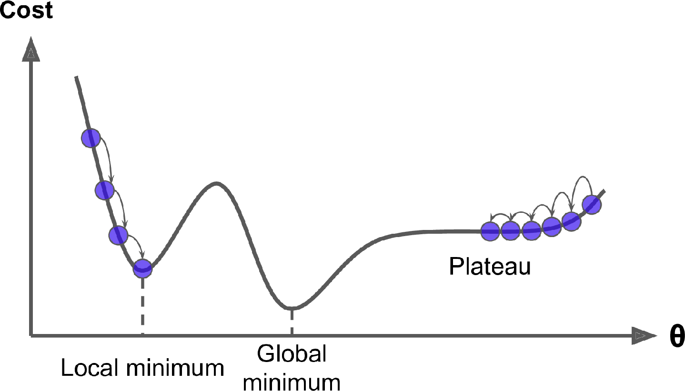

Fortunately, the MSE cost
function for a Linear Regression model happens to be a *convex
function*, which means that if you pick any two points on the curve, the
line segment joining them never crosses the curve. This implies that
there are no local minima, just one global minimum. It is also a
continuous function with a slope that never changes
abruptly.^[3](https://learning.oreilly.com/library/view/hands-on-machine-learning/9781492032632/ch04.html){-marker
.totri-footnote}^ These two facts have a great consequence: Gradient
Descent is guaranteed to approach arbitrarily close the global minimum
(if you wait long enough and if the learning rate is not too high).

In fact, the  []{}cost function has the shape of a
bowl, but it can be an elongated bowl if the features have very
different scales.
[Figure 4-7](https://learning.oreilly.com/library/view/hands-on-machine-learning/9781492032632/ch04.html#elongated_bowl_diagram)
shows Gradient Descent on a training set where features 1 and 2 have the
same scale (on the left), and on a training set where feature 1 has much
smaller values than feature 2 (on the
right).^[4](https://learning.oreilly.com/library/view/hands-on-machine-learning/9781492032632/ch04.html){-marker
.totri-footnote}^

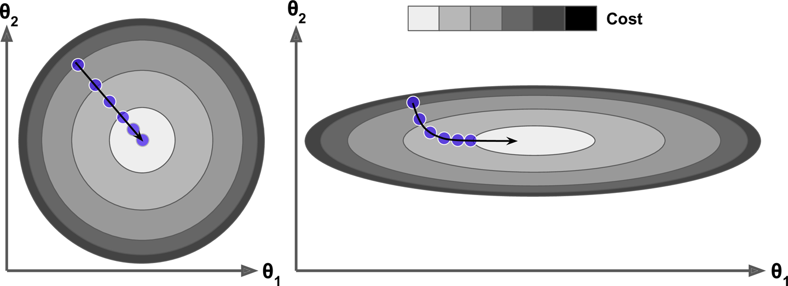

As you can see, on the left the Gradient Descent algorithm goes straight
toward the minimum, thereby reaching it quickly, whereas on the right it
first goes in a direction almost orthogonal to the direction of the
global minimum, and it ends with a long march down an almost flat
valley. It will eventually reach the minimum, but it will take a long
time.


###### Warning

When using Gradient Descent, you should ensure that all features have a
similar scale (e.g., using Scikit-Learn's `StandardScaler` class), or
else it will take much longer to converge.


This diagram also illustrates the fact that training a model means
searching for a combination of model parameters that minimizes a cost
function (over the training set). It is a search
in the model's *parameter space*: the more parameters a model has, the
more dimensions this space has, and the harder the search is: searching
for a needle in a 300-dimensional haystack is much trickier than in 3
dimensions. Fortunately, since the cost function is convex in the case
of Linear Regression, the needle is simply at the bottom of the bowl.


Batch Gradient Descent
----------------------

To implement Gradient
Descent, you need to compute the gradient of the cost function with
regard to each model parameter *θ*~*j*~. In other words, you need to
calculate how much the cost function will change if you change *θ*~*j*~
just a little bit. This is called a *partial
derivative*. It is like asking "What is the slope of the mountain under
my feet if I face east?" and then asking the same question facing north
(and so on for all other dimensions, if you can imagine a universe with
more than three dimensions). [Equation
4-5](https://learning.oreilly.com/library/view/hands-on-machine-learning/9781492032632/ch04.html#mse_partial_derivatives)
computes the partial derivative of the cost function with regard to
parameter *θ*~*j*~, noted ∂ MSE(**θ**) / ∂θ~*j*~.


##### [Equation 4-5. ] Partial derivatives of the cost function

$$\frac{\partial}{\partial\theta_{j}}\text{MSE}\left( \mathbf{\theta} \right) = \frac{2}{m}\sum\limits_{i = 1}^{m}\left( \mathbf{\theta}^{\intercal}\mathbf{x}^{(i)} - y^{(i)} \right)\, x_{j}^{(i)}$$


Instead of computing these partial derivatives individually, you can use
[Equation
4-6](https://learning.oreilly.com/library/view/hands-on-machine-learning/9781492032632/ch04.html#mse_gradient_vector)
to compute them all in one go. The gradient vector, noted
∇~**θ**~MSE(**θ**), contains all the partial derivatives of the cost
function (one for each model parameter).


##### [Equation 4-6. ] Gradient vector of the cost function

$$\nabla_{\mathbf{\theta}}\,\text{MSE}\left( \mathbf{\theta} \right) = \begin{pmatrix}
{\frac{\partial}{\partial\theta_{0}}\text{MSE}\left( \mathbf{\theta} \right)} \\
{\frac{\partial}{\partial\theta_{1}}\text{MSE}\left( \mathbf{\theta} \right)} \\
 \vdots \\
{\frac{\partial}{\partial\theta_{n}}\text{MSE}\left( \mathbf{\theta} \right)} \\
\end{pmatrix} = \frac{2}{m}\mathbf{X}^{\intercal}\left( \mathbf{X}\mathbf{\theta} - \mathbf{y} \right)$$


###### Warning

Notice that this formula involves calculations over the full training
set **X**, at each Gradient Descent step! This is why the algorithm is
called *Batch Gradient Descent*: it uses the whole batch of training
data at every step (actually, *Full Gradient
Descent* would probably be a better name). As a result it is terribly
slow on very large training sets (but we will see much faster Gradient
Descent algorithms shortly). However, Gradient Descent scales well with
the number of features; training a Linear Regression model when there
are hundreds of thousands of features is much faster using Gradient
Descent than using the Normal Equation or SVD decomposition.


Once you have the gradient vector, which points uphill, just go in the
opposite direction to go downhill. This means subtracting
∇~**θ**~MSE(**θ**) from **θ**. This is where the learning rate *η* comes
into
play:^[5](https://learning.oreilly.com/library/view/hands-on-machine-learning/9781492032632/ch04.html){-marker
.totri-footnote}^ multiply the gradient vector by *η* to determine the
size of the downhill step ([Equation
4-7](https://learning.oreilly.com/library/view/hands-on-machine-learning/9781492032632/ch04.html#gradient_descent_step)).


##### [Equation 4-7. ] Gradient Descent step

$\mathbf{\theta}^{(\text{next\ step})} = \mathbf{\theta} - \eta\nabla_{\mathbf{\theta}}\,\text{MSE}\left( \mathbf{\theta} \right)$


Let's look at a quick implementation of this algorithm:

``` {data-type="programlisting" code-language="python"}
eta = 0.1  # learning rate
n_iterations = 1000
m = 100

theta = np.random.randn(2,1)  # random initialization

for iteration in range(n_iterations):
    gradients = 2/m * X_b.T.dot(X_b.dot(theta) - y)
    theta = theta - eta * gradients
```

That wasn't too hard! Let's look at the resulting `theta`:

``` {data-type="programlisting" code-language="pycon"}
>>> theta
array([[4.21509616],
       [2.77011339]])
```

Hey, that's exactly what the Normal Equation found! Gradient Descent
worked perfectly. But what if you had used a different learning rate
`eta`?
[Figure 4-8](https://learning.oreilly.com/library/view/hands-on-machine-learning/9781492032632/ch04.html#gradient_descent_plot)
shows the first 10 steps of Gradient Descent using three different
learning rates (the dashed line represents the starting point).

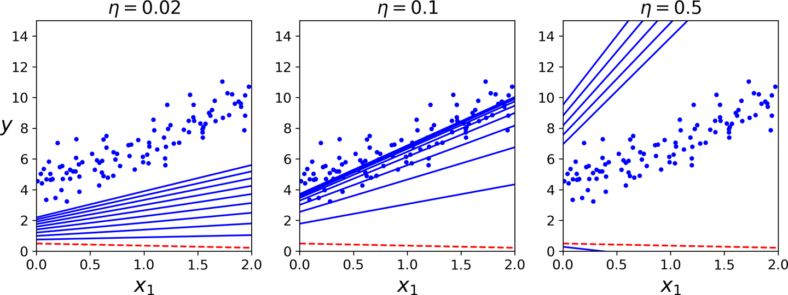

On the left, the learning rate is too low: the algorithm will eventually
reach the solution, but it will take a long time. In the middle, the
learning rate looks pretty good: in just a few iterations, it has
already converged to the solution. On the right, the learning rate is
too high: the algorithm diverges, jumping all over the place and
actually getting further and further away from the solution at every
step.

To find a good learning rate, you can use grid search (see
[Lab 2](https://learning.oreilly.com/library/view/hands-on-machine-learning/9781492032632/ch02.html#project_lab)).
However, you may want to limit the number of iterations so that grid
search can eliminate models that take too long to converge.

You may wonder how to set the number of iterations. If it is too low,
you will still be far away from the optimal solution when the algorithm
stops; but if it is too high, you will waste time while the model
parameters do not change anymore. A simple
solution is to set a very large number of iterations but to interrupt
the algorithm when the gradient vector becomes tiny---that is, when its
norm becomes smaller than a tiny number *ϵ* (called the
*tolerance*)---because this happens when Gradient Descent has (almost)
reached the minimum.


##### Convergence Rate

When the cost function is convex and its slope does not change abruptly
(as is the case for the MSE cost function), Batch Gradient Descent with
a fixed learning rate will eventually converge to the optimal solution,
but you may have to wait a while: it can take *O*(1/*ϵ*) iterations to
reach the optimum within a range of *ϵ*, depending on the shape of the
cost function. If you divide the tolerance by 10 to have a more precise
solution, then the algorithm may have to run about 10 times longer.


Stochastic Gradient Descent
---------------------------

The []{}
main problem with Batch Gradient Descent is the fact that it uses the
whole training set to compute the gradients at every step, which makes
it very slow when the training set is large. At the opposite extreme,
*Stochastic Gradient Descent* picks a random instance in the training
set at every step and computes the gradients based only on that single
instance. Obviously, working on a single instance at a time makes the
algorithm much faster because it has very little data to manipulate at
every iteration. It also makes it possible to train on huge training
sets, since only one instance needs to be in memory at each iteration
(Stochastic GD can be implemented as an out-of-core algorithm; see
[Lab 1](https://learning.oreilly.com/library/view/hands-on-machine-learning/9781492032632/ch01.html#landscape_lab)).

On the other hand, due to its stochastic (i.e., random) nature, this
algorithm is much less regular than Batch Gradient Descent: instead of
gently decreasing until it reaches the minimum, the cost function will
bounce up and down, decreasing only on average. Over time it will end up
very close to the minimum, but once it gets there it will continue to
bounce around, never settling down (see
[Figure 4-9](https://learning.oreilly.com/library/view/hands-on-machine-learning/9781492032632/ch04.html#sgd_random_walk_diagram)).
So once the algorithm stops, the final parameter values are good, but
not optimal.

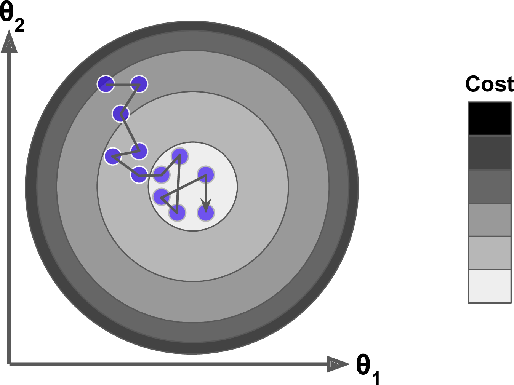

When the cost function is very irregular (as in
[Figure 4-6](https://learning.oreilly.com/library/view/hands-on-machine-learning/9781492032632/ch04.html#gradient_descent_pitfalls_diagram)),
this can actually help the algorithm jump out of local minima, so
Stochastic Gradient Descent has a better chance of finding the global
minimum than Batch Gradient Descent does.

Therefore, randomness is good to escape from local optima, but bad
because it means that the algorithm can never settle at the minimum. One
solution to this dilemma is to gradually reduce the learning rate. The
steps start out large (which helps make quick progress and escape local
minima), then get smaller and smaller, allowing the algorithm to settle
at the global minimum. This process is akin to
*simulated annealing*, an algorithm inspired from the process in
metallurgy of annealing, where molten metal is slowly cooled down.
The function that determines the learning rate at
each iteration is called the *learning schedule*. If the learning rate
is reduced too quickly, you may get stuck in a local minimum, or even
end up frozen halfway to the minimum. If the learning rate is reduced
too slowly, you may jump around the minimum for a long time and end up
with a suboptimal solution if you halt training too early.

This code implements Stochastic Gradient Descent using a simple learning
schedule:

``` {data-type="programlisting" code-language="python"}
n_epochs = 50
t0, t1 = 5, 50  # learning schedule hyperparameters

def learning_schedule(t):
    return t0 / (t + t1)

theta = np.random.randn(2,1)  # random initialization

for epoch in range(n_epochs):
    for i in range(m):
        random_index = np.random.randint(m)
        xi = X_b[random_index:random_index+1]
        yi = y[random_index:random_index+1]
        gradients = 2 * xi.T.dot(xi.dot(theta) - yi)
        eta = learning_schedule(epoch * m + i)
        theta = theta - eta * gradients
```

By convention we iterate by rounds of *m*
iterations; each round is called an *epoch*. While the Batch Gradient
Descent code iterated 1,000 times through the whole training set, this
code goes through the training set only 50 times and reaches a pretty
good solution:

``` {data-type="programlisting" code-language="pycon"}
>>> theta
array([[4.21076011],
       [2.74856079]])
```

[Figure 4-10](https://learning.oreilly.com/library/view/hands-on-machine-learning/9781492032632/ch04.html#sgd_plot)
shows the first 20 steps of training (notice how irregular the steps
are).

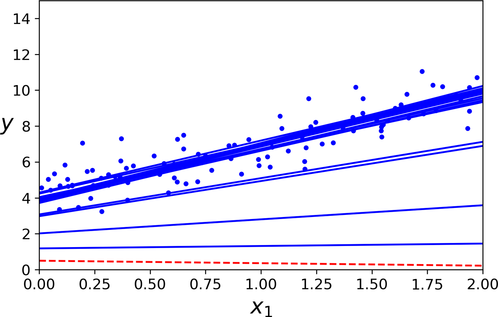

Note that since instances are picked randomly, some instances may be
picked several times per epoch, while others may not be picked at all.
If you want to be sure that the algorithm goes through every instance at
each epoch, another approach is to shuffle the training set (making sure
to shuffle the input features and the labels jointly), then go through
it instance by instance, then shuffle it again, and so on. However, this
approach generally converges more slowly.


###### Warning

When using Stochastic Gradient Descent, the
training instances must be independent and identically distributed (IID)
to ensure that the parameters get pulled toward the global optimum, on
average. A simple way to ensure this is to shuffle the instances during
training (e.g., pick each instance randomly, or shuffle the training set
at the beginning of each epoch). If you do not shuffle the
instances---for example, if the instances are sorted by label---then SGD
will start by optimizing for one label, then the next, and so on, and it
will not settle close to the global minimum.


To perform Linear Regression using Stochastic GD with Scikit-Learn, you
can use the `SGDRegressor` class, which defaults to optimizing the
squared error cost function. The following code runs for maximum 1,000
epochs or until the loss drops by less than 0.001 during one epoch
(`max_iter=1000`, `tol=1e-3`). It starts with a learning rate of 0.1
(`eta0=0.1`), using the default learning schedule (different from the
preceding one). Lastly, it does not use any regularization
(`penalty=None`; more details on this shortly):

``` {data-type="programlisting" code-language="python"}
from sklearn.linear_model import SGDRegressor
sgd_reg = SGDRegressor(max_iter=1000, tol=1e-3, penalty=None, eta0=0.1)
sgd_reg.fit(X, y.ravel())
```

Once again, you find a solution quite close to the one returned by the
Normal [Equation]:

``` {data-type="programlisting" code-language="pycon"}
>>> sgd_reg.intercept_, sgd_reg.coef_
(array([4.24365286]), array([2.8250878]))
```


Mini-batch Gradient Descent
---------------------------

The last Gradient Descent
algorithm we will look at is called *Mini-batch Gradient Descent*. It is
simple to understand once you know Batch and Stochastic Gradient
Descent: at each step, instead of computing the gradients based on the
full training set (as in Batch GD) or based on just one instance (as in
Stochastic GD), Mini-batch GD computes the gradients on small random
sets of instances called *mini-batches*. The main
advantage of Mini-batch GD over Stochastic GD is that you can get a
performance boost from hardware optimization of matrix operations,
especially when using GPUs.

The algorithm's progress in parameter space is less erratic than with
Stochastic GD, especially with fairly large mini-batches. As a result,
Mini-batch GD will end up walking around a bit closer to the minimum
than Stochastic GD---but it may be harder for it to escape from local
minima (in the case of problems that suffer from local minima, unlike
Linear Regression).
[Figure 4-11](https://learning.oreilly.com/library/view/hands-on-machine-learning/9781492032632/ch04.html#gradient_descent_paths_plot)
shows the paths taken by the three Gradient Descent algorithms in
parameter space during training. They all end up near the minimum, but
Batch GD's path actually stops at the minimum, while both Stochastic GD
and Mini-batch GD continue to walk around. However, don't forget that
Batch GD takes a lot of time to take each step, and Stochastic GD and
Mini-batch GD would also reach the minimum if you used a good learning
schedule.

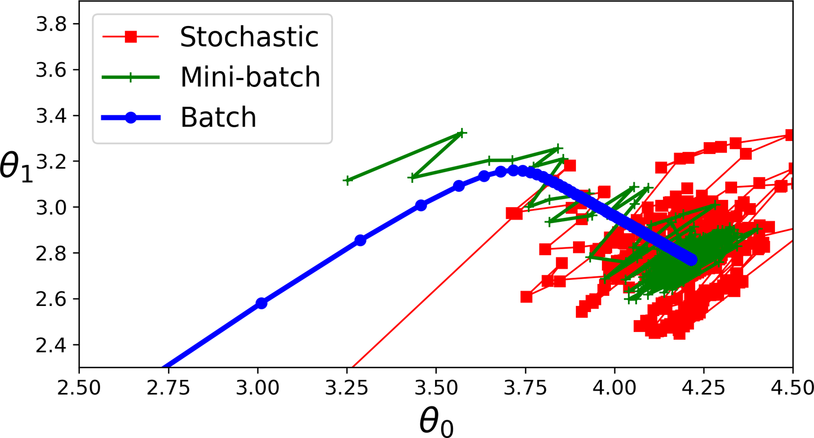

Let's compare the algorithms we've discussed so far for Linear
Regression^[6](https://learning.oreilly.com/library/view/hands-on-machine-learning/9781492032632/ch04.html){-marker
.totri-footnote}^ (recall that *m* is the number of training instances
and *n* is the number of features); see
[Table 4-1](https://learning.oreilly.com/library/view/hands-on-machine-learning/9781492032632/ch04.html#linear_regression_algorithm_comparison).

  Algorithm         Large *m*   Out-of-core support   Large *n*   Hyperparams   Scaling required   Scikit-Learn
  ----------------- ----------- --------------------- ----------- ------------- ------------------ --------------------
  Normal Equation   Fast        No                    Slow        0             No                 N/A
  SVD               Fast        No                    Slow        0             No                 `LinearRegression`
  Batch GD          Slow        No                    Fast        2             Yes                `SGDRegressor`
  Stochastic GD     Fast        Yes                   Fast        ≥2            Yes                `SGDRegressor`
  Mini-batch GD     Fast        Yes                   Fast        ≥2            Yes                `SGDRegressor`

  : [Table 4-1. ] Comparison of algorithms for Linear Regression


###### Note

There is almost no difference after training: all these algorithms end
up with very similar models and make predictions in exactly the same
way. []{}


Polynomial Regression
=====================

What if your
data []{#TMpolyreg04} is more complex than a straight line? Surprisingly,
you can use a linear model to fit nonlinear data. A simple way to do
this is to add powers of each feature as new features, then train a
linear model on this extended set of features. This technique is called
*Polynomial Regression*.

Let's look at an example. First, let's generate some nonlinear data,
based on a simple *quadratic
equation*^[7](https://learning.oreilly.com/library/view/hands-on-machine-learning/9781492032632/ch04.html){-marker
.totri-footnote}^ (plus some noise; see
[Figure 4-12](https://learning.oreilly.com/library/view/hands-on-machine-learning/9781492032632/ch04.html#quadratic_data_plot)):

``` {data-type="programlisting" code-language="python"}
m = 100
X = 6 * np.random.rand(m, 1) - 3
y = 0.5 * X**2 + X + 2 + np.random.randn(m, 1)
```

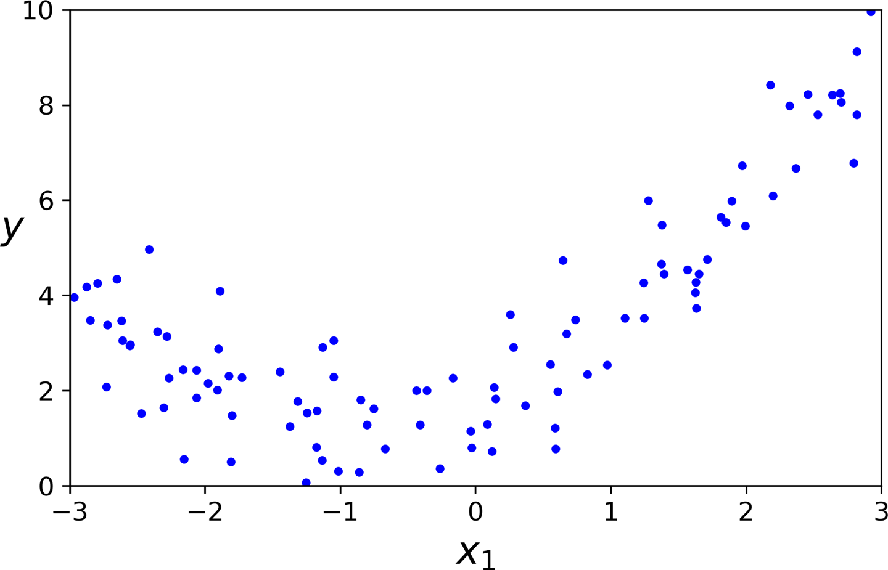

Clearly, a straight line will never fit this data properly. So let's use
Scikit-Learn's `PolynomialFeatures` class to transform our training
data, adding the square (second-degree polynomial) of each feature in
the training set as a new feature (in this case there is just one
feature):

``` {data-type="programlisting" code-language="pycon"}
>>> from sklearn.preprocessing import PolynomialFeatures
>>> poly_features = PolynomialFeatures(degree=2, include_bias=False)
>>> X_poly = poly_features.fit_transform(X)
>>> X[0]
array([-0.75275929])
>>> X_poly[0]
array([-0.75275929, 0.56664654])
```

`X_poly` now contains the original feature of `X` plus the square of
this feature. Now you can fit a `LinearRegression` model to this
extended training data
([Figure 4-13](https://learning.oreilly.com/library/view/hands-on-machine-learning/9781492032632/ch04.html#quadratic_predictions_plot)):

``` {data-type="programlisting" code-language="pycon"}
>>> lin_reg = LinearRegression()
>>> lin_reg.fit(X_poly, y)
>>> lin_reg.intercept_, lin_reg.coef_
(array([1.78134581]), array([[0.93366893, 0.56456263]]))
```

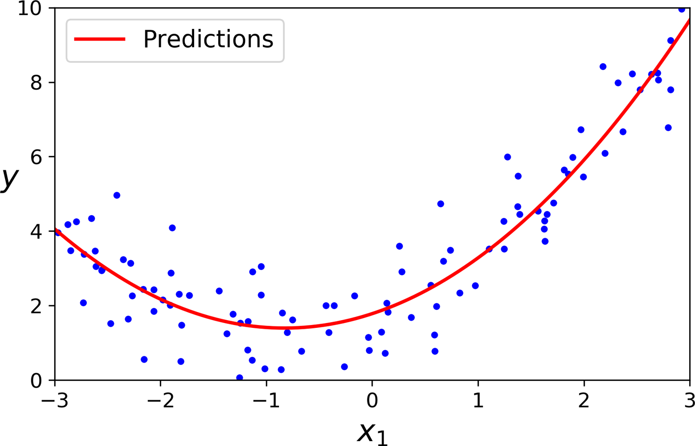

Not bad: the model estimates
$\hat{y} = 0.56{x_{1}}^{2} + 0.93x_{1} + 1.78$ when in fact the original
function was
$y = 0.5{x_{1}}^{2} + 1.0x_{1} + 2.0 + \text{Gaussian\ noise}$.

Note that when there are multiple features, Polynomial Regression is
capable of finding relationships between features (which is something a
plain Linear Regression model cannot do). This is made possible by the
fact that `PolynomialFeatures` also adds all combinations of features up
to the given degree. For example, if there were two features *a* and
*b*, `PolynomialFeatures` with `degree=3` would not only add the
features *a*^2^, *a*^3^, *b*^2^, and *b*^3^, but also the combinations
*ab*, *a*^2^*b*, and *ab*^2^.


###### Warning

`PolynomialFeatures(degree=d)` transforms an array containing *n*
features into an array containing (*n* + *d*)! / *d*!*n*! features,
where *n*! is the *factorial* of *n*, equal to 1 × 2 × 3 × ⋯ × *n*.
Beware of the combinatorial explosion of the number of
features! []{}


Learning Curves
===============

If []{#TMlearncurv04} []{#learncurve04} you perform high-degree Polynomial
Regression, you will likely fit the training data much better than with
plain Linear Regression. For example,
[Figure 4-14](https://learning.oreilly.com/library/view/hands-on-machine-learning/9781492032632/ch04.html#high_degree_polynomials_plot)
applies a 300-degree polynomial model to the preceding training data,
and compares the result with a pure linear model and a quadratic model
(second-degree polynomial). Notice how the 300-degree polynomial model
wiggles around to get as close as possible to the training instances.

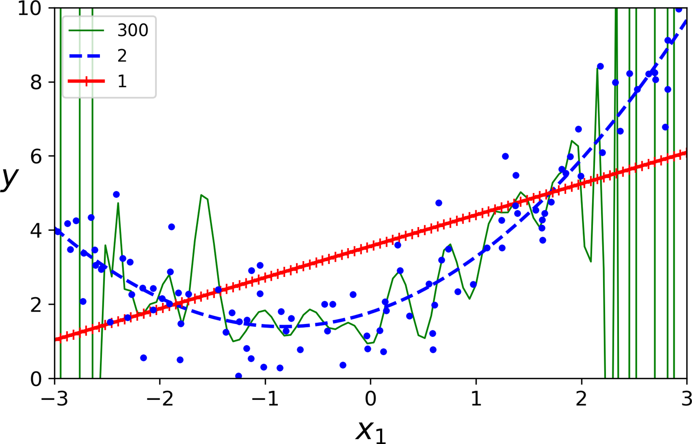

This high-degree Polynomial Regression model is severely overfitting the
training data, while the linear model is underfitting it. The model that
will generalize best in this case is the quadratic model, which makes
sense because the data was generated using a quadratic model. But in
general you won't know what function generated the data, so how can you
decide how complex your model should be? How can you tell that your
model is overfitting or underfitting the data?

In
[Lab 2](https://learning.oreilly.com/library/view/hands-on-machine-learning/9781492032632/ch02.html#project_lab)
you used cross-validation to get an estimate of a model's generalization
performance. If a model performs well on the training data but
generalizes poorly according to the cross-validation metrics, then your
model is overfitting. If it performs poorly on both, then it is
underfitting. This is one way to tell when a model is too simple or too
complex.

Another way to tell is to look at the *learning curves*: these are plots
of the model's performance on the training set and the validation set as
a function of the training set size (or the training iteration). To
generate the plots, train the model several times on different sized
subsets of the training set. The following code defines a function that,
given some training data, plots the learning curves of a model:

``` {.pagebreak-before data-type="programlisting" code-language="python"}
from sklearn.metrics import mean_squared_error
from sklearn.model_selection import train_test_split

def plot_learning_curves(model, X, y):
    X_train, X_val, y_train, y_val = train_test_split(X, y, test_size=0.2)
    train_errors, val_errors = [], []
    for m in range(1, len(X_train)):
        model.fit(X_train[:m], y_train[:m])
        y_train_predict = model.predict(X_train[:m])
        y_val_predict = model.predict(X_val)
        train_errors.append(mean_squared_error(y_train[:m], y_train_predict))
        val_errors.append(mean_squared_error(y_val, y_val_predict))
    plt.plot(np.sqrt(train_errors), "r-+", linewidth=2, label="train")
    plt.plot(np.sqrt(val_errors), "b-", linewidth=3, label="val")
```

Let's look at the learning curves of the plain Linear Regression model
(a straight line; see
[Figure 4-15](https://learning.oreilly.com/library/view/hands-on-machine-learning/9781492032632/ch04.html#underfitting_learning_curves_plot)):

``` {data-type="programlisting" code-language="python"}
lin_reg = LinearRegression()
plot_learning_curves(lin_reg, X, y)
```

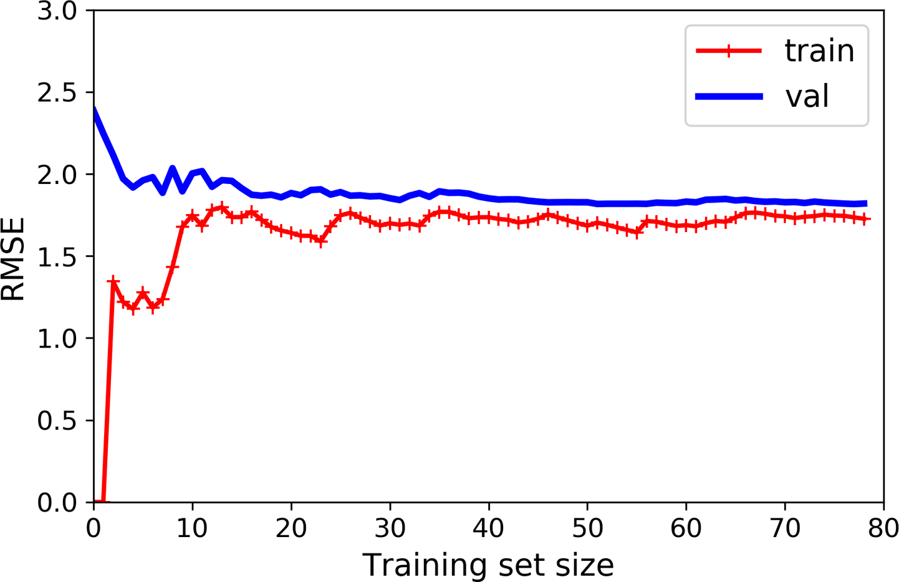

This model that's underfitting deserves a bit of explanation. First,
let's look at the performance on the training data: when there are just
one or two instances in the training set, the model can fit them
perfectly, which is why the curve starts at zero. But as new instances
are added to the training set, it becomes impossible for the model to
fit the training data perfectly, both because the data is noisy and
because it is not linear at all. So the error on the training data goes
up until it reaches a plateau, at which point adding new instances to
the training set doesn't make the average error much better or worse.
Now let's look at the performance of the model on the validation data.
When the model is trained on very few training instances, it is
incapable of generalizing properly, which is why the validation error is
initially quite big. Then, as the model is shown more training examples,
it learns, and thus the validation error slowly goes down. However, once
again a straight line cannot do a good job modeling the data, so the
error ends up at a plateau, very close to the other curve.

These learning curves are typical of a model that's underfitting. Both
curves have reached a plateau; they are close and fairly high.


###### Tip

If your model is underfitting the training data, adding more training
examples will not help. You need to use a more complex model or come up
with better features.


Now let's look at the learning curves of a 10th-degree polynomial model
on the same data
([Figure 4-16](https://learning.oreilly.com/library/view/hands-on-machine-learning/9781492032632/ch04.html#learning_curves_plot)):

``` {data-type="programlisting" code-language="python"}
from sklearn.pipeline import Pipeline

polynomial_regression = Pipeline([
        ("poly_features", PolynomialFeatures(degree=10, include_bias=False)),
        ("lin_reg", LinearRegression()),
    ])

plot_learning_curves(polynomial_regression, X, y)
```

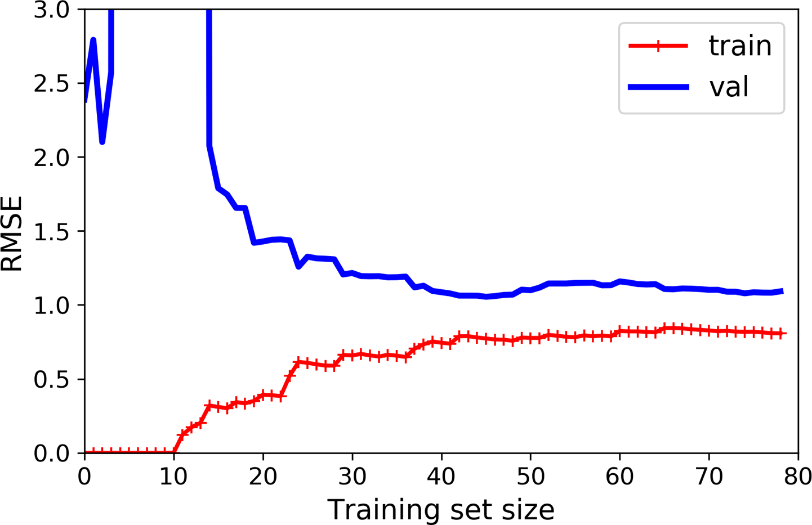

These learning curves look a bit like the previous ones, but there are
two very important differences:

-   The error on the training data is much lower than with the Linear
    Regression model.

-   There is a gap between the curves. This means that the model
    performs significantly better on the training data than on the
    validation data, which is the hallmark of an overfitting model. If
    you used a much larger training set, however, the two curves would
    continue to get closer.


###### Tip

One way to improve an overfitting model is to feed it more training data
until the validation error reaches the training error.


##### The Bias/Variance Trade-off

An important theoretical result of statistics and
Machine Learning is the fact that a model's generalization error can be
expressed as the sum of three very different errors:

*Bias*

:   This part of the generalization error is due to wrong assumptions,
    such as assuming that the data is linear when it is actually
    quadratic. A high-bias model is most likely to underfit the training
    data.^[8](https://learning.oreilly.com/library/view/hands-on-machine-learning/9781492032632/ch04.html){-marker
    .totri-footnote}^

*Variance*

:   This part is due to the model's excessive sensitivity to small
    variations in the training data. A model with many degrees of
    freedom (such as a high-degree polynomial model) is likely to have
    high variance and thus overfit the training data.

*Irreducible error*

:   This part is due to the noisiness of the data itself. The only way
    to reduce this part of the error is to clean up the data (e.g., fix
    the data sources, such as broken sensors, or detect and remove
    outliers).

Increasing a model's complexity will typically increase its variance and
reduce its bias. Conversely, reducing a model's complexity increases its
bias and reduces its variance. This is why it is called a
trade-off. []{}


Regularized Linear Models
=========================

As []{#TMreglin04} we saw in Labs
[1](https://learning.oreilly.com/library/view/hands-on-machine-learning/9781492032632/ch01.html#landscape_lab){.totri-footnote}
and
[2](https://learning.oreilly.com/library/view/hands-on-machine-learning/9781492032632/ch02.html#project_lab){.totri-footnote},
a good way to reduce overfitting is to regularize the model (i.e., to
constrain it): the fewer degrees of freedom it has, the harder it will
be for it to overfit the data. A simple way to regularize a polynomial
model is to reduce the number of polynomial degrees.

For a linear model, regularization is typically achieved by constraining
the weights of the model. We will now look at Ridge Regression, Lasso
Regression, and Elastic Net, which implement three different ways to
constrain the weights.


Ridge Regression
----------------

*Ridge Regression* (also called *Tikhonov regularization*)
is []{} []{}
a regularized version of Linear Regression: a *regularization term*
equal to $\alpha\sum_{i = 1}^{n}{\theta_{i}}^{2}$ is added to the cost
function. This forces the learning algorithm to not only fit the data
but also keep the model weights as small as possible. Note that the
regularization term should only be added to the cost function during
training. Once the model is trained, you want to use the unregularized
performance measure to evaluate the model's performance.


###### Note

It is quite common for the cost function used during training to be
different from the performance measure used for testing. Apart from
regularization, another reason they might be different is that a good
training cost function should have optimization-friendly derivatives,
while the performance measure used for testing should be as close as
possible to the final objective. For example, classifiers are often
trained using a cost function such as the log loss (discussed in a
moment) but evaluated using precision/recall.


The hyperparameter *α* controls how much you want to regularize the
model. If *α* = 0, then Ridge Regression is just Linear Regression. If
*α* is very large, then all weights end up very close to zero and the
result is a flat line going through the data's mean. [Equation
4-8](https://learning.oreilly.com/library/view/hands-on-machine-learning/9781492032632/ch04.html#ridge_cost_function)
presents the Ridge Regression cost
function.^[9](https://learning.oreilly.com/library/view/hands-on-machine-learning/9781492032632/ch04.html){-marker
.totri-footnote}^


##### [Equation 4-8. ] Ridge Regression cost function

${J\left( \mathbf{\theta} \right)} = {\text{MSE}\left( \mathbf{\theta} \right)} + \alpha\frac{1}{2}\sum\limits_{i = 1}^{n}{\theta_{i}}^{2}$


Note that the bias term *θ*~0~ is not regularized (the sum starts at *i*
= 1, not 0). If we define **w** as the vector of feature weights (*θ*~1~
to *θ*~*n*~), then the regularization term is equal to ½(∥ **w**
∥~2~)^2^, where ∥ **w** ∥~2~ represents the ℓ~2~ norm of the weight
vector.^[10](https://learning.oreilly.com/library/view/hands-on-machine-learning/9781492032632/ch04.html){-marker}^
For Gradient Descent, just add *α***w** to the MSE gradient vector
([Equation
4-6](https://learning.oreilly.com/library/view/hands-on-machine-learning/9781492032632/ch04.html#mse_gradient_vector)).


###### Warning

It is important to scale the data (e.g., using a `StandardScaler`)
before performing Ridge Regression, as it is sensitive to the scale of
the input features. This is true of most regularized models.


[Figure 4-17](https://learning.oreilly.com/library/view/hands-on-machine-learning/9781492032632/ch04.html#ridge_regression_plot)
shows several Ridge models trained on some linear data using different
*α* values. On the left, plain Ridge models are used, leading to linear
predictions. On the right, the data is first expanded using
`PolynomialFeatures(degree=10)`, then it is scaled using a
`StandardScaler`, and finally the Ridge models are applied to the
resulting features: this is Polynomial Regression with Ridge
regularization. Note how increasing *α* leads to flatter (i.e., less
extreme, more reasonable) predictions, thus reducing the model's
variance but increasing its bias.

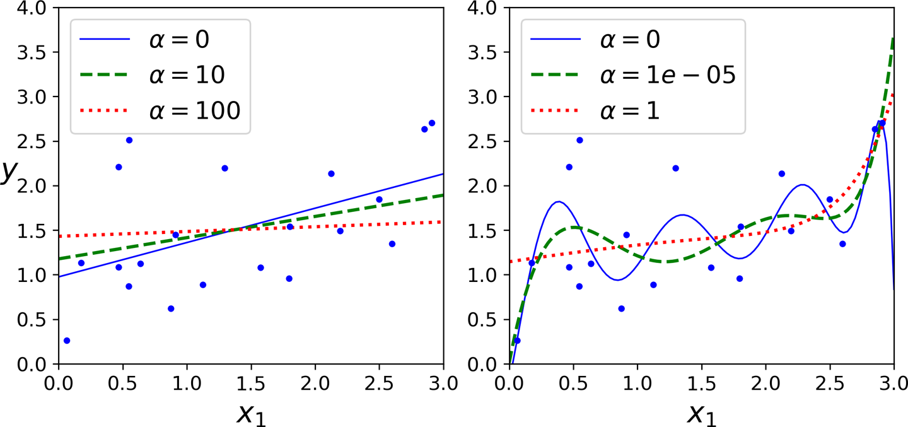

As with Linear Regression, we can perform Ridge Regression either by
computing a closed-form equation or by performing Gradient Descent. The
pros and cons are the same. [Equation
4-9](https://learning.oreilly.com/library/view/hands-on-machine-learning/9781492032632/ch04.html#ridge_regression_solution)
shows the closed-form solution, where **A** is the
(*n* + 1) × (*n* + 1) *identity
matrix*,^[11](https://learning.oreilly.com/library/view/hands-on-machine-learning/9781492032632/ch04.html){-marker}^
except with a 0 in the top-left cell, corresponding to the bias term.


##### [Equation 4-9. ] Ridge Regression closed-form solution

$$\hat{\mathbf{\theta}} = \left( \mathbf{X}^{\intercal}\mathbf{X} + \alpha\mathbf{A} \right)^{- 1}~\mathbf{X}^{\intercal}~\mathbf{y}$$


Here is how to perform Ridge Regression with Scikit-Learn using a
closed-form solution (a variant of [Equation
4-9](https://learning.oreilly.com/library/view/hands-on-machine-learning/9781492032632/ch04.html#ridge_regression_solution)
that uses a matrix factorization technique by André-Louis Cholesky):

``` {data-type="programlisting" code-language="pycon"}
>>> from sklearn.linear_model import Ridge
>>> ridge_reg = Ridge(alpha=1, solver="cholesky")
>>> ridge_reg.fit(X, y)
>>> ridge_reg.predict([[1.5]])
array([[1.55071465]])
```

And using Stochastic Gradient
Descent:^[12](https://learning.oreilly.com/library/view/hands-on-machine-learning/9781492032632/ch04.html){-marker}^

``` {data-type="programlisting" code-language="pycon"}
>>> sgd_reg = SGDRegressor(penalty="l2")
>>> sgd_reg.fit(X, y.ravel())
>>> sgd_reg.predict([[1.5]])
array([1.47012588])
```

The `penalty` hyperparameter sets the type of regularization term to
use. Specifying `"l2"` indicates that you want SGD to add a
regularization term to the cost function equal to half the square of the
ℓ~2~ norm of the weight vector: this is simply Ridge Regression.


Lasso Regression
----------------

*Least Absolute Shrinkage and Selection Operator Regression* (usually
simply called *Lasso Regression*)
is []{}
another regularized version of Linear Regression: just like Ridge
Regression, it adds a regularization term to the cost function, but it
uses the ℓ~1~ norm of the weight vector instead of half the square of
the ℓ~2~ norm (see [Equation
4-10](https://learning.oreilly.com/library/view/hands-on-machine-learning/9781492032632/ch04.html#lasso_cost_function)).


##### [Equation 4-10. ] Lasso Regression cost function

${J\left( \mathbf{\theta} \right)} = {\text{MSE}\left( \mathbf{\theta} \right)} + {\alpha\sum\limits_{i = 1}^{n}\left| \theta_{i} \right|}$


[Figure 4-18](https://learning.oreilly.com/library/view/hands-on-machine-learning/9781492032632/ch04.html#lasso_regression_plot)
shows the same thing as
[Figure 4-17](https://learning.oreilly.com/library/view/hands-on-machine-learning/9781492032632/ch04.html#ridge_regression_plot)
but replaces Ridge models with Lasso models and uses smaller *α* values.

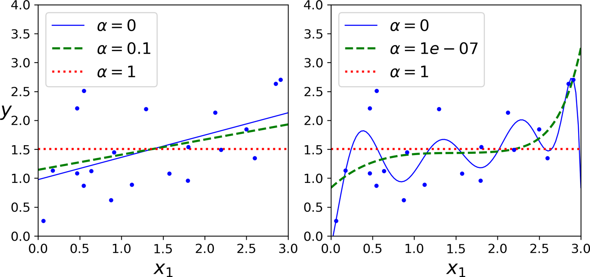

An important characteristic of Lasso Regression is that it tends to
eliminate the weights of the least important features (i.e., set them to
zero). For example, the dashed line in the righthand plot in
[Figure 4-18](https://learning.oreilly.com/library/view/hands-on-machine-learning/9781492032632/ch04.html#lasso_regression_plot)
(with *α* = 10^-7^) looks quadratic, almost linear: all the weights for
the high-degree polynomial features are equal to zero. In other words,
Lasso Regression automatically performs feature selection and outputs a
*sparse model* (i.e., with few nonzero feature weights).

You can get a sense of why this is the case by looking at
[Figure 4-19](https://learning.oreilly.com/library/view/hands-on-machine-learning/9781492032632/ch04.html#lasso_vs_ridge_plot):
the axes represent two model parameters, and the background contours
represent different loss functions. In the top-left plot, the contours
represent the ℓ~1~ loss (\|*θ*~1~\| + \|*θ*~2~\|), which drops linearly
as you get closer to any axis. For example, if you initialize the model
parameters to *θ*~1~ = 2 and *θ*~2~ = 0.5, running Gradient Descent will
decrement both parameters equally (as represented by the dashed yellow
line); therefore *θ*~2~ will reach 0 first (since it was closer to 0 to
begin with). After that, Gradient Descent will roll down the gutter
until it reaches *θ*~1~ = 0 (with a bit of bouncing around, since the
gradients of ℓ~1~ never get close to 0: they are either --1 or 1 for
each parameter). In the top-right plot, the contours represent Lasso's
cost function (i.e., an MSE cost function plus an ℓ~1~ loss). The small
white circles show the path that Gradient Descent takes to optimize some
model parameters that were initialized around *θ*~1~ = 0.25 and *θ*~2~ =
--1: notice once again how the path quickly reaches *θ*~2~ = 0, then
rolls down the gutter and ends up bouncing around the global optimum
(represented by the red square). If we increased *α*, the global optimum
would move left along the dashed yellow line, while if we decreased *α*,
the global optimum would move right (in this example, the optimal
parameters for the unregularized MSE are *θ*~1~ = 2 and *θ*~2~ = 0.5).

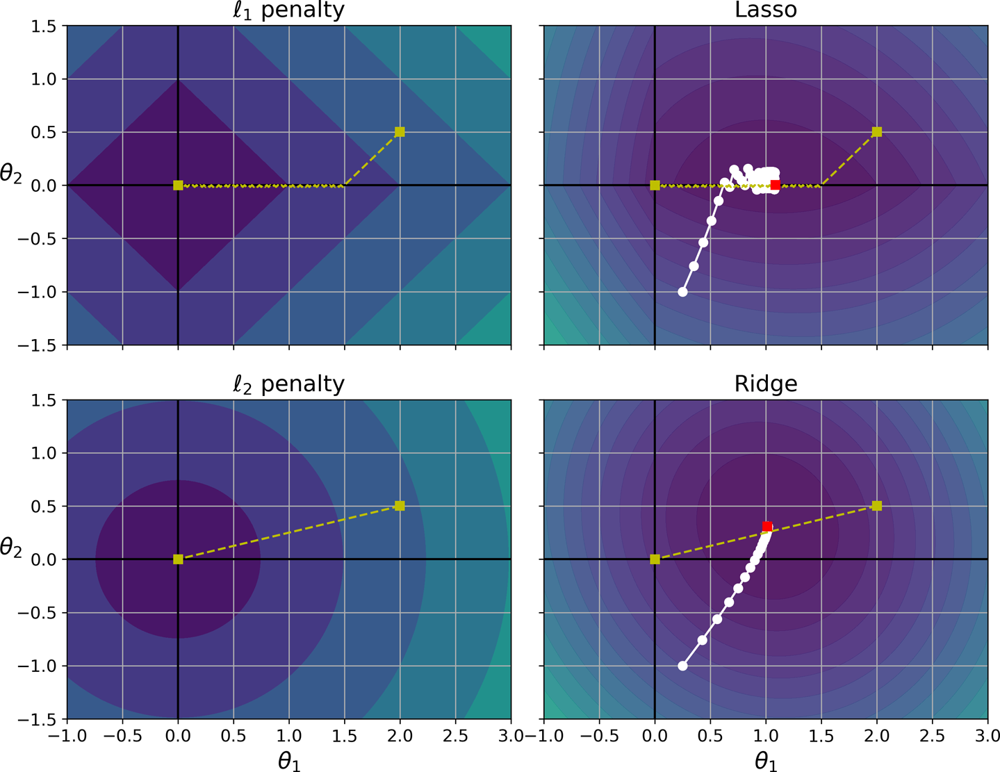

The two bottom plots show the same thing but with an ℓ~2~ penalty
instead. In the bottom-left plot, you can see that the ℓ~2~ loss
decreases with the distance to the origin, so Gradient Descent just
takes a straight path toward that point. In the bottom-right plot, the
contours represent Ridge Regression's cost function (i.e., an MSE cost
function plus an ℓ~2~ loss). There are two main differences with Lasso.
First, the gradients get smaller as the parameters approach the global
optimum, so Gradient Descent naturally slows down, which helps
convergence (as there is no bouncing around). Second, the optimal
parameters (represented by the red square) get closer and closer to the
origin when you increase *α*, but they never get eliminated entirely.


###### Tip

To avoid Gradient Descent from bouncing around the optimum at the end
when using Lasso, you need to gradually reduce the learning rate during
training (it will still bounce around the optimum, but the steps will
get smaller and smaller, so it will converge).


The Lasso cost function is
not differentiable at *θ*~*i*~ = 0 (for *i* = 1, 2, ⋯, *n*), but
Gradient Descent still works fine if you use a *subgradient vector*
**g**^[13](https://learning.oreilly.com/library/view/hands-on-machine-learning/9781492032632/ch04.html){-marker}^
instead when any *θ*~*i*~ = 0. [Equation
4-11](https://learning.oreilly.com/library/view/hands-on-machine-learning/9781492032632/ch04.html#lasso_subgradient_vector)
shows a subgradient vector equation you can use for Gradient Descent
with the Lasso cost function.


##### [Equation 4-11. ] Lasso Regression subgradient vector

${g\left( \mathbf{\theta},J \right)} = {\nabla_{\mathbf{\theta}}\,\text{MSE}\left( \mathbf{\theta} \right)} + {\alpha\begin{pmatrix}
{\operatorname{sign}\left( \theta_{1} \right)} \\
{\operatorname{sign}\left( \theta_{2} \right)} \\
 \vdots \\
{\operatorname{sign}\left( \theta_{n} \right)} \\
\end{pmatrix}}\operatorname{~~}\text{where~}{\operatorname{sign}\left( \theta_{i} \right)} = \left\{ \begin{matrix}
{- 1} & {\text{if~}\theta_{i} < 0} \\
0 & {\text{if~}\theta_{i} = 0} \\
{+ 1} & {\text{if~}\theta_{i} > 0} \\
\end{matrix} \right.$


Here is a small Scikit-Learn example using the `Lasso` class:

``` {data-type="programlisting" code-language="pycon"}
>>> from sklearn.linear_model import Lasso
>>> lasso_reg = Lasso(alpha=0.1)
>>> lasso_reg.fit(X, y)
>>> lasso_reg.predict([[1.5]])
array([1.53788174])
```

Note that you could instead use `SGDRegressor(penalty="l1")`.


Elastic Net
-----------

Elastic Net is a middle
ground between Ridge Regression and Lasso Regression. The regularization
term is a simple mix of both Ridge and Lasso's regularization terms, and
you can control the mix ratio *r*. When *r* = 0, Elastic Net is
equivalent to Ridge Regression, and when *r* = 1, it is equivalent to
Lasso Regression (see [Equation
4-12](https://learning.oreilly.com/library/view/hands-on-machine-learning/9781492032632/ch04.html#elastic_net_cost_function)).


##### [Equation 4-12. ] Elastic Net cost function

${J\left( \mathbf{\theta} \right)} = {\text{MSE}\left( \mathbf{\theta} \right)} + {r\alpha\sum\limits_{i = 1}^{n}\left| \theta_{i} \right|} + \frac{1 - r}{2}\alpha\sum\limits_{i = 1}^{n}{\theta_{i}}^{2}$


So when should you use plain Linear Regression (i.e., without any
regularization), Ridge, Lasso, or Elastic Net? It is almost always
preferable to have at least a little bit of regularization, so generally
you should avoid plain Linear Regression. Ridge is a good default, but
if you suspect that only a few features are useful, you should prefer
Lasso or Elastic Net because they tend to reduce the useless features'
weights down to zero, as we have discussed. In general, Elastic Net is
preferred over Lasso because Lasso may behave erratically when the
number of features is greater than the number of training instances or
when several features are strongly correlated.

Here is a short example that uses Scikit-Learn's `ElasticNet`
(`l1_ratio` corresponds to the mix ratio *r*):

``` {data-type="programlisting" code-language="pycon"}
>>> from sklearn.linear_model import ElasticNet
>>> elastic_net = ElasticNet(alpha=0.1, l1_ratio=0.5)
>>> elastic_net.fit(X, y)
>>> elastic_net.predict([[1.5]])
array([1.54333232])
```


Early Stopping
--------------

A very different way to regularize iterative
learning algorithms such as Gradient Descent is to stop training as soon
as the validation error reaches a minimum. This is called *early
stopping*.
[Figure 4-20](https://learning.oreilly.com/library/view/hands-on-machine-learning/9781492032632/ch04.html#early_stopping_plot)
shows a complex model (in this case, a high-degree Polynomial Regression
model) being trained with Batch Gradient Descent. As the epochs go by
the algorithm learns, and its prediction error (RMSE) on the training
set goes down, along with its prediction error on the validation set.
After a while though, the validation error stops decreasing and starts
to go back up. This indicates that the model has started to overfit the
training data. With early stopping you just stop training as soon as the
validation error reaches the minimum. It is such a simple and efficient
regularization technique that Geoffrey Hinton called it a "beautiful
free lunch."

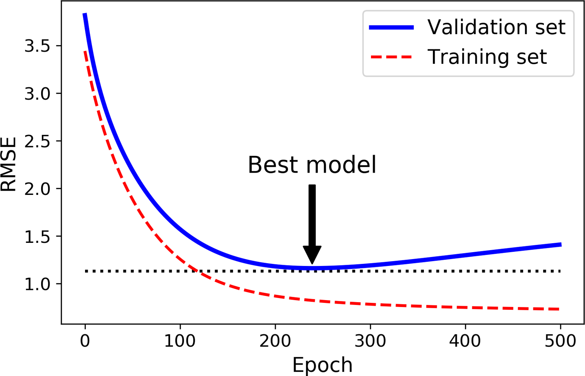


###### Tip

With Stochastic and Mini-batch Gradient Descent, the curves are not so
smooth, and it may be hard to know whether you have reached the minimum
or not. One solution is to stop only after the validation error has been
above the minimum for some time (when you are confident that the model
will not do any better), then roll back the model parameters to the
point where the validation error was at a minimum.


Here is a basic implementation of early stopping:

``` {data-type="programlisting" code-language="python"}
from sklearn.base import clone

# prepare the data
poly_scaler = Pipeline([
        ("poly_features", PolynomialFeatures(degree=90, include_bias=False)),
        ("std_scaler", StandardScaler())
    ])
X_train_poly_scaled = poly_scaler.fit_transform(X_train)
X_val_poly_scaled = poly_scaler.transform(X_val)

sgd_reg = SGDRegressor(max_iter=1, tol=-np.infty, warm_start=True,
                       penalty=None, learning_rate="constant", eta0=0.0005)

minimum_val_error = float("inf")
best_epoch = None
best_model = None
for epoch in range(1000):
    sgd_reg.fit(X_train_poly_scaled, y_train)  # continues where it left off
    y_val_predict = sgd_reg.predict(X_val_poly_scaled)
    val_error = mean_squared_error(y_val, y_val_predict)
    if val_error < minimum_val_error:
        minimum_val_error = val_error
        best_epoch = epoch
        best_model = clone(sgd_reg)
```

Note that with `warm_start=True`, when the `fit()` method is called it
continues training where it left off, instead of restarting from
scratch. []{}


Logistic Regression
===================

As 
we discussed in
[Lab 1](https://learning.oreilly.com/library/view/hands-on-machine-learning/9781492032632/ch01.html#landscape_lab),
some regression algorithms can be used for classification (and vice
versa). *Logistic Regression* (also called *Logit Regression*) is
commonly used to estimate the probability that an instance belongs to a
particular class (e.g., what is the probability that this email is
spam?). If the estimated probability is greater than 50%, then the model
predicts that the instance belongs to that class (called the *positive
class*, labeled "1"), and otherwise it predicts that it does not (i.e.,
it belongs to the *negative class*, labeled "0"). This makes it a binary
classifier.


Estimating Probabilities
------------------------

So how does Logistic Regression work? Just like a
Linear Regression model, a Logistic Regression model computes a weighted
sum of the input features (plus a bias term), but instead of outputting
the result directly like the Linear Regression model does, it outputs
the *logistic* of this result (see [Equation
4-13](https://learning.oreilly.com/library/view/hands-on-machine-learning/9781492032632/ch04.html#logisticregression_model_estimated_probability_vectorized_form)).


##### [Equation 4-13. ] Logistic Regression model estimated probability (vectorized form)

$$\hat{p} = h_{\mathbf{\theta}}\left( \mathbf{x} \right) = \sigma\left( \mathbf{x}^{\intercal}\mathbf{\theta} \right)$$


The logistic---noted
*σ*(·)---is []{}
a *sigmoid function* (i.e., *S*-shaped) that outputs a number between 0
and 1. It is defined as shown in [Equation
4-14](https://learning.oreilly.com/library/view/hands-on-machine-learning/9781492032632/ch04.html#equation_four_fourteen)
and
[Figure 4-21](https://learning.oreilly.com/library/view/hands-on-machine-learning/9781492032632/ch04.html#logistic_function_plot).


##### [Equation 4-14. ] Logistic function

$$\sigma\left( t \right) = \frac{1}{1 + \exp\left( - t \right)}$$


Once the Logistic Regression model has estimated the probability
$\hat{p}$ = *h*~**θ**~(**x**) that an instance **x** belongs to the
positive class, it can make its prediction *ŷ* easily (see [Equation
4-15](https://learning.oreilly.com/library/view/hands-on-machine-learning/9781492032632/ch04.html#equation_four_fifteen)).


##### [Equation 4-15. ] Logistic Regression model prediction

$$\hat{y} = \begin{cases}
0 & {\text{if}\hat{p} < 0.5} \\
1 & {\text{if}\hat{p} \geq 0.5} \\
\end{cases}$$


Notice that *σ*(*t*) \< 0.5 when *t* \< 0, and *σ*(*t*) ≥ 0.5 when *t* ≥
0, so a Logistic Regression model predicts 1 if **x**^⊺^ **θ** is
positive and 0 if it is negative.


###### Note

The score *t* is often called the *logit*. The
name comes from the fact that the logit function, defined as logit(*p*)
= log(*p* / (1 -- *p*)), is the inverse of the logistic function.
Indeed, if you compute the logit of the estimated probability *p*, you
will find that the result is *t*. The logit is
also called the *log-odds*, since it is the log of the ratio between the
estimated probability for the positive class and the estimated
probability for the negative class.


Training and Cost Function
--------------------------

Now you know how a Logistic Regression model
estimates probabilities and makes predictions. But how is it trained?
The objective of training is to set the parameter vector **θ** so that
the model estimates high probabilities for positive instances (*y* = 1)
and low probabilities for negative instances (*y* = 0). This idea is
captured by the cost function shown in [Equation
4-16](https://learning.oreilly.com/library/view/hands-on-machine-learning/9781492032632/ch04.html#cost_function_of_a_single_training_instance)
for a single training instance **x**.


##### [Equation 4-16. ] Cost function of a single training instance

${c\left( \mathbf{\theta} \right)} = \left\{ \begin{matrix}
{- \log\left( \hat{p} \right)} & {\text{if~}y = 1} \\
{- \log\left( 1 - \hat{p} \right)} & {\text{if~}y = 0} \\
\end{matrix} \right.$


This cost function makes sense because --log(*t*) grows very large when
*t* approaches 0, so the cost will be large if the model estimates a
probability close to 0 for a positive instance, and it will also be very
large if the model estimates a probability close to 1 for a negative
instance. On the other hand, --log(*t*) is close to 0 when *t* is close
to 1, so the cost will be close to 0 if the estimated probability is
close to 0 for a negative instance or close to 1 for a positive
instance, which is precisely what we want.

The cost function over the whole training set is
the average cost over all training instances. It can be written in a
single expression called the *log loss*, shown in [Equation
4-17](https://learning.oreilly.com/library/view/hands-on-machine-learning/9781492032632/ch04.html#logistic_regression_cost_function).


##### [Equation 4-17. ] Logistic Regression cost function (log loss)

${J\left( \mathbf{\theta} \right)} = {- \frac{1}{m}\sum\limits_{i = 1}^{m}\left\lbrack {y^{(i)}log\left\lbrack {\hat{p}}^{(i)} \right\rbrack + \left( 1 - y^{(i)} \right)log\left\lbrack {1 - {\hat{p}}^{(i)}} \right\rbrack} \right\rbrack}$


The bad news is that there is no known closed-form equation to compute
the value of **θ** that minimizes this cost function (there is no
equivalent of the Normal Equation). The good news is that this cost
function is convex, so Gradient Descent (or any other optimization
algorithm) is guaranteed to find the global minimum (if the learning
rate is not too large and you wait long enough). The partial derivatives
of the cost function with regard to the *j*^th^ model parameter *θ*~*j*~
are given by [Equation
4-18](https://learning.oreilly.com/library/view/hands-on-machine-learning/9781492032632/ch04.html#logistic_cost_function_partial_derivatives).


##### [Equation 4-18. ] Logistic cost function partial derivatives

$$\frac{\partial}{\partial\theta_{j}}\text{J}\left( \mathbf{\theta} \right) = \frac{1}{m}\sum\limits_{i = 1}^{m}\left( {\sigma\left( \mathbf{\theta}^{\intercal}\mathbf{x}^{(i)} \right) - y^{(i)}} \right)\, x_{j}^{(i)}$$


This equation looks very much like [Equation
4-5](https://learning.oreilly.com/library/view/hands-on-machine-learning/9781492032632/ch04.html#mse_partial_derivatives):
for each instance it computes the prediction error and multiplies it by
the *j*^th^ feature value, and then it computes the average over all
training instances. Once you have the gradient vector containing all the
partial derivatives, you can use it in the Batch Gradient Descent
algorithm. That's it: you now know how to train a Logistic Regression
model. For Stochastic GD you would take one instance at a time, and for
Mini-batch GD you would use a mini-batch at a time.


Decision Boundaries
-------------------

Let's use []{}
the iris dataset to
illustrate Logistic Regression. This is a famous dataset that contains
the sepal and petal length and width of 150 iris flowers of three
different species: *Iris setosa*, *Iris versicolor*, and *Iris
virginica* (see
[Figure 4-22](https://learning.oreilly.com/library/view/hands-on-machine-learning/9781492032632/ch04.html#iris_dataset_diagram)).

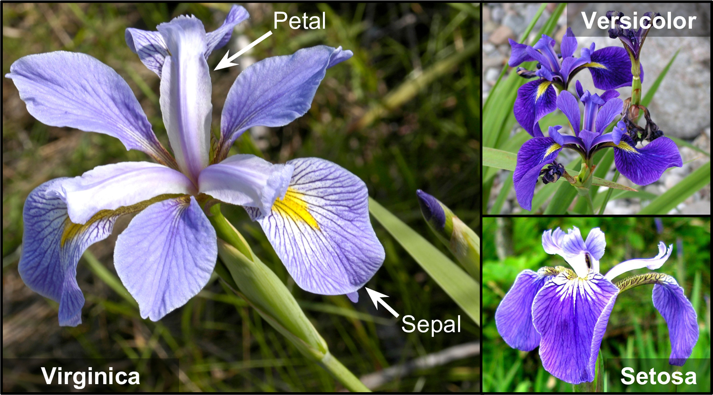

Let's try to build a classifier to detect the *Iris virginica* type
based only on the petal width feature. First let's load the data:

``` {data-type="programlisting" code-language="pycon"}
>>> from sklearn import datasets
>>> iris = datasets.load_iris()
>>> list(iris.keys())
['data', 'target', 'target_names', 'DESCR', 'feature_names', 'filename']
>>> X = iris["data"][:, 3:]  # petal width
>>> y = (iris["target"] == 2).astype(np.int)  # 1 if Iris virginica, else 0
```

Now let's train a Logistic Regression model:

``` {data-type="programlisting" code-language="python"}
from sklearn.linear_model import LogisticRegression

log_reg = LogisticRegression()
log_reg.fit(X, y)
```

Let's look at the model's estimated probabilities for flowers with petal
widths varying from 0 cm to 3 cm
([Figure 4-23](https://learning.oreilly.com/library/view/hands-on-machine-learning/9781492032632/ch04.html#logistic_regression_plot)):^[15](https://learning.oreilly.com/library/view/hands-on-machine-learning/9781492032632/ch04.html){-marker}^

``` {data-type="programlisting" code-language="python"}
X_new = np.linspace(0, 3, 1000).reshape(-1, 1)
y_proba = log_reg.predict_proba(X_new)
plt.plot(X_new, y_proba[:, 1], "g-", label="Iris virginica")
plt.plot(X_new, y_proba[:, 0], "b--", label="Not Iris virginica")
# + more Matplotlib code to make the image look pretty
```


The petal width of *Iris virginica* flowers (represented by triangles)
ranges from 1.4 cm to 2.5 cm, while the other iris flowers (represented
by squares) generally have a smaller petal width, ranging from 0.1 cm to
1.8 cm. Notice that there is a bit of overlap. Above about 2 cm the
classifier is highly confident that the flower is an *Iris virginica*
(it outputs a high probability for that class), while below 1 cm it is
highly confident that it is not an *Iris virginica* (high probability
for the "Not Iris virginica" class). In between these extremes, the
classifier is unsure. However, if you ask it to predict the class (using
the `predict()` method rather than the `predict_proba()` method), it
will return whichever class is the most likely. Therefore, there is a
*decision boundary* at around 1.6 cm where both probabilities are equal
to 50%: if the petal width is higher than 1.6 cm, the classifier will
predict that the flower is an *Iris virginica*, and otherwise it will
predict that it is not (even if it is not very confident):

``` {data-type="programlisting" code-language="pycon"}
>>> log_reg.predict([[1.7], [1.5]])
array([1, 0])
```

[Figure 4-24](https://learning.oreilly.com/library/view/hands-on-machine-learning/9781492032632/ch04.html#logistic_regression_contour_plot)
shows the same dataset, but this time displaying two features: petal
width and length. Once trained, the Logistic Regression classifier can,
based on these two features, estimate the probability that a new flower
is an *Iris virginica*. The dashed line represents the points where the
model estimates a 50% probability: this is the model's decision
boundary. Note that it is a linear
boundary.^[16](https://learning.oreilly.com/library/view/hands-on-machine-learning/9781492032632/ch04.html){-marker}^
Each parallel line represents the points where the model outputs a
specific probability, from 15% (bottom left) to 90% (top right). All the
flowers beyond the top-right line have an over 90% chance of being *Iris
virginica*, according to the model.

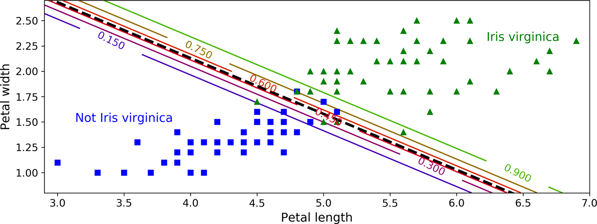

Just like the other linear models, Logistic Regression models can be
regularized using ℓ~1~ or ℓ~2~ penalties. Scikit-Learn actually adds an
ℓ~2~ penalty by default.


###### Note

The hyperparameter controlling the regularization strength of a
Scikit-Learn `LogisticRegression` model is not `alpha` (as in other
linear models), but its inverse: `C`. The higher the value of `C`, the
*less* the model is regularized.


Softmax Regression
------------------

The 
Logistic Regression model can be generalized to support multiple classes
directly, without having to train and combine multiple binary
classifiers (as discussed in
[Lab 3](https://learning.oreilly.com/library/view/hands-on-machine-learning/9781492032632/ch03.html#classification_lab)).
This is called *Softmax Regression*, or *Multinomial Logistic
Regression*.

The idea is simple: when given an instance **x**, the Softmax Regression
model first computes a score *s*~*k*~(**x**) for each class *k*, then
estimates the probability of each
class by applying the
*softmax function* (also called the *normalized exponential*) to the
scores. The equation to compute *s*~*k*~(**x**) should look familiar, as
it is just like the equation for Linear Regression prediction (see
[Equation
4-19](https://learning.oreilly.com/library/view/hands-on-machine-learning/9781492032632/ch04.html#softmax_score_for_class_k)).


##### [Equation 4-19. ] Softmax score for class k

$$s_{k}\left( \mathbf{x} \right) = \mathbf{x}^{\intercal}\mathbf{\theta}^{(k)}$$


Note that each class has its own dedicated
parameter vector **θ**^(*k*)^. All these vectors are typically stored as
rows in a *parameter matrix* **Θ**.

Once you have computed the score of every class for the instance **x**,
you can estimate the probability $\hat{p}$~*k*~ that the instance
belongs to class *k* by running the scores through the softmax function
([Equation
4-20](https://learning.oreilly.com/library/view/hands-on-machine-learning/9781492032632/ch04.html#softmax_function)).
The function computes the exponential of every score, then normalizes
them (dividing by the sum of all the exponentials). The scores are
generally called logits or log-odds (although they are actually
unnormalized log-odds).


##### [Equation 4-20. ] Softmax function

$${\hat{p}}_{k} = \sigma\left( {\mathbf{s}\left( \mathbf{x} \right)} \right)_{k} = \frac{\exp\left( {s_{k}\left( \mathbf{x} \right)} \right)}{\sum\limits_{j = 1}^{K}{\exp\left( {s_{j}\left( \mathbf{x} \right)} \right)}}$$


In this equation:

-   *K* is the number of classes.

-   **s**(**x**) is a vector containing the scores of each class for the
    instance **x**.

-   *σ*(**s**(**x**))~*k*~ is the estimated probability that the
    instance **x** belongs to class *k*, given the scores of each class
    for that instance.

Just like the Logistic Regression classifier, the Softmax Regression
classifier predicts the class with the highest estimated probability
(which is simply the class with the highest score), as shown in
[Equation
4-21](https://learning.oreilly.com/library/view/hands-on-machine-learning/9781492032632/ch04.html#softmax_regression_classifier_prediction).


##### [Equation 4-21. ] Softmax Regression classifier prediction

$$\hat{y} = \operatorname{argmax}\limits_{k}\,\sigma\left( {\mathbf{s}\left( \mathbf{x} \right)} \right)_{k} = \operatorname{argmax}\limits_{k}\, s_{k}\left( \mathbf{x} \right) = \operatorname{argmax}\limits_{k}\,\left( {\left( \mathbf{\theta}^{(k)} \right)^{\intercal}\mathbf{x}} \right)$$


The *argmax* operator returns the value of a
variable that maximizes a function. In this equation, it returns the
value of *k* that maximizes the estimated probability
*σ*(**s**(**x**))~*k*~.


###### Tip

The Softmax Regression classifier predicts only one class at a time
(i.e., it is multiclass, not multioutput), so it should be used only
with mutually exclusive classes, such as different types of plants. You
cannot use it to recognize multiple people in one picture.


Now that you know how the model estimates probabilities and makes
predictions, let's take a look at training. The objective is to have a
model that estimates a high probability for the target class (and
consequently a low probability for the other classes).
Minimizing the cost function
shown in [Equation
4-22](https://learning.oreilly.com/library/view/hands-on-machine-learning/9781492032632/ch04.html#cross_entropy_cost_function),
called the *cross entropy*, should lead to this objective because it
penalizes the model when it estimates a low probability for a target
class. Cross entropy is frequently used to measure how well a set of
estimated class probabilities matches the target classes.


##### [Equation 4-22. ] Cross entropy cost function

${J\left( \mathbf{\Theta} \right)} = {- \frac{1}{m}\sum\limits_{i = 1}^{m}\sum\limits_{k = 1}^{K}y_{k}^{(i)}\log\left( {\hat{p}}_{k}^{(i)} \right)}$


In this equation:

-   $y_{k}^{(i)}$ is the target probability that the *i*^th^ instance
    belongs to class *k*. In general, it is either equal to 1 or 0,
    depending on whether the instance belongs to the class or not.

Notice that when there are just two classes (*K* = 2), this cost
function is equivalent to the Logistic Regression's cost function (log
loss; see [Equation
4-17](https://learning.oreilly.com/library/view/hands-on-machine-learning/9781492032632/ch04.html#logistic_regression_cost_function)).


##### Cross Entropy

Cross entropy originated from information theory. Suppose you want to
efficiently transmit information about the weather every day. If there
are eight options (sunny, rainy, etc.), you could encode each option
using three bits because 2^3^ = 8. However, if you think it will be
sunny almost every day, it would be much more efficient to code "sunny"
on just one bit (0) and the other seven options on four bits (starting
with a 1). Cross entropy measures the average number of bits you
actually send per option. If your assumption about the weather is
perfect, cross entropy will be equal to the entropy of the weather
itself (i.e., its intrinsic unpredictability). But if your assumptions
are wrong (e.g., if it rains often), cross entropy []{}
will be greater by an amount called the *Kullback--Leibler (KL)
divergence*.

The cross entropy between two probability distributions *p* and *q* is
defined as *H*(*p*,*q*) = ---Σ~*x*~ *p*(*x*) log *q*(*x*) (at least when
the distributions are discrete). For more details, check out [my video
on the subject](https://homl.info/xentropy).


The gradient vector of this cost function with regard to **θ**^(*k*)^ is
given by [Equation
4-23](https://learning.oreilly.com/library/view/hands-on-machine-learning/9781492032632/ch04.html#cross_entropy_gradient_vector_for_class_k).


##### [Equation 4-23. ] Cross entropy gradient vector for class k

$$\nabla_{\mathbf{\theta}^{(k)}}\, J\left( \mathbf{\Theta} \right) = \frac{1}{m}\sum\limits_{i = 1}^{m}{\left( {{\hat{p}}_{k}^{(i)} - y_{k}^{(i)}} \right)\mathbf{x}^{(i)}}$$


Now you can compute the gradient vector for every class, then use
Gradient Descent (or any other optimization algorithm) to find the
parameter matrix **Θ** that minimizes the cost function.

Let's use Softmax Regression to classify the iris flowers into all three
classes. Scikit-Learn's `LogisticRegression` uses one-versus-the-rest by
default when you train it on more than two classes, but you can set the
`multi_class` hyperparameter to `"multinomial"` to switch it to Softmax
Regression. You must also specify a solver that supports Softmax
Regression, such as the `"lbfgs"` solver (see Scikit-Learn's
documentation for more details). It also applies ℓ~2~ regularization by
default, which you can control using the hyperparameter `C`:

``` {data-type="programlisting" code-language="python"}
X = iris["data"][:, (2, 3)]  # petal length, petal width
y = iris["target"]

softmax_reg = LogisticRegression(multi_class="multinomial",solver="lbfgs", C=10)
softmax_reg.fit(X, y)
```

So the next time you find an iris with petals that are 5 cm long and 2
cm wide, you can ask your model to tell you what type of iris it is, and
it will answer *Iris virginica* (class 2) with 94.2% probability (or
*Iris versicolor* with 5.8% probability):

``` {data-type="programlisting" code-language="pycon"}
>>> softmax_reg.predict([[5, 2]])
array([2])
>>> softmax_reg.predict_proba([[5, 2]])
array([[6.38014896e-07, 5.74929995e-02, 9.42506362e-01]])
```

[Figure 4-25](https://learning.oreilly.com/library/view/hands-on-machine-learning/9781492032632/ch04.html#softmax_regression_contour_plot)
shows the resulting decision boundaries, represented by the background
colors. Notice that the decision boundaries between any two classes are
linear. The figure also shows the probabilities for the *Iris
versicolor* class, represented by the curved lines (e.g., the line
labeled with 0.450 represents the 45% probability boundary). Notice that
the model can predict a class that has an estimated probability below
50%. For example, at the point where all decision boundaries meet, all
classes have an equal estimated probability of
33%. []{}

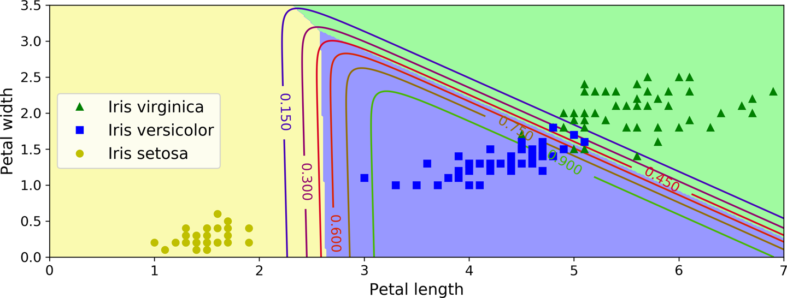


Exercises
=========

1.  Which Linear Regression training algorithm can you use if you have a
    training set with millions of features?

2.  Suppose the features in your training set have very different
    scales. Which algorithms might suffer from this, and how? What can
    you do about it?

3.  Can Gradient Descent get stuck in a local minimum when training a
    Logistic Regression model?

4.  Do all Gradient Descent algorithms lead to the same model, provided
    you let them run long enough?

5.  Suppose you use Batch Gradient Descent and you plot the validation
    error at every epoch. If you notice that the validation error
    consistently goes up, what is likely going on? How can you fix this?

6.  Is it a good idea to stop Mini-batch Gradient Descent immediately
    when the validation error goes up?

7.  Which Gradient Descent algorithm (among those we discussed) will
    reach the vicinity of the optimal solution the fastest? Which will
    actually converge? How can you make the others converge as well?

8.  Suppose you are using Polynomial Regression. You plot the learning
    curves and you notice that there is a large gap between the training
    error and the validation error. What is happening? What are three
    ways to solve this?

9.  Suppose you are using Ridge Regression and you notice that the
    training error and the validation error are almost equal and fairly
    high. Would you say that the model suffers from high bias or high
    variance? Should you increase the regularization hyperparameter *α*
    or reduce it?

10. Why would you want to use:

    1.  Ridge Regression instead of plain Linear Regression (i.e.,
        without any regularization)?

    2.  Lasso instead of Ridge Regression?

    3.  Elastic Net instead of Lasso?

11. Suppose you want to classify pictures as outdoor/indoor and
    daytime/nighttime. Should you implement two Logistic Regression
    classifiers or one Softmax Regression classifier?

12. Implement Batch Gradient Descent with early stopping for Softmax
    Regression (without using Scikit-Learn).

Solutions to these exercises are available in
[Appendix A](https://learning.oreilly.com/library/view/hands-on-machine-learning/9781492032632/app01.html#solutions_appendix).


^[1](https://learning.oreilly.com/library/view/hands-on-machine-learning/9781492032632/ch04.html-marker){.totri-footnote}^
It is often the case that a learning algorithm will try to optimize a
different function than the performance measure used to evaluate the
final model. This is generally because that function is easier to
compute, because it has useful differentiation properties that the
performance measure lacks, or because we want to constrain the model
during training, as you will see when we discuss regularization.

^[2](https://learning.oreilly.com/library/view/hands-on-machine-learning/9781492032632/ch04.html-marker){.totri-footnote}^
Note that Scikit-Learn separates the bias term (`intercept_`) from the
feature weights (`coef_`).

^[3](https://learning.oreilly.com/library/view/hands-on-machine-learning/9781492032632/ch04.html-marker){.totri-footnote}^
Technically speaking, its derivative is *Lipschitz continuous*.

^[4](https://learning.oreilly.com/library/view/hands-on-machine-learning/9781492032632/ch04.html-marker){.totri-footnote}^
Since feature 1 is smaller, it takes a larger change in *θ*~1~ to affect
the cost function, which is why the bowl is elongated along the *θ*~1~
axis.

^[5](https://learning.oreilly.com/library/view/hands-on-machine-learning/9781492032632/ch04.html-marker){.totri-footnote}^
Eta (*η*) is the seventh letter of the Greek alphabet.

^[6](https://learning.oreilly.com/library/view/hands-on-machine-learning/9781492032632/ch04.html-marker){.totri-footnote}^
While the Normal Equation can only perform Linear Regression, the
Gradient Descent algorithms can be used to train many other models, as
we will see.

^[7](https://learning.oreilly.com/library/view/hands-on-machine-learning/9781492032632/ch04.html-marker){.totri-footnote}^
A quadratic equation is of the form *y* = *ax*^2^ + *bx* + *c*.

^[8](https://learning.oreilly.com/library/view/hands-on-machine-learning/9781492032632/ch04.html-marker){.totri-footnote}^
This notion of bias is not to be confused with the bias term of linear
models.

^[9](https://learning.oreilly.com/library/view/hands-on-machine-learning/9781492032632/ch04.html-marker){.totri-footnote}^
It is common to use the notation *J*(**θ**) for cost functions that
don't have a short name; we will often use this notation throughout the
rest of this course. The context will make it clear which cost function is
being discussed.

^[10](https://learning.oreilly.com/library/view/hands-on-machine-learning/9781492032632/ch04.html-marker)^
Norms are discussed in
[Lab 2](https://learning.oreilly.com/library/view/hands-on-machine-learning/9781492032632/ch02.html#project_lab).

^[11](https://learning.oreilly.com/library/view/hands-on-machine-learning/9781492032632/ch04.html-marker)^
A square matrix full of 0s except for 1s on the main diagonal (top left
to bottom right).

^[12](https://learning.oreilly.com/library/view/hands-on-machine-learning/9781492032632/ch04.html-marker)^
Alternatively you can use the `Ridge` class with the `"sag"` solver.
Stochastic Average GD is a variant of Stochastic GD. For more details,
see the presentation ["Minimizing Finite Sums with the Stochastic
Average Gradient Algorithm"](https://homl.info/12) by Mark Schmidt et
al. from the University of British Columbia.

^[13](https://learning.oreilly.com/library/view/hands-on-machine-learning/9781492032632/ch04.html-marker)^
You can think of a subgradient vector at a nondifferentiable point as an
intermediate vector between the gradient vectors around that point.

^[14](https://learning.oreilly.com/library/view/hands-on-machine-learning/9781492032632/ch04.html-marker)^
Photos reproduced from the corresponding Wikipedia pages. *Iris
virginica* photo by Frank Mayfield ([Creative Commons BY-SA
2.0](https://creativecommons.org/licenses/by-sa/2.0/)), *Iris
versicolor* photo by D. Gordon E. Robertson ([Creative Commons BY-SA
3.0](https://creativecommons.org/licenses/by-sa/3.0/)), *Iris setosa*
photo public domain.

^[15](https://learning.oreilly.com/library/view/hands-on-machine-learning/9781492032632/ch04.html-marker)^
NumPy's `reshape()` function allows one dimension to be --1, which means
"unspecified": the value is inferred from the length of the array and
the remaining dimensions.

^[16](https://learning.oreilly.com/library/view/hands-on-machine-learning/9781492032632/ch04.html-marker)^
It is the the set of points **x** such that *θ*~0~ + *θ*~1~*x*~1~ +
*θ*~2~*x*~2~ = 0, which defines a straight line.
