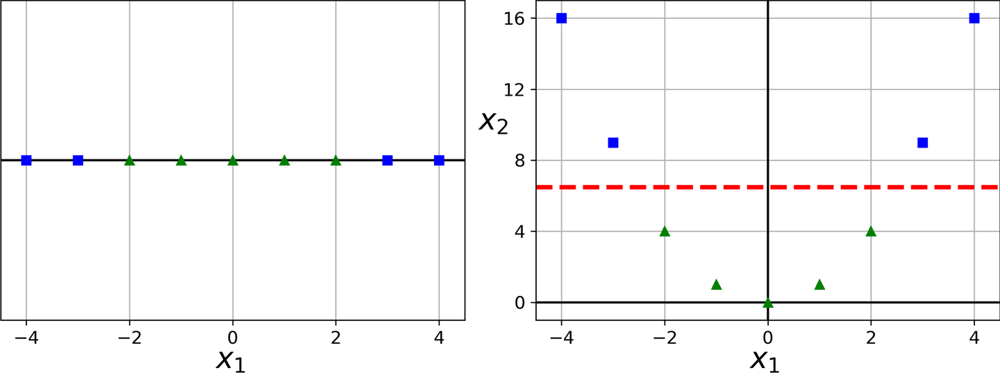
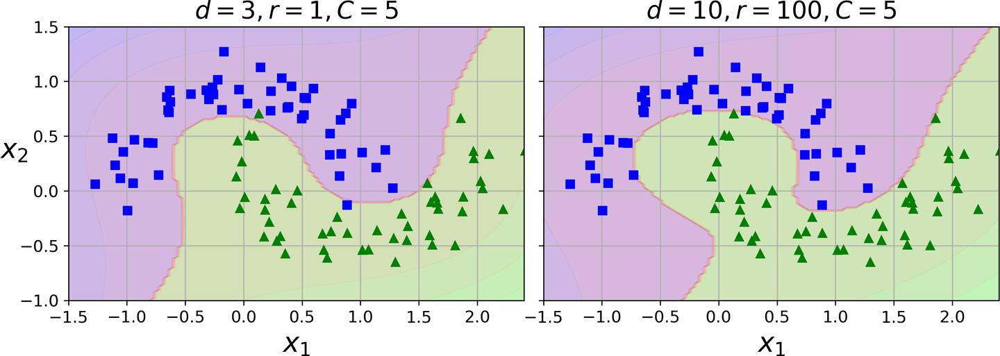
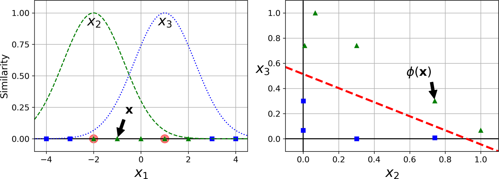
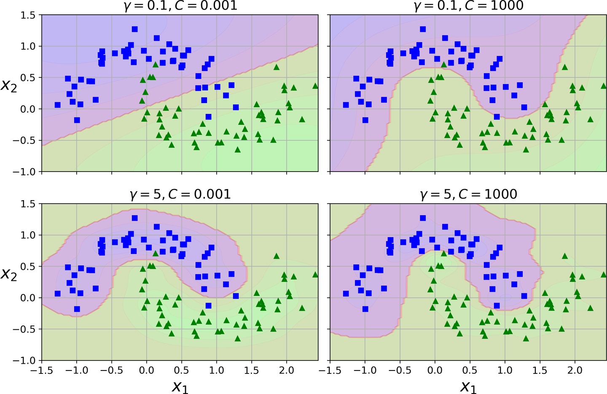
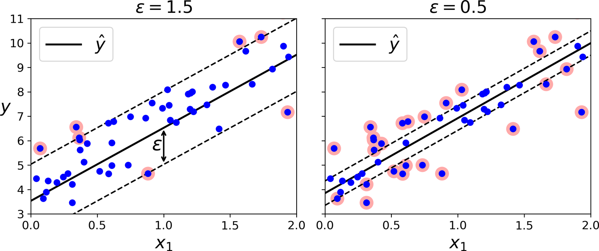
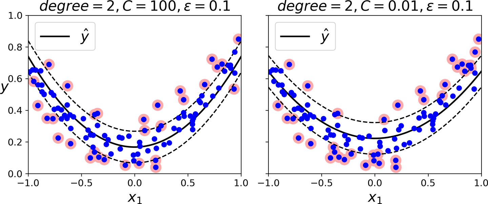
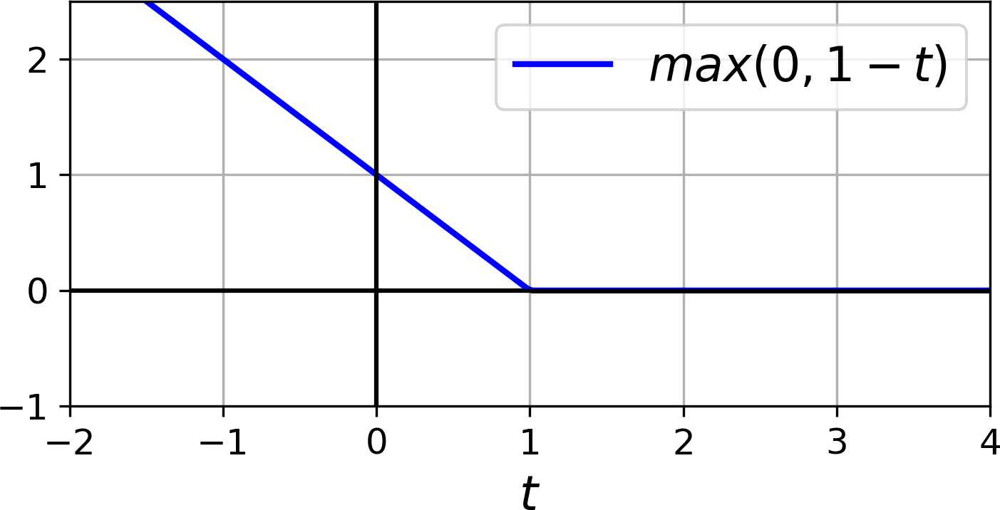

[Lab 5. ] Support Vector Machines
============================================

A *Support Vector Machine* (SVM) is[]{#idm45728481784856} a powerful and
versatile Machine Learning model, capable of performing linear or
nonlinear classification, regression, and even outlier detection. It is
one of the most popular models in Machine Learning, and anyone
interested in Machine Learning should have it in their toolbox. SVMs are
particularly well suited for classification of complex small- or
medium-sized datasets.

This lab will explain the core concepts of SVMs, how to use them,
and how they work.


Linear SVM Classification
=========================

The[]{#idm45728481715704}[]{#idm45728481714664}[]{#idm45728481713976}
fundamental idea behind SVMs is best explained with some pictures.
[Figure 5-1](https://learning.oreilly.com/library/view/hands-on-machine-learning/9781492032632/ch05.html#large_margin_classification_plot)
shows part of the iris dataset that was introduced at the end of
[Lab 4](https://learning.oreilly.com/library/view/hands-on-machine-learning/9781492032632/ch04.html#linear_models_lab).
The two classes can clearly be separated easily with a straight line
(they are *linearly separable*). The left plot shows the decision
boundaries of three possible linear classifiers. The model whose
decision boundary is represented by the dashed line is so bad that it
does not even separate the classes properly. The other two models work
perfectly on this training set, but their decision boundaries come so
close to the instances that these models will probably not perform as
well on new instances. In contrast, the solid line in the plot on the
right represents the decision boundary of an SVM classifier; this line
not only separates the two classes but also stays as far away from the
closest training instances as possible. You can think of an SVM
classifier as fitting the widest possible street (represented by the
parallel dashed lines) between the classes.
This[]{#idm45728481710104}[]{#idm45728481709384} is called *large margin
classification*.


Notice[]{#idm45728481705608} that adding more training instances "off
the street" will not affect the decision boundary at all: it is fully
determined (or "supported") by the instances located on the edge of the
street. These instances are called the *support vectors* (they are
circled in
[Figure 5-1](https://learning.oreilly.com/library/view/hands-on-machine-learning/9781492032632/ch05.html#large_margin_classification_plot)).


###### Warning

SVMs are sensitive to the feature scales, as you can see in
[Figure 5-2](https://learning.oreilly.com/library/view/hands-on-machine-learning/9781492032632/ch05.html#sensitivity_to_feature_scales_plot):
in the left plot, the vertical scale is much larger than the horizontal
scale, so the widest possible street is close to horizontal.
After[]{#idm45728481699144} feature scaling (e.g., using Scikit-Learn's
`StandardScaler`), the decision boundary in the right plot looks much
better.


Soft Margin Classification
--------------------------

If[]{#idm45728481695512}[]{#idm45728481694760} we strictly impose that
all instances must be off the street and on the right side,
this[]{#idm45728481693560}[]{#idm45728481692872} is called *hard margin
classification*. There are two main issues with hard margin
classification. First, it only works if the data is linearly separable.
Second, it is sensitive to outliers.
[Figure 5-3](https://learning.oreilly.com/library/view/hands-on-machine-learning/9781492032632/ch05.html#sensitivity_to_outliers_plot)
shows the iris dataset with just one additional outlier: on the left, it
is impossible to find a hard margin; on the right, the decision boundary
ends up very different from the one we saw in
[Figure 5-1](https://learning.oreilly.com/library/view/hands-on-machine-learning/9781492032632/ch05.html#large_margin_classification_plot)
without the outlier, and it will probably not generalize as well.


To[]{#idm45728481687032} avoid these issues, use a more flexible model.
The objective is to find a good balance between keeping the street as
large as possible and limiting the *margin violations* (i.e., instances
that end up in the middle of the street or even on the wrong side). This
is called *soft margin classification*.

When[]{#idm45728481684616} creating an SVM model using Scikit-Learn, we
can specify a number of hyperparameters. `C` is one of those
hyperparameters. If we set it to a low value, then we end up with the
model on the left of
[Figure 5-4](https://learning.oreilly.com/library/view/hands-on-machine-learning/9781492032632/ch05.html#regularization_plot).
With a high value, we get the model on the right. Margin violations are
bad. It's usually better to have few of them. However, in this case the
model on the left has a lot of margin violations but will probably
generalize better.


###### Tip

If your SVM model is overfitting, you can try regularizing it by
reducing `C`.


The[]{#idm45728481677640}[]{#idm45728481676904} following Scikit-Learn
code loads the iris dataset, scales the features, and then trains a
linear SVM model (using the `LinearSVC` class with `C=1` and the *hinge
loss* function, described shortly) to detect *Iris virginica* flowers:

``` {data-type="programlisting" code-language="python"}
import numpy as np
from sklearn import datasets
from sklearn.pipeline import Pipeline
from sklearn.preprocessing import StandardScaler
from sklearn.svm import LinearSVC

iris = datasets.load_iris()
X = iris["data"][:, (2, 3)]  # petal length, petal width
y = (iris["target"] == 2).astype(np.float64)  # Iris virginica

svm_clf = Pipeline([
        ("scaler", StandardScaler()),
        ("linear_svc", LinearSVC(C=1, loss="hinge")),
    ])

svm_clf.fit(X, y)
```

The resulting model is represented on the left in
[Figure 5-4](https://learning.oreilly.com/library/view/hands-on-machine-learning/9781492032632/ch05.html#regularization_plot).

Then, as usual, you can use the model to make predictions:

``` {data-type="programlisting" code-language="pycon"}
>>> svm_clf.predict([[5.5, 1.7]])
array([1.])
```


###### Note

Unlike Logistic Regression classifiers, SVM classifiers do not output
probabilities for each class.


Instead of using the `LinearSVC` class, we could use the `SVC` class
with a linear kernel. When creating the SVC model, we would write
`SVC(kernel="linear", C=1)`. Or we could use the `SGDClassifier` class,
with `SGDClassifier(loss="hinge", alpha=1/(m*C))`. This applies regular
Stochastic Gradient Descent (see
[Lab 4](https://learning.oreilly.com/library/view/hands-on-machine-learning/9781492032632/ch04.html#linear_models_lab))
to train a linear SVM classifier. It does not converge as fast as the
`LinearSVC` class, but it can be useful to handle online classification
tasks or huge datasets that do not fit in memory (out-of-core training).


###### Tip

The `LinearSVC` class regularizes the bias term, so you should center
the training set first by subtracting its mean. This is automatic if you
scale the data using the `StandardScaler`. Also make sure you set the
`loss` hyperparameter to `"hinge"`, as it is not the default value.
Finally, for better performance, you should set the `dual`
hyperparameter to `False`, unless there are more features than training
instances (we will discuss duality later in the lab).


Nonlinear SVM Classification
============================

Although[]{#SVMnonlinear05}[]{#nonlinSVM05}[]{#CPnonlinear05} linear SVM
classifiers are efficient and work surprisingly well in many cases, many
datasets are not even close to being linearly separable. One approach to
handling nonlinear datasets is to add more features, such as polynomial
features (as you did in
[Lab 4](https://learning.oreilly.com/library/view/hands-on-machine-learning/9781492032632/ch04.html#linear_models_lab));
in some cases this can result in a linearly separable dataset. Consider
the left plot in
[Figure 5-5](https://learning.oreilly.com/library/view/hands-on-machine-learning/9781492032632/ch05.html#higher_dimensions_plot):
it represents a simple dataset with just one feature, *x*~1~. This
dataset is not linearly separable, as you can see. But if you add a
second feature *x*~2~ = (*x*~1~)^2^, the resulting 2D dataset is
perfectly linearly separable.



To implement this idea using Scikit-Learn, create a `Pipeline`
containing a `PolynomialFeatures` transformer (discussed in ["Polynomial
Regression"](https://learning.oreilly.com/library/view/hands-on-machine-learning/9781492032632/ch04.html#polynomial_regression)),
followed by a `StandardScaler` and a `LinearSVC`. Let's test this on the
moons dataset: this is a toy dataset for binary classification in which
the data points are shaped as two interleaving half circles (see
[Figure 5-6](https://learning.oreilly.com/library/view/hands-on-machine-learning/9781492032632/ch05.html#moons_polynomial_svc_plot)).
You can generate this dataset using the `make_moons()` function:

``` {data-type="programlisting" code-language="python"}
from sklearn.datasets import make_moons
from sklearn.pipeline import Pipeline
from sklearn.preprocessing import PolynomialFeatures

X, y = make_moons(n_samples=100, noise=0.15)
polynomial_svm_clf = Pipeline([
        ("poly_features", PolynomialFeatures(degree=3)),
        ("scaler", StandardScaler()),
        ("svm_clf", LinearSVC(C=10, loss="hinge"))
    ])

polynomial_svm_clf.fit(X, y)
```


Polynomial Kernel
-----------------

Adding[]{#idm45728481404824} polynomial features is simple to implement
and can work great with all sorts of Machine Learning algorithms (not
just SVMs). That said, at a low polynomial degree, this method cannot
deal with very complex datasets, and with a high polynomial degree it
creates a huge number of features, making the model too slow.

Fortunately, when[]{#idm45728481403240} using SVMs you can apply an
almost miraculous mathematical technique called the *kernel trick*
(explained in a moment). The kernel trick makes it possible to get the
same result as if you had added many polynomial features, even with very
high-degree polynomials, without actually having to add them. So there
is no combinatorial explosion of the number of features because you
don't actually add any features. This trick is implemented by the `SVC`
class. Let's test it on the moons dataset:

``` {data-type="programlisting" code-language="python"}
from sklearn.svm import SVC
poly_kernel_svm_clf = Pipeline([
        ("scaler", StandardScaler()),
        ("svm_clf", SVC(kernel="poly", degree=3, coef0=1, C=5))
    ])
poly_kernel_svm_clf.fit(X, y)
```

This code trains an SVM classifier using a third-degree polynomial
kernel. It is represented on the left in
[Figure 5-7](https://learning.oreilly.com/library/view/hands-on-machine-learning/9781492032632/ch05.html#moons_kernelized_polynomial_svc_plot).
On the right is another SVM classifier using a 10th-degree polynomial
kernel. Obviously, if your model is overfitting, you might want to
reduce the polynomial degree. Conversely, if it is underfitting, you can
try increasing it. The hyperparameter `coef0` controls how much the
model is influenced by high-degree polynomials versus low-degree
polynomials.




###### Tip

A common approach to finding the right hyperparameter values is to use
grid search (see
[Lab 2](https://learning.oreilly.com/library/view/hands-on-machine-learning/9781492032632/ch02.html#project_lab)).
It is often faster to first do a very coarse grid search, then a finer
grid search around the best values found. Having a good sense of what
each hyperparameter actually does can also help you search in the right
part of the hyperparameter space.


Similarity Features
-------------------

Another technique[]{#idm45728481297240}[]{#idm45728481296120} to tackle
nonlinear problems is to add features computed using a *similarity
function*, which measures how much each instance resembles a particular
*landmark*. For example, let's take the 1D dataset discussed earlier and
add two landmarks to it at *x*~1~ = --2 and *x*~1~ = 1 (see the left
plot in
[Figure 5-8](https://learning.oreilly.com/library/view/hands-on-machine-learning/9781492032632/ch05.html#kernel_method_plot)).
Next, let's define[]{#idm45728481292136}[]{#idm45728481291464} the
similarity function to be the Gaussian *Radial Basis Function* (RBF)
with *γ* = 0.3 (see [Equation
5-1](https://learning.oreilly.com/library/view/hands-on-machine-learning/9781492032632/ch05.html#grbf_function)).


##### [Equation 5-1. ] Gaussian RBF

$${\phi_{\gamma}\left( \mathbf{x},\ell \right)} = {\exp\left( {- \gamma{\parallel {\mathbf{x} - \ell} \parallel}^{2}} \right)}$$


This is a bell-shaped function varying from 0 (very far away from the
landmark) to 1 (at the landmark). Now we are ready to compute the new
features. For example, let's look at the instance *x*~1~ = --1: it is
located at a distance of 1 from the first landmark and 2 from the second
landmark. Therefore its new features are *x*~2~ = exp(--0.3 × 1^2^) ≈
0.74 and *x*~3~ = exp(--0.3 × 2^2^) ≈ 0.30. The plot on the right in
[Figure 5-8](https://learning.oreilly.com/library/view/hands-on-machine-learning/9781492032632/ch05.html#kernel_method_plot)
shows the transformed dataset (dropping the original features). As you
can see, it is now linearly [separable].



You may wonder how to select the landmarks. The simplest approach is to
create a landmark at the location of each and every instance in the
dataset. Doing that creates many dimensions and thus increases the
chances that the transformed training set will be linearly separable.
The downside is that a training set with *m* instances and *n* features
gets transformed into a training set with *m* instances and *m* features
(assuming you drop the original features). If your training set is very
large, you end up with an equally large number of features.


Gaussian RBF Kernel
-------------------

Just like the polynomial features method, the similarity features method
can be useful with any Machine Learning algorithm, but it may be
computationally expensive to compute all the additional features,
especially on large training sets. Once again the kernel trick does its
SVM magic, making it possible to obtain a similar result as if you had
added many similarity features. Let's try the `SVC` class with the
Gaussian RBF [kernel]:

``` {data-type="programlisting" code-language="python"}
rbf_kernel_svm_clf = Pipeline([
        ("scaler", StandardScaler()),
        ("svm_clf", SVC(kernel="rbf", gamma=5, C=0.001))
    ])
rbf_kernel_svm_clf.fit(X, y)
```

This model is represented at the bottom left in
[Figure 5-9](https://learning.oreilly.com/library/view/hands-on-machine-learning/9781492032632/ch05.html#moons_rbf_svc_plot).
The other plots show models trained with different values of
hyperparameters `gamma` (*γ*) and `C`. Increasing `gamma` makes the
bell-shaped curve narrower (see the lefthand plots in
[Figure 5-8](https://learning.oreilly.com/library/view/hands-on-machine-learning/9781492032632/ch05.html#kernel_method_plot)).
As a result, each instance's range of influence is smaller: the decision
boundary ends up being more irregular, wiggling around individual
instances. Conversely, a small `gamma` value makes the bell-shaped curve
wider: instances have a larger range of influence, and the decision
boundary ends up smoother. So *γ* acts like a regularization
[hyperparameter]: if your model is overfitting, you
should reduce it; if it is underfitting, you should increase it (similar
to the `C` hyperparameter).



Other
kernels[]{#idm45728481200616}[]{#idm45728481199880}[]{#idm45728481199240}
exist but are used much more rarely. Some kernels are specialized for
specific data structures. *String kernels* are sometimes used when
classifying text documents or DNA sequences (e.g., using the *string
subsequence kernel* or kernels based on the *Levenshtein distance*).


###### Tip

With so many kernels to choose from, how can you decide which one to
use? As a rule of thumb, you should always try the linear kernel first
(remember that `LinearSVC` is much faster than `SVC(kernel="linear")`),
especially if the training set is very large or if it has plenty of
features. If the training set is not too large, you should also try the
Gaussian RBF kernel; it works well in most cases. Then if you have spare
time and computing power, you can experiment with a few other kernels,
using cross-validation and grid search. You'd want to experiment like
that especially if there are kernels specialized for your training set's
data structure.


Computational Complexity
------------------------

The `LinearSVC` class[]{#idm45728481192376} is based on the `liblinear`
library, which implements an [optimized algorithm](https://homl.info/13)
for linear
SVMs.^[1](https://learning.oreilly.com/library/view/hands-on-machine-learning/9781492032632/ch05.html#idm45728481190408){#idm45728481190408-marker
.totri-footnote}^ It does not support the kernel trick, but it scales
almost linearly with the number of training instances and the number of
features. Its training time complexity is roughly *O*(*m* × *n*).

The[]{#idm45728481187368} algorithm takes longer if you require very
high precision. This is controlled by the tolerance hyperparameter *ϵ*
(called `tol` in Scikit-Learn). In most classification tasks, the
default tolerance is fine.

The `SVC` class[]{#idm45728481184008} is based on the `libsvm` library,
which implements [an algorithm](https://homl.info/14) that supports the
kernel
trick.^[2](https://learning.oreilly.com/library/view/hands-on-machine-learning/9781492032632/ch05.html#idm45728481182040){#idm45728481182040-marker
.totri-footnote}^ The training time complexity is usually between
*O*(*m*^2^ × *n*) and *O*(*m*^3^ × *n*). Unfortunately, this means that
it gets dreadfully slow when the number of training instances gets large
(e.g., hundreds of thousands of instances). This algorithm is perfect
for complex small or medium-sized training sets. It scales well with the
number of features, especially with *sparse features* (i.e., when each
instance has few nonzero features). In this case, the algorithm scales
roughly with the average number of nonzero features per instance.
[Table 5-1](https://learning.oreilly.com/library/view/hands-on-machine-learning/9781492032632/ch05.html#svm_classification_algorithm_comparison)
compares Scikit-Learn's SVM classification
classes.[]{#idm45728481175032}[]{#idm45728481174024}[]{#idm45728481173080}[]{#idm45728481172136}

  Class             Time complexity                      Out-of-core support   Scaling required   Kernel trick
  ----------------- ------------------------------------ --------------------- ------------------ --------------
  `LinearSVC`       *O*(*m* × *n*)                       No                    Yes                No
  `SGDClassifier`   *O*(*m* × *n*)                       Yes                   Yes                No
  `SVC`             *O*(*m*² × *n*) to *O*(*m*³ × *n*)   No                    Yes                Yes

  : [Table 5-1. ] Comparison of Scikit-Learn classes for SVM
  classification


SVM Regression
==============

As[]{#idm45728481127288}[]{#idm45728481126312} mentioned earlier, the
SVM algorithm is versatile: not only does it support linear and
nonlinear classification, but it also supports linear and nonlinear
regression. To use SVMs for regression instead of classification, the
trick is to reverse the objective: instead of trying to fit the largest
possible street between two classes while limiting margin violations,
SVM Regression tries to fit as many instances as possible *on* the
street while limiting margin violations (i.e., instances *off* the
street). The width of the street is controlled by a hyperparameter, *ϵ*.
[Figure 5-10](https://learning.oreilly.com/library/view/hands-on-machine-learning/9781492032632/ch05.html#svm_regression_plot)
shows two linear SVM Regression models trained on some random linear
data, one with a large margin (*ϵ* = 1.5) and the other with a small
margin (*ϵ* = 0.5).



Adding more training instances within the margin does not affect the
model's predictions; thus, the model is said to be *ϵ-insensitive*.

You can use Scikit-Learn's `LinearSVR` class to perform linear SVM
Regression. The following code produces the model represented on the
left in
[Figure 5-10](https://learning.oreilly.com/library/view/hands-on-machine-learning/9781492032632/ch05.html#svm_regression_plot)
(the training data should be scaled and centered first):

``` {data-type="programlisting" code-language="python"}
from sklearn.svm import LinearSVR

svm_reg = LinearSVR(epsilon=1.5)
svm_reg.fit(X, y)
```

To tackle nonlinear regression tasks, you can use a kernelized SVM
model.
[Figure 5-11](https://learning.oreilly.com/library/view/hands-on-machine-learning/9781492032632/ch05.html#svm_with_polynomial_kernel_plot)
shows SVM Regression on a random quadratic training set, using a
second-degree polynomial kernel. There is little regularization in the
left plot (i.e., a large `C` value), and much more regularization in the
right plot (i.e., a small `C` value).



The following code uses Scikit-Learn's `SVR` class (which supports the
kernel trick) to produce the model represented on the left in
[Figure 5-11](https://learning.oreilly.com/library/view/hands-on-machine-learning/9781492032632/ch05.html#svm_with_polynomial_kernel_plot):

``` {data-type="programlisting" code-language="python"}
from sklearn.svm import SVR

svm_poly_reg = SVR(kernel="poly", degree=2, C=100, epsilon=0.1)
svm_poly_reg.fit(X, y)
```

The `SVR` class is the regression equivalent of the `SVC` class, and the
`LinearSVR` class is the regression equivalent of the `LinearSVC` class.
The `LinearSVR` class scales linearly with the size of the training set
(just like the `LinearSVC` class), while the `SVR` class gets much too
slow when the training set grows large (just like the `SVC` class).


###### Note

SVMs can also be used for outlier detection; see Scikit-Learn's
documentation for more details.


Under the Hood
==============

This section explains how SVMs make predictions and how their training
algorithms work, starting with linear SVM classifiers. If you are just
getting started with Machine Learning, you can safely skip it and go
straight to the exercises at the end of this lab, and come back
later when you want to get a deeper understanding of SVMs.

First, a word[]{#idm45728481030984} about notations. In
[Lab 4](https://learning.oreilly.com/library/view/hands-on-machine-learning/9781492032632/ch04.html#linear_models_lab)
we used the convention of putting all the model parameters in one vector
**θ**, including the bias term *θ*~0~ and the input feature weights
*θ*~1~ to *θ*~*n*~, and adding a bias input *x*~0~ = 1 to all instances.
In this lab we will use a convention that is more convenient (and
more common) when dealing with SVMs: the bias term will be called *b*,
and the feature weights vector will be called **w**. No bias feature
will be added to the input feature vectors.


Decision Function and Predictions
---------------------------------

The[]{#idm45728481022888} linear SVM classifier model predicts the class
of a new instance **x** by simply computing the decision function
**w**^⊺^ **x** + *b* = *w*~1~ *x*~1~ + ⋯ + *w*~*n*~ *x*~*n*~ + *b*. If
the result is positive, the predicted class *ŷ* is the positive class
(1), and otherwise it is the negative class (0); see [Equation
5-2](https://learning.oreilly.com/library/view/hands-on-machine-learning/9781492032632/ch05.html#linear_svm_classifier_prediction).


##### [Equation 5-2. ] Linear SVM classifier prediction

$$\hat{y} = \begin{cases}
0 & {\text{if}\mathbf{w}^{\intercal}\mathbf{x} + b < 0,} \\
1 & {\text{if}\mathbf{w}^{\intercal}\mathbf{x} + b \geq 0} \\
\end{cases}$$


[Figure 5-12](https://learning.oreilly.com/library/view/hands-on-machine-learning/9781492032632/ch05.html#iris_3D_plot)
shows the decision function that corresponds to the model in the left in
[Figure 5-4](https://learning.oreilly.com/library/view/hands-on-machine-learning/9781492032632/ch05.html#regularization_plot):
it is a 2D plane because this dataset has two features (petal width and
petal length). The decision boundary is the set of points where the
decision function is equal to 0: it is the intersection of two planes,
which is a straight line (represented by the thick solid
line).^[3](https://learning.oreilly.com/library/view/hands-on-machine-learning/9781492032632/ch05.html#idm45728480959240){#idm45728480959240-marker
.totri-footnote}^


The dashed lines represent the points where the decision function is
equal to 1 or --1: they are parallel and at equal distance to the
decision boundary, and they form a margin around it. Training a linear
SVM classifier means finding the values of **w** and *b* that make this
margin as wide as possible while avoiding margin violations (hard
margin) or limiting them (soft margin).


Training Objective
------------------

Consider[]{#idm45728480950392} the slope of the decision function: it is
equal to the norm of the weight vector, ∥ **w** ∥. If we divide this
slope by 2, the points where the decision function is equal to ±1 are
going to be twice as far away from the decision boundary. In other
words, dividing the slope by 2 will multiply the margin by 2. This may
be easier to visualize in 2D, as shown in
[Figure 5-13](https://learning.oreilly.com/library/view/hands-on-machine-learning/9781492032632/ch05.html#small_w_large_margin_plot).
The smaller the weight vector **w**, the larger the
[margin].


So we want to minimize ∥ **w** ∥ to get a large margin. If we also want
to avoid any margin violations (hard margin), then we need the decision
function to be greater than 1 for all positive training instances and
lower than --1 for negative training instances. If we define *t*^(*i*)^
= --1 for negative instances (if *y*^(*i*)^ = 0) and *t*^(*i*)^ = 1 for
positive instances (if *y*^(*i*)^ = 1), then we can express this
constraint as *t*^(*i*)^(**w**^⊺^ **x**^(*i*)^ + *b*) ≥ 1 for all
instances.

We[]{#idm45728480934840} can therefore express the hard margin linear
SVM classifier objective as the constrained optimization problem in
[Equation
5-3](https://learning.oreilly.com/library/view/hands-on-machine-learning/9781492032632/ch05.html#hard_margin_objective).


##### [Equation 5-3. ] Hard margin linear SVM classifier objective

$$\begin{array}{cl}
 & {\operatorname{minimize}\limits_{\mathbf{w},b}{\frac{1}{2}\mathbf{w}^{\intercal}\mathbf{w}}} \\
 & {\text{subject}\text{to} t^{(i)}\left( \mathbf{w}^{\intercal}\mathbf{x}^{(i)} + b \right) \geq 1\text{for} i = 1,2,\cdots,m} \\
\end{array}$$


###### Note

We are minimizing ½ **w**^⊺^ **w**, which is equal to ½∥ **w** ∥^2^,
rather than minimizing ∥ **w** ∥. Indeed, ½∥ **w** ∥^2^ has a nice,
simple derivative (it is just **w**), while ∥ **w** ∥ is not
differentiable at **w** = 0. Optimization algorithms work much better on
differentiable functions.


To get the soft margin objective, we need to[]{#idm45728480897096}
introduce a *slack variable* *ζ*^(*i*)^ ≥ 0 for each
instance:^[4](https://learning.oreilly.com/library/view/hands-on-machine-learning/9781492032632/ch05.html#idm45728480894344){#idm45728480894344-marker
.totri-footnote}^ *ζ*^(*i*)^ measures how much the *i*^th^ instance is
allowed to violate the margin. We now have two conflicting objectives:
make the slack variables as small as possible to reduce the margin
violations, and make ½ **w**^⊺^ **w** as small as possible to increase
the margin. This is where the `C` hyperparameter comes in: it allows us
to define the tradeoff between these two objectives. This gives us the
constrained optimization problem in [Equation
5-4](https://learning.oreilly.com/library/view/hands-on-machine-learning/9781492032632/ch05.html#soft_margin_objective).


##### [Equation 5-4. ] Soft margin linear SVM classifier objective

$$\begin{array}{cl}
 & {\operatorname{minimize}\limits_{\mathbf{w},b,\zeta}{\frac{1}{2}\mathbf{w}^{\intercal}\mathbf{w} + C\sum\limits_{i = 1}^{m}\zeta^{(i)}}} \\
 & {\text{subject}\text{to} t^{(i)}\left( \mathbf{w}^{\intercal}\mathbf{x}^{(i)} + b \right) \geq 1 - \zeta^{(i)}\text{and}\zeta^{(i)} \geq 0\text{for} i = 1,2,\cdots,m} \\
\end{array}$$


Quadratic Programming
---------------------

The hard margin and soft margin problems are both convex quadratic
optimization problems with linear constraints.
Such[]{#idm45728480843656} problems are known as *Quadratic Programming*
(QP) problems. Many off-the-shelf solvers are available to solve QP
problems by using a variety of techniques that are outside the scope of
this
course.^[5](https://learning.oreilly.com/library/view/hands-on-machine-learning/9781492032632/ch05.html#idm45728480842232){#idm45728480842232-marker
.totri-footnote}^

The general problem formulation is given by [Equation
5-5](https://learning.oreilly.com/library/view/hands-on-machine-learning/9781492032632/ch05.html#quadratic_programming_problem_formulation).


##### [Equation 5-5. ] Quadratic Programming problem

$$\begin{aligned}
{\underset{\mathbf{p}}{\text{Minimize}}} & {\frac{1}{2}\mathbf{p}^{\intercal}\mathbf{H}\mathbf{p} + \mathbf{f}^{\intercal}\mathbf{p}} \\
{\text{subject}\text{to}} & {\mathbf{A}\mathbf{p} \leq \mathbf{b}} \\
{\text{where}} & \begin{cases}
\mathbf{p} & {\text{is}\text{an} n_{p}\text{-dimensional}\text{vector}\text{(}n_{p} = \text{number}\text{of}\text{parameters),}} \\
\mathbf{H} & {\text{is}\text{an} n_{p} \times n_{p}\text{matrix,}} \\
\mathbf{f} & {\text{is}\text{an} n_{p}\text{-dimensional}\text{vector,}} \\
\mathbf{A} & {\text{is}\text{an} n_{c} \times n_{p}\text{matrix}\text{(}n_{c} = \text{number}\text{of}\text{constraints),}} \\
\mathbf{b} & {\text{is}\text{an} n_{c}\text{-dimensional}\text{vector.}} \\
\end{cases} \\
\end{aligned}$$


Note that the expression **A** **p** ≤ **b** defines *n*~*c*~
constraints: **p**^⊺^ **a**^(*i*)^ ≤ *b*^(*i*)^ for *i* = 1, 2, ⋯,
*n*~*c*~, where **a**^(*i*)^ is the vector containing the elements of
the *i*^th^ row of **A** and *b*^(*i*)^ is the *i*^th^ element of **b**.

You can easily verify that if you set the QP parameters in the following
way, you get the hard margin linear SVM classifier objective:

-   *n*~*p*~ = *n* + 1, where *n* is the number of features (the +1 is
    for the bias term).

-   *n*~*c*~ = *m*, where *m* is the number of training instances.

-   **H** is the *n*~*p*~ × *n*~*p*~ identity matrix, except with a zero
    in the top-left cell (to ignore the bias term).

-   **f** = 0, an *n*~*p*~-dimensional vector full of 0s.

-   **b** = --1, an *n*~*c*~-dimensional vector full of --1s.

-   **a**^(*i*)^ = --*t*^(*i*)^ $\overset{˙}{\mathbf{x}}$^(*i*)^, where
    $\overset{˙}{\mathbf{x}}$^(*i*)^ is equal to **x**^(*i*)^ with an
    extra bias feature $\overset{˙}{\mathbf{x}}$~0~ = 1.

One way to train a hard margin linear SVM classifier is to use an
off-the-shelf QP solver and pass it the preceding parameters. The
resulting vector **p** will contain the bias term *b* = *p*~0~ and the
feature weights *w*~*i*~ = *p*~*i*~ for *i* = 1, 2, ⋯, *n*. Similarly,
you can use a QP solver to solve the soft margin problem (see the
exercises at the end of the lab).

To use the kernel trick, we are going to look at a different constrained
optimization problem.


The Dual Problem
----------------

Given[]{#idm45728480711368}[]{#idm45728480710392}[]{#idm45728480709720}
a constrained optimization problem, known as the *primal problem*, it is
possible to express a different but closely related problem, called its
*dual problem*. The [solution] to the dual problem
typically gives a lower bound to the solution of the primal problem, but
under some conditions it can have the same solution as the primal
problem. Luckily, the SVM problem happens to meet these
conditions,^[6](https://learning.oreilly.com/library/view/hands-on-machine-learning/9781492032632/ch05.html#idm45728480707160){#idm45728480707160-marker
.totri-footnote}^ so you can choose to solve the primal problem or the
dual problem; both will have the same solution. [Equation
5-6](https://learning.oreilly.com/library/view/hands-on-machine-learning/9781492032632/ch05.html#svm_dual_form)
shows the dual form of the linear SVM objective (if you are interested
in knowing how to derive the dual problem from the primal problem, see
[Appendix C](https://learning.oreilly.com/library/view/hands-on-machine-learning/9781492032632/app03.html#svm_dual_problem_appendix)).


##### [Equation 5-6. ] Dual form of the linear SVM objective

$$\begin{array}{r}
{\operatorname{minimize}\limits_{\alpha}\frac{1}{2}\sum\limits_{i = 1}^{m}{\sum\limits_{j = 1}^{m}{\alpha^{(i)}\alpha^{(j)}t^{(i)}t^{(j)}{\mathbf{x}^{(i)}}^{\intercal}\mathbf{x}^{(j)}}} - \sum\limits_{i = 1}^{m}\alpha^{(i)}} \\
{\text{subject}\text{to}\alpha^{(i)} \geq 0\text{for} i = 1,2,\cdots,m} \\
\end{array}$$


Once you find the vector $\hat{\mathbf{\alpha}}$ that minimizes this
equation (using a QP solver), use [Equation
5-7](https://learning.oreilly.com/library/view/hands-on-machine-learning/9781492032632/ch05.html#from_alpha_to_w_and_b)
to compute $\hat{\mathbf{w}}$ and $\hat{b}$ that minimize the primal
problem.


##### [Equation 5-7. ] From the dual solution to the primal solution

$$\begin{array}{cl}
 & {\hat{\mathbf{w}} = \sum\limits_{i = 1}^{m}{\hat{\alpha}}^{(i)}t^{(i)}\mathbf{x}^{(i)}} \\
 & {\hat{b} = \frac{1}{n_{s}}\sum\limits_{\binom{i = 1}{{\hat{\alpha}}^{(i)} > 0}}^{m}\left( {t^{(i)} - {{\hat{\mathbf{w}}}^{\intercal}\mathbf{x}^{(i)}}} \right)} \\
\end{array}$$


The dual problem is faster to solve than the primal one when the number
of training instances is smaller than the number of features. More
importantly, the dual problem makes the kernel trick possible, while the
primal does not. So what is this kernel trick, anyway?


Kernelized SVMs
---------------

Suppose[]{#idm45728480611848}[]{#idm45728480610824} you want to apply a
second-degree polynomial transformation to a two-dimensional training
set (such as the moons training set), then train a linear SVM classifier
on the transformed training set. [Equation
5-8](https://learning.oreilly.com/library/view/hands-on-machine-learning/9781492032632/ch05.html#example_second_degree_polynomial_mapping)
shows the second-degree polynomial mapping function *ϕ* that you want to
apply.


##### [Equation 5-8. ] Second-degree polynomial mapping

$$\phi\left( \mathbf{x} \right) = \phi\left( \begin{pmatrix}
x_{1} \\
x_{2} \\
\end{pmatrix} \right) = \begin{pmatrix}
{x_{1}}^{2} \\
{\sqrt{2}\, x_{1}x_{2}} \\
{x_{2}}^{2} \\
\end{pmatrix}$$


Notice that the transformed vector is 3D instead of 2D. Now let's look
at what happens to a couple of 2D vectors, **a** and **b**, if we apply
this second-degree polynomial mapping and then compute the dot
product^[7](https://learning.oreilly.com/library/view/hands-on-machine-learning/9781492032632/ch05.html#idm45728480581784){#idm45728480581784-marker
.totri-footnote}^ of the transformed vectors (See [Equation
5-9](https://learning.oreilly.com/library/view/hands-on-machine-learning/9781492032632/ch05.html#kernel_trick_for_second_degree_polynomial_mapping)).


##### [Equation 5-9. ] Kernel trick for a second-degree polynomial mapping

$$\begin{array}{cl}
{\phi\left( \mathbf{a} \right)^{\intercal}\phi\left( \mathbf{b} \right)} & { = \begin{pmatrix}
{a_{1}}^{2} \\
{\sqrt{2}\, a_{1}a_{2}} \\
{a_{2}}^{2} \\
\end{pmatrix}^{\intercal}\begin{pmatrix}
{b_{1}}^{2} \\
{\sqrt{2}\, b_{1}b_{2}} \\
{b_{2}}^{2} \\
\end{pmatrix} = {a_{1}}^{2}{b_{1}}^{2} + 2a_{1}b_{1}a_{2}b_{2} + {a_{2}}^{2}{b_{2}}^{2}} \\
 & { = \left( {a_{1}b_{1} + a_{2}b_{2}} \right)^{2} = \left( {\begin{pmatrix}
a_{1} \\
a_{2} \\
\end{pmatrix}^{\intercal}\begin{pmatrix}
b_{1} \\
b_{2} \\
\end{pmatrix}} \right)^{2} = \left( \mathbf{a}^{\intercal}\mathbf{b} \right)^{2}} \\
\end{array}$$


How about that? The dot product of the transformed vectors is equal to
the square of the dot product of the original vectors: *ϕ*(**a**)^⊺^
*ϕ*(**b**) = (**a**^⊺^ **b**)^2^.

Here is the key insight: if you apply the transformation *ϕ* to all
training instances, then the dual problem (see [Equation
5-6](https://learning.oreilly.com/library/view/hands-on-machine-learning/9781492032632/ch05.html#svm_dual_form))
will contain the dot product *ϕ*(**x**^(*i*)^)^⊺^ *ϕ*(**x**^(*j*)^). But
if *ϕ* is the second-degree polynomial transformation defined in
[Equation
5-8](https://learning.oreilly.com/library/view/hands-on-machine-learning/9781492032632/ch05.html#example_second_degree_polynomial_mapping),
then you can replace this dot product of transformed vectors simply by
$\left( {\mathbf{x}^{(i)}}^{\intercal}\mathbf{x}^{(j)} \right)^{2}$. So,
you don't need to transform the training instances at all; just replace
the dot product by its square in [Equation
5-6](https://learning.oreilly.com/library/view/hands-on-machine-learning/9781492032632/ch05.html#svm_dual_form).
The result will be strictly the same as if you had gone through the
trouble of transforming the training set then fitting a linear SVM
algorithm, but this trick makes the whole process much more
computationally efficient.

The function *K*(**a**, **b**) = (**a**^⊺^ **b**)^2^ is
a[]{#idm45728480481944}[]{#idm45728480481208} second-degree polynomial
kernel. In Machine Learning, a *kernel* is a function capable of
computing the dot product *ϕ*(**a**)^⊺^ *ϕ*(**b**), based only on the
original vectors **a** and **b**, without having to compute (or even to
know about) the transformation *ϕ*. [Equation
5-10](https://learning.oreilly.com/library/view/hands-on-machine-learning/9781492032632/ch05.html#common_kernels)
lists some of the most commonly used kernels.


##### [Equation 5-10. ] Common kernels

$$\begin{aligned}
\text{Linear:} & { K\left( \mathbf{a},\mathbf{b} \right) = \mathbf{a}^{\intercal}\mathbf{b}} \\
\text{Polynomial:} & { K\left( \mathbf{a},\mathbf{b} \right) = \left( {\gamma\mathbf{a}^{\intercal}\mathbf{b} + r} \right)^{d}} \\
{\text{Gaussian}\text{RBF:}} & { K\left( \mathbf{a},\mathbf{b} \right) = \exp\left( {- \gamma{\parallel {\mathbf{a} - \mathbf{b}} \parallel}^{2}} \right)} \\
\text{Sigmoid:} & { K\left( \mathbf{a},\mathbf{b} \right) = \tanh\left( {\gamma\mathbf{a}^{\intercal}\mathbf{b} + r} \right)} \\
\end{aligned}$$


##### Mercer's Theorem

According[]{#idm45728480419416}[]{#idm45728480417960} to *Mercer's
theorem*, if a function *K*(**a**, **b**) respects a few mathematical
conditions called *Mercer's conditions* (e.g., *K* must be continuous
and symmetric in its arguments so that *K*(**a**, **b**) = *K*(**b**,
**a**), etc.), then there exists a function *ϕ* that maps **a** and
**b** into another space (possibly with much higher dimensions) such
that *K*(**a**, **b**) = *ϕ*(**a**)^⊺^ *ϕ*(**b**). You can use *K* as a
kernel because you know *ϕ* exists, even if you don't know what *ϕ* is.
In the case of the Gaussian RBF kernel, it can be shown that *ϕ* maps
each training instance to an infinite-dimensional space, so it's a good
thing you don't need to actually perform the mapping!

Note[]{#idm45728480418472} that some frequently used kernels (such as
the sigmoid kernel) don't respect all of Mercer's conditions, yet they
generally work well in practice.


There is still one loose end we must tie up. [Equation
5-7](https://learning.oreilly.com/library/view/hands-on-machine-learning/9781492032632/ch05.html#from_alpha_to_w_and_b)
shows how to go from the dual solution to the primal solution in the
case of a linear SVM classifier. But if you apply the kernel trick, you
end up with equations that include *ϕ*(*x*^(*i*)^). In fact,
$\hat{\mathbf{w}}$ must have the same number of dimensions as
*ϕ*(*x*^(*i*)^), which may be huge or even infinite, so you can't
compute it. But how can you make predictions without knowing
$\hat{\mathbf{w}}$? Well, the good news is that you can plug the formula
for $\hat{\mathbf{w}}$ from [Equation
5-7](https://learning.oreilly.com/library/view/hands-on-machine-learning/9781492032632/ch05.html#from_alpha_to_w_and_b)
into the decision function for a new instance **x**^(*n*)^, and you get
an equation with only dot products between input vectors. This makes it
possible to use the kernel trick ([Equation
5-11](https://learning.oreilly.com/library/view/hands-on-machine-learning/9781492032632/ch05.html#making_predictions_with_a_kernelized_svm)).


##### [Equation 5-11. ] Making predictions with a kernelized SVM

$$\begin{array}{cl}
{h_{\hat{\mathbf{w}},\hat{b}}\left( {\phi\left( \mathbf{x}^{(n)} \right)} \right)} & {= \,{\hat{\mathbf{w}}}^{\intercal}\phi\left( \mathbf{x}^{(n)} \right) + \hat{b} = \left( {\sum\limits_{i = 1}^{m}{\hat{\alpha}}^{(i)}t^{(i)}\phi\left( \mathbf{x}^{(i)} \right)} \right)^{\intercal}\phi\left( \mathbf{x}^{(n)} \right) + \hat{b}} \\
 & {= \,\sum\limits_{i = 1}^{m}{\hat{\alpha}}^{(i)}t^{(i)}\left( {\phi\left( \mathbf{x}^{(i)} \right)^{\intercal}\phi\left( \mathbf{x}^{(n)} \right)} \right) + \hat{b}} \\
 & {= \sum\limits_{\binom{i = 1}{{\hat{\alpha}}^{(i)} > 0}}^{m}{\hat{\alpha}}^{(i)}t^{(i)}K\left( \mathbf{x}^{(i)},\mathbf{x}^{(n)} \right) + \hat{b}} \\
\end{array}$$


Note that since *α*^(*i*)^ ≠ 0 only for support vectors, making
predictions involves computing the dot product of the new input vector
**x**^(*n*)^ with only the support vectors, not all the training
instances. Of course, you need to use the same trick to compute the bias
term $\hat{b}$ ([Equation
5-12](https://learning.oreilly.com/library/view/hands-on-machine-learning/9781492032632/ch05.html#bias_term_using_the_kernel_trick)).


##### [Equation 5-12. ] Using the kernel trick to compute the bias term

$$\begin{array}{cl}
\hat{b} & {= \frac{1}{n_{s}}\sum\limits_{\binom{i = 1}{{\hat{\alpha}}^{(i)} > 0}}^{m}\left( {t^{(i)} - {\hat{\mathbf{w}}}^{\intercal}\phi\left( \mathbf{x}^{(i)} \right)} \right) = \frac{1}{n_{s}}\sum\limits_{\binom{i = 1}{{\hat{\alpha}}^{(i)} > 0}}^{m}\left( {t^{(i)} - \left( {\sum\limits_{j = 1}^{m}{\hat{\alpha}}^{(j)}t^{(j)}\phi\left( \mathbf{x}^{(j)} \right)} \right)^{\intercal}\phi\left( \mathbf{x}^{(i)} \right)} \right)} \\
 & {= \frac{1}{n_{s}}\sum\limits_{\binom{i = 1}{{\hat{\alpha}}^{(i)} > 0}}^{m}\left( {t^{(i)} - \sum\limits_{\binom{j = 1}{{\hat{\alpha}}^{(j)} > 0}}^{m}{{\hat{\alpha}}^{(j)}t^{(j)}K\left( \mathbf{x}^{(i)},\mathbf{x}^{(j)} \right)}} \right)} \\
\end{array}$$


If you are starting to get a headache, it's perfectly normal: it's an
unfortunate side effect of the kernel trick.


Online SVMs
-----------

Before[]{#idm45728480202904}[]{#idm45728480201928} concluding this
lab, let's take a quick look at online SVM classifiers (recall that
online learning means learning incrementally, typically as new instances
arrive).

For linear SVM classifiers, one method for implementing an online SVM
classifier is to use Gradient Descent (e.g., using `SGDClassifier`) to
minimize the cost function in [Equation
5-13](https://learning.oreilly.com/library/view/hands-on-machine-learning/9781492032632/ch05.html#linear_svm_classifier_cost_function),
which is derived from the primal problem. Unfortunately, Gradient
Descent converges much more slowly than the methods based on QP.


##### [Equation 5-13. ] Linear SVM classifier cost function

$$J\left( \mathbf{w},b \right) = \frac{1}{2}\mathbf{w}^{\intercal}\mathbf{w} + C{\sum\limits_{i = 1}^{m}max\left( {0,1 - t^{(i)}\left( \mathbf{w}^{\intercal}\mathbf{x}^{(i)} + b \right)} \right)}$$


The first sum in the cost function will push the model to have a small
weight vector **w**, leading to a larger margin. The second sum computes
the total of all margin violations. An instance's margin violation is
equal to 0 if it is located off the street and on the correct side, or
else it is proportional to the distance to the correct side of the
street. Minimizing this term ensures that the model makes the margin
violations as small and as few as possible.


##### Hinge Loss

The[]{#idm45728480167192}[]{#idm45728480166072} function *max*(0, 1 --
*t*) is called the *hinge loss* function (see the following image). It
is equal to 0 when *t* ≥ 1. Its derivative (slope) is equal to --1 if
*t* \< 1 and 0 if *t* \> 1. It is not differentiable at *t* = 1, but
just like for Lasso Regression (see ["Lasso
Regression"](https://learning.oreilly.com/library/view/hands-on-machine-learning/9781492032632/ch04.html#lasso_regression)),
you can still use Gradient Descent using[]{#idm45728480160968} any
*subderivative* at *t* = 1 (i.e., any value between --1 and 0).




It is also possible to implement online kernelized SVMs, as described in
the papers ["Incremental and Decremental Support Vector Machine
Learning"](https://homl.info/17)^[8](https://learning.oreilly.com/library/view/hands-on-machine-learning/9781492032632/ch05.html#idm45728480156312){#idm45728480156312-marker
.totri-footnote}^ and ["Fast Kernel Classifiers with Online and Active
Learning"](https://homl.info/18).^[9](https://learning.oreilly.com/library/view/hands-on-machine-learning/9781492032632/ch05.html#idm45728480154232){#idm45728480154232-marker
.totri-footnote}^ These kernelized SVMs are implemented in Matlab and
C++. For large-scale nonlinear problems, you may want to consider using
neural networks instead (see
[Part II](https://learning.oreilly.com/library/view/hands-on-machine-learning/9781492032632/part02.html#neural_nets_part)).


Exercises
=========

1.  What is the fundamental idea behind Support Vector Machines?

2.  What is a support vector?

3.  Why is it important to scale the inputs when using SVMs?

4.  Can an SVM classifier output a confidence score when it classifies
    an instance? What about a probability?

5.  Should you use the primal or the dual form of the SVM problem to
    train a model on a training set with millions of instances and
    hundreds of features?

6.  Say you've trained an SVM classifier with an RBF kernel, but it
    seems to underfit the training set. Should you increase or decrease
    *γ* (`gamma`)? What about `C`?

7.  How should you set the QP parameters (**H**, **f**, **A**, and
    **b**) to solve the soft margin linear SVM classifier problem using
    an off-the-shelf QP solver?

8.  Train a `LinearSVC` on a linearly separable dataset. Then train an
    `SVC` and a `SGDClassifier` on the same dataset. See if you can get
    them to produce roughly the same model.

9.  Train an SVM classifier on the MNIST dataset. Since SVM classifiers
    are binary classifiers, you will need to use one-versus-the-rest to
    classify all 10 digits. You may want to tune the hyperparameters
    using small validation sets to speed up the process. What accuracy
    can you reach?

10. Train an SVM regressor on the California housing dataset.

Solutions to these exercises are available in
[Appendix A](https://learning.oreilly.com/library/view/hands-on-machine-learning/9781492032632/app01.html#solutions_appendix).


^[1](https://learning.oreilly.com/library/view/hands-on-machine-learning/9781492032632/ch05.html#idm45728481190408-marker){.totri-footnote}^
Chih-Jen Lin et al., "A Dual Coordinate Descent Method for Large-Scale
Linear SVM," *Proceedings of the 25th International Conference on
Machine Learning* (2008): 408--415.

^[2](https://learning.oreilly.com/library/view/hands-on-machine-learning/9781492032632/ch05.html#idm45728481182040-marker){.totri-footnote}^
John Platt, "Sequential Minimal Optimization: A Fast Algorithm for
Training Support Vector Machines" (Microsoft Research technical report,
April 21, 1998),
[*https://www.microsoft.com/en-us/research/wp-content/uploads/2016/02/tr-98-14.pdf*](https://www.microsoft.com/en-us/research/wp-content/uploads/2016/02/tr-98-14.pdf).

^[3](https://learning.oreilly.com/library/view/hands-on-machine-learning/9781492032632/ch05.html#idm45728480959240-marker){.totri-footnote}^
More generally, when there are *n* features, the decision function is an
*n*-dimensional *hyperplane*, and[]{#idm45728480957096} the decision
boundary is an (*n* -- 1)-dimensional hyperplane.

^[4](https://learning.oreilly.com/library/view/hands-on-machine-learning/9781492032632/ch05.html#idm45728480894344-marker){.totri-footnote}^
Zeta (*ζ*) is the sixth letter of the Greek alphabet.

^[5](https://learning.oreilly.com/library/view/hands-on-machine-learning/9781492032632/ch05.html#idm45728480842232-marker){.totri-footnote}^
To learn more about Quadratic Programming, you can start by reading
Stephen Boyd and Lieven Vandenberghe's course [*Convex
Optimization*](https://homl.info/15) (Cambridge University Press, 2004)
or watch Richard Brown's [series of video
lectures](https://homl.info/16).

^[6](https://learning.oreilly.com/library/view/hands-on-machine-learning/9781492032632/ch05.html#idm45728480707160-marker){.totri-footnote}^
The objective function is convex, and the inequality constraints are
continuously differentiable and convex functions.

^[7](https://learning.oreilly.com/library/view/hands-on-machine-learning/9781492032632/ch05.html#idm45728480581784-marker){.totri-footnote}^
As explained in
[Lab 4](https://learning.oreilly.com/library/view/hands-on-machine-learning/9781492032632/ch04.html#linear_models_lab),
the dot product of two vectors **a** and **b** is normally noted **a** ·
**b**. However, in Machine Learning, vectors are frequently represented
as column vectors (i.e., single-column matrices), so the dot product is
achieved by computing **a**^⊺^**b**. To remain consistent with the rest
of the course, we will use this notation here, ignoring the fact that this
technically results in a single-cell matrix rather than a scalar value.

^[8](https://learning.oreilly.com/library/view/hands-on-machine-learning/9781492032632/ch05.html#idm45728480156312-marker){.totri-footnote}^
Gert Cauwenberghs and Tomaso Poggio, "Incremental and Decremental
Support Vector Machine Learning," *Proceedings of the 13th International
Conference on Neural Information Processing Systems* (2000): 388--394.

^[9](https://learning.oreilly.com/library/view/hands-on-machine-learning/9781492032632/ch05.html#idm45728480154232-marker){.totri-footnote}^
Antoine Bordes et al., "Fast Kernel Classifiers with Online and Active
Learning," *Journal of Machine Learning Research* 6 (2005): 1579--1619.
