[Chapter 8. ] Dimensionality Reduction
=============================================

Many[]{#idm45728477818264} Machine Learning problems involve thousands
or even millions of features for each training instance. Not only do all
these features make training extremely slow, but they can also make it
much harder to find a good solution, as we will see. This problem is
often referred to as the *curse of dimensionality*.

Fortunately, in real-world problems, it is often possible to reduce the
number of features considerably, turning an intractable problem into a
tractable one. For example, consider the MNIST images (introduced in
[Chapter 3](https://learning.oreilly.com/library/view/hands-on-machine-learning/9781492032632/ch03.html#classification_chapter)):
the pixels on the image borders are almost always white, so you could
completely drop these pixels from the training set without losing much
information.
[Figure 7-6](https://learning.oreilly.com/library/view/hands-on-machine-learning/9781492032632/ch07.html#mnist_feature_importance_plot)
confirms that these pixels are utterly unimportant for the
classification task. Additionally, two neighboring pixels are often
highly correlated: if you merge them into a single pixel (e.g., by
taking the mean of the two pixel intensities), you will not lose much
information.


###### Warning

Reducing dimensionality does cause some information loss (just like
compressing an image to JPEG can degrade its quality), so even though it
will speed up training, it may make your system perform slightly worse.
It also makes your pipelines a bit more complex and thus harder to
maintain. So, if training is too slow, you should first try to train
your system with the original data before considering using
dimensionality reduction. In some cases, reducing the dimensionality of
the training data may filter out some noise and unnecessary details and
thus result in higher performance, but in general it won't; it will just
speed up training.


Apart[]{#idm45728477811560}[]{#idm45728477810536} from speeding up
training, dimensionality reduction is also extremely useful for data
visualization (or *DataViz*). Reducing the number of dimensions down to
two (or three) makes it possible to plot a condensed view of
a[]{#idm45728477808824}[]{#idm45728477808104} high-dimensional training
set on a graph and often gain some important insights by visually
detecting patterns, such as clusters. Moreover, DataViz is essential to
communicate your conclusions to people who are not data scientists---in
particular, decision makers who will use your results.

In this chapter we will discuss the curse of dimensionality and get a
sense of what goes on in high-dimensional space. Then, we will consider
the two main approaches to dimensionality reduction (projection and
Manifold Learning), and we will go through three of the most popular
dimensionality reduction techniques: PCA, Kernel PCA, and LLE.


The Curse of Dimensionality
===========================

We[]{#idm45728477804600}[]{#idm45728477803528} are so used to living in
three
dimensions^[1](https://learning.oreilly.com/library/view/hands-on-machine-learning/9781492032632/ch08.html#idm45728477802728){#idm45728477802728-marker
.totri-footnote}^ that our intuition fails us when we try to imagine a
high-dimensional space. Even a basic 4D hypercube is incredibly hard to
picture in our minds (see
[Figure 8-1](https://learning.oreilly.com/library/view/hands-on-machine-learning/9781492032632/ch08.html#hypercube_wikipedia)),
let alone a 200-dimensional ellipsoid bent in a 1,000-dimensional space.


It turns out that many things behave very differently in
high-dimensional space. For example, if you pick a random point in a
unit square (a 1 × 1 square), it will have only about a 0.4% chance of
being located less than 0.001 from a border (in other words, it is very
unlikely that a random point will be "extreme" along any dimension). But
in a 10,000-dimensional unit hypercube, this probability is greater than
99.999999%. Most points in a high-dimensional hypercube are very close
to the
border.^[3](https://learning.oreilly.com/library/view/hands-on-machine-learning/9781492032632/ch08.html#idm45728477794648){#idm45728477794648-marker
.totri-footnote}^

Here is a more troublesome difference: if you pick two points randomly
in a unit square, the distance between these two points will be, on
average, roughly 0.52. If you pick two random points in a unit 3D cube,
the average distance will be roughly 0.66. But what about two points
picked randomly in a 1,000,000-dimensional hypercube? The average
distance, believe it or not, will be about 408.25 (roughly
$\sqrt{1,000,000/6}$)! This is counterintuitive: how can two points be
so far apart when they both lie within the same unit hypercube? Well,
there's just plenty of space in high dimensions. As a result,
high-dimensional datasets are at risk of being very sparse: most
training instances are likely to be far away from each other. This also
means that a new instance will likely be far away from any training
instance, making predictions much less reliable than in lower
dimensions, since they will be based on much larger extrapolations. In
short, the more dimensions the training set has, the greater the risk of
overfitting it.

In theory, one solution to the curse of dimensionality could be to
increase the size of the training set to reach a sufficient density of
training instances. Unfortunately, in practice, the number of training
instances required to reach a given density grows exponentially with the
number of dimensions. With just 100 features (significantly fewer than
in the MNIST problem), you would need more training instances than atoms
in the observable universe in order for training instances to be within
0.1 of each other on average, assuming they were spread out uniformly
across all dimensions.


Main Approaches for Dimensionality Reduction
============================================

Before[]{#DRapp08} we dive into specific dimensionality reduction
algorithms, let's take a look at the two main approaches to reducing
dimensionality: projection and Manifold Learning.


Projection
----------

In[]{#idm45728477781608}[]{#idm45728477780872} most real-world problems,
training instances are *not* spread out uniformly across all dimensions.
Many features are almost constant, while others are highly correlated
(as discussed earlier for MNIST). As a result, all training instances
lie within (or close to) a[]{#idm45728477779464} much lower-dimensional
*subspace* of the high-dimensional space. This sounds very abstract, so
let's look at an example. In
[Figure 8-2](https://learning.oreilly.com/library/view/hands-on-machine-learning/9781492032632/ch08.html#dataset_3d_plot)
you can see a 3D dataset represented by circles.

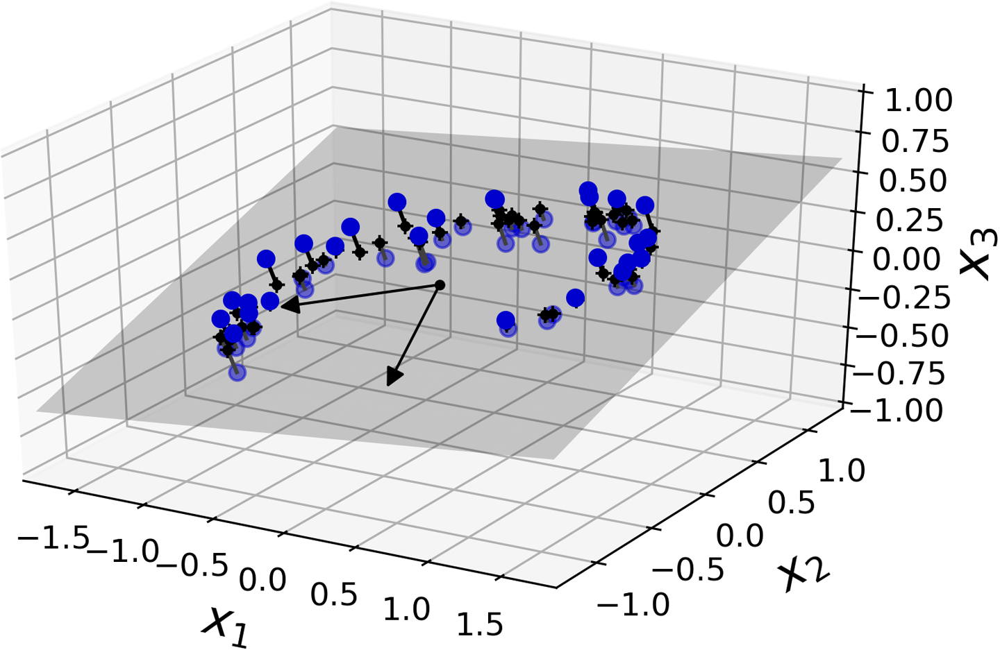

Notice that all training instances lie close to a plane: this is a
lower-dimensional (2D) subspace of the high-dimensional (3D) space. If
we project every training instance perpendicularly onto this subspace
(as represented by the short lines connecting the instances to the
plane), we get the new 2D dataset shown in
[Figure 8-3](https://learning.oreilly.com/library/view/hands-on-machine-learning/9781492032632/ch08.html#dataset_2d_plot).
Ta-da! We have just reduced the dataset's dimensionality from 3D to 2D.
Note that the axes correspond to new features *z*~1~ and *z*~2~ (the
coordinates of the projections on the plane).

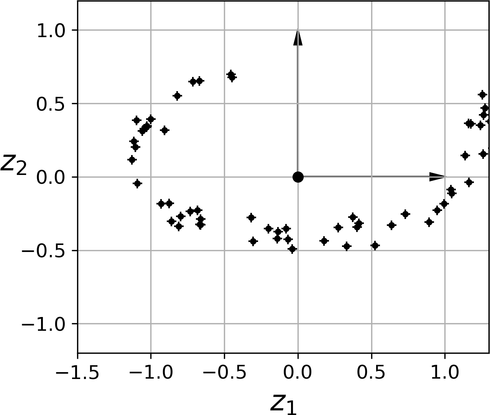

However, projection is not always the best approach to dimensionality
reduction. In many cases the subspace may twist and turn, such as in the
famous *Swiss roll* toy dataset represented in
[Figure 8-4](https://learning.oreilly.com/library/view/hands-on-machine-learning/9781492032632/ch08.html#swiss_roll_plot).

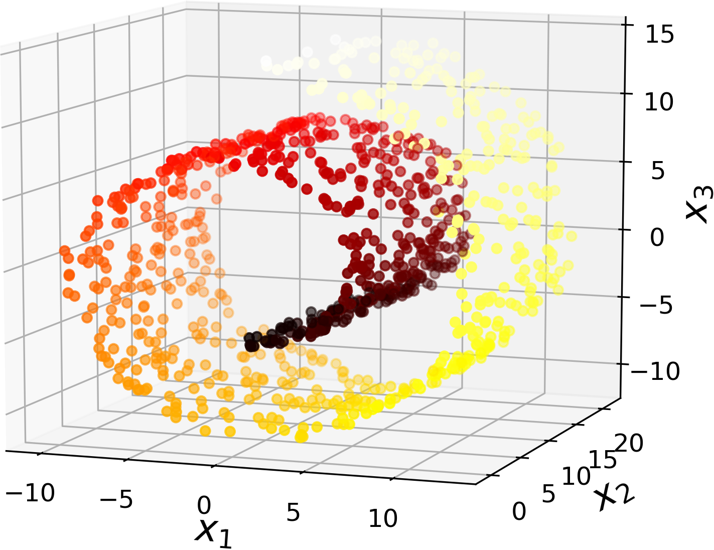

Simply projecting onto a plane (e.g., by dropping *x*~3~) would squash
different layers of the Swiss roll together, as shown on the left side
of
[Figure 8-5](https://learning.oreilly.com/library/view/hands-on-machine-learning/9781492032632/ch08.html#squished_swiss_roll_plot).
What you really want is to unroll the Swiss roll to obtain the 2D
dataset on the right side of
[Figure 8-5](https://learning.oreilly.com/library/view/hands-on-machine-learning/9781492032632/ch08.html#squished_swiss_roll_plot).

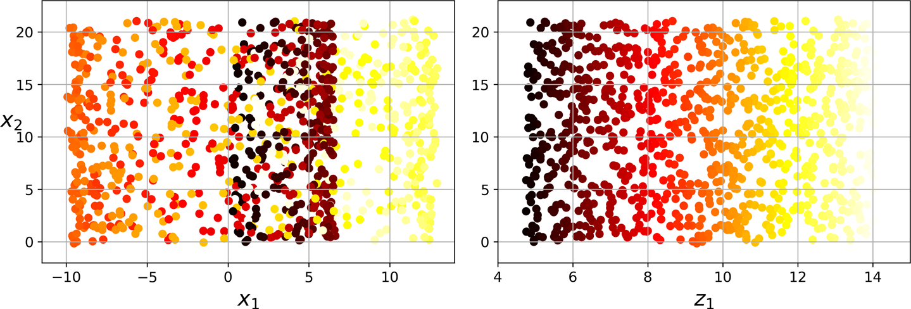


Manifold Learning
-----------------

The[]{#idm45728477758440} Swiss roll is an example of a 2D *manifold*.
Put simply, a 2D manifold is a 2D shape that can be bent and twisted in
a higher-dimensional space. More generally, a *d*-dimensional manifold
is a part of an *n*-dimensional space (where *d* \< *n*) that locally
resembles a *d*-dimensional hyperplane. In the case of the Swiss roll,
*d* = 2 and *n* = 3: it locally resembles a 2D plane, but it is rolled
in the third dimension.

Many dimensionality reduction algorithms work by modeling the manifold
on which the training instances lie; this is called *Manifold Learning*.
It relies[]{#idm45728477753176}[]{#idm45728477752440} on the *manifold
assumption*, also called the *manifold hypothesis*, which holds that
most real-world high-dimensional datasets lie close to a much
lower-dimensional manifold. This assumption is very often empirically
observed.

Once again, think about the MNIST dataset: all handwritten digit images
have some similarities. They are made of connected lines, the borders
are white, and they are more or less centered. If you randomly generated
images, only a ridiculously tiny fraction of them would look like
handwritten digits. In other words, the degrees of freedom available to
you if you try to create a digit image are dramatically lower than the
degrees of freedom you would have if you were allowed to generate any
image you wanted. These constraints tend to squeeze the dataset into a
lower-dimensional manifold.

The manifold assumption is often accompanied by another implicit
assumption: that the task at hand (e.g., classification or regression)
will be simpler if expressed in the lower-dimensional space of the
manifold. For example, in the top row of
[Figure 8-6](https://learning.oreilly.com/library/view/hands-on-machine-learning/9781492032632/ch08.html#manifold_decision_boundary_plot)
the Swiss roll is split into two classes: in the 3D space (on the left),
the decision boundary would be fairly complex, but in the 2D unrolled
manifold space (on the right), the decision boundary is a straight line.

However, this implicit assumption does not always hold. For example, in
the bottom row of
[Figure 8-6](https://learning.oreilly.com/library/view/hands-on-machine-learning/9781492032632/ch08.html#manifold_decision_boundary_plot),
the decision boundary is located at *x*~1~ = 5. This decision boundary
looks very simple in the original 3D space (a vertical plane), but it
looks more complex in the unrolled manifold (a collection of four
independent line segments).

In short, reducing the dimensionality of your training set before
training a model will usually speed up training, but it may not always
lead to a better or simpler solution; it all depends on the dataset.

Hopefully you now have a good sense of what the curse of dimensionality
is and how dimensionality reduction algorithms can fight it, especially
when the manifold assumption holds. The rest of this chapter will go
through some of the most popular algorithms.[]{#idm45728477744264}

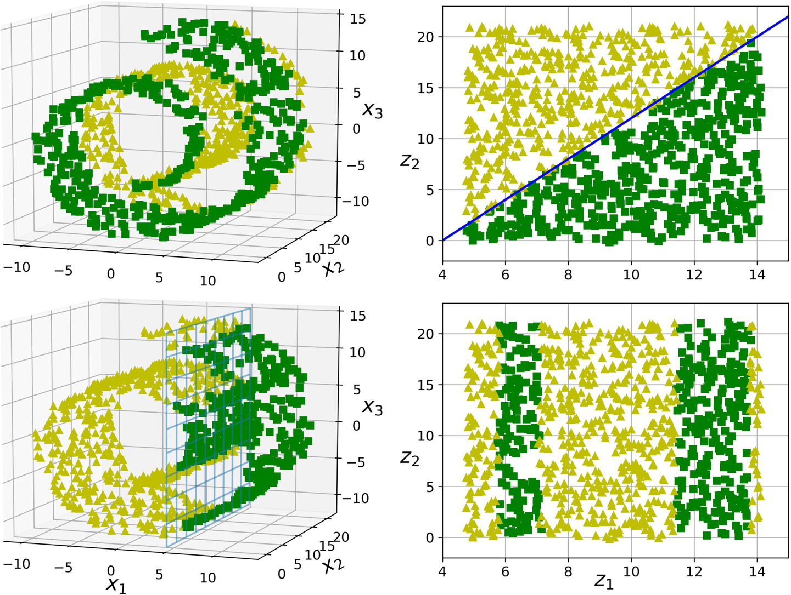


PCA
===

*Principal Component Analysis* (PCA)[]{#DRpca08}[]{#idm45728477737784}
is by far the most popular dimensionality reduction algorithm. First it
identifies the hyperplane that lies closest to the data, and then it
projects the data onto it, just like in
[Figure 8-2](https://learning.oreilly.com/library/view/hands-on-machine-learning/9781492032632/ch08.html#dataset_3d_plot).


Preserving the Variance
-----------------------

Before[]{#idm45728477734248}[]{#idm45728477733224} you can project the
training set onto a lower-dimensional hyperplane, you first need to
choose the right hyperplane. For example, a simple 2D dataset is
represented on the left in
[Figure 8-7](https://learning.oreilly.com/library/view/hands-on-machine-learning/9781492032632/ch08.html#pca_best_projection_plot),
along with three different axes (i.e., 1D hyperplanes). On the right is
the result of the projection of the dataset onto each of these axes. As
you can see, the projection onto the solid line preserves the maximum
variance, while the projection onto the dotted line preserves very
little variance and the projection onto the dashed line preserves an
intermediate amount of variance.

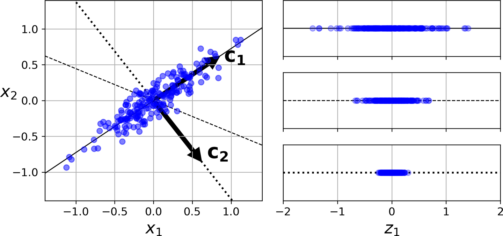

It seems reasonable to select the axis that preserves the maximum amount
of variance, as it will most likely lose less information than the other
projections. Another way to justify this choice is that it is the axis
that minimizes the mean squared distance between the original dataset
and its projection onto that axis. This is the rather simple idea behind
[PCA](https://homl.info/pca){.orm:hideurl}.^[4](https://learning.oreilly.com/library/view/hands-on-machine-learning/9781492032632/ch08.html#idm45728477727032){#idm45728477727032-marker
.totri-footnote}^


Principal Components
--------------------

PCA[]{#idm45728477723096} identifies the axis that accounts for the
largest amount of variance in the training set. In
[Figure 8-7](https://learning.oreilly.com/library/view/hands-on-machine-learning/9781492032632/ch08.html#pca_best_projection_plot),
it is the solid line. It also finds a second axis, orthogonal to the
first one, that accounts for the largest amount of remaining variance.
In this 2D example there is no choice: it is the dotted line. If it were
a higher-dimensional dataset, PCA would also find a third axis,
orthogonal to both previous axes, and a fourth, a fifth, and so on---as
many axes as the number of dimensions in the dataset.

The *i*^th^ axis is called the *i*^th^ *principal component* (PC) of the
data. In
[Figure 8-7](https://learning.oreilly.com/library/view/hands-on-machine-learning/9781492032632/ch08.html#pca_best_projection_plot),
the first PC is the axis on which vector **c**~**1**~ lies, and the
second PC is the axis on which vector **c**~**2**~ lies. In
[Figure 8-2](https://learning.oreilly.com/library/view/hands-on-machine-learning/9781492032632/ch08.html#dataset_3d_plot)
the first two PCs are the orthogonal axes on which the two arrows lie,
on the plane, and the third PC is the axis orthogonal to that plane.


###### Note

For each principal component, PCA finds a zero-centered unit vector
pointing in the direction of the PC. Since two opposing unit vectors lie
on the same axis, the direction of the unit vectors returned by PCA is
not stable: if you perturb the training set slightly and run PCA again,
the unit vectors may point in the opposite direction as the original
vectors. However, they will generally still lie on the same axes. In
some cases, a pair of unit vectors may even rotate or swap (if the
variances along these two axes are close), but the plane they define
will generally remain the same.


So how can you find the principal components of a training set? Luckily,
there is a standard matrix factorization[]{#idm45728477712104} technique
called *Singular Value Decomposition* (SVD) that can decompose the
training set matrix **X** into the matrix multiplication of three
matrices **U** **Σ** **V**^⊺^, where **V** contains the unit vectors
that define all the principal components that we are looking for, as
shown in [Equation
8-1](https://learning.oreilly.com/library/view/hands-on-machine-learning/9781492032632/ch08.html#principal_components_matrix).


##### [Equation 8-1. ] Principal components matrix

$$\mathbf{V} = \begin{pmatrix}
 \mid & \mid & & \mid \\
\mathbf{c}_{1} & \mathbf{c}_{2} & \cdots & \mathbf{c}_{\mathit{n}} \\
 \mid & \mid & & \mid \\
\end{pmatrix}$$


The following Python[]{#idm45728477687224} code uses NumPy's `svd()`
function to obtain all the principal components of the training set,
then extracts the two unit vectors that define the first two PCs:

``` {data-type="programlisting" code-language="python"}
X_centered = X - X.mean(axis=0)
U, s, Vt = np.linalg.svd(X_centered)
c1 = Vt.T[:, 0]
c2 = Vt.T[:, 1]
```


###### Warning

PCA assumes that the dataset is centered around the origin. As we will
see, Scikit-Learn's PCA[]{#idm45728477642584} classes take care of
centering the data for you. If you implement PCA yourself (as in the
preceding example), or if you use other libraries, don't forget to
center the data first.


Projecting Down to d Dimensions
-------------------------------

Once[]{#idm45728477639368} you have identified all the principal
components, you can reduce the dimensionality of the dataset down to *d*
dimensions by projecting it onto the hyperplane defined by the first *d*
principal components. Selecting this hyperplane ensures that the
projection will preserve as much variance as possible. For example, in
[Figure 8-2](https://learning.oreilly.com/library/view/hands-on-machine-learning/9781492032632/ch08.html#dataset_3d_plot)
the 3D dataset is projected down to the 2D plane defined by the first
two principal [components], preserving a large part of
the dataset's variance. As a result, the 2D projection looks very much
like the original 3D dataset.

To project the training set onto the hyperplane and obtain a reduced
dataset **X**~*d*-proj~ of dimensionality *d*, compute the matrix
multiplication of the training set matrix **X** by the matrix
**W**~*d*~, defined as the matrix containing the first *d* columns of
**V**, as shown in [Equation
8-2](https://learning.oreilly.com/library/view/hands-on-machine-learning/9781492032632/ch08.html#pca_projection).


##### [Equation 8-2. ] Projecting the training set down to *d* dimensions

$$\mathbf{X}_{d\text{-proj}} = \mathbf{X}\mathbf{W}_{d}$$


The following Python code projects the training set onto the plane
defined by the first two principal components:

``` {data-type="programlisting" code-language="python"}
W2 = Vt.T[:, :2]
X2D = X_centered.dot(W2)
```

There you have it! You now know how to reduce the
dimensionality[]{#idm45728477616280} of any dataset down to any number
of dimensions, while preserving as much variance as possible.


Using Scikit-Learn
------------------

Scikit-Learn's `PCA` class[]{#idm45728477613496}[]{#idm45728477612248}
uses SVD decomposition to implement PCA, just like we did earlier in
this chapter. The following code applies PCA to reduce the
dimensionality of the dataset down to two dimensions (note that it
automatically takes care of centering the data):

``` {data-type="programlisting" code-language="python"}
from sklearn.decomposition import PCA

pca = PCA(n_components = 2)
X2D = pca.fit_transform(X)
```

After fitting the `PCA` transformer to the dataset, its `components_`
attribute holds the transpose of **W**~*d*~ (e.g., the unit vector that
defines the first principal component is equal to
`pca.components_.T[:, 0]`).


Explained Variance Ratio
------------------------

Another[]{#idm45728477518984}[]{#idm45728477518040}[]{#idm45728477517352}
useful piece of information is the *explained variance ratio* of each
principal component, available via the `explained_variance_ratio_`
variable. The ratio indicates the proportion of the dataset's variance
that lies along each principal component. For example, let's look at the
explained variance ratios of the first two components of the 3D dataset
represented in
[Figure 8-2](https://learning.oreilly.com/library/view/hands-on-machine-learning/9781492032632/ch08.html#dataset_3d_plot):

``` {data-type="programlisting" code-language="pycon"}
>>> pca.explained_variance_ratio_
array([0.84248607, 0.14631839])
```

This output tells you that 84.2% of the dataset's variance lies along
the first PC, and 14.6% lies along the second PC. This leaves less than
1.2% for the third PC, so it is reasonable to assume that the third PC
probably carries little information.


Choosing the Right Number of Dimensions
---------------------------------------

Instead[]{#idm45728477509960} of arbitrarily choosing the number of
dimensions to reduce down to, it is simpler to choose the number of
dimensions that add up to a sufficiently large portion of the variance
(e.g., 95%). Unless, of course, you are reducing dimensionality for data
visualization---in that case you will want to reduce the dimensionality
down to 2 or 3.

The following code performs PCA without reducing dimensionality, then
computes the minimum number of dimensions required to preserve 95% of
the training set's variance:

``` {data-type="programlisting" code-language="python"}
pca = PCA()
pca.fit(X_train)
cumsum = np.cumsum(pca.explained_variance_ratio_)
d = np.argmax(cumsum >= 0.95) + 1
```

You could then set `n_components=d` and run PCA again. But there is a
much better option: instead of specifying the number of principal
components you want to preserve, you can set `n_components` to be a
float between 0.0 and 1.0, indicating the ratio of variance you wish to
preserve:

``` {data-type="programlisting" code-language="python"}
pca = PCA(n_components=0.95)
X_reduced = pca.fit_transform(X_train)
```

Yet another option is to plot the explained variance as a function of
the number of dimensions (simply plot `cumsum`; see
[Figure 8-8](https://learning.oreilly.com/library/view/hands-on-machine-learning/9781492032632/ch08.html#explained_variance_plot)).
There will usually be an elbow in the curve, where the explained
variance stops growing fast. In this case, you can see that reducing the
dimensionality down to about 100 dimensions wouldn't lose too much
explained variance.


PCA for Compression
-------------------

After[]{#idm45728477416712}[]{#idm45728477415464}[]{#idm45728477414792}
dimensionality reduction, the training set takes up much less space. As
an example, try applying PCA to the MNIST dataset while preserving 95%
of its variance. You should find that each instance will have just over
150 features, instead of the original 784 features. So, while most of
the variance is preserved, the dataset is now less than 20% of its
original size! This is a reasonable compression ratio, and you can see
how this size reduction can speed up a classification algorithm (such as
an SVM classifier) tremendously.

It is also possible to[]{#idm45728477406600}[]{#idm45728477405592}
decompress the reduced dataset back to 784 dimensions by applying the
inverse transformation of the PCA projection. This won't give you back
the original data, since the projection lost a bit of information
(within the 5% variance that was dropped), but it will likely be close
to the original data. The mean squared distance between the original
data and the reconstructed data (compressed and then decompressed)
is[]{#idm45728477404360}[]{#idm45728477403688} called the
*reconstruction error*.

The following code compresses the MNIST dataset down to 154 dimensions,
then uses the `inverse_transform()` method to decompress it back to 784
dimensions:

``` {data-type="programlisting" code-language="python"}
pca = PCA(n_components = 154)
X_reduced = pca.fit_transform(X_train)
X_recovered = pca.inverse_transform(X_reduced)
```

[Figure 8-9](https://learning.oreilly.com/library/view/hands-on-machine-learning/9781492032632/ch08.html#mnist_compression_plot)
shows a few digits from the original training set (on the left), and the
corresponding digits after compression and decompression. You can see
that there is a slight image quality loss, but the digits are still
mostly intact.

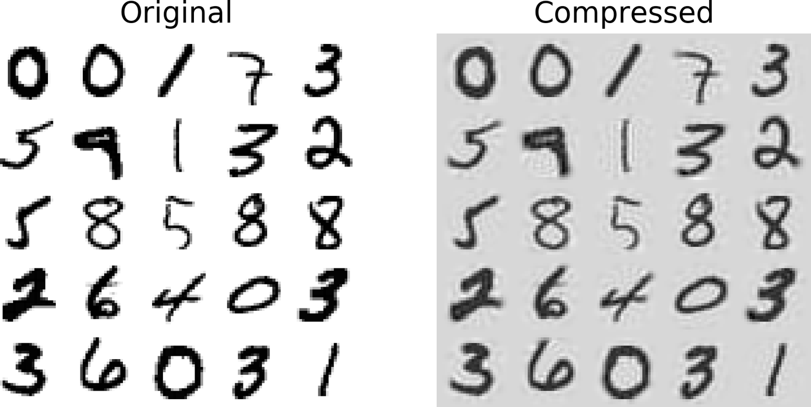

The[]{#idm45728477324056}[]{#idm45728477323320} equation of the inverse
transformation is shown in [Equation
8-3](https://learning.oreilly.com/library/view/hands-on-machine-learning/9781492032632/ch08.html#inverse_pca).


##### [Equation 8-3. ] PCA inverse transformation, back to the original number of dimensions

$$\mathbf{X}_{\text{recovered}} = \mathbf{X}_{d\text{-proj}}{\mathbf{W}_{d}}^{\intercal}$$


Randomized PCA
--------------

If[]{#idm45728477311144}[]{#idm45728477309448}[]{#idm45728477308536} you
set the `svd_solver` hyperparameter to `"randomized"`,
Scikit-Learn[]{#idm45728477306872} uses a stochastic algorithm called
*Randomized PCA* that quickly finds an approximation of the first *d*
principal components. Its computational complexity is *O*(*m* × *d*^2^)
+ *O*(*d*^3^), instead of *O*(*m* × *n*^2^) + *O*(*n*^3^) for the full
SVD approach, so it is dramatically faster than full SVD when *d* is
much smaller than *n*:

``` {data-type="programlisting" code-language="python"}
rnd_pca = PCA(n_components=154, svd_solver="randomized")
X_reduced = rnd_pca.fit_transform(X_train)
```

By default, `svd_solver` is actually set to `"auto"`: Scikit-Learn
automatically uses the randomized PCA algorithm if *m* or *n* is greater
than 500 and *d* is less than 80% of *m* or *n*, or else it uses the
full SVD approach. If you want to force
Scikit-Learn[]{#idm45728477258344} to use full SVD, you can set the
`svd_solver` hyperparameter to `"full"`.


Incremental PCA
---------------

One[]{#idm45728477247096}[]{#idm45728477246120} problem with the
preceding implementations of PCA is that they require the whole training
set to fit in memory in order for the algorithm to run. Fortunately,
*Incremental PCA* (IPCA) algorithms have been developed. They allow you
to split the training set into mini-batches and feed an IPCA algorithm
one mini-batch at a time. This is useful for large training sets and for
applying PCA online (i.e., on the fly, as new instances arrive).

The[]{#idm45728477243848} following code splits the MNIST dataset into
100 mini-batches (using NumPy's `array_split()` function) and feeds them
to[]{#idm45728477242328} Scikit-Learn's [`IncrementalPCA`
class](https://homl.info/32)^[5](https://learning.oreilly.com/library/view/hands-on-machine-learning/9781492032632/ch08.html#idm45728477240376){#idm45728477240376-marker
.totri-footnote}^ to reduce the dimensionality of the MNIST dataset down
to 154 dimensions (just like before). Note that you must call the
`partial_fit()` method with each mini-batch, rather than the `fit()`
method with the whole training set:

``` {data-type="programlisting" code-language="python"}
from sklearn.decomposition import IncrementalPCA

n_batches = 100
inc_pca = IncrementalPCA(n_components=154)
for X_batch in np.array_split(X_train, n_batches):
    inc_pca.partial_fit(X_batch)

X_reduced = inc_pca.transform(X_train)
```

Alternatively, you can use[]{#idm45728477197784} NumPy's `memmap` class,
which allows you to manipulate a large array stored in a binary file on
disk as if it were entirely in memory; the class loads only the data it
needs in memory, when it needs it. Since the `IncrementalPCA` class uses
only a small part of the array at any given time, the memory usage
remains under control. This makes it possible to call the usual `fit()`
method, as you can see in the following code:

``` {data-type="programlisting" code-language="python"}
X_mm = np.memmap(filename, dtype="float32", mode="readonly", shape=(m, n))

batch_size = m // n_batches
inc_pca = IncrementalPCA(n_components=154, batch_size=batch_size)
inc_pca.fit(X_mm)
```


Kernel PCA
==========

In
[Chapter 5](https://learning.oreilly.com/library/view/hands-on-machine-learning/9781492032632/ch05.html#svm_chapter)
we[]{#PCAkernel08}[]{#kernalpca04}[]{#idm45728477084696} discussed the
kernel trick, a mathematical technique that implicitly maps instances
into a very high-dimensional[]{#idm45728477083768} space (called the
*feature space*), enabling nonlinear classification and regression with
Support Vector Machines. Recall that a linear decision boundary in the
high-dimensional feature space corresponds to a complex
nonlinear[]{#idm45728477082344} decision boundary in the *original
space*.

It turns out that the same trick can be applied to PCA, making it
possible to perform complex nonlinear projections for dimensionality
reduction. This is called [*Kernel PCA*
(kPCA)](https://homl.info/33).^[6](https://learning.oreilly.com/library/view/hands-on-machine-learning/9781492032632/ch08.html#idm45728477079656){#idm45728477079656-marker
.totri-footnote}^ It is often good at preserving clusters of
[instances] after projection, or sometimes even
unrolling datasets that lie close to a twisted manifold.

The[]{#idm45728477077304} following code uses Scikit-Learn's `KernelPCA`
class to perform kPCA with an RBF kernel (see
[Chapter 5](https://learning.oreilly.com/library/view/hands-on-machine-learning/9781492032632/ch05.html#svm_chapter)
for more details about the RBF kernel and other kernels):

``` {data-type="programlisting" code-language="python"}
from sklearn.decomposition import KernelPCA

rbf_pca = KernelPCA(n_components = 2, kernel="rbf", gamma=0.04)
X_reduced = rbf_pca.fit_transform(X)
```

[Figure 8-10](https://learning.oreilly.com/library/view/hands-on-machine-learning/9781492032632/ch08.html#kernel_pca_plot)
shows the Swiss roll, reduced to two dimensions using a linear kernel
(equivalent to simply using the `PCA` class), an RBF kernel, and a
sigmoid kernel.

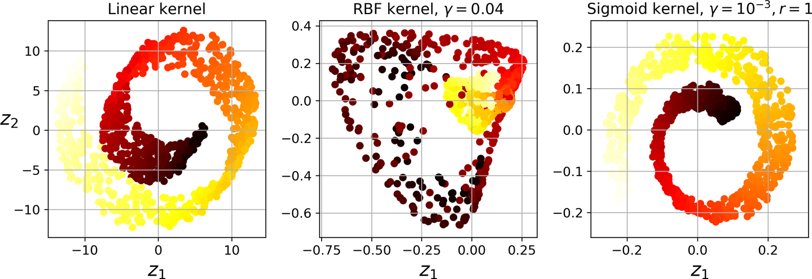


Selecting a Kernel and Tuning Hyperparameters
---------------------------------------------

As kPCA is an unsupervised learning algorithm, there is no obvious
performance measure to help you select the best kernel and
hyperparameter values. That said, dimensionality reduction is often a
preparation step for a supervised learning task (e.g., classification),
so you can use grid search to select the kernel and hyperparameters that
lead to the best performance on that task. The following code creates a
two-step pipeline, first reducing dimensionality to two dimensions using
kPCA, then applying Logistic Regression for classification. Then it uses
`GridSearchCV` to find the best kernel and `gamma` value for kPCA in
order to get the best classification accuracy at the end of the
pipeline:

``` {data-type="programlisting" code-language="python"}
from sklearn.model_selection import GridSearchCV
from sklearn.linear_model import LogisticRegression
from sklearn.pipeline import Pipeline

clf = Pipeline([
        ("kpca", KernelPCA(n_components=2)),
        ("log_reg", LogisticRegression())
    ])

param_grid = [{
        "kpca__gamma": np.linspace(0.03, 0.05, 10),
        "kpca__kernel": ["rbf", "sigmoid"]
    }]

grid_search = GridSearchCV(clf, param_grid, cv=3)
grid_search.fit(X, y)
```

The best kernel and hyperparameters are then available through the
`best_params_` variable:

``` {data-type="programlisting" code-language="pycon"}
>>> print(grid_search.best_params_)
{'kpca__gamma': 0.043333333333333335, 'kpca__kernel': 'rbf'}
```

Another approach, this time entirely unsupervised, is to select the
kernel and hyperparameters that yield the lowest reconstruction error.
Note that reconstruction is not as easy as with linear PCA. Here's why.
[Figure 8-11](https://learning.oreilly.com/library/view/hands-on-machine-learning/9781492032632/ch08.html#kernel_pca_diagram)
shows the original Swiss roll 3D dataset (top left) and the resulting 2D
dataset after kPCA is applied using an RBF kernel (top right). Thanks to
the[]{#idm45728476877272} kernel trick, this transformation is
mathematically equivalent to[]{#idm45728476876504} using the *feature
map* φ to map the training set to an infinite-dimensional feature space
(bottom right), then projecting the transformed training set down to 2D
using linear PCA.

Notice that if we could invert the linear PCA step for a given instance
in the reduced space, the reconstructed point would lie in feature
space, not in the original space (e.g., like the one represented by an X
in the diagram). Since the feature space is infinite-dimensional, we
cannot compute the reconstructed point, and therefore we cannot compute
the true reconstruction error. Fortunately, it is possible to find a
point in the original space that would map close to the reconstructed
point. This point is called
the[]{#idm45728476874152}[]{#idm45728476873448} reconstruction
*pre-image*. Once you have this pre-image, you can measure its squared
distance to the original instance. You can then select the kernel and
hyperparameters that minimize this reconstruction pre-image error.

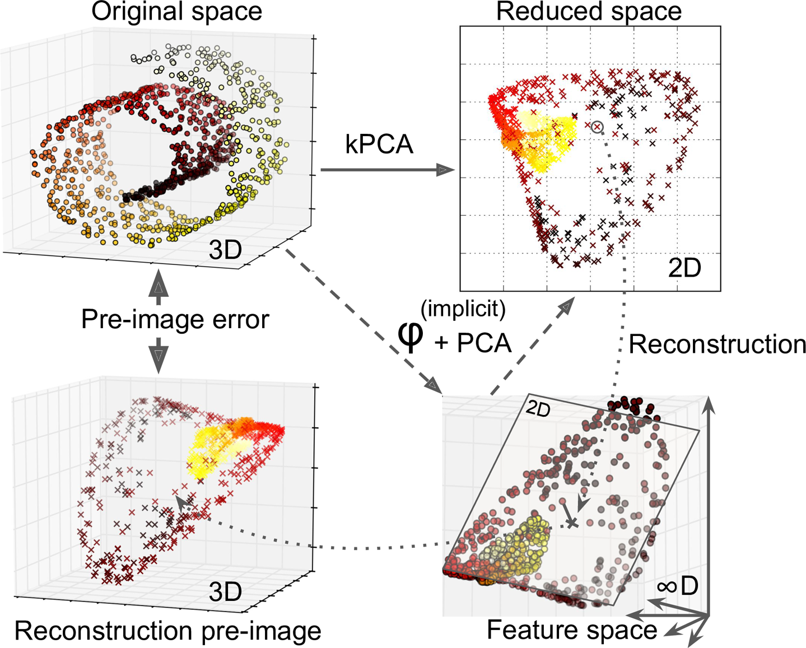

You may be wondering how to perform this reconstruction. One solution is
to train a supervised regression model, with the projected instances as
the training set and the original instances as the targets.
Scikit-Learn[]{#idm45728476866776} will do this automatically if you set
`fit_inverse_transform=True`, as shown in the following
code:^[7](https://learning.oreilly.com/library/view/hands-on-machine-learning/9781492032632/ch08.html#idm45728476865320){#idm45728476865320-marker
.totri-footnote}^

``` {data-type="programlisting" code-language="python"}
rbf_pca = KernelPCA(n_components = 2, kernel="rbf", gamma=0.0433,
                    fit_inverse_transform=True)
X_reduced = rbf_pca.fit_transform(X)
X_preimage = rbf_pca.inverse_transform(X_reduced)
```


###### Note

By default, `fit_inverse_transform=False` and `KernelPCA` has no
`inverse_transform()` method. This method only gets created when you set
`fit_inverse_transform=True`.


You can then compute the reconstruction pre-image error:

``` {data-type="programlisting" code-language="pycon"}
>>> from sklearn.metrics import mean_squared_error
>>> mean_squared_error(X, X_preimage)
32.786308795766132
```

Now you can use grid search with cross-validation to find the kernel and
hyperparameters that minimize this
error.[]{#idm45728476718600}[]{#idm45728476717752}[]{#idm45728476716840}


LLE
===

[*Locally Linear Embedding*
(LLE)](https://homl.info/lle)^[8](https://learning.oreilly.com/library/view/hands-on-machine-learning/9781492032632/ch08.html#idm45728476713480){#idm45728476713480-marker
.totri-footnote}^ is[]{#idm45728476773048} another powerful *nonlinear
dimensionality reduction* (NLDR) technique.
It[]{#idm45728476771768}[]{#idm45728476770856} is a Manifold Learning
technique that does not rely on projections, like the previous
algorithms do. In a nutshell, LLE works by first measuring how each
training instance linearly relates to its closest neighbors (c.n.), and
then looking for a low-dimensional representation of the training set
where these local relationships are best preserved (more details
shortly). This approach makes it particularly good at unrolling twisted
manifolds, especially when there is not too much noise.

The following code uses[]{#idm45728476769192} Scikit-Learn's
`LocallyLinearEmbedding` class to unroll the Swiss roll:

``` {data-type="programlisting" code-language="python"}
from sklearn.manifold import LocallyLinearEmbedding

lle = LocallyLinearEmbedding(n_components=2, n_neighbors=10)
X_reduced = lle.fit_transform(X)
```

The resulting 2D dataset is shown in
[Figure 8-12](https://learning.oreilly.com/library/view/hands-on-machine-learning/9781492032632/ch08.html#lle_unrolling_plot).
As you can see, the Swiss roll is completely unrolled, and the distances
between instances are locally well preserved. However, distances are not
preserved on a larger scale: the left part of the unrolled Swiss roll is
stretched, while the right part is squeezed. Nevertheless, LLE did a
pretty good job at modeling the manifold.

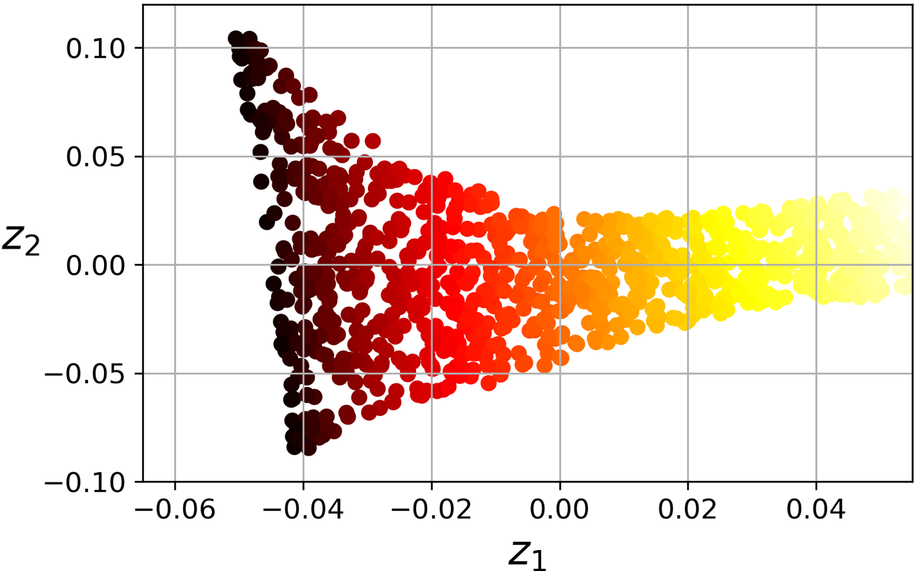

Here's how LLE works: for each training instance **x**^(*i*)^, the
algorithm identifies its *k* closest neighbors (in the preceding code
*k* = 10), then tries to reconstruct **x**^(*i*)^ as a linear function
of these neighbors. More specifically, it finds the weights *w*~*i,j*~
such that the squared distance between **x**^(*i*)^ and
$\sum_{j = 1}^{m}{w_{i,j}\mathbf{x}^{(j)}}$ is as small as possible,
assuming *w*~*i,j*~ = 0 if **x**^(*j*)^ is not one of the *k* closest
neighbors of **x**^(*i*)^. Thus the first step of LLE is the constrained
optimization problem described in [Equation
8-4](https://learning.oreilly.com/library/view/hands-on-machine-learning/9781492032632/ch08.html#lle_first_step),
where **W** is the weight matrix containing all the weights *w*~*i,j*~.
The second constraint simply normalizes the weights for each training
instance **x**^(*i*)^.


##### [Equation 8-4. ] LLE step one: linearly modeling local relationships

$$\begin{array}{cl}
 & {\hat{\mathbf{W}} = \operatorname{argmin}\limits_{\mathbf{W}}\sum\limits_{i = 1}^{m}\left( {\mathbf{x}^{(i)} - \sum\limits_{j = 1}^{m}w_{i,j}\mathbf{x}^{(j)}} \right)^{2}} \\
 & {\text{subject}\text{to}\begin{cases}
{w_{i,j} = 0} & {\text{if}\mathbf{x}^{(j)}\text{is}\text{not}\text{one}\text{of}\text{the} k\text{c.n.}\text{of}\mathbf{x}^{(i)}} \\
{\sum\limits_{j = 1}^{m}w_{i,j} = 1} & {\text{for} i = 1,2,\cdots,m} \\
\end{cases}} \\
\end{array}$$


After this step, the weight matrix $\hat{\mathbf{W}}$ (containing the
weights ${\hat{w}}_{i,j}$) encodes the local linear relationships
between the training instances. The second step is to map the training
instances into a *d*-dimensional space (where *d* \< *n*) while
preserving these local relationships as much as possible. If
**z**^(*i*)^ is the image of **x**^(*i*)^ in this *d*-dimensional space,
then we want the squared distance between **z**^(*i*)^ and
$\sum_{j = 1}^{m}{{\hat{w}}_{i,j}\mathbf{z}^{(j)}}$ to be as small as
possible. This idea leads to the unconstrained optimization problem
described in [Equation
8-5](https://learning.oreilly.com/library/view/hands-on-machine-learning/9781492032632/ch08.html#lle_second_step).
It looks very similar to the first step, but instead of keeping the
instances fixed and finding the optimal weights, we are doing the
reverse: keeping the weights fixed and finding the optimal position of
the instances' images in the low-dimensional space. Note that **Z** is
the matrix containing all **z**^(*i*)^.


##### [Equation 8-5. ] LLE step two: reducing dimensionality while preserving relationships

$$\hat{\mathbf{Z}} = \operatorname{argmin}\limits_{\mathbf{Z}}\sum\limits_{i = 1}^{m}\left( {\mathbf{z}^{(i)} - \sum\limits_{j = 1}^{m}{\hat{w}}_{i,j}\mathbf{z}^{(j)}} \right)^{2}$$


Scikit-Learn's LLE implementation[]{#idm45728476531048} has the
following computational complexity: [*O*(*m* log(*m*)*n*
log(*k*))] for finding the *k* nearest neighbors,
*O*(*mnk*^3^) for optimizing the weights, and *O*(*dm*^2^) for
constructing the low-dimensional representations. Unfortunately, the
*m*^2^ in the last term makes this algorithm scale poorly to very large
datasets.


Other Dimensionality Reduction Techniques
=========================================

There[]{#idm45728476522168} are many other dimensionality reduction
techniques, several of which are[]{#idm45728476521064} available in
Scikit-Learn. Here are some of the most popular ones:

Random Projections

:   As[]{#idm45728476518168} its name suggests, projects the data to a
    lower-dimensional space using a random linear projection. This may
    sound crazy, but it turns out that such a random projection is
    actually very likely to preserve distances well, as was demonstrated
    mathematically by William B. Johnson and Joram Lindenstrauss in a
    famous lemma. The quality of the dimensionality reduction depends on
    the number of instances and the target dimensionality, but
    surprisingly not on the initial dimensionality. Check out the
    documentation for the `sklearn.random_projection` package for more
    details.

Multidimensional Scaling (MDS)

:   Reduces[]{#idm45728476515080} dimensionality while trying to
    preserve the distances between the instances.

Isomap

:   Creates[]{#idm45728476512872}[]{#idm45728476512136} a graph by
    connecting each instance to its nearest neighbors, then reduces
    dimensionality while trying to preserve the *geodesic
    distances*^[9](https://learning.oreilly.com/library/view/hands-on-machine-learning/9781492032632/ch08.html#idm45728476510664){#idm45728476510664-marker
    .totri-footnote}^ between the instances.

t-Distributed Stochastic Neighbor Embedding (t-SNE)

:   Reduces dimensionality[]{#idm45728476508504} while trying to keep
    similar instances close and dissimilar instances apart. It is mostly
    used for visualization, in particular to visualize clusters of
    instances in high-dimensional space (e.g., to visualize the MNIST
    images in 2D).

Linear Discriminant Analysis (LDA)

:   Is[]{#idm45728476506040} a classification algorithm, but during
    training it learns the most discriminative axes between the classes,
    and these axes can then be used to define a hyperplane onto which to
    project the data. The benefit of this approach is that the
    projection will keep classes as far apart as possible, so LDA is a
    good technique to reduce dimensionality before running another
    classification algorithm such as an SVM classifier.

[Figure 8-13](https://learning.oreilly.com/library/view/hands-on-machine-learning/9781492032632/ch08.html#other_dim_reduction_plot)
shows the results of a few of these techniques.

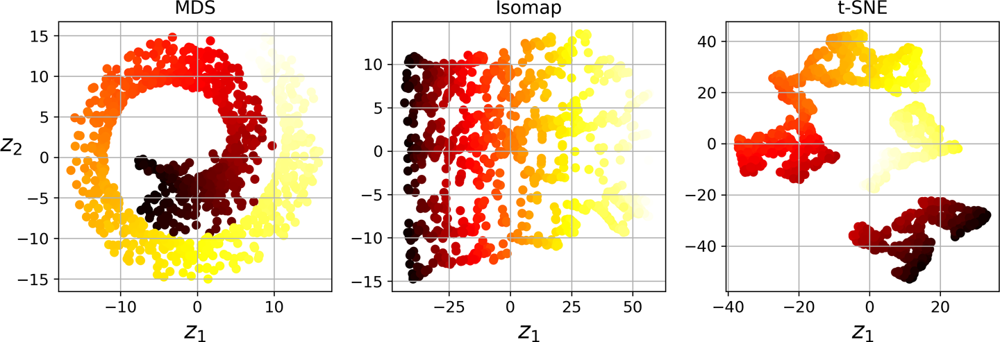


Exercises
=========

1.  What are the main motivations for reducing a dataset's
    dimensionality? What are the main drawbacks?

2.  What is the curse of dimensionality?

3.  Once a dataset's dimensionality has been reduced, is it possible to
    reverse the operation? If so, how? If not, why?

4.  Can PCA be used to reduce the dimensionality of a highly nonlinear
    dataset?

5.  Suppose you perform PCA on a 1,000-dimensional dataset, setting the
    explained variance ratio to 95%. How many dimensions will the
    resulting dataset have?

6.  In what cases would you use vanilla PCA, Incremental PCA, Randomized
    PCA, or Kernel PCA?

7.  How can you evaluate the performance of a dimensionality reduction
    algorithm on your dataset?

8.  Does it make any sense to chain two different dimensionality
    reduction algorithms?

9.  Load the MNIST dataset (introduced in
    [Chapter 3](https://learning.oreilly.com/library/view/hands-on-machine-learning/9781492032632/ch03.html#classification_chapter))
    and split it into a training set and a test set (take the first
    60,000 instances for training, and the remaining 10,000 for
    testing). Train a Random Forest classifier on the dataset and time
    how long it takes, then evaluate the resulting model on the test
    set. Next, use PCA to reduce the dataset's dimensionality, with an
    explained variance ratio of 95%. Train a new Random Forest
    classifier on the reduced dataset and see how long it takes. Was
    training much faster? Next, evaluate the classifier on the test set.
    How does it compare to the previous classifier?

10. Use t-SNE to reduce the MNIST dataset down to two dimensions and
    plot the result using Matplotlib. You can use a scatterplot using 10
    different colors to represent each image's target class.
    Alternatively, you can replace each dot in the scatterplot with the
    corresponding instance's class (a digit from 0 to 9), or even plot
    scaled-down versions of the digit images themselves (if you plot all
    digits, the visualization will be too cluttered, so you should
    either draw a random sample or plot an instance only if no other
    instance has already been plotted at a close distance). You should
    get a nice visualization with well-separated clusters of digits. Try
    using other dimensionality reduction algorithms such as PCA, LLE, or
    MDS and compare the resulting visualizations.

Solutions to these exercises are available in
[Appendix A](https://learning.oreilly.com/library/view/hands-on-machine-learning/9781492032632/app01.html#solutions_appendix).


^[1](https://learning.oreilly.com/library/view/hands-on-machine-learning/9781492032632/ch08.html#idm45728477802728-marker){.totri-footnote}^
Well, four dimensions if you count time, and a few more if you are a
string theorist.

^[2](https://learning.oreilly.com/library/view/hands-on-machine-learning/9781492032632/ch08.html#idm45728477799288-marker){.totri-footnote}^
Watch a rotating tesseract projected into 3D space at
[*https://homl.info/30*](https://homl.info/30). Image by Wikipedia user
NerdBoy1392 ([Creative Commons BY-SA
3.0](https://creativecommons.org/licenses/by-sa/3.0/)). Reproduced from
[*https://en.wikipedia.org/wiki/Tesseract*](https://en.wikipedia.org/wiki/Tesseract).

^[3](https://learning.oreilly.com/library/view/hands-on-machine-learning/9781492032632/ch08.html#idm45728477794648-marker){.totri-footnote}^
Fun fact: anyone you know is probably an extremist in at least one
dimension (e.g., how much sugar they put in their coffee), if you
consider enough dimensions.

^[4](https://learning.oreilly.com/library/view/hands-on-machine-learning/9781492032632/ch08.html#idm45728477727032-marker){.totri-footnote}^
Karl Pearson, "On Lines and Planes of Closest Fit to Systems of Points
in Space," *The London, Edinburgh, and Dublin Philosophical Magazine and
Journal of Science* 2, no. 11 (1901): 559-572,
[*https://homl.info/pca*](https://homl.info/pca).

^[5](https://learning.oreilly.com/library/view/hands-on-machine-learning/9781492032632/ch08.html#idm45728477240376-marker){.totri-footnote}^
Scikit-Learn uses the algorithm described in David A. Ross et al.,
"Incremental Learning for Robust Visual Tracking," *International
Journal of Computer Vision* 77, no. 1--3 (2008): 125--141.

^[6](https://learning.oreilly.com/library/view/hands-on-machine-learning/9781492032632/ch08.html#idm45728477079656-marker){.totri-footnote}^
Bernhard Schölkopf et al., "Kernel Principal Component Analysis," in
*Lecture Notes in Computer Science* 1327 (Berlin: Springer, 1997):
583--588.

^[7](https://learning.oreilly.com/library/view/hands-on-machine-learning/9781492032632/ch08.html#idm45728476865320-marker){.totri-footnote}^
If you set `fit_inverse_transform=True`, Scikit-Learn will use the
algorithm (based on Kernel Ridge Regression) described in Gokhan H.
Bakır et al., ["Learning to Find Pre-Images"](https://homl.info/34),
*Proceedings of the 16th International Conference on Neural Information
Processing Systems* (2004): 449--456.

^[8](https://learning.oreilly.com/library/view/hands-on-machine-learning/9781492032632/ch08.html#idm45728476713480-marker){.totri-footnote}^
Sam T. Roweis and Lawrence K. Saul, "Nonlinear Dimensionality Reduction
by Locally Linear Embedding," *Science* 290, no. 5500 (2000):
2323--2326.

^[9](https://learning.oreilly.com/library/view/hands-on-machine-learning/9781492032632/ch08.html#idm45728476510664-marker){.totri-footnote}^
The geodesic distance between two nodes in a graph is the number of
nodes on the shortest path between these nodes.
