[Lab 9. ] Unsupervised Learning Techniques
=====================================================

Although most of the applications of Machine
Learning today are based on supervised learning (and as a result, this
is where most of the investments go to), the vast majority of the
available data is unlabeled: we have the input features **X**, but we do
not have the labels **y**. The computer scientist Yann LeCun famously
said that "if intelligence was a cake, unsupervised learning would be
the cake, supervised learning would be the icing on the cake, and
reinforcement learning would be the cherry on the cake." In other words,
there is a huge potential in unsupervised learning that we have only
barely started to sink our teeth into.

Say you want to create a system that will take a few pictures of each
item on a manufacturing production line and detect which items are
defective. You can fairly easily create a system that will take pictures
automatically, and this might give you thousands of pictures every day.
You can then build a reasonably large dataset in just a few weeks. But
wait, there are no labels! If you want to train a regular binary
classifier that will predict whether an item is defective or not, you
will need to label every single picture as "defective" or "normal." This
will generally require human experts to sit down and manually go through
all the pictures. This is a long, costly, and tedious task, so it will
usually only be done on a small subset of the available pictures. As a
result, the labeled dataset will be quite small, and the classifier's
performance will be disappointing. Moreover, every time the company
makes any change to its products, the whole process will need to be
started over from scratch. Wouldn't it be great if the algorithm could
just exploit the unlabeled data without needing humans to label every
picture? Enter unsupervised learning.

In
[Lab 8]
we looked at the most common unsupervised learning task: dimensionality
reduction. In this lab we will look at a few more unsupervised
learning tasks and algorithms:

Clustering

:   The goal is to group similar instances
    together into *clusters*. Clustering is a great tool for data
    analysis, customer segmentation, recommender systems, search
    engines, image segmentation, semi-supervised learning,
    dimensionality reduction, and more.

Anomaly detection

:   The objective is to learn what "normal" data
    looks like, and then use that to detect abnormal instances, such as
    defective items on a production line or a new trend in a time
    series.

Density estimation

:   This is the task of
    estimating the *probability density function* (PDF) of the random
    process that generated the dataset. Density estimation is commonly
    used for anomaly detection: instances located in very low-density
    regions are likely to be anomalies. It is also useful for data
    analysis and visualization.

Ready for some cake? We will start with clustering, using K-Means and
DBSCAN, and then we will discuss Gaussian mixture models and see how
they can be used for density estimation, clustering, and anomaly
detection.


Clustering
==========

As you enjoy a hike in the
mountains, you stumble upon a plant you have never seen before. You look
around and you notice a few more. They are not identical, yet they are
sufficiently similar for you to know that they most likely belong to the
same species (or at least the same genus). You may need a botanist to
tell you what species that is, but you certainly don't need an expert to
identify groups of similar-looking objects. This is called *clustering*:
it is the task of identifying similar instances and assigning them to
*clusters*, or groups of similar instances.

Just like in classification, each instance gets assigned to a group.
However, unlike classification, clustering is an unsupervised task.
Consider
[Figure 9-1]
on the left is the iris dataset (introduced in
[Lab 4]
where each instance's species (i.e., its class) is represented with a
different marker. It is a labeled dataset, for which classification
algorithms such as Logistic Regression, SVMs, or Random Forest
classifiers are well suited. On the right is the same dataset, but
without the labels, so you cannot use a classification algorithm
anymore. This is where clustering algorithms step in: many of them can
easily detect the lower-left cluster. It is also quite easy to see with
our own eyes, but it is not so obvious that the upper-right cluster is
composed of two distinct sub-clusters. That said, the dataset has two
additional features (sepal length and width), not represented here, and
clustering algorithms can make good use of all features, so in fact they
identify the three clusters fairly well (e.g., using a Gaussian mixture
model, only 5 instances out of 150 are assigned to the wrong cluster).

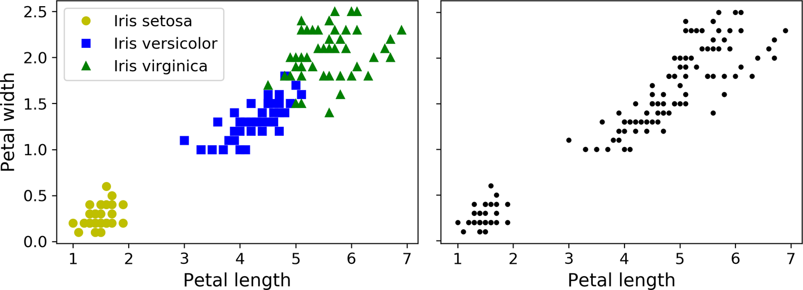

Clustering is used in a wide variety of
applications, including these:

For customer segmentation

:   You can cluster your
    customers based on their purchases and their activity on your
    website. This is useful to understand who your customers are and
    what they need, so you can adapt your products and marketing
    campaigns to each segment. For example, customer segmentation can be
    useful in *recommender systems* to suggest content that other users
    in the same cluster enjoyed.

For data analysis

:   When you analyze a new dataset, it can be
    helpful to run a clustering algorithm, and then analyze each cluster
    separately.

As a dimensionality reduction technique

:   Once a dataset has been
    clustered, it is usually possible to measure each instance's
    *affinity* with each cluster (affinity is any measure of how well an
    instance fits into a cluster). Each instance's feature vector **x**
    can then be replaced with the vector of its cluster affinities. If
    there are *k* clusters, then this vector is *k*-dimensional. This
    vector is typically much lower-dimensional than the original feature
    vector, but it can preserve enough information for further
    processing.

For *anomaly detection* (also called *outlier detection*)

:   Any instance that has a
    low affinity to all the clus ters is likely to
    be an anomaly. For example, if you have clustered the users of your
    website based on their behavior, you can detect users with unusual
    behavior, such as an unusual number of requests per second. Anomaly
    detection is particularly useful in detecting defects in
    manufacturing, or for *fraud detection*.

For semi-supervised learning

:   If you only have a few labels, you could
    perform clustering and propagate the labels to all the instances in
    the same cluster. This technique can greatly increase the number of
    labels available for a subsequent supervised learning algorithm, and
    thus improve its performance.

For search engines

:   Some search engines let you search for images
    that are similar to a reference image. To build such a system, you
    would first apply a clustering algorithm to all the images in your
    database; similar images would end up in the same cluster. Then when
    a user provides a reference image, all you need to do is use the
    trained clustering model to find this image's cluster, and you can
    then simply return all the images from this cluster.

To segment an image

:   By clustering pixels
    according to their color, then replacing each pixel's color with the
    mean color of its cluster, it is possible to considerably reduce the
    number of different colors in the image. Image segmentation is used
    in many object detection and tracking systems, as it makes it easier
    to detect the contour of each object.

There is no universal definition of what a cluster is: it really depends
on the context, and different algorithms will capture different kinds of
clusters. Some algorithms look for instances centered around a
particular point, called a *centroid*. Others look
for continuous regions of densely packed instances: these clusters can
take on any shape. Some algorithms are hierarchical, looking for
clusters of clusters. And the list goes on.

In this section, we will look at two popular clustering algorithms,
K-Means and DBSCAN, and explore some of their applications, such as
nonlinear dimensionality reduction, semi-supervised learning, and
anomaly detection.


K-Means
-------

Consider the
unlabeled dataset represented in
[Figure 9-2]
you can clearly see five blobs of instances. The K-Means algorithm is a
simple algorithm capable of clustering this kind of dataset very quickly
and efficiently, often in just a few iterations. It was proposed by
Stuart Lloyd at Bell Labs in 1957 as a technique for pulse-code
modulation, but it was only published outside of the company [in
1982](https://homl.info/36).
^[1](https://learning.oreilly.com/library/view/hands-on-machine-learning/9781492032632/ch09.html) In 1965, Edward W. Forgy had published virtually the
same algorithm, so K-Means 
is sometimes referred to as Lloyd--Forgy.

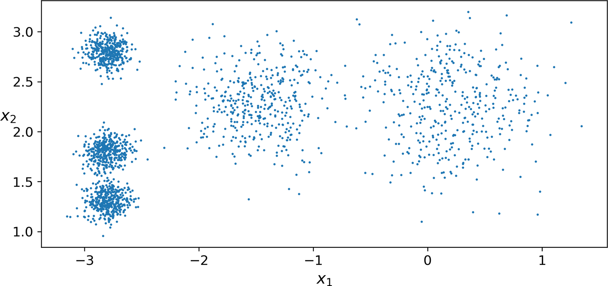

Let's train a K-Means clusterer on this dataset. It will try to find
each blob's center and assign each instance to the closest blob:

``` {data-type="programlisting" code-language="python"}
from sklearn.cluster import KMeans
k = 5
kmeans = KMeans(n_clusters=k)
y_pred = kmeans.fit_predict(X)
```

Note that you have to specify the number of clusters *k* that the
algorithm must find. In this example, it is pretty obvious from looking
at the data that *k* should be set to 5, but in general it is not that
easy. We will discuss this shortly.

Each instance was assigned to one of the five clusters. In the context
of clustering, an instance's *label* is the index
of the cluster that this instance gets assigned to by the algorithm:
this is not to be confused with the class labels in classification
(remember that clustering is an unsupervised learning task). The
`KMeans` instance preserves a copy of the labels of the instances it was
trained on, available via the `labels_` instance variable:

``` {data-type="programlisting" code-language="pycon"}
>>> y_pred
array([4, 0, 1, ..., 2, 1, 0], dtype=int32)
>>> y_pred is kmeans.labels_
True
```

We can also take a look at the five centroids that the algorithm found:

``` {data-type="programlisting" code-language="pycon"}
>>> kmeans.cluster_centers_
array([[-2.80389616,  1.80117999],
       [ 0.20876306,  2.25551336],
       [-2.79290307,  2.79641063],
       [-1.46679593,  2.28585348],
       [-2.80037642,  1.30082566]])
```

You can easily assign new instances to the cluster whose centroid is
closest:

``` {data-type="programlisting" code-language="pycon"}
>>> X_new = np.array([[0, 2], [3, 2], [-3, 3], [-3, 2.5]])
>>> kmeans.predict(X_new)
array([1, 1, 2, 2], dtype=int32)
```

If you plot the cluster's decision boundaries, you get a Voronoi
tessellation (see
[Figure 9-3]
where each centroid is represented with an X).

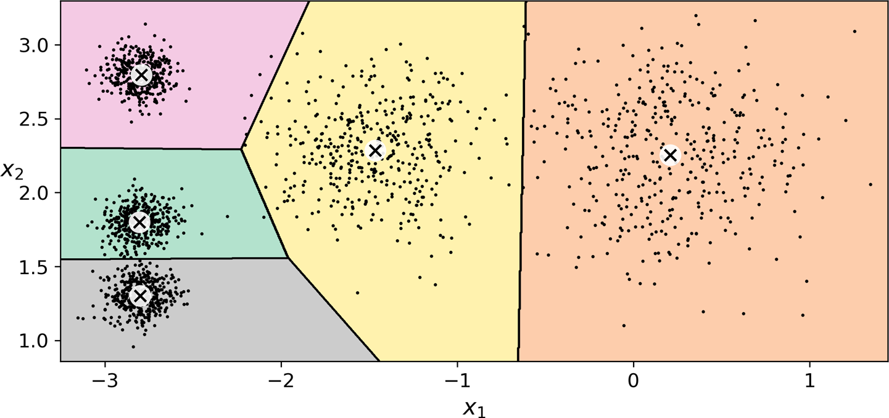

The vast majority of the instances were clearly assigned to the
appropriate cluster, but a few instances were probably mislabeled
(especially near the boundary between the top-left cluster and the
central cluster). Indeed, the K-Means algorithm does not behave very
well when the blobs have very different diameters because all it cares
about when assigning an instance to a cluster is the distance to the
centroid.

Instead 
of assigning each instance to a single cluster, which is called *hard
clustering*, it can be useful to give each instance a score per cluster,
which is called *soft clustering*. The score can be the distance between
the instance and the centroid; conversely, it can be a similarity score
(or affinity), such as the Gaussian Radial Basis Function (introduced in
[Lab 5]
In the `KMeans` class, the `transform()` method measures the distance
from each instance to every centroid:

``` {data-type="programlisting" code-language="pycon"}
>>> kmeans.transform(X_new)
array([[2.81093633, 0.32995317, 2.9042344 , 1.49439034, 2.88633901],
       [5.80730058, 2.80290755, 5.84739223, 4.4759332 , 5.84236351],
       [1.21475352, 3.29399768, 0.29040966, 1.69136631, 1.71086031],
       [0.72581411, 3.21806371, 0.36159148, 1.54808703, 1.21567622]])
```

In this example, the first instance in `X_new` is located at a distance
of 2.81 from the first centroid, 0.33 from the second centroid, 2.90
from the third centroid, 1.49 from the fourth centroid, and 2.89 from
the fifth centroid. If you have a high-dimensional dataset and you
transform it this way, you end up with a *k*-dimensional dataset: this
transformation can be a very efficient nonlinear dimensionality
reduction technique.


### The K-Means algorithm

So, how does the algorithm work? Well, suppose you
were given the centroids. You could easily label all the instances in
the dataset by assigning each of them to the cluster whose centroid is
closest. Conversely, if you were given all the instance labels, you
could easily locate all the centroids by computing the mean of the
instances for each cluster. But you are given neither the labels nor the
centroids, so how can you proceed? Well, just start by placing the
centroids randomly (e.g., by picking *k* instances at random and using
their locations as centroids). Then label the instances, update the
centroids, label the instances, update the centroids, and so on until
the centroids stop moving. The algorithm is guaranteed to converge in a
finite number of steps (usually quite small); it will not oscillate
forever.
^[2](https://learning.oreilly.com/library/view/hands-on-machine-learning/9781492032632/ch09.html)


You can see the algorithm in action in
[Figure 9-4]
the centroids are initialized randomly (top left), then the instances
are labeled (top right), then the centroids are updated (center left),
the instances are relabeled (center right), and so on. As you can see,
in just three iterations, the algorithm has reached a clustering that
seems close to optimal.


###### Note

The computational complexity of the algorithm is generally linear with
regard to the number of instances *m*, the number of clusters *k*, and
the number of dimensions *n*. However, this is only true when the data
has a clustering structure. If it does not, then in the worst-case
scenario the complexity can increase exponentially with the number of
instances. In practice, this rarely happens, and K-Means is generally
one of the fastest clustering algorithms.


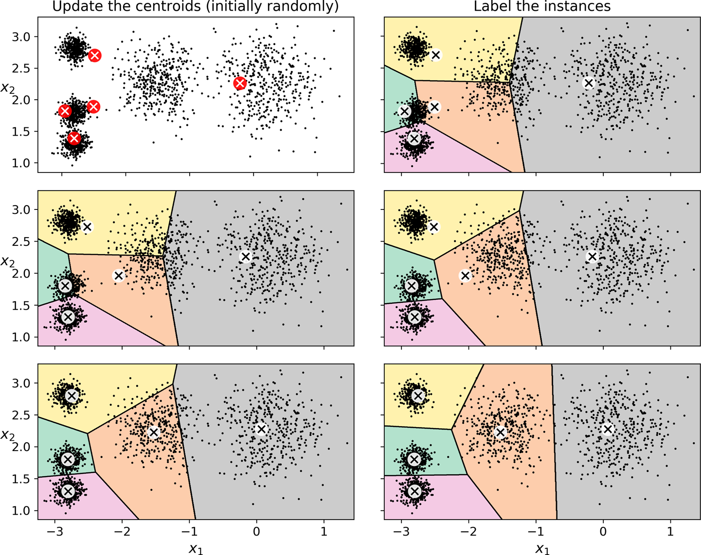

Although the algorithm is guaranteed to converge, it may not converge to
the right solution (i.e., it may converge to a local optimum): whether
it does or not depends on the centroid initialization.
[Figure 9-5]
shows two suboptimal solutions that the algorithm can converge to if you
are not lucky with the random initialization step.


Let's look at a few ways you can mitigate this risk by improving the
centroid [initialization].


### Centroid initialization methods

If you happen to know
approximately where the centroids should be (e.g., if you ran another
clustering algorithm earlier), then you can set the `init`
hyperparameter to a NumPy array containing the list of centroids, and
set `n_init` to `1`:

``` {data-type="programlisting" code-language="python"}
good_init = np.array([[-3, 3], [-3, 2], [-3, 1], [-1, 2], [0, 2]])
kmeans = KMeans(n_clusters=5, init=good_init, n_init=1)
```

Another solution is to run the algorithm multiple times with different
random initializations and keep the best solution. The number of random
initializations is controlled by the `n_init` hyperparameter: by
default, it is equal to `10`, which means that the whole algorithm
described earlier runs 10 times when you call `fit()`, and Scikit-Learn
keeps the best solution. But how exactly does it know which solution is
the best? It uses a performance metric! That 
metric is called the model's *inertia*, which is the mean squared
distance between each instance and its closest centroid. It is roughly
equal to 223.3 for the model on the left in
[Figure 9-5]
237.5 for the model on the right in
[Figure 9-5]
and 211.6 for the model in
[Figure 9-3]
The `KMeans` class runs the algorithm `n_init` times and keeps the model
with the lowest inertia. In this example, the model in
[Figure 9-3]
will be selected (unless we are very unlucky with `n_init` consecutive
random initializations). If you are curious, a model's inertia is
accessible via the `inertia_` instance variable:

``` {data-type="programlisting" code-language="pycon"}
>>> kmeans.inertia_
211.59853725816856
```

The `score()` method returns the negative inertia. Why negative? Because
a predictor's `score()` method must always respect Scikit-Learn's
"greater is better" rule: if a predictor is better than another, its
`score()` method should return a greater score.

``` {data-type="programlisting" code-language="pycon"}
>>> kmeans.score(X)
-211.59853725816856
```

An important improvement to the K-Means algorithm,
*K-Means++*, was proposed in a [2006 paper](https://homl.info/37) by
David Arthur and Sergei
Vassilvitskii.
^[3](https://learning.oreilly.com/library/view/hands-on-machine-learning/9781492032632/ch09.html) They introduced a smarter initialization step that
tends to select centroids that are distant from one another, and this
improvement makes the K-Means algorithm much less likely to converge to
a suboptimal solution. They showed that the additional computation
required for the smarter initialization step is well worth it because it
makes it possible to drastically reduce the number of times the
algorithm needs to be run to find the optimal solution. Here is the
K-Means++ initialization algorithm:

1.  Take one centroid **c**^(1)^, chosen uniformly at random from the
    dataset.

2.  Take a new centroid **c**^(*i*)^, choosing an instance **x**^(*i*)^
    with probability $D\left( \mathbf{x}^{(i)} \right)^{2}$ /
    $\sum_{j = 1}^{m}{D\left( \mathbf{x}^{(j)} \right)}^{2}$, where
    D(**x**^(*i*)^) is the distance between the instance **x**^(*i*)^
    and the closest centroid that was already chosen. This probability
    distribution ensures that instances farther away from already chosen
    centroids are much more likely be selected as centroids.

3.  Repeat the previous step until all *k* centroids have been chosen.

The `KMeans` class uses this initialization method by default. If you
want to force it to use the original method (i.e., picking *k* instances
randomly to define the initial centroids), then you can set the `init`
hyperparameter to `"random"`. You will rarely need to do this.


### Accelerated K-Means and mini-batch K-Means

Another 
important improvement to the K-Means algorithm was proposed in a [2003
paper](https://homl.info/38) by Charles
Elkan.
^[4](https://learning.oreilly.com/library/view/hands-on-machine-learning/9781492032632/ch09.html) It considerably accelerates the algorithm by avoiding
many unnecessary distance calculations. Elkan achieved this by
exploiting the triangle inequality (i.e., that a straight line is always
the shortest distance between two
points^[5](https://learning.oreilly.com/library/view/hands-on-machine-learning/9781492032632/ch09.html)
) and by keeping track of lower and upper bounds for
distances between instances and centroids. This is the algorithm the
`KMeans` class uses by default (you can force it to use the original
algorithm by setting the `algorithm` hyperparameter to `"full"`,
although you probably will never need to).

Yet another important variant of the K-Means algorithm was proposed in a
[2010 paper](https://homl.info/39) by David
Sculley.
^[6](https://learning.oreilly.com/library/view/hands-on-machine-learning/9781492032632/ch09.html) Instead of using the full dataset at each iteration,
the algorithm is capable of using mini-batches, moving the centroids
just slightly at each iteration. This speeds up the algorithm typically
by a factor of three or four and makes it possible to cluster huge
datasets that do not fit in memory. Scikit-Learn implements this
algorithm in the `MiniBatchKMeans` class. You can just use this class
like the `KMeans` class:

``` {data-type="programlisting" code-language="python"}
from sklearn.cluster import MiniBatchKMeans

minibatch_kmeans = MiniBatchKMeans(n_clusters=5)
minibatch_kmeans.fit(X)
```

If the dataset does not fit in memory, the simplest option is to use the
`memmap` class, as we did for incremental PCA in
[Lab 8]
Alternatively, you can pass one mini-batch at a time to the
`partial_fit()` method, but this will require much more work, since you
will need to perform multiple initializations and select the best one
yourself (see the mini-batch K-Means section of the notebook for an
example).

Although the Mini-batch K-Means algorithm is much faster than the
regular K-Means algorithm, its inertia is generally slightly worse,
especially as the number of clusters increases. You can see this in
[Figure 9-6]
the plot on the left compares the inertias of Mini-batch K-Means and
regular K-Means models trained on the previous dataset using various
numbers of clusters *k*. The difference between the two curves remains
fairly constant, but this difference becomes more and more significant
as *k* increases, since the inertia becomes smaller and smaller. In the
plot on the right, you can see that Mini-batch K-Means is much faster
than regular K-Means, and this difference increases with *k*.

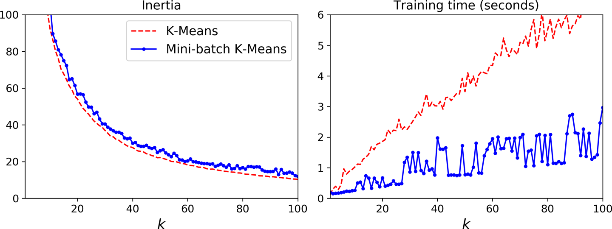


### Finding the optimal number of clusters

So far, we have set the number of clusters *k* to
5 because it was obvious by looking at the data that this was the
correct number of clusters. But in general, it will not be so easy to
know how to set *k*, and the result might be quite bad if you set it to
the wrong value. As you can see in
[Figure 9-7]
setting *k* to 3 or 8 results in fairly bad models.


You might be thinking that we could just pick the model with the lowest
inertia, right? Unfortunately, it is not that simple. The inertia for
*k*=3 is 653.2, which is much higher than for *k*=5 (which was 211.6).
But with *k*=8, the inertia is just 119.1. The inertia is not a good
performance metric when trying to choose *k* because it keeps getting
lower as we increase *k*. Indeed, the more clusters there are, the
closer each instance will be to its closest centroid, and therefore the
lower the inertia will be. Let's plot the inertia as a function of *k*
(see
[Figure 9-8]

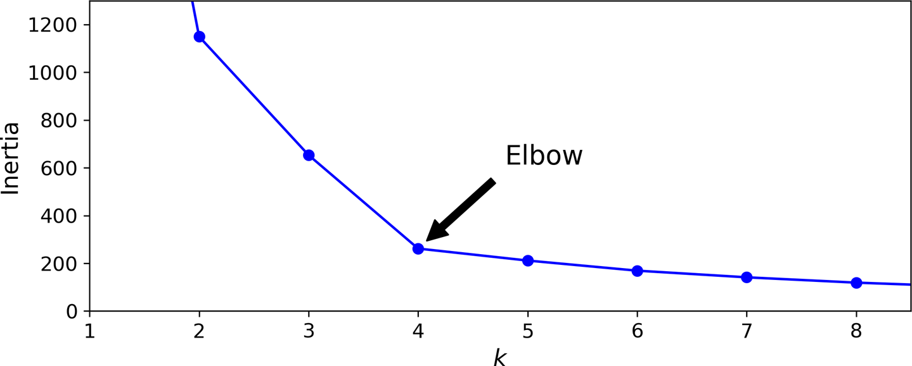

As you can see, the inertia drops very quickly as we increase *k* up to
4, but then it decreases much more slowly as we keep increasing *k*.
This curve has roughly the shape of an arm, and there is an "elbow" at
*k* = 4. So, if we did not know better, 4 would be a good choice: any
lower value would be dramatic, while any higher value would not help
much, and we might just be splitting perfectly good clusters in half for
no good reason.

This technique for choosing
the best value for the number of clusters is rather coarse. A more
precise approach (but also more computationally expensive) is to use the
[*silhouette score*], which is the mean *silhouette
coefficient* over all the instances. An [instance's]
silhouette coefficient is equal to (*b* -- *a*) / max(*a*, *b*), where
*a* is the mean distance to the other instances in the same cluster
(i.e., the mean intra-cluster distance) and *b* is the mean
nearest-cluster distance (i.e., the mean distance to the instances of
the next closest cluster, defined as the one that minimizes *b*,
excluding the instance's own cluster). The silhouette coefficient can
vary between --1 and +1. A coefficient close to +1 means that the
instance is well inside its own cluster and far from other clusters,
while a coefficient close to 0 means that it is close to a cluster
boundary, and finally a coefficient close to --1 means that the instance
may have been assigned to the wrong cluster.

To compute the silhouette score, you can use Scikit-Learn's
`silhouette_score()` function, giving it all the instances in the
dataset and the labels they were assigned:

``` {data-type="programlisting" code-language="pycon"}
>>> from sklearn.metrics import silhouette_score
>>> silhouette_score(X, kmeans.labels_)
0.655517642572828
```

Let's compare the silhouette scores for different numbers of clusters
(see
[Figure 9-9]

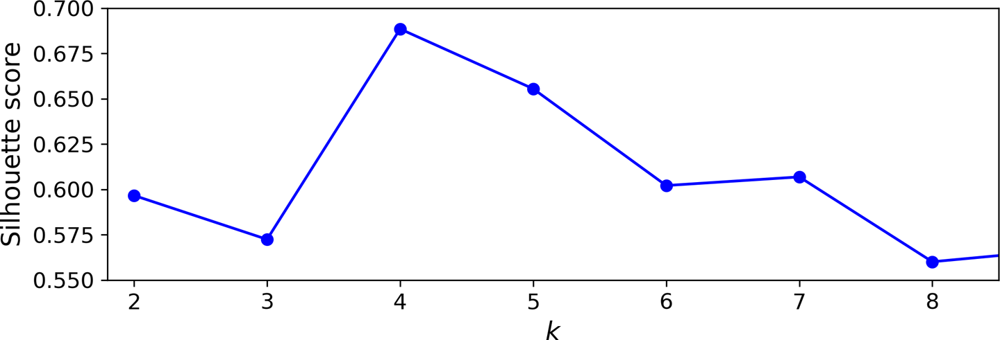

As you can see, this visualization is much richer than the previous one:
although it confirms that *k* = 4 is a very good choice, it also
underlines the fact that *k* = 5 is quite good as well, and much better
than *k* = 6 or 7. This was not visible when comparing inertias.

An even more informative visualization is obtained when you plot every
instance's silhouette coefficient, sorted by the cluster they are
assigned to and by the value of the coefficient.
This is called a *silhouette diagram* (see
[Figure 9-10]
Each diagram contains one knife shape per cluster. The shape's height
indicates the number of instances the cluster contains, and its width
represents the sorted silhouette coefficients of the instances in the
cluster (wider is better). The dashed line indicates the mean silhouette
coefficient.

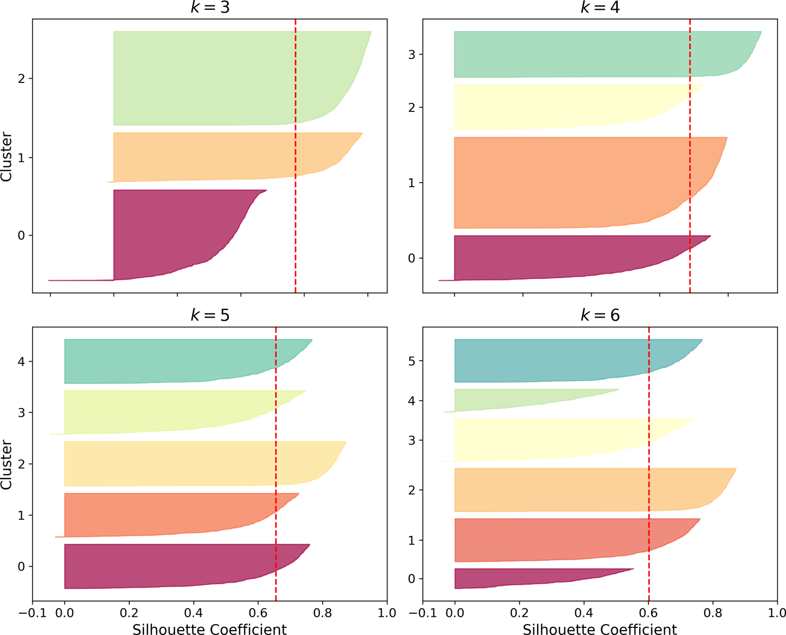

The vertical dashed lines represent the silhouette score for each number
of clusters. When most of the instances in a cluster have a lower
coefficient than this score (i.e., if many of the instances stop short
of the dashed line, ending to the left of it), then the cluster is
rather bad since this means its instances are much too close to other
clusters. We can see that when *k* = 3 and when *k* = 6, we get bad
clusters. But when *k* = 4 or *k* = 5, the clusters look pretty good:
most instances extend beyond the dashed line, to the right and closer to
1.0. When *k* = 4, the cluster at index 1 (the third from the top) is
rather big. When *k* = 5, all clusters have similar sizes. So, even
though the overall silhouette score from *k* = 4 is slightly greater
than for *k* = 5, it seems like a good idea to use *k* = 5 to get
clusters of similar sizes.


Limits of K-Means
-----------------

Despite its many merits, most notably being fast
and scalable, K-Means is not perfect. As we saw, it is necessary to run
the algorithm several times to avoid suboptimal solutions, plus you need
to specify the number of clusters, which can be quite a hassle.
Moreover, K-Means does not behave very well when the clusters have
varying sizes, different densities, or nonspherical shapes. For example,
[Figure 9-11]
shows how K-Means clusters a dataset containing three ellipsoidal
clusters of different dimensions, densities, and orientations.


As you can see, neither of these solutions is any good. The solution on
the left is better, but it still chops off 25% of the middle cluster and
assigns it to the cluster on the right. The solution on the right is
just terrible, even though its inertia is lower. So, depending on the
data, different clustering algorithms may perform better. On these types
of elliptical clusters, Gaussian mixture models work great.


###### Tip

It is important to scale the input features before
you run K-Means, or the clusters may be very stretched and K-Means will
perform poorly. Scaling the features does not guarantee that all the
clusters will be nice and spherical, but it generally improves things.


Now let's look at a few ways we can benefit from clustering. We will use
K-Means, but feel free to experiment with other clustering
algorithms. 


Using Clustering for Image Segmentation
---------------------------------------

*Image segmentation* is the
task of partitioning an
image into multiple segments. In *semantic segmentation*, all pixels
that are part of the same object type get assigned to the same segment.
For example, in a self-driving car's vision system, all pixels that are
part of a pedestrian's image might be assigned to the "pedestrian"
segment (there would be one segment containing all the pedestrians).
In *instance segmentation*, all pixels that are
part of the same individual object are assigned to the same segment. In
this case there would be a different segment for each pedestrian. The
state of the art in semantic or instance segmentation today is achieved
using complex architectures based on convolutional neural networks (see
[Lab 14]
Here, we are going to do something much simpler:
*color segmentation*. We will simply assign pixels to the same segment
if they have a similar color. In some applications, this may be
sufficient. For example, if you want to analyze satellite images to
measure how much total forest area there is in a region, color
segmentation may be just fine.

First, use Matplotlib's `imread()` function to load the image (see the
upper-left image in
[Figure 9-12]

``` {data-type="programlisting" code-language="pycon"}
>>> from matplotlib.image import imread  # or `from imageio import imread`
>>> image = imread(os.path.join("images","unsupervised_learning","ladybug.png"))
>>> image.shape
(533, 800, 3)
```

The image is represented as a 3D array. The first dimension's size is
the height; the second is the width; and the third is the number of
color channels, in this case red, green, and blue (RGB). In other words,
for each pixel there is a 3D vector containing the intensities of red,
green, and blue, each between 0.0 and 1.0 (or between 0 and 255, if you
use `imageio.imread()`). Some images may have fewer channels, such as
grayscale images (one channel). And some images may have more channels,
such as images with an additional *alpha channel*
for transparency or satellite images, which often contain channels for
many light frequencies (e.g., infrared). The following code reshapes the
array to get a long list of RGB colors, then it clusters these colors
using K-Means:

``` {data-type="programlisting" code-language="python"}
X = image.reshape(-1, 3)
kmeans = KMeans(n_clusters=8).fit(X)
segmented_img = kmeans.cluster_centers_[kmeans.labels_]
segmented_img = segmented_img.reshape(image.shape)
```

For example, it may identify a color cluster for all shades of green.
Next, for each color (e.g., dark green), it looks for the mean color of
the pixel's color cluster. For example, all shades of green may be
replaced with the same light green color (assuming the mean color of the
green cluster is light green). Finally, it reshapes this long list of
colors to get the same shape as the original image. And we're done!

This outputs the image shown in the upper right of
[Figure 9-12]
You can experiment with various numbers of clusters, as shown in the
figure. When you use fewer than eight clusters, notice that the
ladybug's flashy red color fails to get a cluster of its own: it gets
merged with colors from the environment. This is because K-Means prefers
clusters of similar sizes. The ladybug is small---much smaller than the
rest of the image---so even though its color is flashy, K-Means fails to
dedicate a cluster to it.

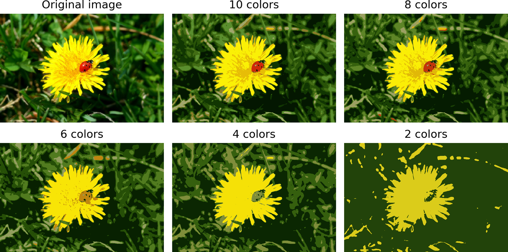

That wasn't too hard, was it? Now let's look at another application of
clustering: preprocessing.


Using Clustering for Preprocessing
----------------------------------

Clustering
can 
be an efficient approach to dimensionality reduction, in particular as a
preprocessing step before a supervised learning algorithm. As an example
of using clustering for dimensionality reduction, let's tackle the
digits dataset, which is a simple MNIST-like dataset containing 1,797
grayscale 8 × 8 images representing the digits 0 to 9. First, load the
dataset:

``` {data-type="programlisting" code-language="python"}
from sklearn.datasets import load_digits

X_digits, y_digits = load_digits(return_X_y=True)
```

Now, split it into a training set and a test set:

``` {data-type="programlisting" code-language="python"}
from sklearn.model_selection import train_test_split

X_train, X_test, y_train, y_test = train_test_split(X_digits, y_digits)
```

Next, fit a Logistic Regression model:

``` {data-type="programlisting" code-language="python"}
from sklearn.linear_model import LogisticRegression

log_reg = LogisticRegression()
log_reg.fit(X_train, y_train)
```

Let's evaluate its accuracy on the test set:

``` {data-type="programlisting" code-language="pycon"}
>>> log_reg.score(X_test, y_test)
0.9688888888888889
```

OK, that's our baseline: 96.9% accuracy. Let's see if we can do better
by using K-Means as a preprocessing step. We will create a pipeline that
will first cluster the training set into 50 clusters and replace the
images with their distances to these 50 clusters, then apply a Logistic
Regression model:

``` {data-type="programlisting" code-language="python"}
from sklearn.pipeline import Pipeline

pipeline = Pipeline([
    ("kmeans", KMeans(n_clusters=50)),
    ("log_reg", LogisticRegression()),
])
pipeline.fit(X_train, y_train)
```


###### Warning

Since there are 10 different digits, it is tempting to set the number of
clusters to 10. However, each digit can be written several different
ways, so it is preferable to use a larger number of clusters, such as
50.


Now let's evaluate this classification pipeline:

``` {data-type="programlisting" code-language="pycon"}
>>> pipeline.score(X_test, y_test)
0.9777777777777777
```

How about that? We reduced the error rate by almost 30% (from about 3.1%
to about 2.2%)!

But we chose the number of clusters *k* arbitrarily; we can surely do
better. Since K-Means is just a preprocessing step in a classification
pipeline, finding a good value for *k* is much simpler than earlier.
There's no need to perform silhouette analysis or minimize the inertia;
the best value of *k* is simply the one that results in the best
classification performance during cross-validation. We can use
`GridSearchCV` to find the optimal number of clusters:

``` {data-type="programlisting" code-language="python"}
from sklearn.model_selection import GridSearchCV

param_grid = dict(kmeans__n_clusters=range(2, 100))
grid_clf = GridSearchCV(pipeline, param_grid, cv=3, verbose=2)
grid_clf.fit(X_train, y_train)
```

Let's look at the best value for *k* and the performance of the
resulting pipeline:

``` {data-type="programlisting" code-language="pycon"}
>>> grid_clf.best_params_
{'kmeans__n_clusters': 99}
>>> grid_clf.score(X_test, y_test)
0.9822222222222222
```

With *k* = 99 clusters, we get a significant accuracy boost, reaching
98.22% accuracy on the test set. Cool! You may want to keep exploring
higher values for *k*, since 99 was the largest value in the range we
explored.


Using Clustering for Semi-Supervised Learning
---------------------------------------------

Another 
use case for clustering is in semi-supervised learning, when we have
plenty of unlabeled instances and very few labeled instances. Let's
train a Logistic Regression model on a sample of 50 labeled instances
from the digits dataset:

``` {data-type="programlisting" code-language="python"}
n_labeled = 50
log_reg = LogisticRegression()
log_reg.fit(X_train[:n_labeled], y_train[:n_labeled])
```

What is the performance of this model on the test set?

``` {data-type="programlisting" code-language="pycon"}
>>> log_reg.score(X_test, y_test)
0.8333333333333334
```

The accuracy is just 83.3%. It should come as no surprise that this is
much lower than earlier, when we trained the model on the full training
set. Let's see how we can do better. First, let's cluster the training
set into 50 clusters. Then for each cluster, let's find the image
closest to the centroid. We will call these images the *representative
images*:

``` {data-type="programlisting" code-language="python"}
k = 50
kmeans = KMeans(n_clusters=k)
X_digits_dist = kmeans.fit_transform(X_train)
representative_digit_idx = np.argmin(X_digits_dist, axis=0)
X_representative_digits = X_train[representative_digit_idx]
```

[Figure 9-13]
shows these 50 representative images.


Let's look at each image and manually label it:

``` {data-type="programlisting" code-language="python"}
y_representative_digits = np.array([4, 8, 0, 6, 8, 3, ..., 7, 6, 2, 3, 1, 1])
```

Now we have a dataset with just 50 labeled instances, but instead of
being random instances, each of them is a representative image of its
cluster. Let's see if the performance is any better:

``` {data-type="programlisting" code-language="pycon"}
>>> log_reg = LogisticRegression()
>>> log_reg.fit(X_representative_digits, y_representative_digits)
>>> log_reg.score(X_test, y_test)
0.9222222222222223
```

Wow! We jumped from 83.3% accuracy to 92.2%, although we are still only
training the model on 50 instances. Since it is often costly and painful
to label instances, especially when it has to be done manually by
experts, it is a good idea to label representative instances rather than
just random instances.

But perhaps we can go one step further: what if we
propagated the labels to all the other instances in the same cluster?
This is called *label propagation*:

``` {data-type="programlisting" code-language="python"}
y_train_propagated = np.empty(len(X_train), dtype=np.int32)
for i in range(k):
    y_train_propagated[kmeans.labels_==i] = y_representative_digits[i]
```

Now let's train the model again and look at its performance:

``` {data-type="programlisting" code-language="pycon"}
>>> log_reg = LogisticRegression()
>>> log_reg.fit(X_train, y_train_propagated)
>>> log_reg.score(X_test, y_test)
0.9333333333333333
```

We got a reasonable accuracy boost, but nothing absolutely astounding.
The problem is that we propagated each representative instance's label
to all the instances in the same cluster, including the instances
located close to the cluster boundaries, which are more likely to be
mislabeled. Let's see what happens if we only propagate the labels to
the 20% of the instances that are closest to the centroids:

``` {data-type="programlisting" code-language="python"}
percentile_closest = 20
​
X_cluster_dist = X_digits_dist[np.arange(len(X_train)), kmeans.labels_]
for i in range(k):
    in_cluster = (kmeans.labels_ == i)
    cluster_dist = X_cluster_dist[in_cluster]
    cutoff_distance = np.percentile(cluster_dist, percentile_closest)
    above_cutoff = (X_cluster_dist > cutoff_distance)
    X_cluster_dist[in_cluster & above_cutoff] = -1

partially_propagated = (X_cluster_dist != -1)
X_train_partially_propagated = X_train[partially_propagated]
y_train_partially_propagated = y_train_propagated[partially_propagated]
```

Now let's train the model again on this partially propagated dataset:

``` {data-type="programlisting" code-language="pycon"}
>>> log_reg = LogisticRegression()
>>> log_reg.fit(X_train_partially_propagated, y_train_partially_propagated)
>>> log_reg.score(X_test, y_test)
0.94
```

Nice! With just 50 labeled instances (only 5 examples per class on
average!), we got 94.0% accuracy, which is pretty close to the
performance of Logistic Regression on the fully labeled digits dataset
(which was 96.9%). This good performance is due to the fact that the
propagated labels are actually pretty good---their accuracy is very
close to 99%, as the following code shows:

``` {data-type="programlisting" code-language="pycon"}
>>> np.mean(y_train_partially_propagated == y_train[partially_propagated])
0.9896907216494846
```


##### Active Learning

To continue improving your model and your training
set, the next step could be to do a few rounds of *active learning*,
which is when a human expert interacts with the learning algorithm,
providing labels for specific instances when the algorithm requests
them. There are many different strategies for active learning, but one
of the most common ones is called *uncertainty
sampling*. Here is how it works:

1.  The model is trained on the labeled instances gathered so far, and
    this model is used to make predictions on all the unlabeled
    instances.

2.  The instances for which the model is most uncertain (i.e., when its
    estimated probability is lowest) are given to the expert to be
    labeled.

3.  You iterate this process until the performance improvement stops
    being worth the labeling effort.

Other strategies include labeling the instances that would result in the
largest model change, or the largest drop in the model's validation
error, or the instances that different models disagree on (e.g., an SVM
or a Random Forest).


Before we move on to Gaussian mixture models, let's take a look at
DBSCAN, another popular clustering algorithm that illustrates a very
different approach based on local density estimation. This approach
allows the algorithm to identify clusters of arbitrary shapes.


DBSCAN
------

This algorithm defines
clusters as continuous regions of high density. Here is how it works:

-   For each instance, the algorithm counts how many instances are
    located within a small distance ε (epsilon) from it. This region is
    called the instance's *ε-neighborhood*.

-   If an instance has at least `min_samples` instances in its
    ε-neighborhood (including itself), then it is
    considered a *core instance*. In other words, core instances are
    those that are located in dense regions.

-   All instances in the neighborhood of a core instance belong to the
    same cluster. This neighborhood may include other core instances;
    therefore, a long sequence of neighboring core instances forms a
    single cluster.

-   Any instance that is not a core instance and does not have one in
    its neighborhood is considered an anomaly.

This algorithm works well if all the clusters are dense enough and if
they are well separated by low-density regions. The `DBSCAN` class in
Scikit-Learn is as simple to use as you might expect. Let's test it on
the moons dataset, introduced in
[Lab 5]

``` {data-type="programlisting" code-language="python"}
from sklearn.cluster import DBSCAN
from sklearn.datasets import make_moons

X, y = make_moons(n_samples=1000, noise=0.05)
dbscan = DBSCAN(eps=0.05, min_samples=5)
dbscan.fit(X)
```

The labels of all the instances are now available in the `labels_`
instance variable:

``` {data-type="programlisting" code-language="pycon"}
>>> dbscan.labels_
array([ 0,  2, -1, -1,  1,  0,  0,  0, ...,  3,  2,  3,  3,  4,  2,  6,  3])
```

Notice that some instances have a cluster index equal to --1, which
means that they are considered as anomalies by the algorithm. The
indices of the core instances are available in the
`core_sample_indices_` instance variable, and the core instances
themselves are available in the `components_` instance variable:

``` {data-type="programlisting" code-language="pycon"}
>>> len(dbscan.core_sample_indices_)
808
>>> dbscan.core_sample_indices_
array([ 0,  4,  5,  6,  7,  8, 10, 11, ..., 992, 993, 995, 997, 998, 999])
>>> dbscan.components_
array([[-0.02137124,  0.40618608],
       [-0.84192557,  0.53058695],
                  ...
       [-0.94355873,  0.3278936 ],
       [ 0.79419406,  0.60777171]])
```

This clustering is represented in the lefthand plot of
[Figure 9-14]
As you can see, it identified quite a lot of anomalies, plus seven
different clusters. How disappointing! Fortunately, if we widen each
instance's neighborhood by increasing `eps` to 0.2, we get the
clustering on the right, which looks perfect. Let's continue with this
model.


Somewhat surprisingly, the `DBSCAN` class does not have a `predict()`
method, although it has a `fit_predict()` method. In other words, it
cannot predict which cluster a new instance belongs to. This
implementation decision was made because different classification
algorithms can be better for different tasks, so the authors decided to
let the user choose which one to use. Moreover, it's not hard to
implement. For example, let's train a `KNeighborsClassifier`:

``` {data-type="programlisting" code-language="python"}
from sklearn.neighbors import KNeighborsClassifier

knn = KNeighborsClassifier(n_neighbors=50)
knn.fit(dbscan.components_, dbscan.labels_[dbscan.core_sample_indices_])
```

Now, given a few new instances, we can predict which cluster they most
likely belong to and even estimate a probability for each cluster:

``` {data-type="programlisting" code-language="pycon"}
>>> X_new = np.array([[-0.5, 0], [0, 0.5], [1, -0.1], [2, 1]])
>>> knn.predict(X_new)
array([1, 0, 1, 0])
>>> knn.predict_proba(X_new)
array([[0.18, 0.82],
       [1.  , 0.  ],
       [0.12, 0.88],
       [1.  , 0.  ]])
```

Note that we only trained the classifier on the core instances, but we
could also have chosen to train it on all the instances, or all but the
anomalies: this choice depends on the final task.

The decision boundary is represented in
[Figure 9-15]
(the crosses represent the four instances in `X_new`). Notice that since
there is no anomaly in the training set, the classifier always chooses a
cluster, even when that cluster is far away. It is fairly
straightforward to introduce a maximum distance, in which case the two
instances that are far away from both clusters are classified as
anomalies. To do this, use the `kneighbors()` method of the
`KNeighborsClassifier`. Given a set of instances, it returns the
distances and the indices of the *k* nearest neighbors in the training
set (two matrices, each with *k* columns):

``` {data-type="programlisting" code-language="pycon"}
>>> y_dist, y_pred_idx = knn.kneighbors(X_new, n_neighbors=1)
>>> y_pred = dbscan.labels_[dbscan.core_sample_indices_][y_pred_idx]
>>> y_pred[y_dist > 0.2] = -1
>>> y_pred.ravel()
array([-1,  0,  1, -1])
```

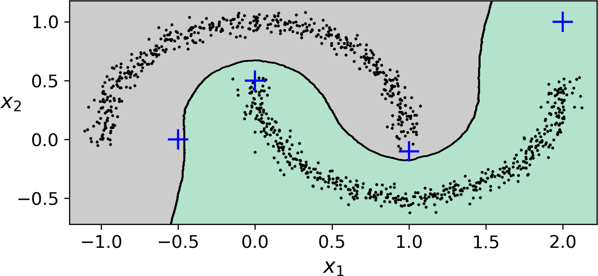

In short, DBSCAN is a very simple yet powerful algorithm capable of
identifying any number of clusters of any shape. It is robust to
outliers, and it has just two hyperparameters (`eps` and `min_samples`).
If the density varies significantly across the clusters, however, it can
be impossible for it to capture all the clusters properly. Its
computational complexity is roughly *O*(*m* log *m*), making it pretty
close to linear with regard to the number of instances, but
Scikit-Learn's implementation can require up to *O*(*m*^2^) memory if
`eps` is large.


###### Tip

You may also want to try *Hierarchical DBSCAN*
(HDBSCAN), which is implemented in the [scikit-learn-contrib
project](https://github.com/scikit-learn-contrib/hdbscan/).


Other Clustering Algorithms
---------------------------

Scikit-Learn implements
several more clustering algorithms that you should take a look at. We
cannot cover them all in detail here, but here is a brief overview:

Agglomerative clustering

:   A hierarchy of clusters is built from the
    bottom up. Think of many tiny bubbles floating on water and
    gradually attaching to each other until there's one big group of
    bubbles. Similarly, at each iteration, agglomerative clustering
    connects the nearest pair of clusters (starting with individual
    instances). If you drew a tree with a branch for every pair of
    clusters that merged, you would get a binary tree of clusters, where
    the leaves are the individual instances. This approach scales very
    well to large numbers of instances or clusters. It can capture
    clusters of various shapes, it produces a flexible and informative
    cluster tree instead of forcing you to choose a particular cluster
    scale, and it can be used with any pairwise distance. It can scale
    nicely to large numbers of instances if you provide a connectivity
    matrix, which is a sparse *m* × *m* matrix that indicates which
    pairs of instances are neighbors (e.g., returned by
    `sklearn.neighbors.kneighbors_graph()`). Without a connectivity
    matrix, the algorithm does not scale well to large datasets.

BIRCH

:   The BIRCH (Balanced Iterative Reducing and Clustering using
    Hierarchies) algorithm
    was designed specifically for very large datasets, and it can be
    faster than batch K-Means, with similar results, as long as the
    number of features is not too large (\<20). During training, it
    builds a tree structure containing just enough information to
    quickly assign each new instance to a cluster, without having to
    store all the instances in the tree: this approach allows it to use
    limited memory, while handling huge datasets.

Mean-Shift

:   This algorithm starts by
    placing a circle centered on each instance; then for each circle it
    computes the mean of all the instances located within it, and it
    shifts the circle so that it is centered on the mean. Next, it
    iterates this mean-shifting step until all the circles stop moving
    (i.e., until each of them is centered on the mean of the instances
    it contains). Mean-Shift shifts the circles in the direction of
    higher density, until each of them has found a local density
    maximum. Finally, all the instances whose circles have settled in
    the same place (or close enough) are assigned to the same cluster.
    Mean-Shift has some of the same features as DBSCAN, like how it can
    find any number of clusters of any shape, it has very few
    hyperparameters (just one---the radius of the circles, called the
    *bandwidth*), and it relies on local density estimation. But unlike
    DBSCAN, Mean-Shift tends to chop clusters into pieces when they have
    internal density variations. Unfortunately, its computational
    complexity is O(*m*^2^), so it is not suited for large datasets.

Affinity propagation

:   This algorithm uses a voting system, where
    instances vote for similar instances to be their representatives,
    and once the algorithm converges, each representative and its voters
    form a cluster. Affinity propagation can detect any number of
    clusters of different sizes. Unfortunately, this algorithm has a
    computational complexity of O(*m*^2^), so it too is not suited for
    large datasets.

Spectral clustering

:   This algorithm takes a similarity matrix
    between the instances and creates a low-dimensional embedding from
    it (i.e., it reduces its dimensionality), then it uses another
    clustering algorithm in this low-dimensional space (Scikit-Learn's
    implementation uses K-Means.) Spectral clustering can capture
    complex cluster structures, and it can also be used to cut graphs
    (e.g., to identify clusters of friends on a social network). It does
    not scale well to large numbers of instances, and it does not behave
    well when the clusters have very different sizes.

Now let's dive into Gaussian mixture models, which can be used for
density estimation, clustering, and anomaly
detection. 


Gaussian Mixtures
=================

A *Gaussian mixture model* (GMM)
is a probabilistic model that
assumes that the instances were generated from a mixture of several
Gaussian distributions whose parameters are unknown. All the instances
generated from a single Gaussian distribution form a cluster that
typically looks like an ellipsoid. Each cluster can have a different
ellipsoidal shape, size, density, and orientation, just like in
[Figure 9-11]
When you observe an instance, you know it was generated from one of the
Gaussian distributions, but you are not told which one, and you do not
know what the parameters of these distributions are.

There are several GMM variants. In the simplest
variant, implemented in the `GaussianMixture` class, you must know in
advance the number *k* of Gaussian distributions. The dataset **X** is
assumed to have been generated through the following probabilistic
process:

-   For each instance, a cluster is picked randomly from among *k*
    clusters. The probability of choosing the *j*^th^ cluster is defined
    by the cluster's weight,
    *ϕ*^(*j*)^.
^[7](https://learning.oreilly.com/library/view/hands-on-machine-learning/9781492032632/ch09.html)
     The index of the cluster chosen for the *i*^th^
    instance is noted *z*^(*i*)^.

-   If *z*^(*i*)^=*j*, meaning the *i*^th^ instance has been assigned to
    the *j*^th^ cluster, the location **x**^(*i*)^ of this instance is
    sampled randomly from the Gaussian distribution with mean
    **μ**^(*j*)^ and covariance matrix **Σ**^(*j*)^. This is noted
    $\mathbf{x}^{(i)} \sim \mathcal{N}\left( \mathbf{\mu}^{(j)},\mathbf{\Sigma}^{(j)} \right)$.

This generative process can be represented as a
graphical model.
[Figure 9-16]
represents the structure of the conditional dependencies between random
variables.

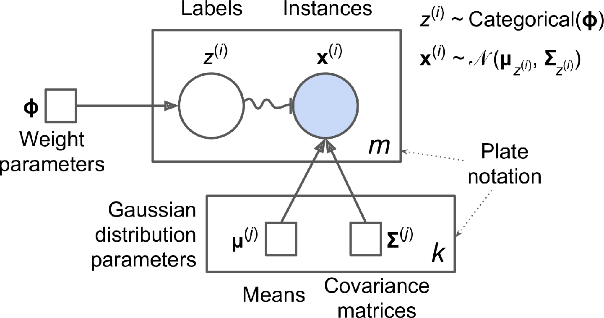

Here is how to interpret the
figure: ^[8](https://learning.oreilly.com/library/view/hands-on-machine-learning/9781492032632/ch09.html)


-   The circles represent random variables.

-   The squares represent fixed values (i.e., parameters of the model).

-   The large rectangles are called *plates*. They indicate that their
    content is repeated several times.

-   The number at the bottom right of each plate indicates how many
    times its content is repeated. So, there are *m* random variables
    *z*^(*i*)^ (from *z*^(1)^ to *z*^(*m*)^) and *m* random variables
    **x**^(*i*)^. There are also *k* means **μ**^(*j*)^ and *k*
    covariance matrices **Σ**^(*j*)^. Lastly, there is just one weight
    vector **ϕ** (containing all the weights *ϕ*^(1)^ to *ϕ*^(*k*)^).

-   Each variable *z*^(*i*)^ is drawn from the
    *categorical distribution* with weights **ϕ**. Each variable
    **x**^(*i*)^ is drawn from the normal distribution, with the mean
    and covariance matrix defined by its cluster *z*^(*i*)^.

-   The solid arrows represent conditional dependencies. For example,
    the probability distribution for each random variable *z*^(*i*)^
    depends on the weight vector **ϕ**. Note that when an arrow crosses
    a plate boundary, it means that it applies to all the repetitions of
    that plate. For example, the weight vector **ϕ** conditions the
    probability distributions of all the random variables **x**^(1)^ to
    **x**^(*m*)^.

-   The squiggly arrow from *z*^(*i*)^ to **x**^(*i*)^ represents a
    switch: depending on the value of *z*^(*i*)^, the instance
    **x**^(*i*)^ will be sampled from a different Gaussian distribution.
    For example, if *z*^(*i*)^=*j*, then
    $\mathbf{x}^{(i)} \sim \mathcal{N}\left( \mathbf{\mu}^{(j)},\mathbf{\Sigma}^{(j)} \right)$.

-   Shaded nodes indicate that the value is known. So, in this case,
    only the random variables **x**^(*i*)^ have known values:
    they are called *observed variables*.
    The unknown random variables *z*^(*i*)^ are
    called *latent variables*.

So, what can you do with such a model? Well, given the dataset **X**,
you typically want to start by estimating the weights **ϕ** and all the
distribution parameters **μ**^(1)^ to **μ**^(*k*)^ and **Σ**^(1)^ to
**Σ**^(*k*)^. Scikit-Learn's `GaussianMixture` class makes this super
easy:

``` {data-type="programlisting" code-language="python"}
from sklearn.mixture import GaussianMixture

gm = GaussianMixture(n_components=3, n_init=10)
gm.fit(X)
```

Let's look at the parameters that the algorithm estimated:

``` {data-type="programlisting" code-language="pycon"}
>>> gm.weights_
array([0.20965228, 0.4000662 , 0.39028152])
>>> gm.means_
array([[ 3.39909717,  1.05933727],
       [-1.40763984,  1.42710194],
       [ 0.05135313,  0.07524095]])
>>> gm.covariances_
array([[[ 1.14807234, -0.03270354],
        [-0.03270354,  0.95496237]],

       [[ 0.63478101,  0.72969804],
        [ 0.72969804,  1.1609872 ]],

       [[ 0.68809572,  0.79608475],
        [ 0.79608475,  1.21234145]]])
```

Great, it worked fine!
Indeed, the weights that were used to generate the data were 0.2, 0.4,
and 0.4; and similarly, the means and covariance matrices were very
close to those found by the algorithm. But how? This class relies on the
*Expectation-Maximization* (EM) algorithm, which has many similarities
with the K-Means algorithm: it also initializes the cluster parameters
randomly, then it repeats two steps until convergence,
first assigning instances to
clusters (this is called the *expectation step*) and then updating the
clusters (this is called the *maximization step*). Sounds familiar,
right? In the context of clustering, you can think of EM as a
generalization of K-Means that not only finds the cluster centers
(**μ**^(1)^ to **μ**^(*k*)^), but also their size, shape, and
orientation (**Σ**^(1)^ to **Σ**^(*k*)^), as well as their relative
weights (*ϕ*^(1)^ to *ϕ*^(*k*)^). Unlike K-Means, though, EM uses soft
cluster assignments, not hard assignments. For each instance, during the
expectation step, the algorithm estimates the probability that it
belongs to each cluster (based on the current cluster parameters). Then,
during the maximization step, each cluster is updated using *all* the
instances in the dataset, with each instance weighted by the estimated
probability that it belongs to that cluster. These 
probabilities are called the *responsibilities* of the clusters for the
instances. [During] the maximization step, each
cluster's update will mostly be impacted by the instances it is most
responsible for.


###### Warning

Unfortunately, just like K-Means, EM can end up converging to poor
solutions, so it needs to be run several times, keeping only the best
solution. This is why we set `n_init` to `10`. Be careful: by default
`n_init` is set to `1`.


You can check whether or not the algorithm converged and how many
iterations it took:

``` {data-type="programlisting" code-language="pycon"}
>>> gm.converged_
True
>>> gm.n_iter_
3
```

Now that you have an estimate of the location, size, shape, orientation,
and relative weight of each cluster, the model can easily assign each
instance to the most likely cluster (hard clustering) or estimate the
probability that it belongs to a particular cluster (soft clustering).
Just use the `predict()` method for hard clustering, or the
`predict_proba()` method for soft clustering:

``` {data-type="programlisting" code-language="pycon"}
>>> gm.predict(X)
array([2, 2, 1, ..., 0, 0, 0])
>>> gm.predict_proba(X)
array([[2.32389467e-02, 6.77397850e-07, 9.76760376e-01],
       [1.64685609e-02, 6.75361303e-04, 9.82856078e-01],
       [2.01535333e-06, 9.99923053e-01, 7.49319577e-05],
       ...,
       [9.99999571e-01, 2.13946075e-26, 4.28788333e-07],
       [1.00000000e+00, 1.46454409e-41, 5.12459171e-16],
       [1.00000000e+00, 8.02006365e-41, 2.27626238e-15]])
```

A Gaussian mixture model is a *generative model*,
meaning you can sample new instances from it (note that they are ordered
by cluster index):

``` {data-type="programlisting" code-language="pycon"}
>>> X_new, y_new = gm.sample(6)
>>> X_new
array([[ 2.95400315,  2.63680992],
       [-1.16654575,  1.62792705],
       [-1.39477712, -1.48511338],
       [ 0.27221525,  0.690366  ],
       [ 0.54095936,  0.48591934],
       [ 0.38064009, -0.56240465]])

>>> y_new
array([0, 1, 2, 2, 2, 2])
```

It is also possible to estimate the density of the model at any given
location. This is achieved using the `score_samples()` method: for each
instance it is given, this method estimates the
log of the *probability density function* (PDF) at that location. The
greater the score, the higher the density:

``` {data-type="programlisting" code-language="pycon"}
>>> gm.score_samples(X)
array([-2.60782346, -3.57106041, -3.33003479, ..., -3.51352783,
       -4.39802535, -3.80743859])
```

If you compute the exponential of these scores, you get the value of the
PDF at the location of the given instances. These are not probabilities,
but probability *densities*: they can take on any
positive value, not just a value between 0 and 1. To estimate the
probability that an instance will fall within a particular region, you
would have to integrate the PDF over that region (if you do so over the
entire space of possible instance locations, the result will be 1).

[Figure 9-17]
shows the cluster means, the decision boundaries (dashed lines), and the
density contours of this model.

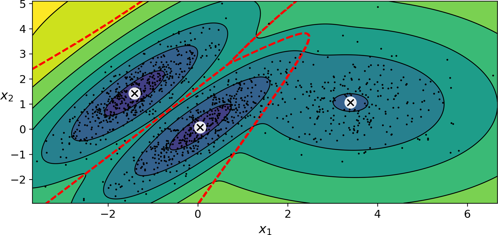

Nice! The algorithm clearly found an excellent solution. Of course, we
made its task easy by generating the data using a set of 2D Gaussian
distributions (unfortunately, real-life data is not always so Gaussian
and low-dimensional). We also gave the algorithm the correct number of
clusters. When there are many dimensions, or many clusters, or few
instances, EM can struggle to converge to the optimal solution. You
might need to reduce the difficulty of the task by limiting the number
of parameters that the algorithm has to learn. One way to do this is to
limit the range of shapes and orientations that the clusters can have.
This can be achieved by imposing constraints on the covariance matrices.
To do this, set the `covariance_type` hyperparameter to one of the
following values:

`"spherical"`

:   All clusters must be spherical, but they can have different
    diameters (i.e., different variances).

`"diag"`

:   Clusters can take on any ellipsoidal shape of any size, but the
    ellipsoid's axes must be parallel to the coordinate axes (i.e., the
    covariance matrices must be diagonal).

`"tied"`

:   All clusters must have the same ellipsoidal shape, size, and
    orientation (i.e., all clusters share the same covariance matrix).

By default, `covariance_type` is equal to `"full"`, which means that
each cluster can take on any shape, size, and orientation (it has its
own unconstrained covariance matrix).
[Figure 9-18]
plots the solutions found by the EM algorithm when `covariance_type` is
set to `"tied"` or \"`spherical`."

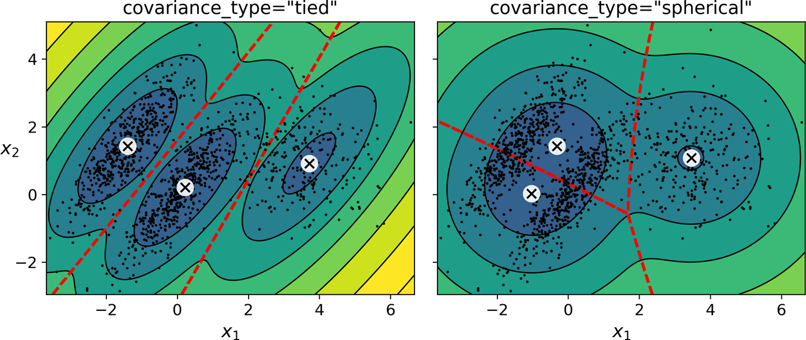


###### Note

The computational complexity of training a `GaussianMixture` model
depends on the number of instances *m*, the number of dimensions *n*,
the number of clusters *k*, and the constraints on the covariance
matrices. If `covariance_type` is `"spherical` or `"diag"`, it is
*O*(*kmn*), assuming the data has a clustering structure. If
`covariance_type` is `"tied"` or `"full"`, it is *O*(*kmn*^2^ +
*kn*^3^), so it will not scale to large numbers of features.


Gaussian mixture models can also be used for anomaly detection. Let's
see how.


Anomaly Detection Using Gaussian Mixtures
-----------------------------------------

*Anomaly detection* (also called *outlier detection*)
is 
the task of detecting instances that deviate strongly from the norm.
These instances are called *anomalies*, or *outliers*, while the normal
instances are called *inliers*. Anomaly detection is useful in a wide
variety of applications, such as fraud detection, detecting defective
products in manufacturing, or removing outliers from a dataset before
training another model (which can significantly improve the performance
of the resulting model).

Using a Gaussian mixture model for anomaly detection is quite simple:
any instance located in a low-density region can be considered an
anomaly. You must define what density threshold you want to use. For
example, in a manufacturing company that tries to detect defective
products, the ratio of defective products is usually well known. Say it
is equal to 4%. You then set the density threshold to be the value that
results in having 4% of the instances located in areas below that
threshold density. If you notice that you get too many false positives
(i.e., perfectly good products that are flagged as defective), you can
lower the threshold. Conversely, if you have too many false negatives
(i.e., defective products that the system does not flag as defective),
you can increase the threshold. This is the usual precision/recall
trade-off (see
[Lab 3]
Here is how you would identify the outliers using the fourth percentile
lowest density as the threshold (i.e., approximately 4% of the instances
will be flagged as anomalies):

``` {data-type="programlisting" code-language="python"}
densities = gm.score_samples(X)
density_threshold = np.percentile(densities, 4)
anomalies = X[densities < density_threshold]
```

[Figure 9-19]
represents these anomalies as stars.


A closely related task is *novelty detection*: it
differs from anomaly detection in that the algorithm is assumed to be
trained on a "clean" dataset, uncontaminated by outliers, whereas
anomaly detection does not make this assumption. Indeed, outlier
detection is often used to clean up a dataset.


###### Tip

Gaussian mixture models try to fit all the data, including the outliers,
so if you have too many of them, this will bias the model's view of
"normality," and some outliers may wrongly be considered as normal. If
this happens, you can try to fit the model once, use it to detect and
remove the most extreme outliers, then fit the model again on the
cleaned-up dataset. Another approach is to use robust covariance
estimation methods (see the `EllipticEnvelope` class).


Just like K-Means, the `GaussianMixture` algorithm requires you to
specify the number of clusters. So, how can you find it?


Selecting the Number of Clusters
--------------------------------

With 
K-Means, you could use the inertia or the silhouette score to select the
appropriate number of clusters. But with Gaussian mixtures, it is not
possible to use these metrics because they are not reliable when the
clusters are not spherical or have different sizes. Instead, you can try
to find the model that minimizes a *theoretical information criterion*,
such as the *Bayesian information criterion* (BIC) or the *Akaike
information criterion* (AIC), defined in [Equation
9-1]


##### [Equation 9-1. ] Bayesian information criterion (BIC) and Akaike information criterion (AIC)

$$\begin{aligned}
{BIC = \,} & {\,\log\left( m \right)p - 2\log\left( \hat{L} \right)} \\
{AIC = \,} & {\, 2p - 2\log\left( \hat{L} \right)} \\
\end{aligned}$$


In these equations:

-   *m* is the number of instances, as always.

-   *p* is the number of parameters learned by the model.

-   $\hat{L}$ is the maximized value of the
    *likelihood function* of the model.

Both the BIC and the AIC penalize models that have more parameters to
learn (e.g., more clusters) and reward models that fit the data well.
They often end up selecting the same model. When they differ, the model
selected by the BIC tends to be simpler (fewer parameters) than the one
selected by the AIC, but tends to not fit the data quite as well (this
is especially true for larger datasets).


##### Likelihood Function

The terms "probability" and "likelihood" are often used interchangeably
in the English language, but they have very different meanings in
statistics. Given a statistical model with some parameters **θ**, the
word "probability" is used to describe how plausible a future outcome
**x** is (knowing the parameter values **θ**), while the word
"likelihood" is used to describe how plausible a particular set of
parameter values **θ** are, after the outcome **x** is known.

Consider a 1D mixture model of two Gaussian distributions centered at
--4 and +1. For simplicity, this toy model has a single parameter *θ*
that controls the standard deviations of both distributions. The
top-left contour plot in
[Figure 9-20]
shows the entire model *f*(*x*; *θ*) as a function of both *x* and *θ*.
To estimate the probability distribution of a future outcome *x*, you
need to set the model parameter *θ*. For example, if you set *θ* to 1.3
(the horizontal line), you get the probability density function *f*(*x*;
*θ*=1.3) shown in the lower-left plot. Say you want to estimate the
probability that *x* will fall between --2 and +2. You must calculate
the integral of the PDF on this range (i.e., the surface of the shaded
region). But what if you don't know *θ*, and instead if you have
observed a single instance *x*=2.5 (the vertical line in the upper-left
plot)? In this case, you get the likelihood function
ℒ(*θ*\|*x*=2.5)=f(*x*=2.5; *θ*), represented in the upper-right plot.

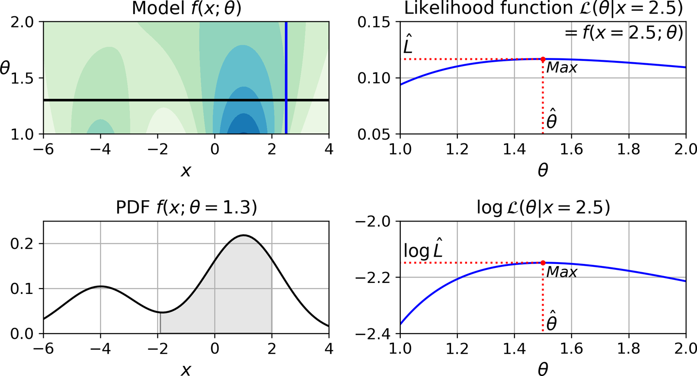

In short, the PDF is a function of *x* (with *θ* fixed), while the
likelihood function is a function of *θ* (with *x* fixed). It is
important to understand that the likelihood function is *not* a
probability distribution: if you integrate a probability distribution
over all possible values of *x*, you always get 1; but if you integrate
the likelihood function over all possible values of *θ*, the result can
be any positive value.

Given a dataset **X**, a common task is to try to estimate the most
likely values for the model parameters. To do this, you must find the
values that maximize the likelihood function, given **X**. In this
example, if you have observed a single instance
*x*=2.5, the *maximum likelihood estimate* (MLE) of *θ* is
$\hat{\theta}$=1.5. If a prior probability distribution *g* over *θ*
exists, it is possible to take it into account by maximizing
ℒ(*θ*\|*x*)g(*θ*) rather than just maximizing ℒ(*θ*\|*x*).
This is called *maximum a-posteriori* (MAP)
estimation. Since MAP constrains the parameter values, you can think of
it as a regularized version of MLE.

Notice that maximizing the likelihood function is equivalent to
maximizing its logarithm (represented in the lower-righthand plot in
[Figure 9-20]
Indeed the logarithm is a strictly increasing function, so if *θ*
maximizes the log likelihood, it also maximizes the likelihood. It turns
out that it is generally easier to maximize the log likelihood. For
example, if you observed several independent instances *x*^(1)^ to
*x*^(*m*)^, you would need to find the value of *θ* that maximizes the
product of the individual likelihood functions. But it is equivalent,
and much simpler, to maximize the sum (not the product) of the log
likelihood functions, thanks to the magic of the logarithm which
converts products into sums: log(*ab*)=log(*a*)+log(*b*).

Once you have estimated $\hat{\theta}$, the value of *θ* that maximizes
the likelihood function, then you are ready to compute
$\hat{L} = \mathcal{L}\left( \hat{\theta},\mathbf{X} \right)$, which is
the value used to compute the AIC and BIC; you can think of it as a
measure of how well the model fits the data.


To compute the BIC and AIC, call the `bic()` and `aic()` methods:

``` {data-type="programlisting" code-language="pycon"}
>>> gm.bic(X)
8189.74345832983
>>> gm.aic(X)
8102.518178214792
```

[Figure 9-21]
shows the BIC for different numbers of clusters *k*. As you can see,
both the BIC and the AIC are lowest when *k*=3, so it is most likely the
best choice. Note that we could also search for the best value for the
`covariance_type` hyperparameter. For example, if it is `"spherical"`
rather than `"full"`, then the model has significantly fewer parameters
to learn, but it does not fit the data as well.

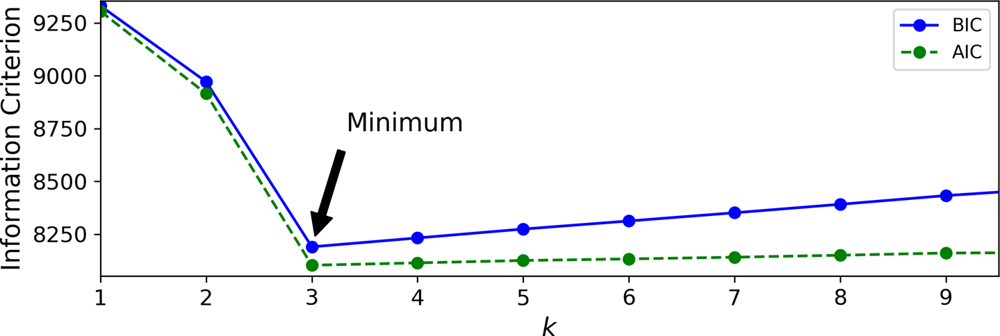


Bayesian Gaussian Mixture Models
--------------------------------

Rather than manually
searching for the optimal number of clusters, you can use the
`BayesianGaussianMixture` class, which is capable of giving weights
equal (or close) to zero to unnecessary clusters. Set the number of
clusters `n_components` to a value that you have good reason to believe
is greater than the optimal number of clusters (this assumes some
minimal knowledge about the problem at hand), and the algorithm will
eliminate the unnecessary clusters automatically. For example, let's set
the number of clusters to 10 and see what happens:

``` {data-type="programlisting" code-language="pycon"}
>>> from sklearn.mixture import BayesianGaussianMixture
>>> bgm = BayesianGaussianMixture(n_components=10, n_init=10)
>>> bgm.fit(X)
>>> np.round(bgm.weights_, 2)
array([0.4 , 0.21, 0.4 , 0.  , 0.  , 0.  , 0.  , 0.  , 0.  , 0.  ])
```

Perfect: the algorithm automatically detected that only three clusters
are needed, and the resulting clusters are almost identical to the ones
in
[Figure 9-17]

In this model, the cluster parameters (including the weights, means, and
covariance matrices) are not treated as fixed model parameters anymore,
but as latent random variables, like the cluster assignments (see
[Figure 9-22]
So **z** now includes both the cluster parameters and the cluster
assignments.

The Beta distribution is commonly used to model random variables whose
values lie within a fixed range. In this case, the range is from 0 to 1.
The Stick-Breaking Process (SBP) is best explained through an example:
suppose Φ=\[0.3, 0.6, 0.5,...\], then 30% of the instances will be
assigned to cluster 0, then 60% of the remaining instances will be
assigned to cluster 1, then 50% of the remaining instances will be
assigned to cluster 2, and so on. This process is a good model for
datasets where new instances are more likely to join large clusters than
small clusters (e.g., people are more likely to move to larger cities).
If the concentration α is high, then Φ values will likely be close to 0,
and the SBP generate many clusters. Conversely, if the concentration is
low, then Φ values will likely be close to 1, and there will be few
clusters. Finally, the Wishart distribution is used to sample covariance
matrices: the parameters d and V control the distribution of cluster
shapes.

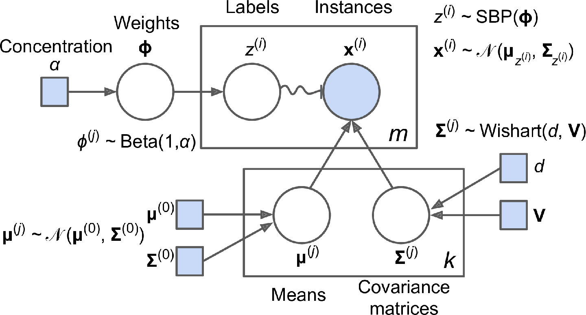

Prior knowledge about the latent variables **z**
can be encoded in a probability distribution *p*(**z**) called the
*prior*. For example, we may have a prior belief that the clusters are
likely to be few (low concentration), or conversely, that they are
likely to be plentiful (high concentration). This prior belief about the
number of clusters can be adjusted using the
`weight_concentration_prior` hyperparameter. Setting it to 0.01 or
10,000 gives very different clusterings (see
[Figure 9-23]
The more data we have, however, the less the priors matter. In fact, to
plot diagrams with such large differences, you must use very strong
priors and little data.

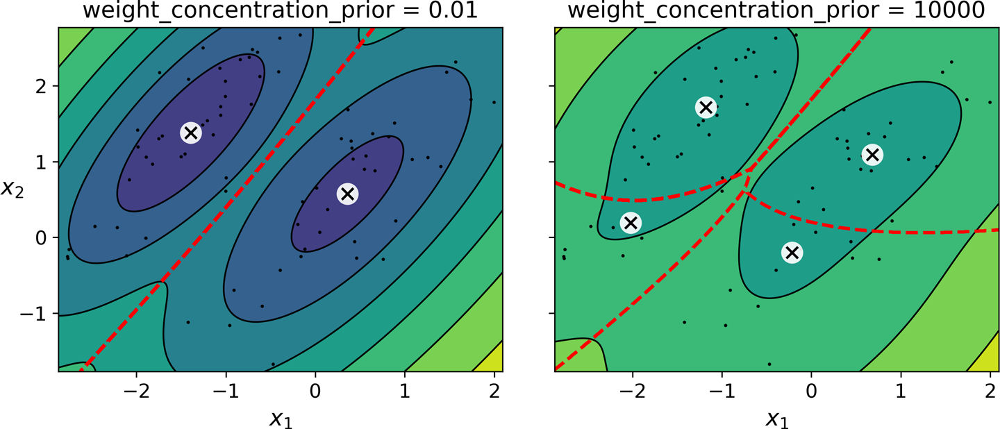

Bayes' theorem ([Equation
9-2]
tells us how to update the probability distribution over the latent
variables after we observe some data **X**. It 
computes the *posterior* distribution *p*(**z**\|**X**), which is the
conditional probability of **z** given **X**.


##### [Equation 9-2. ] Bayes' theorem

$$p\left( \mathbf{z} \middle| \mathbf{X} \right) = \text{posterior} = \frac{\text{likelihood}\operatorname{~\times~}\text{prior}}{\text{evidence}} = \frac{p\left( \mathbf{X} \middle| \mathbf{z} \right)\, p\left( \mathbf{z} \right)}{p\left( \mathbf{X} \right)}$$


Unfortunately, in a Gaussian mixture model (and many other problems),
the denominator *p*(**x**) is intractable, as it requires integrating
over all the possible values of **z** ([Equation
9-3]
which would require considering all possible combinations of cluster
parameters and cluster assignments.


##### [Equation 9-3. ] The evidence *p*(**X**) is often intractable

$$p\left( \mathbf{X} \right) = \int{p\left( \mathbf{X} \middle| \mathbf{z} \right)p\left( \mathbf{z} \right)d\mathbf{z}}$$


This intractability is one
of the central problems in Bayesian statistics, and there are several
approaches to solving it. One of them is *variational inference*, which
picks a family of distributions *q*(**z**; **λ**) with its own
*variational parameters* **λ** (lambda), then optimizes these parameters
to make *q*(**z**) a good approximation of *p*(**z**\|**X**). This is
achieved by finding the value of **λ** that minimizes the KL divergence
from *q*(**z**) to [*p*(**z**\|**X**]), noted
D~KL~(*q*‖*p*). The KL divergence equation is shown in [Equation
9-4]
and it can be rewritten as the log of the evidence (log *p*(**X**))
minus the *evidence lower bound* (ELBO). Since the
log of the evidence does not depend on *q*, it is a constant term, so
minimizing the KL divergence just requires maximizing the ELBO.


##### [Equation 9-4. ] KL divergence from *q*(**z**) to *p*(**z**\|**X**)

$$\begin{array}{cl}
{{D_{KL}\left( q \parallel p \right)} =} & {\,{\mathbb{E}}_{q}\left\lbrack {\log\frac{q\left( \mathbf{z} \right)}{p\left( \mathbf{z}\, \middle| \,\mathbf{X} \right)}} \right\rbrack} \\
 = & {\,{\mathbb{E}}_{q}\left\lbrack {\log q\left( \mathbf{z} \right) - \log p\left( \mathbf{z}\, \middle| \,\mathbf{X} \right)} \right\rbrack} \\
 = & {\,{\mathbb{E}}_{q}\left\lbrack {\log q\left( \mathbf{z} \right) - \log\frac{p\left( \mathbf{z},\mathbf{X} \right)}{p\left( \mathbf{X} \right)}} \right\rbrack} \\
 = & {\,{\mathbb{E}}_{q}\left\lbrack {\log q\left( \mathbf{z} \right) - \log p\left( \mathbf{z},\mathbf{X} \right) + \log p\left( \mathbf{X} \right)} \right\rbrack} \\
 = & {\,{\mathbb{E}}_{q}\left\lbrack {\log q\left( \mathbf{z} \right)} \right\rbrack - {\mathbb{E}}_{q}\left\lbrack {\log p\left( \mathbf{z},\mathbf{X} \right)} \right\rbrack + {\mathbb{E}}_{q}\left\lbrack {\log p\left( \mathbf{X} \right)} \right\rbrack} \\
 = & {\,{\mathbb{E}}_{q}\left\lbrack {\log\, p\left( \mathbf{X} \right)} \right\rbrack - \left( {{\mathbb{E}}_{q}\left\lbrack {\log\, p\left( \mathbf{z},\mathbf{X} \right)} \right\rbrack - {\mathbb{E}}_{q}\left\lbrack {\log\, q\left( \mathbf{z} \right)} \right\rbrack} \right)} \\
 = & {\,\log\, p\left( \mathbf{X} \right) - \text{ELBO}} \\
 & {\text{where}\text{ELBO} = {\mathbb{E}}_{q}\left\lbrack {\log\, p\left( \mathbf{z},\mathbf{X} \right)} \right\rbrack - {\mathbb{E}}_{q}\left\lbrack {\log\, q\left( \mathbf{z} \right)} \right\rbrack} \\
\end{array}$$


In practice, there are different techniques to
maximize the ELBO. In *mean field variational inference*, it is
necessary to pick the family of distributions *q*(**z**; **λ**) and the
prior *p*(*z*) very carefully to ensure that the equation for the ELBO
simplifies to a form that can be computed. Unfortunately, there is no
general way to do this. Picking the right family of distributions and
the right prior depends on the task and requires some mathematical
skills. For example, the distributions and lower-bound equations used in
Scikit-Learn's `BayesianGaussianMixture` class are presented in the
[documentation](https://homl.info/40). From these equations it is
possible to derive update equations for the cluster parameters and
assignment variables: these are then used very much like in the
Expectation-Maximization algorithm. In fact, the computational
complexity of the `BayesianGaussianMixture` class is similar to that of
the `GaussianMixture` class (but generally significantly slower). A
simpler approach to maximizing the ELBO is called
*black box stochastic variational inference* (BBSVI): at each iteration,
a few samples are drawn from *q*, and they are used to estimate the
gradients of the ELBO with regard to the variational parameters **λ**,
which are then used in a gradient ascent step. This approach makes it
possible to use Bayesian inference with any kind of model (provided it
is differentiable), even deep neural networks; using Bayesian inference
with deep neural networks is called Bayesian Deep Learning.


###### Tip

If you want to dive deeper into Bayesian statistics, check out the course
[*Bayesian Data Analysis*](https://homl.info/bda) by Andrew Gelman et
al. (Chapman & Hall).


Gaussian mixture models work great on clusters with ellipsoidal shapes,
but if you try to fit a dataset with different shapes, you may have bad
surprises. For example, let's see what happens if we use a Bayesian
Gaussian mixture model to cluster the moons dataset (see
[Figure 9-24]


Oops! The algorithm desperately searched for ellipsoids, so it found
eight different clusters instead of two. The density estimation is not
too bad, so this model could perhaps be used for anomaly detection, but
it failed to identify the two moons. Let's now look at a few clustering
algorithms capable of dealing with arbitrarily shaped clusters.


Other Algorithms for Anomaly and Novelty Detection
--------------------------------------------------

Scikit-Learn
implements  
other algorithms dedicated to anomaly detection or novelty detection:

PCA (and other dimensionality reduction techniques with an `inverse_transform()` method)

:   If you compare the reconstruction error of a
    normal instance with the reconstruction error of an anomaly, the
    latter will usually be much larger. This is a simple and often quite
    efficient anomaly detection approach (see this lab's exercises
    for an application of this approach).

Fast-MCD (minimum covariance determinant)

:   Implemented by the `EllipticEnvelope` class,
    this algorithm is useful for outlier detection, in particular to
    clean up a dataset. It assumes that the normal instances (inliers)
    are generated from a single Gaussian distribution (not a mixture).
    It also assumes that the dataset is contaminated with outliers that
    were not generated from this Gaussian distribution. When the
    algorithm estimates the parameters of the Gaussian distribution
    (i.e., the shape of the elliptic envelope around the inliers), it is
    careful to ignore the instances that are most likely outliers. This
    technique gives a better estimation of the elliptic envelope and
    thus makes the algorithm better at identifying the outliers.

Isolation Forest

:   This is an efficient
    algorithm for outlier detection, especially in high-dimensional
    datasets. The algorithm builds a Random Forest in which each
    Decision Tree is grown randomly: at each node, it picks a feature
    randomly, then it picks a random threshold value (between the min
    and max values) to split the dataset in two. The dataset gradually
    gets chopped into pieces this way, until all instances end up
    isolated from the other instances. Anomalies are usually far from
    other instances, so on average (across all the Decision Trees) they
    tend to get isolated in fewer steps than normal instances.

Local Outlier Factor (LOF)

:   This algorithm is also good for outlier
    detection. It compares the density of instances around a given
    instance to the density around its neighbors. An anomaly is often
    more isolated than its *k* nearest neighbors.

One-class SVM

:   This algorithm is better
    suited for novelty detection. Recall that a kernelized SVM
    classifier separates two classes by first (implicitly) mapping all
    the instances to a high-dimensional space, then separating the two
    classes using a linear SVM classifier within this high-dimensional
    space (see
    [Lab 5]
    Since we just have one class of instances, the one-class SVM
    algorithm instead tries to separate the instances in
    high-dimensional space from the origin. In the original space, this
    will correspond to finding a small region that encompasses all the
    instances. If a new instance does not fall within this region, it is
    an anomaly. There are a few hyperparameters to tweak: the usual ones
    for a kernelized SVM, plus a margin hyperparameter that corresponds
    to the probability of a new instance being mistakenly considered as
    novel when it is in fact normal. It works great, especially with
    high-dimensional datasets, but like all SVMs it does not scale to
    large [datasets]. 


Exercises
=========

1.  How would you define clustering? Can you name a few clustering
    algorithms?

2.  What are some of the main applications of clustering algorithms?

3.  Describe two techniques to select the right number of clusters when
    using [K-Means].

4.  What is label propagation? Why would you implement it, and how?

5.  Can you name two clustering algorithms that can scale to large
    datasets? And two that look for regions of high density?

6.  Can you think of a use case where active learning would be useful?
    How would you implement it?

7.  What is the difference between anomaly detection and novelty
    detection?

8.  What is a Gaussian mixture? What tasks can you use it for?

9.  Can you name two techniques to find the right number of clusters
    when using a Gaussian mixture model?

10. The classic Olivetti faces dataset contains 400 grayscale 64 ×
    64--pixel images of faces. Each image is flattened to a 1D vector of
    size 4,096. 40 different people were photographed (10 times each),
    and the usual task is to train a model that can predict which person
    is represented in each picture. Load the dataset using the
    `sklearn.datasets.fetch_olivetti_faces()` function, then split it
    into a training set, a validation set, and a test set (note that the
    dataset is already scaled between 0 and 1). Since the dataset is
    quite small, you probably want to use stratified sampling to ensure
    that there are the same number of images per person in each set.
    Next, cluster the images using K-Means, and ensure that you have a
    good number of clusters (using one of the techniques discussed in
    this lab). Visualize the clusters: do you see similar faces in
    each cluster?

11. Continuing with the Olivetti faces dataset, train a classifier to
    predict which person is represented in each picture, and evaluate it
    on the validation set. Next, use K-Means as a dimensionality
    reduction tool, and train a classifier on the reduced set. Search
    for the number of clusters that allows the classifier to get the
    best performance: what performance can you reach? What if you append
    the features from the reduced set to the original features (again,
    searching for the best number of clusters)?

12. Train a Gaussian mixture model on the Olivetti faces dataset. To
    speed up the algorithm, you should probably reduce the dataset's
    dimensionality (e.g., use PCA, preserving 99% of the variance). Use
    the model to generate some new faces (using the `sample()` method),
    and visualize them (if you used PCA, you will need to use its
    `inverse_transform()` method). Try to modify some images (e.g.,
    rotate, flip, darken) and see if the model can detect the anomalies
    (i.e., compare the output of the `score_samples()` method for normal
    images and for anomalies).

13. Some dimensionality reduction techniques can also be used for
    anomaly detection. For example, take the Olivetti faces dataset and
    reduce it with PCA, preserving 99% of the variance. Then compute the
    reconstruction error for each image. Next, take some of the modified
    images you built in the previous exercise, and look at their
    reconstruction error: notice how much larger the reconstruction
    error is. If you plot a reconstructed image, you will see why: it
    tries to reconstruct a normal face.

**Solution for the exercises are available in the solutions file.**


^[1]

Stuart P. Lloyd, "Least Squares Quantization in PCM," *IEEE Transactions
on Information Theory* 28, no. 2 (1982): 129--137.

^[2]

That's because the mean squared distance between the instances and their
closest centroid can only go down at each step.

^[3]

David Arthur and Sergei Vassilvitskii, "k-Means++: The Advantages of
Careful Seeding," *Proceedings of the 18th Annual ACM-SIAM Symposium on
Discrete Algorithms* (2007): 1027--1035.

^[4]

Charles Elkan, "Using the Triangle Inequality to Accelerate k-Means,"
*Proceedings of the 20th International Conference on Machine Learning*
(2003): 147--153.

^[5]

The triangle inequality is AC ≤ AB + BC where A, B and C are three
points and AB, AC, and BC are the distances between these points.

^[6]

David Sculley, "Web-Scale K-Means Clustering," *Proceedings of the 19th
International Conference on World Wide Web* (2010): 1177--1178.

^[7]

Phi (*ϕ* or *φ*) is the 21st letter of the Greek alphabet.

^[8]

Most of these notations are standard, but a few additional notations
were taken from the Wikipedia article on [plate
notation](https://en.wikipedia.org/wiki/Plate_notation).
